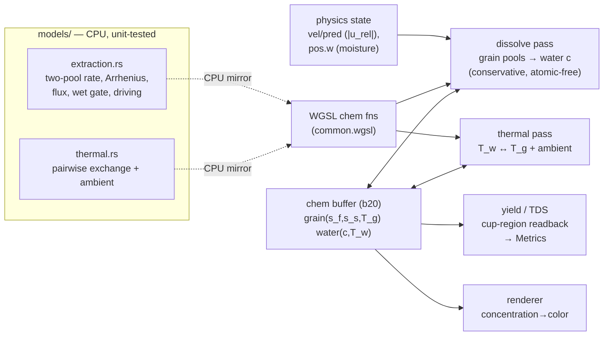

Reading additional input from stdin...
OpenAI Codex v0.137.0
--------
workdir: /Users/cxc/Github/coffee-sim
model: gpt-5.5
provider: openai
approval: never
sandbox: read-only
reasoning effort: high
reasoning summaries: none
session id: 019e952f-6892-7f63-a1a6-28db43fe7933
--------
user
ROUND 2 review of the Phase 1.5 (extraction + thermal) plan for a Rust + wgpu + WGSL two-species XPBD coffee simulator. Round 1 returned REVISE with 8 items; all are folded in:

1. **Dissolution cap tightened** (KTD-2/U5): identical eligibility predicate on all three passes (diss_count + both transfer passes), explicit `N=0` guard, and **proportional pool depletion** `s_p −= Σtake·release_p/release_total` with a `release_total=0` guard.
2. **KTD-1 reframed**: conserves an *extractable-solute scalar inventory* (and thermal-energy inventory), NOT mechanical mass — the dilute-solution density/inertia neglect is stated as a deliberate, bounded (~1.3% TDS, <1.5% density) simplification.
3. **KTD-4** (free Lagrangian advection) — confirmed correct in round 1; unchanged.
4. **Thermal energy conservation fixed** (R2/U2/U6/HTD): now **capacity-weighted** — `ΔT_i = (κ·dt/C_i)·Σ(T_j−T_i)` with per-species `C=mass·specific_heat`, which conserves `Σ C_i·T_i` for UNEQUAL capacities (each pair contributes ±q antisymmetrically). Added per-species specific-heat constants (U3). Symmetric ΔT explicitly called out as wrong unless C_i=C_j. U2/U6 gates now use an unequal-capacity pair.
5. **Flux source pinned** (KTD-3/U5): the dissolution pass recomputes |u_rel| from the **finalized `vel` (b3)** with the same range h, used identically by all three passes (no drift); a real velocity, not the solve residual.
6. **Yield/TDS accounting fixed** (R6/R8/U7/KTD-7): water is never removed, so the conserved quantity is `Σ(grain s_f+s_s) + Σ(active water c·V_w)` — no separate "drained" term (that double-counted). The drained Open Question is reduced to a reporting nicety.
7. **Exact bind layouts** (HTD budget table): chem=b20, diss_neighbors=b21 (dedicated); diss_count 6/8, dissolve_grain/water 7/8 (vel b3 included for the flux), thermal_exchange 5/8; the six 8/8 kernels untouched.
8. **Tests added** (U1/U5/U6): Arrhenius-clamp + u_half=0 guards; saturated-adjacent-to-unsaturated water; release_total=0 guard; CPU/GPU parity on a tiny hand-computable pair graph; unequal-capacity thermal energy gate.

Verify each is genuinely resolved (not hand-waved) and surface any NEW or second-order correctness issue. First line: **APPROVE**, **REVISE**, or **REJECT**, then explain citing section/unit IDs.

Project hard constraints (verified): ≤8 storage buffers/stage; no float atomics; Params byte-matched Rust↔WGSL (grows to ~320B for the new constants); counting-sort grid does NOT reorder particle arrays (so chem[i] rides particle i); Phase-1.4 wetting is the proven atomic-free two-sided transfer template; existing suites must stay green (opt-in, extract_rate=0 default); the user is a physics reviewer who rejects silent conservation leaks.

## Revised Plan to Review

---
title: "feat: Phase 1.5 — extraction + thermal"
type: feat
status: active
date: 2026-06-04
origin: null
deepened: null
---

# feat: Phase 1.5 — extraction + thermal

## Summary

Add the **wetting→extraction pipeline's dissolution + solute transport + temperature-dependent
kinetics** to the two-species XPBD GPU solver (`solver_xpbd.md` step 5, `models.md` build-phase 3).
Coffee grains hold extractable solute in a **two-pool** model (fast surfaces/fines + slow interiors);
wet grains dissolve solute into the surrounding water at a rate gated by **flow** (the drag term's
relative velocity), **moisture**, and **temperature** (Arrhenius); the dissolved concentration `c`
**rides on the water particles** (Lagrangian, no numerical diffusion) and accumulates into **yield**
and **TDS** measured in the cup. A lumped **thermal** model carries temperature on the particles and
lets the natural pour-temperature drop reduce late-brew extraction.

This is a **passive scalar layer**: extraction/thermal **read** physics state (relative velocity,
moisture, positions) and **write only** solute `c` / temperature `T` / yield — they do **not** feed
back into momentum, incompressibility, contact, density, or mass. So unlike the geometry/coupling
phases, this phase cannot destabilize the sim; the invariant to protect is **solute (and thermal-
energy) conservation**, not momentum/volume. Extraction is **opt-in** (off by default) so every
existing suite stays byte-unchanged and green.

---

## Problem Frame

The solver has water incompressibility, the granular bed, mechanical coupling (drag/buoyancy/
exclusion), wetting/absorption, and SDF geometry — but **no extraction**. `src/models/` has
`permeability.rs`, `cohesion.rs`, `wetting.rs` but **no `extraction.rs`/`thermal.rs`** (a `grep` for
extraction/thermal/solute in `src/` returns only the `models/mod.rs` doc comment, the `state.rs` stub
fields, and the reserved `buffers.rs` slots). `engine::Metrics` (`src/engine/state.rs`) declares
`extraction_yield` and `tds` but `XpbdSolver::metrics()` leaves them `0.0` — nothing computes them.
`ParticleBuffers` (`src/utils/buffers.rs`) already reserves `concentration`/`temperature`/`moisture`
`Option<Arc<Buffer>>` slots for exactly this work.

The model shape is specified at the stub level (`models.md` §extraction/§thermal,
`solver_xpbd.md:35-39`): two-pool kinetics `ds/dt = k(T)·A·s·(1−c/c_sat)·g(|u_rel|)·wet(r)`, Arrhenius
`k(T)`, surface area `A∝1/d_p`, the flux bridge using the drag relative velocity (so extraction is
"independent of incompressibility-solve accuracy"), the moisture gate, Lagrangian solute advection,
and lumped bed↔water thermal feeding the Arrhenius term. Salvaged constants live in `KEEP.md §1`; the
gate band in `KEEP.md §5` / `solver_xpbd.md:64`.

The job: build the two model files (CPU, unit-tested), carry per-particle solute/temperature on the
GPU, run a **conservation-clean grain→water dissolution pass** (atomic-free, mirroring the Phase-1.4
wetting transfer), a thermal exchange pass, and a yield/TDS readout — all within the 8-storage-buffer
budget, the 256-byte `Params` byte-match (now full), and opt-in so suites stay green.

---

## Requirements

- **R1** — `src/models/extraction.rs` (NEW, pure CPU functions + tests like `wetting.rs`): two-pool
  dissolution rate with a **bounded** per-step law `release = s·(1 − e^{−k_eff·dt})` (no overshoot at
  any `dt`), where `k_eff = k0·k_T(T)·area(d_p)·driving(c)·flux(|u_rel|)·wet(s)`; Arrhenius `k_T`
  (normalized so `k_T(T_ref)=1`); `area ∝ 1/d_p`; `driving(c)=max(1−c/c_sat,0)`; saturating
  `flux(u)=u/(u+u_half)`; moisture gate `wet(s)` (dry grain → 0); pool split (fast fraction). Constants
  from `KEEP.md §1` (re-validate).
- **R2** — `src/models/thermal.rs` (NEW, pure CPU + tests): **capacity-weighted** pairwise heat
  exchange. A pair exchanges a heat amount `q = κ·(T_j − T_i)·dt`; each side applies `ΔT_i = +q/C_i`,
  `ΔT_j = −q/C_j` with per-species heat capacity `C = mass·specific_heat`. Equivalently the per-particle
  GPU form `ΔT_i = (κ·dt/C_i)·Σ_neighbors(T_j − T_i)`, which is **energy-conserving for unequal
  capacities** (each pair contributes `+q` to `E_i = C_i·T_i` and `−q` to `E_j`, summing to zero). Plus
  ambient loss `ΔT = −clamp(h_amb·dt,0,1)·(T − T_amb)`. Bounded/stable for any `dt` (clamp the per-step
  fraction); symmetric `ΔT = α·(T_j−T_i)` is **wrong** unless `C_i = C_j` (Codex R1).
- **R3** — Per-particle GPU chem/thermal state in **one** new `vec4` storage buffer: grain lanes
  `(s_f, s_s, T_g, _)`, water lanes `(c, T_w, _, _)`. Seeded at build (grain pools from the soluble
  dose split by fast fraction; water `c=0`, `T_w=pour_T`; grain `T_g=pour_T` or ambient). Exposed via
  `ParticleBuffers.concentration`/`temperature` for the renderer.
- **R4** — A **conservative grain→water dissolution pass**: solute leaving grain pools exactly equals
  solute added to water `c` (atomic-free, two-sided/frozen-snapshot, water-normalized — the Phase-1.4
  wetting pattern). The `(1−c/c_sat)` driving force is enforced as the **water-side headroom cap**, so
  `c` never exceeds `c_sat`. The flux signal `g(|u_rel|)` is **recomputed** in the pass's neighbor loop.
- **R5** — A **thermal exchange pass**: water↔grain pairwise exchange + ambient loss; updates `T_w`/
  `T_g`; the dissolution pass reads `T` for `k_T`. Lagrangian transport of `c`/`T` is automatic (they
  ride dedicated per-particle lanes untouched by other kernels — no advection kernel).
- **R6** — **Yield + TDS** accumulation: yield = total dissolved solute / total soluble dose; TDS =
  solute mass in the cup / water mass in the cup. Populated into `Metrics.extraction_yield`/`tds` via a
  cached cup-region readback in `sample_diagnostics` (no stalling sync in `metrics()`).
- **R7** — **Opt-in / no regression.** Extraction + thermal are a no-op by default (e.g. `extract_rate
  = 0`), gated to mixed wet-bed scenes, so the water / bed / coupling / wetting / geometry suites and
  scenes stay byte-unchanged and green.
- **R8** — **Conservation as a gate.** Water is never removed (drained water just pools in the cup,
  still carrying its `c`), so the conserved quantity is `Σ(grain s_f+s_s) + Σ(active water c·V_w)` —
  invariant to float tolerance over a full brew (no separate "drained" term). Capacity-weighted thermal
  energy `Σ C_i·T_i` is invariant in closed exchange. These are gating tests, not diagnostics.
- **R9** — **Calibration to band.** A full V60 brew lands yield **~18–22%**, TDS **~1.2–1.4%**, `c`
  capped at `c_sat=0.08`; a cooler pour temperature measurably lowers extraction.

**Success gate** (`solver_xpbd.md:64`): causal levers correct; yield ~18–22%, TDS ~1.2–1.4%; solute
conserved over a full brew; temperature drop lowers extraction; `Params` byte-match assert holds;
existing suites green; `clippy -D warnings` + `fmt --check` clean.

---

## Key Technical Decisions

### KTD-1 — Passive scalar layer: extraction/thermal read physics, never feed back
Extraction and thermal **only read** physics state (relative velocity, moisture `pos.w`,
positions/neighbors, `T`) and **only write** solute `c`, temperature `T`, grain pools, and yield/TDS.
They do **not** modify momentum, velocity, position, the density target, particle mass, or grain
volume. **What is conserved is an *extractable-solute scalar inventory* (and a thermal-energy
inventory) — NOT total mechanical mass/momentum.** The solver *intentionally neglects* the small
density/inertia effect of dissolved solute: ~4 g of solute into ~250 ml is ≈1.3% TDS, a <1.5% density
perturbation, below the sim's other modeling errors — so `c` is a passive tracer (the standard dilute-
solution approximation). This is a deliberate, bounded mass-model simplification, stated so it is not a
*silent* inconsistency. The benefit: the pass is **stable-by-construction** — it cannot inject the
momentum/position energy that the SDF push-out and buoyancy could. Temperature is likewise passive this
phase (T→viscosity/density back-coupling deferred).

### KTD-2 — Reuse the Phase-1.4 wetting transfer; driving force == conservation cap
The dissolution pass mirrors `wetting.wgsl` (`wet_count` → `wet_water`/`wet_grain`): a count pre-pass
for eligible opposite-species neighbors, then two passes that recompute the **identical per-pair
transfer off a frozen snapshot** and each write only their own slot → atomic-free, exact conservation.
The two-sided cap is `take = min(grain_release / N_w, water_headroom / N_g)` where
`water_headroom = max(c_sat − c, 0)·V_w`. **This makes the `(1−c/c_sat)` driving force and solute
conservation the same mechanism**: a water at `c_sat` has zero headroom → accepts nothing → grains
can't over-release into it. Bounded rate `(1−e^{−k·dt})`, **no force-dump of the remainder** (the
Phase-1.4 leak bug), no float atomics.

Conservation-exactness preconditions, which both passes MUST satisfy identically (Codex R1): (a) the
**eligibility predicate** for counting `N_w`/`N_g` and for the transfer loop is byte-identical on the
count pass and both transfer passes (same range `h`, same species/moisture test, same frozen snapshot);
(b) **`N=0` particles emit/accept nothing** (guard the divide); (c) the grain decrements each pool by
`take · release_p/release_total` (**proportional pool share**, `release_total = release_f + release_s`),
guarded for `release_total = 0`. Because both passes compute `take` as the same pure function of the
frozen chem snapshot + the frozen counts, grain-loss == water-gain exactly.

### KTD-3 — Flux `g(|u_rel|)` is recomputed from a pinned velocity source, not stored
The drag relative velocity is computed inline per-pair in `drag_delta_for_pair` and never stored
per-particle (verified). Rather than add a scratch buffer in the drag subcycle, the dissolution pass
**recomputes** the water↔grain relative-velocity magnitude in its own neighbor loop (it already gathers
neighbors for the transfer). **Pinned source (Codex R1):** it reads the **finalized `vel` (binding 3)**
— the post-substep real water/grain velocities — with the same pair geometry and range `h` as the
dissolution gather. This is a *real* relative velocity (the flux bridge's intent: "independent of
incompressibility-solve accuracy"), not the density-solve residual; it need not bit-match drag's frozen
snapshot (both are valid real velocities), but the source is fixed (finalized `vel`, same `h`) so the
flux doesn't drift between the count and the two transfer passes — all three read the same `vel`.

### KTD-4 — One vec4 chem buffer (binding 20); Lagrangian advection is free
Per-particle chem state packs into **one** `var<storage, read_write> chem: array<vec4<f32>>` at binding
20 (next free): grain `(s_f, s_s, T_g, _)`, water `(c, T_w, _, _)` — **separate f32 lanes, not bit-
packing** (the Codex-flagged hazard). Solute/temperature **advect for free**: they live on the
particle's own lane and are *untouched* by every existing kernel (unlike moisture on `pos.w`, which
needed preservation), so position advection carries them automatically — **no advection kernel, no
`.w`-preservation edits**. Only the new chem passes touch binding 20, on **dedicated lean bind groups**,
so the six kernels already at 8/8 storage buffers are not modified.

### KTD-5 — Constants live in a grown `Params` (byte-matched), not a second uniform
`Params` is full at exactly 256 B. The extraction/thermal constants (`k0`, Arrhenius `Ea/R`, `T_ref`,
`c_sat`, fast fraction, `area` ref, `u_half`, `extract_rate` gate; thermal `h_wg`, `h_amb`, `T_amb`,
`pour_T`, `s_on`) — ~14 scalars ≈ 56 B — grow `Params` to the next 16-byte-aligned size (**≈ 320 B**),
updating the Rust struct, the WGSL mirror, and the `size_of` assert in lockstep (the Phase-1.4
procedure). Chosen over a second uniform because the chem passes already read `Params` (dt, h,
grain_diameter) — one uniform read, one byte-match to maintain. (A second `ChemParams` uniform is the
documented alternative if `Params` growth proves awkward.)

### KTD-6 — Opt-in, mixed-gated (suites stay byte-unchanged)
Like `absorb_rate` (wetting) and `num_solids` (SDF), extraction/thermal default **off**
(`extract_rate = 0`, thermal exchange `0`/identity) and the whole stage is gated `mixed &&
extract_rate > 0` in the substep loop. Existing scenes don't opt in → zero new passes run → byte-
unchanged. Constants default to the `KEEP.md` values but the **rate gate** is what activates them.

### KTD-7 — Conservation is a gate, not a diagnostic
The conserved **solute inventory** is `Σ(grain s_f+s_s) + Σ(active water c·V_w)` (water is never
removed, so cup solute is already in the water term — no separate "drained" term, KTD-1/R8), invariant
to float tolerance over a full brew; capacity-weighted thermal energy `Σ C_i·T_i` invariant in closed
exchange. Written as **failing-first gating tests** (the reviewer rejects silent leaks). The atomic-free
two-sided transfer (KTD-2) is what makes exact conservation achievable without atomics.

---

## High-Level Technical Design

### Data flow



### Substep loop placement (extends the Phase-1.4 models stage)

```
predict → grid → water density+exclusion (iters) → drag/buoyancy → bed contact → finalize → xsph
  └─ models stage (gated mixed && k_abs>0):  wetting: wet_count → wet_water → wet_grain
  └─ models stage (gated mixed && extract_rate>0):                              # NEW, this phase
       diss_count → dissolve_grain → dissolve_water    # grain pools → water c (conservative)
       thermal_exchange                                # T_w ↔ T_g + ambient loss
```
Runs **after** wetting (reads the post-finalize relative velocity + post-wetting moisture). No solute-
advection pass (KTD-4). Single-species / opted-out scenes skip the whole stage → byte-unchanged.

### Two-pool dissolution (directional pseudo-code, not implementation spec)

```
# Per grain g, per pool p∈{fast,slow}, this substep (reads T_g or local T_w, moisture s, neighbors):
k_T   = exp(-(Ea/R) * (1/T - 1/T_ref))            # Arrhenius, normalized: k_T(T_ref)=1
area  = area_ref * (d_ref / d_p)                  # surface area ∝ 1/grind
flux  = u_rel / (u_rel + u_half)                  # saturating in the drag relative velocity
wet   = smoothstep(0, s_on, saturation(g))        # dry grain (s≈0) → 0
k_eff = extract_rate * k0_p * k_T * area * flux * wet
release_p = s_p * (1 - exp(-k_eff * dt))          # bounded; never exceeds the pool
release_total = release_f + release_s

# Conservative two-sided transfer (frozen snapshot; mirrors wetting; atomic-free):
#   N_w = # eligible water neighbors of g ; N_g = # eligible grain neighbors of a water
#   IDENTICAL eligibility predicate (range h, species, moisture, frozen snapshot) on all 3 passes.
#   if N_w == 0 (grain) or N_g == 0 (water): no transfer (guard the divide).
#   per (g,w) pair:  take = min( release_total / N_w ,  max(c_sat - c_w, 0)*V_w / N_g )
# dissolve_grain: per pool, s_p -= (Σ_waters take) * release_p/release_total   # PROPORTIONAL pool share;
#                 guard release_total==0 ⇒ no depletion                        # pools deplete, ≥ 0
# dissolve_water: c_w += (Σ_grains take) / V_w                                 # concentration rises, ≤ c_sat
```
`driving(c)` is realized as the water-headroom term in `take` (KTD-2): grain-loss == water-gain exactly,
each pool depletes proportionally, and no water exceeds `c_sat`. Water is never removed, so cup solute
stays in the active water term — the yield/TDS readout (R6) reads it there, nothing is "drained away."

### Thermal (directional)

```
# Per particle i (water or grain), pairwise over neighbors + ambient. C_i = mass_i * specific_heat_i.
dT  = (kappa * dt / C_i) * Σ_neighbors (T_j - T_i)        # CAPACITY-WEIGHTED: ΔE_i = C_i·dT = kappa·dt·Σ(T_j-T_i)
dT += -clamp(h_amb*dt, 0, 1) * (T_i - T_amb)              # loss to ambient/dripper
T_i += dT                                                  # (clamp kappa*dt*N/C_i for stability)
```
Energy-conserving with **unequal** water/grain heat capacities: pair `(i,j)` adds `+kappa·dt·(T_j−T_i)`
to `E_i` and the antisymmetric `+kappa·dt·(T_i−T_j)` to `E_j`, summing to zero (ambient loss aside).
A plain symmetric `ΔT = α·(T_j−T_i)` is NOT energy-conserving unless `C_i=C_j` (Codex R1). `k_T` reads
`T`, so the natural cooling lowers late-brew extraction (R9).

### Storage-buffer budget (binding 0 = uniform, excluded)

New storage buffers: `chem` (binding **20**), `diss_neighbors` (binding **21**, the eligible-count
scratch — dedicated so it never collides with `wet_neighbors`/b17). Exact storage bindings per new pass
(binding 0 = uniform `params`, not counted):

| New kernel | storage bindings | count |
|---|---|---|
| `diss_count` | pred(2), phase(11), cell_start(8), sorted_indices(9), chem(20), diss_neighbors(21) | 6/8 |
| `dissolve_grain` | pred(2), vel(3), phase(11), cell_start(8), sorted_indices(9), chem(20), diss_neighbors(21) | 7/8 |
| `dissolve_water` | pred(2), vel(3), phase(11), cell_start(8), sorted_indices(9), chem(20), diss_neighbors(21) | 7/8 |
| `thermal_exchange` | pred(2), phase(11), cell_start(8), sorted_indices(9), chem(20) | 5/8 |
| existing 8/8 kernels (`bed_project`, `compute_lambda/dp`, `drag_*`, `buoyancy_grain`) | **untouched** | — |

`vel`(3) is in the dissolve passes for the recomputed `|u_rel|` flux (KTD-3); both transfer passes read
it so their `take` agrees. The new passes get dedicated lean bind groups (like `wet_*`); `Params` grows
in place (KTD-5); no new uniform.

### Chem buffer (binding 20) lane layout

```
grain (phase 1):  x = s_f (fast pool)   y = s_s (slow pool)   z = T_g   w = _
water (phase 0):  x = c   (concentration) y = T_w             z = _     w = _
```

---

## Output Structure

```
src/models/extraction.rs       # CREATE: two-pool rate, Arrhenius, area, flux, wet gate (CPU + tests)
src/models/thermal.rs          # CREATE: pairwise exchange + ambient loss (CPU + tests)
src/models/mod.rs              # MODIFY: register modules; Materials extraction/thermal fields
src/utils/config.rs           # MODIFY: extract_rate (opt-in gate) + numerics
src/solvers/xpbd/mod.rs       # MODIFY: Params growth, chem buffer (b20) + seeding, pipelines/bind groups, substep wiring, yield/TDS readback, ParticleBuffers c/T
src/solvers/xpbd/common.wgsl  # MODIFY: Params mirror; chem binding + WGSL extraction/thermal fns
src/solvers/xpbd/extraction.wgsl # CREATE: diss_count, dissolve_grain, dissolve_water, thermal_exchange
src/engine/state.rs           # MODIFY (if needed): nothing structural — Metrics fields already exist
tests/xpbd_extraction.rs      # CREATE: conservation, dry-grain, c_sat cap, yield/TDS band, temp-drop, no-regression
examples/brew.rs              # CREATE (or extend coupling_render/water_app): a V60 brew measuring yield/TDS
```

---

## Implementation Units

### U1. `models/extraction.rs` — two-pool kinetics (CPU)

**Goal:** The pure-function extraction math: bounded two-pool release, Arrhenius, area, saturating flux,
moisture gate, driving force, pool split. CPU-testable, the mirror of the GPU pass.

**Requirements:** R1.
**Dependencies:** none.
**Files:** `src/models/extraction.rs`, `src/models/mod.rs` (register).

**Approach:** `#[inline] pub fn` scalars (mirror `wetting.rs`/`permeability.rs`): `arrhenius(t, ea_over_r,
t_ref) -> f32` (returns 1 at `t_ref`), `area_factor(d_p, d_ref) -> f32` (`d_ref/d_p`), `flux_factor(u_rel,
u_half) -> f32` (`u/(u+u_half)`, 0 at 0), `wet_gate(saturation, s_on) -> f32` (smoothstep, 0 when dry),
`driving(c, c_sat) -> f32` (`max(1−c/c_sat, 0)`), `release(pool, k_eff, dt) -> f32` (`pool·(1−e^{−k·dt})`,
clamped to `pool`), and a `split(extractable, fast_fraction) -> (s_f, s_s)`. Constants live in `Materials`
(U3), passed in; functions stay parameterized (the fairness contract). Re-validate `KEEP.md §1` values.

**Patterns to follow:** `src/models/wetting.rs` (bounded `absorb_demand` `(1−e^{−k·dt})`),
`src/models/permeability.rs` (monotonicity test), `src/models/cohesion.rs` (endpoint tests).

**Test scenarios:**
- `release` is bounded: at huge `dt` it approaches but never exceeds the pool; at `dt=0` it's 0; a
  depleted pool releases 0.
- `arrhenius` is 1 at `T_ref`, **monotonically increasing in T**, >1 above and <1 below `T_ref`.
- `flux_factor` is 0 at `u=0`, monotonic increasing, saturating (<1, → 1 as u→∞).
- `wet_gate` is 0 for a dry grain (`saturation≈0`) and rises to 1 when wet; `driving` is 1 at `c=0`, 0 at
  `c=c_sat`, clamped ≥0 above.
- `split` conserves: `s_f + s_s == extractable`; fast fraction respected.
- **Edge/guard (Codex R1):** `arrhenius` clamps its exponent so an extreme `T` returns a finite value
  (no `exp` overflow/NaN); `flux_factor` with `u_half=0` is finite (guard the divide); `driving` clamps
  ≥0 above `c_sat`; all functions return finite values for degenerate params.

**Verification:** `cargo test` for the `extraction` unit tests passes; each law's shape (bounded,
monotone, endpoints) holds.

---

### U2. `models/thermal.rs` — lumped heat exchange (CPU)

**Goal:** Pure-function thermal: bounded pairwise exchange + ambient loss, energy-conserving in a closed
pair.

**Requirements:** R2.
**Dependencies:** none.
**Files:** `src/models/thermal.rs`, `src/models/mod.rs` (register).

**Approach:** **capacity-weighted** so it conserves energy for unequal heat capacities (Codex R1).
`pair_flux(t_i, t_j, kappa, dt) -> q` = `kappa·(t_j − t_i)·dt` (the heat from j into i; antisymmetric:
`pair_flux(j,i) = −pair_flux(i,j)`); apply `ΔT_i = q / C_i`. Provide a convenience
`pair_delta(t_i, c_i, t_j, kappa, dt) -> ΔT_i = pair_flux/c_i`, and `ambient_delta(t, t_amb, h_amb, dt)
= −clamp(h_amb·dt,0,1)·(t − t_amb)`. Bounded so any `dt` is stable (clamp the per-step fraction; no
overshoot past equilibrium). Document that energy conservation requires the `q/C` weighting — a plain
symmetric `ΔT` only conserves when `C_i = C_j`.

**Patterns to follow:** `src/models/wetting.rs` bounded-rate style; `cohesion.rs` test style.

**Test scenarios:**
- `pair_flux` is antisymmetric (`pair_flux(a,b)=−pair_flux(b,a)`); 0 when `t_i==t_j`; 0 at `dt=0`.
- **Closed UNEQUAL-capacity pair (the gate):** with `C_i ≠ C_j`, `t_i += q/C_i`, `t_j += −q/C_j` →
  total enthalpy `C_i·t_i + C_j·t_j` conserved to tolerance; both converge to the capacity-weighted
  equilibrium `(C_i·t_i + C_j·t_j)/(C_i+C_j)` over many steps, never overshooting.
- `ambient_delta` always cools toward `t_amb`, never overshoots; 0 at `t==t_amb`.

**Verification:** `cargo test` passes; closed-pair energy conserved; relaxation monotone.

---

### U3. Materials/Config constants + Params growth (plumbing)

**Goal:** Add the extraction/thermal constants (active-by-default physical values in `Materials`; the
opt-in `extract_rate` gate in `Config`) and grow `Params` to carry them — no behavior yet.

**Requirements:** R1, R2, R6 (gate), R7.
**Dependencies:** U1, U2.
**Files:** `src/models/mod.rs` (`Materials`), `src/utils/config.rs` (`extract_rate` + numerics),
`src/solvers/xpbd/mod.rs` (`Params` struct + assert + literal), `src/solvers/xpbd/common.wgsl` (`Params`
mirror).

**Approach:** Add a `// --- extraction / thermal (Phase 1.5) ---` block to `Materials` (k0_fast,
k0_slow, ea_over_r, t_ref, c_sat, fast_fraction, area_ref/d_ref, u_half, soluble_fraction=0.28; thermal
kappa (conductance), **specific_heat_water, specific_heat_grain** for the capacity-weighted exchange
`C=mass·cp`, h_amb, t_amb, pour_t, s_on) defaulted to `KEEP.md §1` values (thermal constants are fresh —
see Open Questions). Add `extract_rate: f32 = 0.0` to
`Config` (the opt-in gate; comment mirrors `absorb_rate`). Grow `Params` (Rust + WGSL + the `size_of`
assert) to the next 16-byte-aligned size, populating the literal from Materials/Config (KTD-5). No pass
reads the new fields yet.

**Patterns to follow:** the `absorb_rate` opt-in (`config.rs`), the Phase-1.4 `Params` growth
(240→256, the 3-edit procedure: Rust struct + WGSL mirror + assert), `r_max`/`rho_ratio` in `Materials`.

**Test scenarios:** `Test expectation: none — plumbing.` Covered by the `size_of::<Params> == <new>`
compile assert + existing suites staying green (no field is read yet).

**Verification:** `cargo build` + `clippy` clean; the Params assert holds at the new size; WGSL compiles;
all existing suites green.

---

### U4. GPU chem state buffer + WGSL chem functions (plumbing)

**Goal:** The per-particle chem buffer (binding 20), its seeding, the `ParticleBuffers` c/T wiring, and
the WGSL extraction/thermal functions — no pass calls them yet.

**Requirements:** R3.
**Dependencies:** U3.
**Files:** `src/solvers/xpbd/mod.rs`, `src/solvers/xpbd/common.wgsl`.

**Approach:** Create `chem` as a `vec4` storage buffer (binding 20, `COPY_SRC` for readback), seeded in
`build`: grain `(s_f, s_s, T_g, 0)` from `soluble_fraction·grain_dose` split by `fast_fraction`, water
`(0, pour_T, 0, 0)`; re-seed in `reset`. Wire `ParticleBuffers.concentration`/`temperature` (views/
copies of the chem buffer) in `particles()`. Add `@binding(20) var<storage, read_write> chem` + the WGSL
`ex_*` functions (Arrhenius/area/flux/wet/release) and `th_*` (exchange/ambient) mirroring U1/U2. Do
**not** call them from any pass yet (so the 8/8 kernels' layouts are unchanged).

**Patterns to follow:** the SDF `solids` buffer addition (create_buffer_init + struct field +
seeding/reset); the WGSL `solid_*` function block; `seed_block` for per-species init.

**Test scenarios:** `Test expectation: none — plumbing.` Covered by build success + the shader compiling
with the new binding/functions + existing suites green (chem unused).

**Verification:** builds; WGSL compiles; existing suites green; `read_concentration`/`read_temperature`
hooks return seeded values.

---

### U5. Dissolution pass — conservative grain→water solute transfer

**Goal:** The extraction core: wet grains release two-pool solute into overlapping water `c`,
conservation-clean (atomic-free), flux/temperature/moisture-gated, capped at `c_sat`.

**Requirements:** R4, R7, R8.
**Dependencies:** U4.
**Files:** `src/solvers/xpbd/extraction.wgsl` (CREATE: `diss_count`, `dissolve_grain`,
`dissolve_water`), `src/solvers/xpbd/mod.rs` (pipelines + lean bind groups + substep wiring),
`src/solvers/xpbd/common.wgsl` (include), `tests/xpbd_extraction.rs`.

**Approach:** Mirror `wetting.wgsl` exactly (KTD-2): `diss_count` writes per-particle eligible
opposite-species counts (`N_w` for grains, `N_g` for waters) off the frozen snapshot into
`diss_neighbors` (b21); `dissolve_grain` computes each pool's `release` (recomputing `|u_rel|` from the
**finalized `vel`/b3** in the neighbor loop for `flux` — KTD-3, reading `T` for `k_T`, moisture for
`wet`), decrements its pools **proportionally** (`s_p −= Σtake·release_p/release_total`, guarded);
`dissolve_water` increments `c` by the **identical** `take` read off the same frozen chem snapshot +
`vel` + counts. **All three passes use the identical eligibility predicate** (range `h`, species,
moisture, frozen snapshot) and **guard `N=0`/`release_total=0`** (KTD-2). The two-sided cap
`take = min(release_total/N_w, max(c_sat−c,0)·V_w/N_g)` enforces both conservation and the driving force.
Exact bindings per the budget table (≤7/8). Slot the passes after the wetting block in `step()`, gated
`mixed && extract_rate > 0` (rebuild the grid first, like the wetting block does). Atomic-free; no
force-dump.

**Execution note:** Add the failing solute-conservation test before wiring the transfer.

**Patterns to follow:** `wetting.wgsl` (`wet_count`/`wet_water`/`wet_grain` frozen-snapshot two-sided
transfer), `coupling.wgsl` `drag_water` (the neighbor gather + relative-velocity computation),
`mod.rs:1429-1443` (the wetting substep block + grid rebuild + gating).

**Test scenarios:** (`tests/xpbd_extraction.rs`, GPU-gated via `GpuContext::new_headless()`)
- **Solute conservation (gate):** a mixed wet blob, extraction on, several steps → Σ(grain `s_f+s_s`) +
  Σ(water `c·V_w`) is invariant to tolerance every step (no leak, no force-dump). Covers R8.
- **Dry grain doesn't extract:** with moisture off (`absorb_rate=0` and grains seeded dry) the pools are
  unchanged and `c` stays 0 (the `wet` gate holds). Covers R1.
- **`c_sat` cap:** drive extraction hard in a closed cell → water `c` rises but never exceeds `c_sat`;
  grains stop releasing into saturated water (headroom cap). Covers R4.
- **No over-subscription:** one grain among many waters and vice-versa → no water exceeds `c_sat`, no
  pool goes negative (the two-sided `min`).
- **Flux dependence:** higher relative velocity → faster release (monotone), zero flow → minimal release
  (the `flux` bridge).
- **Saturated-adjacent-to-unsaturated water (Codex R1):** a saturated water (`c≈c_sat`) and an
  unsaturated water both overlapping one grain → the grain releases into the unsaturated one only; the
  saturated one's `c` doesn't exceed `c_sat`; solute still conserved.
- **`release_total = 0` guard:** a fully-depleted grain (both pools 0) → no transfer, no NaN, `c`
  unchanged.
- **CPU/GPU parity:** a tiny hand-computable pair graph (1–2 grains, 1–2 waters) → the GPU transfer
  matches the CPU `extraction.rs` `release`/`take` to tolerance (locks the WGSL mirror to the model).
- **No-op without opt-in (R7):** `extract_rate=0` → chem buffer unchanged; an existing scene's invariants
  hold.

**Verification:** conservation + cap + dry-gate + parity tests pass; existing suites unchanged;
`clippy`/`fmt` clean.

---

### U6. Thermal exchange pass + temperature-gated extraction

**Goal:** Per-particle heat exchange + ambient loss; the dissolution `k_T` reads the evolving `T`, so a
cooler pour lowers late extraction.

**Requirements:** R5, R8, R9.
**Dependencies:** U5.
**Files:** `src/solvers/xpbd/extraction.wgsl` (`thermal_exchange`), `src/solvers/xpbd/mod.rs` (pipeline +
bind group + substep wiring), `tests/xpbd_extraction.rs`.

**Approach:** `thermal_exchange` gathers neighbors (counting-sort grid) and applies the **capacity-
weighted** update `ΔT_i = (κ·dt/C_i)·Σ_neighbors(T_j − T_i)` (per-species `C_i = mass·specific_heat`,
from `Params`) + ambient loss, writing `T_w`/`T_g` in the chem lanes. Runs once per substep after
dissolution (one-step `T` lag is acceptable — the doc order is extraction→thermal). Gated with the
extraction stage. Storage bindings: `pred(2), phase(11), cell_start(8), sorted_indices(9), chem(20)` =
5/8.

**Test scenarios:**
- **Relaxation:** a hot water blob next to cooler grains converges toward the capacity-weighted
  equilibrium temperature; ambient loss cools the whole system toward `T_amb`.
- **Energy conservation with UNEQUAL capacities (gate):** with ambient loss off and water/grain heat
  capacities deliberately different, total enthalpy `Σ C_i·T_i` is invariant across exchange to
  tolerance (a plain symmetric ΔT would fail this). Covers R8.
- **Temperature drop lowers extraction (gate):** two identical brews, one with a lower `pour_T` (or
  faster ambient loss) → lower final yield. Covers R9.

**Verification:** relaxation + energy + temp-drop tests pass.

---

### U7. Yield/TDS accumulation + brew scene + calibration

**Goal:** Populate `Metrics.extraction_yield`/`tds` from a cup-region readout, add a brew scene/example,
and calibrate constants to the band.

**Requirements:** R6, R9.
**Dependencies:** U5, U6.
**Files:** `src/solvers/xpbd/mod.rs` (`read_concentration`/`read_temperature` hooks; cup-region
accumulation cached in `sample_diagnostics`; `metrics()` populates yield/tds), `examples/brew.rs`
(CREATE or extend), `tests/xpbd_extraction.rs`.

**Approach:** Add readback hooks mirroring `read_moisture`. In `sample_diagnostics` (the non-stalling
cache point), compute yield = Σ dissolved solute / total soluble dose, TDS = Σ(cup water `c·V_w`) /
Σ(cup water mass) using the cup geometry (r<3, y∈[−8,−3.5] from the V60 cup) — cache into the diagnostics
struct; `metrics()` reads the cache (no GPU sync). A `brew` example drives `Scene::v60()` with extraction
on (the calibrated permeable-bed mats from the SDF phase) and prints yield/TDS over the brew. Calibrate
`k0`/`extract_rate`/`c_sat`/`fast_fraction` so a full brew lands in band.

**Test scenarios:**
- **Yield in band (gate):** a full V60 brew → yield ∈ [18%, 22%] (loose), `c ≤ c_sat`. Covers R9.
- **TDS in band:** cup TDS ∈ ~[1.2%, 1.4%] (loose band; calibration-dependent).
- **Solute conserved over the full brew (gate):** `Σ(grain s_f+s_s) + Σ(active water c·V_w)` invariant
  end-to-end (water is never removed, so cup solute is in the active-water term — no "drained" term).
  Covers R8.
- **Metrics populated:** `metrics().extraction_yield`/`tds` are non-zero and finite after a brew (were
  always 0 before).

**Verification:** brew lands in band; metrics populated; conservation holds; example renders/prints a
believable brew.

---

## Implementation Order

1. **U1** — `extraction.rs` (CPU). *Gate:* bounded/monotone/endpoint unit tests green.
2. **U2** — `thermal.rs` (CPU). *Gate:* closed-pair energy conserved; relaxation monotone.
3. **U3** — Materials/Config + Params growth. *Gate:* builds; Params assert at new size; suites green.
4. **U4** — Chem buffer (b20) + WGSL fns (plumbing). *Gate:* compiles; chem seeded; suites green.
5. **U5** — Dissolution pass. *Gate:* solute conserved; dry-gate; `c_sat` cap; no-op without opt-in.
6. **U6** — Thermal pass. *Gate:* relaxation; energy conserved; temp-drop lowers extraction.
7. **U7** — Yield/TDS + brew + calibration. *Gate:* yield/TDS in band; solute conserved over the brew;
   metrics populated.

---

## Scope Boundaries

**In scope:** two-pool extraction kinetics + thermal models (CPU); per-particle GPU solute/temperature
state; the conservative dissolution pass; the thermal pass; Lagrangian advection (free); yield/TDS
readout + `Metrics` wiring; a brew scene; calibration to the band; opt-in gating.

### Deferred to Follow-Up Work
- **Channeling, fines migration, bloom** (Phase 1.6, `solver_xpbd.md` step 6).
- **Virtual-mass + concentration-gradient interphase forces** (step 3/4, separately deferred) — note the
  concentration-gradient force is the *one* future place composition could feed back into physics.
- **Per-roast `c_sat` / pool-split material presets** (a `materials/` + `assets/calibration/` follow-on).
- **A GPU reduction for yield/TDS** (CPU cup-region readback now; a single-workgroup reduction is a perf
  follow-on).
- **The fine-bed drawdown calibration** (its own phase; the SDF phase's coarse permeable bed is the brew
  testbed for now).

### Out of scope
- **Any extraction→physics back-coupling** — no TDS→density, no `c`/`T`→viscosity, no grain-mass-loss→
  shrink→permeability. Extraction/thermal are passive (KTD-1).
- **Momentum/incompressibility/contact changes** — untouched.
- **Raising the 8-storage-buffer limit** (disallowed); **float atomics** (not used); **perf optimization**
  (deferred until all features built).

---

## Risks & Mitigations

- **R-1 — Solute leak (the reviewer's hard line).** A non-symmetric transfer or a force-dumped remainder
  silently violates conservation. *Mitigation:* reuse the proven Phase-1.4 frozen-snapshot two-sided
  transfer verbatim (KTD-2); conservation is a failing-first gate (KTD-7/U5); no force-dump.
- **R-2 — `c_sat` overshoot / over-subscription** with many waters per grain or vice-versa. *Mitigation:*
  the two-sided `min` with the water-headroom cap; `diss_count` normalizes by eligible-neighbor count;
  tested (U5).
- **R-3 — Arrhenius/flux numerical blow-up** (exp overflow at extreme T; divide issues). *Mitigation:*
  normalized Arrhenius (`k_T(T_ref)=1`), clamp the exponent; `flux=u/(u+u_half)` is bounded in [0,1);
  the bounded `(1−e^{−k·dt})` release caps any rate; CPU tests assert finiteness.
- **R-4 — `Params` byte-drift** on the growth. *Mitigation:* the `size_of` compile assert + field-for-
  field WGSL mirror review (the Phase-1.4 procedure); U3 verifies before any pass uses the fields.
- **R-5 — Calibration doesn't land in band** (the `KEEP.md` values are v1/MPM-tuned; the length scale
  `≈27.7 units/m` couples to extraction timescales). *Mitigation:* U7 is an explicit calibration unit
  with loose bands; constants are `Materials` knobs; flag re-tuning as expected, not a failure.
- **R-6 — Cup accumulation instability** (ISSUES #1: v1 cup blow-up on drip). *Mitigation:* that was a
  v1 global-pressure symptom (designed out by local XPBD); extraction is passive (KTD-1) so it adds no
  cup forces — but the brew test asserts finiteness/no-overflow in the cup.

---

## Open Questions

- `T_ref` and the brew-water `pour_T` / `T_amb` absolute scale — no thermal constants are recorded in
  `KEEP.md` (only kinetics). Pick a convenient normalized scale (e.g. `T_ref = pour_T`, ambient below)
  and calibrate; revisit if SI thermal calibration is wanted. (Resolve in U2/U3, empirical.)
- Per-particle grain `T_g` vs a single lumped bed temperature — plan uses per-particle `T_g` (fits the
  gather framework, no global reduction); revisit if a single bed lump is preferred. (U6.)
- Yield/TDS reporting split: water is never removed (KTD-1/R8), so **yield = Σ(active water c·V_w) /
  total soluble dose** over all water; **TDS** is the cup-region subset. Open only as a *reporting*
  nicety (in-bed vs cup), not a conservation question. (U7.)
- Whether `extract_rate` and the kinetics constants want a `Materials` preset per roast now or later
  (deferred to follow-up). (U3/U7.)

---

## Sources & Research

- `KEEP.md §1` (kinetics: yield 0.28, fast 0.18/s, slow 0.018/s, fast-fraction 0.30, c_sat 0.08,
  pore→water 4.0/s), `§5` (band: yield 18–22%, TDS 1.2–1.4%), `§2` (length scale `≈27.7 units/m` couples
  to extraction timescales — re-validate).
- Model spec: `docs/plans/models.md` (`extraction.rs`/`thermal.rs` sections), `docs/plans/solver_xpbd.md:35-64`
  (wetting→extraction pipeline, substep step 7, build-phase-5 gate).
- Conservation template: `src/solvers/xpbd/wetting.wgsl` (`wet_count`/`wet_water`/`wet_grain` frozen-
  snapshot two-sided transfer); `docs/plans/2026-06-03-001-feat-wetting-cohesion-plan.md` (KTD-1/3, Params
  growth procedure).
- Flux signal: `src/solvers/xpbd/coupling.wgsl` (`drag_delta_for_pair`, `vel_frozen`) — relative velocity
  computed inline, not stored (must recompute).
- State/output: `src/engine/state.rs` (`extraction_yield`/`tds` stubs), `src/utils/buffers.rs`
  (`concentration`/`temperature`/`moisture` reserved slots), `src/solvers/xpbd/mod.rs` (`metrics()`,
  `read_moisture`/`sample_diagnostics`/`diagnostics` patterns; the `solids` buffer addition as the
  buffer/seed/reset template; the substep models stage).
- Models pattern: `src/models/{wetting,permeability,cohesion}.rs` (pure fn + `#[cfg(test)]`).
- Constraints: `AGENTS.md` (8 storage buffers, no float atomics, Params byte-match, no test rot),
  `docs/PERF_NOTES.md` (dispatch count = browser-cost lever). Conservation is a recorded hard gate
  (memory: "extraction must conserve solute mass; thermal must conserve energy").
- v1 issue: `docs/ISSUES.md` #1 (cup blow-up — a v1 global-pressure symptom, designed out).
- Brew testbed: `Scene::v60()` (drains into the cup, calibrated permeable bed from the SDF phase).
codex
I’ll sanity-check the revised plan against the existing XPBD layout and the wetting/coupling templates, then I’ll give a verdict focused on conservation and second-order implementation risks.
exec
/bin/zsh -lc 'rg --files src/solvers/xpbd src/models src/utils src/engine docs | sort' in /Users/cxc/Github/coffee-sim
exec
/bin/zsh -lc "rg -n \"struct Params|binding\\(|wet_count|wet_water|wet_grain|drag_delta_for_pair|sample_diagnostics|read_moisture|ParticleBuffers|concentration|temperature|Metrics|extraction_yield|tds|absorb_rate|wet_neighbors|binding 17|@group\\(0\\) @binding\" src docs KEEP.md README.md" in /Users/cxc/Github/coffee-sim
 succeeded in 0ms:
docs/ARCHITECTURE.md
docs/ISSUES.md
docs/PERF_NOTES.md
docs/SOLVER_PROFILER.md
docs/assets/coffee-sim-center-pour.gif
docs/plans/2026-06-03-001-feat-wetting-cohesion-plan.md
docs/plans/2026-06-04-001-feat-sdf-solid-boundaries-plan.md
docs/plans/2026-06-04-002-feat-extraction-thermal-plan.md
docs/plans/engine.md
docs/plans/models.md
docs/plans/profiler.md
docs/plans/solver_mpm.md
docs/plans/solver_sph_mpm.md
docs/plans/solver_xpbd.md
docs/plans/solvers.md
docs/plans/utils.md
docs/plans/vis.md
src/engine/mod.rs
src/engine/registry.rs
src/engine/scene.rs
src/engine/simulator.rs
src/engine/solvers.json
src/engine/state.rs
src/models/cohesion.rs
src/models/mod.rs
src/models/permeability.rs
src/models/wetting.rs
src/solvers/xpbd/bed.wgsl
src/solvers/xpbd/common.wgsl
src/solvers/xpbd/coupling.wgsl
src/solvers/xpbd/mod.rs
src/solvers/xpbd/water.wgsl
src/solvers/xpbd/wetting.wgsl
src/utils/buffers.rs
src/utils/config.rs
src/utils/geometry/mod.rs
src/utils/gpu.rs
src/utils/hash.rs
src/utils/kernels.rs
src/utils/mod.rs
src/utils/rng.rs
src/utils/sdf.rs

 succeeded in 0ms:
README.md:5:flow, bed deformation, and an extraction model whose causal levers (grind, temperature,
KEEP.md:20:  (≈10× split), max solute concentration **0.08** (8% by mass), fast-pool fraction **0.30**.
src/engine/state.rs:4:use crate::utils::buffers::ParticleBuffers;
src/engine/state.rs:8:pub struct Metrics {
src/engine/state.rs:9:    pub extraction_yield: f32,
src/engine/state.rs:10:    pub tds: f32,
src/engine/state.rs:21:    pub particles: ParticleBuffers,
src/engine/state.rs:22:    pub metrics: Metrics,
src/engine/mod.rs:12:pub use state::{Metrics, State};
docs/plans/vis.md:4:**Depends on:** `engine/` (`BrewStateView`, `BrewMetrics`, `PourInput`), `profiler/` (for the HUD), `utils/` (GpuContext). Solver-agnostic — consumes only the canonical state.
docs/plans/vis.md:21:Brew-outcome HUD from `BrewMetrics`: **extraction yield, TDS, drawdown time, evenness**, plus an **A/B replay** to compare two runs (or two solvers) side by side.
docs/plans/vis.md:24:Interaction → `PourInput` and scene edits: kettle position / flow rate / pour angle, grind size, water temperature, dose / ratio, dripper selection, bloom timing, play / pause / reset / scrub.
docs/plans/vis.md:35:3. Screen-space fluid + concentration color + cross-section. *Gate:* looks like coffee brewing; channeling visible in cross-section.
docs/plans/profiler.md:18:Run `Xpbd`, `Mpm`, `SphMpm` on the **same `Scene`** with the **same `models/`** (the fairness contract), report per-pass timings + dispatch counts + `BrewMetrics` side by side. This is the referee for the method debates.
docs/plans/engine.md:15:User-facing brew description, assembled from `options/`: dripper geometry (`geometry/` SDF: V60/Kalita/flat + filter + cup), coffee dose, brew ratio, water temperature, and the **pour schedule** (kettle path, flow rate, bloom timing). Immutable input to `Solver::build`/`reset`.
docs/plans/engine.md:24:The canonical snapshot decoupling solvers from rendering: the `BrewStateView` handles (canonical particle buffers + optional fields) plus `BrewMetrics`. `vis` and `profiler` only ever see this, never a solver's internals — which is what makes them solver-agnostic.
docs/plans/2026-06-03-001-feat-wetting-cohesion-plan.md:158:is byte-identical in both passes. `N_w`/`N_g` come from a cheap `wet_count` pre-pass (new kernel,
docs/plans/2026-06-03-001-feat-wetting-cohesion-plan.md:177:**`wet_count` is part of the frozen-snapshot contract (Codex R3.3):** it reads `pred.w` (not `pos.w`)
docs/plans/2026-06-03-001-feat-wetting-cohesion-plan.md:238:Insert the wetting/swelling stage (`wet_count` → `wet_water` → `wet_grain`) after the bed contact
docs/plans/2026-06-03-001-feat-wetting-cohesion-plan.md:256:wet_count: reads pred.w (frozen). N_w = #eligible grains in range of w ; N_g = #eligible waters
docs/plans/2026-06-03-001-feat-wetting-cohesion-plan.md:259:wet_water (each water w, f_w > absorb_roundoff):  # eligible grain = in-range ∧ demand>0
docs/plans/2026-06-03-001-feat-wetting-cohesion-plan.md:267:wet_grain (each grain g):
docs/plans/2026-06-03-001-feat-wetting-cohesion-plan.md:295:| `wet_count`/`wet_water`/`wet_grain` (new) | — | pos, pred, vel, phase, grid, +N_w/N_g scratch | ≤ 8 ✓ |
docs/plans/2026-06-03-001-feat-wetting-cohesion-plan.md:322:  mod.rs             # MODIFY — pipelines/bind groups, Params, step() stage, read_moisture hook
docs/plans/2026-06-03-001-feat-wetting-cohesion-plan.md:377:  `s_peak=0.4`, `c_max` tuned); Config gets the numeric knobs (`absorb_rate k_abs`, and the **two**
docs/plans/2026-06-03-001-feat-wetting-cohesion-plan.md:395:  `f_w=1`/grain `V_abs=0`; `read_moisture()` hook; populate `particles().moisture`).
docs/plans/2026-06-03-001-feat-wetting-cohesion-plan.md:399:  can't collide with a valid `f_w∈[0,1]` or with `phase`. Add `read_moisture()`. Until U5 lands,
docs/plans/2026-06-03-001-feat-wetting-cohesion-plan.md:402:- **Test scenarios:** after seeding, `read_moisture()` returns 1.0 for water, 0.0 for grains; after N
docs/plans/2026-06-03-001-feat-wetting-cohesion-plan.md:421:  (Codex R2.2) — `wet_count` (reads `pred.w`, runs **before any absorption write**, writes `N_w` per
docs/plans/2026-06-03-001-feat-wetting-cohesion-plan.md:422:  water + `N_g` per grain to scratch — part of the snapshot contract, Codex R3.3), `wet_water` (each
docs/plans/2026-06-03-001-feat-wetting-cohesion-plan.md:425:  `wet_grain`
docs/plans/2026-06-03-001-feat-wetting-cohesion-plan.md:456:  `drag_delta_for_pair`, buoyancy `/m`, and exclusion with `m_grain_eff`/`m_water_eff` derived from
docs/plans/2026-06-03-001-feat-wetting-cohesion-plan.md:468:  `drag_delta_for_pair` + `bed_project` (`bed.wgsl:17-88`), `models/permeability.rs` (K-C).
docs/plans/2026-06-03-001-feat-wetting-cohesion-plan.md:519:  read back via `read_moisture()` + `read_positions()` + `read_velocities()` + CPU volume/momentum
docs/plans/2026-06-03-001-feat-wetting-cohesion-plan.md:572:U4      (pos.w/pred.w state + read_moisture hook)        + U9 skeleton (conservation & competition tests)
docs/plans/2026-06-03-001-feat-wetting-cohesion-plan.md:590:- Thermal exchange / temperature-dependent kinetics (Phase 1.5).
docs/plans/2026-06-03-001-feat-wetting-cohesion-plan.md:650:1. **`N_w`/`N_g` delivery** — the `wet_count` scratch-buffer pre-pass (both counts) vs a 2-ring
docs/plans/2026-06-03-001-feat-wetting-cohesion-plan.md:651:   recompute in `wet_water`/`wet_grain` (perf vs an extra binding in the new pass). Implementation-time;
docs/plans/2026-06-04-002-feat-extraction-thermal-plan.md:14:Add the **wetting→extraction pipeline's dissolution + solute transport + temperature-dependent
docs/plans/2026-06-04-002-feat-extraction-thermal-plan.md:18:relative velocity), **moisture**, and **temperature** (Arrhenius); the dissolved concentration `c`
docs/plans/2026-06-04-002-feat-extraction-thermal-plan.md:20:and **TDS** measured in the cup. A lumped **thermal** model carries temperature on the particles and
docs/plans/2026-06-04-002-feat-extraction-thermal-plan.md:21:lets the natural pour-temperature drop reduce late-brew extraction.
docs/plans/2026-06-04-002-feat-extraction-thermal-plan.md:24:moisture, positions) and **write only** solute `c` / temperature `T` / yield — they do **not** feed
docs/plans/2026-06-04-002-feat-extraction-thermal-plan.md:38:fields, and the reserved `buffers.rs` slots). `engine::Metrics` (`src/engine/state.rs`) declares
docs/plans/2026-06-04-002-feat-extraction-thermal-plan.md:39:`extraction_yield` and `tds` but `XpbdSolver::metrics()` leaves them `0.0` — nothing computes them.
docs/plans/2026-06-04-002-feat-extraction-thermal-plan.md:40:`ParticleBuffers` (`src/utils/buffers.rs`) already reserves `concentration`/`temperature`/`moisture`
docs/plans/2026-06-04-002-feat-extraction-thermal-plan.md:50:The job: build the two model files (CPU, unit-tested), carry per-particle solute/temperature on the
docs/plans/2026-06-04-002-feat-extraction-thermal-plan.md:75:  `ParticleBuffers.concentration`/`temperature` for the renderer.
docs/plans/2026-06-04-002-feat-extraction-thermal-plan.md:84:  solute mass in the cup / water mass in the cup. Populated into `Metrics.extraction_yield`/`tds` via a
docs/plans/2026-06-04-002-feat-extraction-thermal-plan.md:85:  cached cup-region readback in `sample_diagnostics` (no stalling sync in `metrics()`).
docs/plans/2026-06-04-002-feat-extraction-thermal-plan.md:94:  capped at `c_sat=0.08`; a cooler pour temperature measurably lowers extraction.
docs/plans/2026-06-04-002-feat-extraction-thermal-plan.md:97:conserved over a full brew; temperature drop lowers extraction; `Params` byte-match assert holds;
docs/plans/2026-06-04-002-feat-extraction-thermal-plan.md:106:positions/neighbors, `T`) and **only write** solute `c`, temperature `T`, grain pools, and yield/TDS.
docs/plans/2026-06-04-002-feat-extraction-thermal-plan.md:118:The dissolution pass mirrors `wetting.wgsl` (`wet_count` → `wet_water`/`wet_grain`): a count pre-pass
docs/plans/2026-06-04-002-feat-extraction-thermal-plan.md:136:The drag relative velocity is computed inline per-pair in `drag_delta_for_pair` and never stored
docs/plans/2026-06-04-002-feat-extraction-thermal-plan.md:149:packing** (the Codex-flagged hazard). Solute/temperature **advect for free**: they live on the
docs/plans/2026-06-04-002-feat-extraction-thermal-plan.md:165:Like `absorb_rate` (wetting) and `num_solids` (SDF), extraction/thermal default **off**
docs/plans/2026-06-04-002-feat-extraction-thermal-plan.md:196:  CHEM --> YT["yield / TDS<br/>cup-region readback<br/>→ Metrics"]
docs/plans/2026-06-04-002-feat-extraction-thermal-plan.md:197:  CHEM --> R["renderer<br/>concentration→color"]
docs/plans/2026-06-04-002-feat-extraction-thermal-plan.md:204:  └─ models stage (gated mixed && k_abs>0):  wetting: wet_count → wet_water → wet_grain
docs/plans/2026-06-04-002-feat-extraction-thermal-plan.md:231:# dissolve_water: c_w += (Σ_grains take) / V_w                                 # concentration rises, ≤ c_sat
docs/plans/2026-06-04-002-feat-extraction-thermal-plan.md:253:scratch — dedicated so it never collides with `wet_neighbors`/b17). Exact storage bindings per new pass
docs/plans/2026-06-04-002-feat-extraction-thermal-plan.md:272:water (phase 0):  x = c   (concentration) y = T_w             z = _     w = _
docs/plans/2026-06-04-002-feat-extraction-thermal-plan.md:284:src/solvers/xpbd/mod.rs       # MODIFY: Params growth, chem buffer (b20) + seeding, pipelines/bind groups, substep wiring, yield/TDS readback, ParticleBuffers c/T
docs/plans/2026-06-04-002-feat-extraction-thermal-plan.md:287:src/engine/state.rs           # MODIFY (if needed): nothing structural — Metrics fields already exist
docs/plans/2026-06-04-002-feat-extraction-thermal-plan.md:378:`Config` (the opt-in gate; comment mirrors `absorb_rate`). Grow `Params` (Rust + WGSL + the `size_of`
docs/plans/2026-06-04-002-feat-extraction-thermal-plan.md:382:**Patterns to follow:** the `absorb_rate` opt-in (`config.rs`), the Phase-1.4 `Params` growth
docs/plans/2026-06-04-002-feat-extraction-thermal-plan.md:395:**Goal:** The per-particle chem buffer (binding 20), its seeding, the `ParticleBuffers` c/T wiring, and
docs/plans/2026-06-04-002-feat-extraction-thermal-plan.md:404:`(0, pour_T, 0, 0)`; re-seed in `reset`. Wire `ParticleBuffers.concentration`/`temperature` (views/
docs/plans/2026-06-04-002-feat-extraction-thermal-plan.md:405:copies of the chem buffer) in `particles()`. Add `@binding(20) var<storage, read_write> chem` + the WGSL
docs/plans/2026-06-04-002-feat-extraction-thermal-plan.md:415:**Verification:** builds; WGSL compiles; existing suites green; `read_concentration`/`read_temperature`
docs/plans/2026-06-04-002-feat-extraction-thermal-plan.md:423:conservation-clean (atomic-free), flux/temperature/moisture-gated, capped at `c_sat`.
docs/plans/2026-06-04-002-feat-extraction-thermal-plan.md:446:**Patterns to follow:** `wetting.wgsl` (`wet_count`/`wet_water`/`wet_grain` frozen-snapshot two-sided
docs/plans/2026-06-04-002-feat-extraction-thermal-plan.md:453:- **Dry grain doesn't extract:** with moisture off (`absorb_rate=0` and grains seeded dry) the pools are
docs/plans/2026-06-04-002-feat-extraction-thermal-plan.md:476:### U6. Thermal exchange pass + temperature-gated extraction
docs/plans/2026-06-04-002-feat-extraction-thermal-plan.md:495:  equilibrium temperature; ambient loss cools the whole system toward `T_amb`.
docs/plans/2026-06-04-002-feat-extraction-thermal-plan.md:508:**Goal:** Populate `Metrics.extraction_yield`/`tds` from a cup-region readout, add a brew scene/example,
docs/plans/2026-06-04-002-feat-extraction-thermal-plan.md:513:**Files:** `src/solvers/xpbd/mod.rs` (`read_concentration`/`read_temperature` hooks; cup-region
docs/plans/2026-06-04-002-feat-extraction-thermal-plan.md:514:accumulation cached in `sample_diagnostics`; `metrics()` populates yield/tds), `examples/brew.rs`
docs/plans/2026-06-04-002-feat-extraction-thermal-plan.md:517:**Approach:** Add readback hooks mirroring `read_moisture`. In `sample_diagnostics` (the non-stalling
docs/plans/2026-06-04-002-feat-extraction-thermal-plan.md:530:- **Metrics populated:** `metrics().extraction_yield`/`tds` are non-zero and finite after a brew (were
docs/plans/2026-06-04-002-feat-extraction-thermal-plan.md:553:**In scope:** two-pool extraction kinetics + thermal models (CPU); per-particle GPU solute/temperature
docs/plans/2026-06-04-002-feat-extraction-thermal-plan.md:555:readout + `Metrics` wiring; a brew scene; calibration to the band; opt-in gating.
docs/plans/2026-06-04-002-feat-extraction-thermal-plan.md:559:- **Virtual-mass + concentration-gradient interphase forces** (step 3/4, separately deferred) — note the
docs/plans/2026-06-04-002-feat-extraction-thermal-plan.md:560:  concentration-gradient force is the *one* future place composition could feed back into physics.
docs/plans/2026-06-04-002-feat-extraction-thermal-plan.md:603:- Per-particle grain `T_g` vs a single lumped bed temperature — plan uses per-particle `T_g` (fits the
docs/plans/2026-06-04-002-feat-extraction-thermal-plan.md:620:- Conservation template: `src/solvers/xpbd/wetting.wgsl` (`wet_count`/`wet_water`/`wet_grain` frozen-
docs/plans/2026-06-04-002-feat-extraction-thermal-plan.md:623:- Flux signal: `src/solvers/xpbd/coupling.wgsl` (`drag_delta_for_pair`, `vel_frozen`) — relative velocity
docs/plans/2026-06-04-002-feat-extraction-thermal-plan.md:625:- State/output: `src/engine/state.rs` (`extraction_yield`/`tds` stubs), `src/utils/buffers.rs`
docs/plans/2026-06-04-002-feat-extraction-thermal-plan.md:626:  (`concentration`/`temperature`/`moisture` reserved slots), `src/solvers/xpbd/mod.rs` (`metrics()`,
docs/plans/2026-06-04-002-feat-extraction-thermal-plan.md:627:  `read_moisture`/`sample_diagnostics`/`diagnostics` patterns; the `solids` buffer addition as the
docs/plans/solvers.md:10:**In:** the `CoffeeSolver` trait, `SolverDescriptor`, the cross-seam data types (`PourInput`, `BrewStateView`, `BrewMetrics`, `SolverProfile`), the solver registry/factory, and the substep conventions + shared helpers solvers are expected to use.
docs/plans/solvers.md:22:- `BrewStateView` — handles to canonical particle buffers: `position`, `velocity`, `phase_tag` (Water | Grain | Fines), `concentration`, `temperature`, `moisture`, plus optional sampled fields (`alpha_s`, `pressure`) for debug overlays. Grid-based solvers (MPM) expose particle views + optional field textures; particle solvers expose buffers directly.
docs/plans/solvers.md:24:- `BrewMetrics` — `extraction_yield`, `tds`, `drawdown_time`, `evenness`, plus counts (`particle_count`, `iteration_count`).
docs/plans/models.md:26:- `(1 − c/c_sat)` — concentration-gradient driving force (slow pours over-saturate a region).
docs/plans/models.md:37:Lumped bed↔water heat exchange + loss to dripper/ambient. Water carries `T`; kinetics are `T`-dependent, so the natural pour-temperature drop reduces late-brew extraction. Feeds `extraction`'s Arrhenius term.
docs/plans/models.md:45:3. `extraction` + `thermal`. *Gate:* causal levers correct; yield/TDS in band; temperature drop lowers extraction.
src/utils/mod.rs:3://! the canonical `ParticleBuffers`. Depends on `wgpu`; depends on nothing internal.
src/utils/buffers.rs:15:pub struct ParticleBuffers {
src/utils/buffers.rs:20:    pub concentration: Option<Arc<Buffer>>,
src/utils/buffers.rs:21:    pub temperature: Option<Arc<Buffer>>,
src/utils/buffers.rs:28:impl ParticleBuffers {
docs/ARCHITECTURE.md:8:An interactive, real-time pour-over coffee simulator: water poured through a deformable coffee bed in a dripper, with believable flow, bed deformation, and a coffee-extraction model whose causal levers (grind, temperature, ratio, pour technique, freshness, bed evenness) drive the right outcomes (yield, strength, drawdown, channeling). The bar is **perceptual + causal fidelity within tolerance — no glaring artifacts** — not quantitative CFD. The repo is organized as a **modular library of complete coffee+water solvers** so methods can be implemented and compared through one seam.
docs/ARCHITECTURE.md:52:    │   ├── state.rs                #   canonical State snapshot (+ Metrics) for ui + profiling
docs/ARCHITECTURE.md:66:    └── utils/                      # GpuContext, shared spatial hash, SDF, kernels, RNG, geometry builders, config, ParticleBuffers
docs/ARCHITECTURE.md:96:    fn particles(&self) -> ParticleBuffers;             // canonical particle buffers for rendering
docs/ARCHITECTURE.md:97:    fn metrics(&self) -> Metrics;                       // yield, TDS, drawdown, evenness
docs/ARCHITECTURE.md:133:| `vis.md` | Render (screen-space fluid, concentration→color, cross-section), brew scorecard, interaction controls, debug overlays. | — |
src/utils/config.rs:87:    pub absorb_rate: f32,
src/utils/config.rs:148:            // Wetting OFF by default (like drag_subiters=0): scenes opt in with absorb_rate>0 until
src/utils/config.rs:151:            absorb_rate: 0.0,
docs/plans/2026-06-04-001-feat-sdf-solid-boundaries-plan.md:469:note). Add `@group(0) @binding(19) var<storage, read> solids: array<Primitive>;` and the
docs/plans/2026-06-04-001-feat-sdf-solid-boundaries-plan.md:572:- **Volume conservation (Codex R7):** run the drain with **absorption disabled** (`absorb_rate = 0`) and
src/solvers/noop.rs:7:use crate::engine::{Metrics, Scene};
src/solvers/noop.rs:11:use crate::utils::buffers::ParticleBuffers;
src/solvers/noop.rs:31:    fn particles(&self) -> ParticleBuffers {
src/solvers/noop.rs:32:        ParticleBuffers::empty()
src/solvers/noop.rs:34:    fn metrics(&self) -> Metrics {
src/solvers/noop.rs:35:        Metrics::default()
src/solvers/noop.rs:58:    fn particles(&self) -> ParticleBuffers {
src/solvers/noop.rs:59:        ParticleBuffers::empty()
src/solvers/noop.rs:61:    fn metrics(&self) -> Metrics {
src/solvers/noop.rs:62:        Metrics::default()
src/solvers/base.rs:8:use crate::engine::{Metrics, Scene};
src/solvers/base.rs:11:use crate::utils::buffers::ParticleBuffers;
src/solvers/base.rs:64:    fn particles(&self) -> ParticleBuffers;
src/solvers/base.rs:67:    fn metrics(&self) -> Metrics;
src/lib.rs:20:pub use engine::{Metrics, Scene, Simulator, State};
src/lib.rs:24:pub use utils::buffers::ParticleBuffers;
src/solvers/xpbd/wetting.wgsl:27:fn wet_count(@builtin(global_invocation_id) gid: vec3<u32>) {
src/solvers/xpbd/wetting.wgsl:61:    wet_neighbors[i] = n;
src/solvers/xpbd/wetting.wgsl:65:fn wet_water(@builtin(global_invocation_id) gid: vec3<u32>) {
src/solvers/xpbd/wetting.wgsl:70:    let n_w = f32(wet_neighbors[i]);
src/solvers/xpbd/wetting.wgsl:95:                    let n_g = f32(wet_neighbors[j]);
src/solvers/xpbd/wetting.wgsl:107:fn wet_grain(@builtin(global_invocation_id) gid: vec3<u32>) {
src/solvers/xpbd/wetting.wgsl:113:    let n_g = f32(wet_neighbors[i]);
src/solvers/xpbd/wetting.wgsl:139:                    let n_w = f32(wet_neighbors[j]);
src/solvers/xpbd/wetting.wgsl:141:                    // Identical formula + frozen snapshot as wet_water → water-loss == grain-gain.
src/ui/mod.rs:2://! state (`ParticleBuffers`/`Metrics`/`Profile`) and never writes simulation state (one-way
src/ui/gizmo.wgsl:8:@group(0) @binding(0) var<uniform> g: Gizmo;
src/solvers/xpbd/coupling.wgsl:209:fn drag_delta_for_pair(i: u32, j: u32, self_phase: u32) -> vec3<f32> {
src/solvers/xpbd/coupling.wgsl:242:                    dv = dv + drag_delta_for_pair(i, j, PHASE_WATER);
src/solvers/xpbd/coupling.wgsl:276:                    dv = dv + drag_delta_for_pair(i, j, PHASE_GRAIN);
src/ui/particles.wgsl:11:@group(0) @binding(0) var<uniform> cam: Camera;
src/ui/particles.wgsl:12:@group(0) @binding(1) var<storage, read> positions: array<vec4<f32>>;
src/ui/particles.wgsl:13:@group(0) @binding(2) var<storage, read> velocities: array<vec4<f32>>;
src/ui/particles.wgsl:14:@group(0) @binding(3) var<storage, read> phases: array<u32>;
src/solvers/xpbd/common.wgsl:15:struct Params {
src/solvers/xpbd/common.wgsl:81:@group(0) @binding(0) var<uniform> params: Params;
src/solvers/xpbd/common.wgsl:82:@group(0) @binding(1) var<storage, read_write> pos: array<vec4<f32>>;
src/solvers/xpbd/common.wgsl:83:@group(0) @binding(2) var<storage, read_write> pred: array<vec4<f32>>;
src/solvers/xpbd/common.wgsl:84:@group(0) @binding(3) var<storage, read_write> vel: array<vec4<f32>>;
src/solvers/xpbd/common.wgsl:85:@group(0) @binding(4) var<storage, read_write> vel_smoothed: array<vec4<f32>>;
src/solvers/xpbd/common.wgsl:86:@group(0) @binding(5) var<storage, read_write> lambda: array<f32>;
src/solvers/xpbd/common.wgsl:87:@group(0) @binding(6) var<storage, read_write> dp: array<vec4<f32>>;
src/solvers/xpbd/common.wgsl:88:@group(0) @binding(7) var<storage, read_write> c_residual: array<f32>;
src/solvers/xpbd/common.wgsl:93:@group(0) @binding(8) var<storage, read_write> cell_start: array<u32>;
src/solvers/xpbd/common.wgsl:94:@group(0) @binding(9) var<storage, read_write> sorted_indices: array<u32>;
src/solvers/xpbd/common.wgsl:95:@group(0) @binding(10) var<storage, read_write> status: Status;
src/solvers/xpbd/common.wgsl:96:@group(0) @binding(11) var<storage, read_write> phase: array<u32>;
src/solvers/xpbd/common.wgsl:99:@group(0) @binding(12) var<storage, read_write> normal_impulse: array<f32>;
src/solvers/xpbd/common.wgsl:104:@group(0) @binding(13) var<storage, read_write> alpha_s: array<f32>;
src/solvers/xpbd/common.wgsl:107:@group(0) @binding(14) var<storage, read_write> fluid_impulse: array<f32>;
src/solvers/xpbd/common.wgsl:110:@group(0) @binding(15) var<storage, read_write> vel_frozen: array<vec4<f32>>;
src/solvers/xpbd/common.wgsl:112:@group(0) @binding(16) var<storage, read_write> coupling_scale: array<f32>;
src/solvers/xpbd/common.wgsl:114:// (# unsaturated grains), grain → N_g (# non-empty waters). Written by wet_count, read by both
src/solvers/xpbd/common.wgsl:116:@group(0) @binding(17) var<storage, read_write> wet_neighbors: array<u32>;
src/solvers/xpbd/common.wgsl:118:@group(0) @binding(18) var<storage, read_write> cell_count: array<atomic<u32>>;
src/solvers/xpbd/common.wgsl:133:@group(0) @binding(19) var<storage, read> solids: array<Primitive>;
src/ui/render.rs:3://! offscreen texture. Consumes only the canonical [`ParticleBuffers`].
src/ui/render.rs:10:use crate::utils::buffers::ParticleBuffers;
src/ui/render.rs:136:                resource: gizmo_buf.as_entire_binding(),
src/ui/render.rs:230:        particles: &ParticleBuffers,
src/ui/render.rs:274:                            resource: self.camera_buf.as_entire_binding(),
src/ui/render.rs:278:                            resource: pos.as_entire_binding(),
src/ui/render.rs:282:                            resource: vel.as_entire_binding(),
src/ui/render.rs:286:                            resource: phase.as_entire_binding(),
src/solvers/xpbd/mod.rs:15:use crate::engine::{Metrics, Scene};
src/solvers/xpbd/mod.rs:20:use crate::utils::buffers::ParticleBuffers;
src/solvers/xpbd/mod.rs:35:struct Params {
src/solvers/xpbd/mod.rs:185:    wet_count: wgpu::ComputePipeline,
src/solvers/xpbd/mod.rs:186:    wet_water: wgpu::ComputePipeline,
src/solvers/xpbd/mod.rs:187:    wet_grain: wgpu::ComputePipeline,
src/solvers/xpbd/mod.rs:212:    wet_count: wgpu::BindGroup,
src/solvers/xpbd/mod.rs:213:    wet_water: wgpu::BindGroup,
src/solvers/xpbd/mod.rs:214:    wet_grain: wgpu::BindGroup,
src/solvers/xpbd/mod.rs:411:    pub fn read_moisture(&self) -> Vec<f32> {
src/solvers/xpbd/mod.rs:481:    pub fn sample_diagnostics(&mut self) {
src/solvers/xpbd/mod.rs:641:            k_abs: cfg.absorb_rate,
src/solvers/xpbd/mod.rs:721:        let wet_count = Self::storage(&device, "xpbd-wet-count", f32s, wgpu::BufferUsages::empty());
src/solvers/xpbd/mod.rs:819:            wet_count: make("wet_count"),
src/solvers/xpbd/mod.rs:820:            wet_water: make("wet_water"),
src/solvers/xpbd/mod.rs:821:            wet_grain: make("wet_grain"),
src/solvers/xpbd/mod.rs:834:                    resource: buf.as_entire_binding(),
src/solvers/xpbd/mod.rs:1042:            wet_count: bg(
src/solvers/xpbd/mod.rs:1043:                &pipelines.wet_count,
src/solvers/xpbd/mod.rs:1050:                    (17, &wet_count),
src/solvers/xpbd/mod.rs:1053:            wet_water: bg(
src/solvers/xpbd/mod.rs:1054:                &pipelines.wet_water,
src/solvers/xpbd/mod.rs:1062:                    (17, &wet_count),
src/solvers/xpbd/mod.rs:1065:            wet_grain: bg(
src/solvers/xpbd/mod.rs:1066:                &pipelines.wet_grain,
src/solvers/xpbd/mod.rs:1075:                    (17, &wet_count),
src/solvers/xpbd/mod.rs:1425:                // Wetting / absorption (mixed scenes; opt-in via absorb_rate>0). Runs last in the
src/solvers/xpbd/mod.rs:1441:                    pass(&mut enc, &p.wet_count, &b.wet_count, "wet_count", np);
src/solvers/xpbd/mod.rs:1442:                    pass(&mut enc, &p.wet_water, &b.wet_water, "wet_water", np);
src/solvers/xpbd/mod.rs:1443:                    pass(&mut enc, &p.wet_grain, &b.wet_grain, "wet_grain", np);
src/solvers/xpbd/mod.rs:1464:    fn particles(&self) -> ParticleBuffers {
src/solvers/xpbd/mod.rs:1465:        ParticleBuffers {
src/solvers/xpbd/mod.rs:1474:    fn metrics(&self) -> Metrics {
src/solvers/xpbd/mod.rs:1475:        Metrics {

codex
The repository shape matches the plan’s source references: current scalar outputs are stubs, wetting uses the expected count plus two transfer passes, and bindings 20/21 are open after solids at 19. I’m looking more closely at the transfer math and thermal update now, because that’s where silent leaks usually hide.
exec
/bin/zsh -lc "sed -n '200,290p' src/solvers/xpbd/coupling.wgsl" in /Users/cxc/Github/coffee-sim
exec
/bin/zsh -lc "sed -n '1,170p' src/solvers/xpbd/common.wgsl" in /Users/cxc/Github/coffee-sim
 succeeded in 0ms:
            }
        }
    }

    // Cap so Σ_j min(scale_i, scale_j) ≤ β_max (anti-overshoot). min(beta_i, β_max/N) = beta_i·c_i
    // with the old cap c_i = min(1, β_max/(N·beta_i)), so the global-rate path is unchanged.
    coupling_scale[i] = min(beta_i, params.drag_beta_max / max(n, 1.0));
}

fn drag_delta_for_pair(i: u32, j: u32, self_phase: u32) -> vec3<f32> {
    // coupling_scale already folds in the (possibly local-porosity) rate + the cap, so the symmetric
    // pair scale is just min of the two. Effective masses (swelling) keep momentum conserved.
    let s = min(coupling_scale[i], coupling_scale[j]);
    let m_i = eff_mass(self_phase, pred[i].w);
    let m_j = eff_mass(phase[j], pred[j].w);
    return s * (m_j / (m_i + m_j)) * (vel_frozen[j].xyz - vel_frozen[i].xyz);
}

@compute @workgroup_size(256)
fn drag_water(@builtin(global_invocation_id) gid: vec3<u32>) {
    let i = gid.x;
    if (i >= params.particle_count) { return; }
    if (phase[i] != PHASE_WATER) { return; }
    let xi = pred[i].xyz;
    var dv = vec3<f32>(0.0);

    let base = cell_coord(xi);
    for (var dz = -1; dz <= 1; dz = dz + 1) {
        for (var dy = -1; dy <= 1; dy = dy + 1) {
            for (var dx = -1; dx <= 1; dx = dx + 1) {
                let nc = base + vec3<i32>(dx, dy, dz);
                if (nc.x < 0 || nc.y < 0 || nc.z < 0) { continue; }
                let dims = vec3<i32>(params.grid_dims.xyz);
                if (nc.x >= dims.x || nc.y >= dims.y || nc.z >= dims.z) { continue; }
                let cid = cell_id(nc);
                let lo = cell_start[cid];
                let hi = cell_start[cid + 1u];
                for (var s = lo; s < hi; s = s + 1u) {
                    let j = sorted_indices[s];
                    if (phase[j] != PHASE_GRAIN) { continue; }
                    let r = length(xi - pred[j].xyz);
                    if (r >= params.h) { continue; }
                    dv = dv + drag_delta_for_pair(i, j, PHASE_WATER);
                }
            }
        }
    }

    vel[i] = vec4<f32>(vel_frozen[i].xyz + dv, 0.0);
    fluid_impulse[i] = fluid_impulse[i]; // keep drag_water's auto-layout at the shared 8 buffers
}

@compute @workgroup_size(256)
fn drag_grain(@builtin(global_invocation_id) gid: vec3<u32>) {
    let i = gid.x;
    if (i >= params.particle_count) { return; }
    if (phase[i] != PHASE_GRAIN) { return; }
    let xi = pred[i].xyz;
    var dv = vec3<f32>(0.0);

    let base = cell_coord(xi);
    for (var dz = -1; dz <= 1; dz = dz + 1) {
        for (var dy = -1; dy <= 1; dy = dy + 1) {
            for (var dx = -1; dx <= 1; dx = dx + 1) {
                let nc = base + vec3<i32>(dx, dy, dz);
                if (nc.x < 0 || nc.y < 0 || nc.z < 0) { continue; }
                let dims = vec3<i32>(params.grid_dims.xyz);
                if (nc.x >= dims.x || nc.y >= dims.y || nc.z >= dims.z) { continue; }
                let cid = cell_id(nc);
                let lo = cell_start[cid];
                let hi = cell_start[cid + 1u];
                for (var s = lo; s < hi; s = s + 1u) {
                    let j = sorted_indices[s];
                    if (phase[j] != PHASE_WATER) { continue; }
                    let r = length(xi - pred[j].xyz);
                    if (r >= params.h) { continue; }
                    dv = dv + drag_delta_for_pair(i, j, PHASE_GRAIN);
                }
            }
        }
    }

    vel[i] = vec4<f32>(vel_frozen[i].xyz + dv, 0.0);
    fluid_impulse[i] = fluid_impulse[i] + params.grain_mass * length(dv);
}

fn pressure_for_water(i: u32) -> f32 {
    return max(-lambda[i], 0.0);
}

@compute @workgroup_size(256)

 succeeded in 0ms:
// Shared core for the unified XPBD solver: params/status/bindings, SPH + grid math, and the
// kernels both species use (predict, grid build, apply_dp, finalize). The water-incompressibility
// kernels live in `water.wgsl`; the granular-bed kernel in `bed.wgsl`. The three files are
// concatenated into one shader module at build time (WGSL has no imports), so this file declares
// everything the others reference.
//
// Two species share one particle system + neighbor grid, tagged by `phase`: water solves a
// density constraint (water.wgsl); grains solve contact + friction + cohesion (bed.wgsl). A
// scene is single-species for now, so the step loop runs only that species' passes — but the
// per-particle `phase` guards keep each kernel correct regardless of who calls it.

const PHASE_WATER: u32 = 0u;
const PHASE_GRAIN: u32 = 1u;

struct Params {
    box_min: vec4<f32>,
    box_max: vec4<f32>,
    gravity: vec4<f32>,
    grid_origin: vec4<f32>,   // = box_min
    grid_dims: vec4<u32>,     // nx, ny, nz, num_cells
    dt: f32,
    h: f32,
    rest_density: f32,
    particle_mass: f32,
    s_corr_k: f32,
    s_corr_n: f32,
    s_corr_wq: f32,           // W_poly6(Δq, h)
    relaxation_eps: f32,
    position_relaxation: f32, // ω
    xsph_c: f32,
    max_speed: f32,
    spiky_r_min: f32,         // ε_r · h
    cell_size: f32,           // = h
    particle_count: u32,
    num_solids: u32,          // count of static SDF solids in the `solids` buffer (0 = none)
    min_iters: u32,
    max_iters: u32,
    residual_tolerance: f32,
    lambda_noncohesive: u32,
    max_correction: f32,
    velocity_damping: f32,
    // --- granular bed (grain phase) ---
    grain_diameter: f32,      // contact diameter d (separation kicks in below this)
    friction_mu: f32,         // grain–grain Coulomb coefficient
    floor_mu: f32,            // grain–boundary (floor/wall) Coulomb coefficient
    dry_cohesion: f32,        // weak short-range attraction strength (0 = none)
    cohesion_range: f32,      // cohesion/contact search reach (absolute; d ≤ r < this)
    rolling_damping: f32,     // grain velocity retained per frame (rolling-resistance proxy)
    grain_sleep_speed: f32,   // static-yield dead-band: below this a grain is treated as at rest
    // --- water/bed coupling (mixed scenes) ---
    grain_mass: f32,
    grain_volume: f32,        // (π/6)·grain_diameter³ — effective volume for the α_s sum
    packing_limit: f32,       // α_s clamp (~0.64)
    exclusion_relax: f32,     // under-relaxation on the A.2 correction
    drag_gamma: f32,
    drag_beta_max: f32,
    buoyancy_scale: f32,
    wake_threshold: f32,
    water_grain_distance: f32, // water↔grain exclusion contact (≤ grain spacing lets water thread pores)
    // --- wetting / cohesion (Phase 1.4) ---
    r_max: f32,                // moisture ratio at saturation (mass water / mass dry grain)
    rho_ratio: f32,            // ρ_s/ρ_w — converts absorbed water mass → swelling volume
    s_peak: f32,               // saturation at the cohesion-curve peak
    c_max: f32,                // peak wet cohesion strength (0 until calibrated)
    k_abs: f32,                // absorption rate constant (1/s)
    absorb_roundoff: f32,      // f_w deactivation floor (exact-conservation; ≪ pbf_eps)
    pbf_eps: f32,              // PBF skips water with remaining fraction ≤ this
};

struct Status {
    overflow: atomic<u32>,
    max_occupancy: atomic<u32>,
    converged: u32,
    iters_done: u32,
    effective_iters: u32,
    residual_bits: u32,
    _pad0: u32,
    _pad1: u32,
};

@group(0) @binding(0) var<uniform> params: Params;
@group(0) @binding(1) var<storage, read_write> pos: array<vec4<f32>>;
@group(0) @binding(2) var<storage, read_write> pred: array<vec4<f32>>;
@group(0) @binding(3) var<storage, read_write> vel: array<vec4<f32>>;
@group(0) @binding(4) var<storage, read_write> vel_smoothed: array<vec4<f32>>;
@group(0) @binding(5) var<storage, read_write> lambda: array<f32>;
@group(0) @binding(6) var<storage, read_write> dp: array<vec4<f32>>;
@group(0) @binding(7) var<storage, read_write> c_residual: array<f32>;
// Counting-sort spatial hash (no fixed buckets / overflow): cell_start is the exclusive prefix sum
// of per-cell counts (num_cells+1 entries), and sorted_indices holds particle indices grouped by
// cell. Gather cell c = sorted_indices[cell_start[c] .. cell_start[c+1]]. cell_count (binding 18) is
// the transient counter used only while (re)building the grid.
@group(0) @binding(8) var<storage, read_write> cell_start: array<u32>;
@group(0) @binding(9) var<storage, read_write> sorted_indices: array<u32>;
@group(0) @binding(10) var<storage, read_write> status: Status;
@group(0) @binding(11) var<storage, read_write> phase: array<u32>;
// Per-grain accumulated normal-correction magnitude this frame (reset in predict). The Coulomb
// friction budget is μ·normal_impulse — load-scaled and non-zero at static rest, unlike μ·overlap.
@group(0) @binding(12) var<storage, read_write> normal_impulse: array<f32>;
// Per-particle solid fraction α_s = Σ grain V_g W (clamped to the packing limit). Computed each
// iteration by compute_fractions in mixed scenes; zero in single-species scenes (so the water
// density solve is unmodulated there). The water target becomes ρ₀·(1−α_s) → pore water packs to
// the pore fraction (drainage-ready), and the geometric exclusion keeps water out of grain bodies.
@group(0) @binding(13) var<storage, read_write> alpha_s: array<f32>;
// Per-grain accumulated |water↔grain drag impulse| this frame; it wakes the static dead-band
// under fluid load. Reset in predict, written by drag_grain, read in finalize.
@group(0) @binding(14) var<storage, read_write> fluid_impulse: array<f32>;
// Frozen velocity snapshot for symmetric water↔grain drag gathers. Both drag passes read the
// same snapshot so every pair computes equal-and-opposite impulses without atomics.
@group(0) @binding(15) var<storage, read_write> vel_frozen: array<vec4<f32>>;
// Per-particle drag blend cap computed from the opposite-phase neighbor count.
@group(0) @binding(16) var<storage, read_write> coupling_scale: array<f32>;
// Per-particle count of ELIGIBLE opposite-species neighbors for absorption (wetting): water → N_w
// (# unsaturated grains), grain → N_g (# non-empty waters). Written by wet_count, read by both
// transfer passes so the two-sided allocation take_wg is identical (and conservation-safe).
@group(0) @binding(17) var<storage, read_write> wet_neighbors: array<u32>;
// Transient per-cell particle counter for the counting-sort grid build (count → scan → scatter).
@group(0) @binding(18) var<storage, read_write> cell_count: array<atomic<u32>>;

// Static SDF solid geometry (read-only). Each Primitive is a cavity: sample > 0 inside (allowed),
// < 0 through the wall. Only the collision passes (apply_dp / apply_drag_pred) reach `solid_union`,
// so this binding is absent from every other kernel's auto-derived layout (8-buffer budget holds).
// Byte-identical to the Rust `Primitive` (64 bytes). Cone radii in `a` are OUTER wall radii.
struct Primitive {
    kind: u32,          // 0 = cone, 1 = cylinder
    species_mask: u32,
    friction: f32,
    flags: u32,         // bit0 = apex_open
    a: vec4<f32>,       // cone:(apex_y, apex_r, top_y, top_r)  cyl:(floor_y, rim_y, radius, _)
    b: vec4<f32>,       // cone:(thickness, hole_radius, center_x, center_z)  cyl:(center_x, center_z, _, _)
    c: vec4<f32>,       // reserved
};
@group(0) @binding(19) var<storage, read> solids: array<Primitive>;

const PI: f32 = 3.14159265358979;

// --- SDF cavity geometry (mirrors utils/sdf.rs; interior positive, gradient toward the cavity) ---
const SDF_EPS: f32 = 1.0e-6;
const SDF_FREE: f32 = 1.0e30;

struct SolidHit { dist: f32, grad: vec3<f32>, friction: f32 };
struct SegCP { p: vec2<f32>, interior: bool };

fn sdf_normalize2(v: vec2<f32>) -> vec2<f32> {
    let len = length(v);
    if (len > SDF_EPS) { return v / len; }
    return vec2<f32>(0.0, 0.0);
}
fn sdf_normalize3(v: vec3<f32>) -> vec3<f32> {
    let len = length(v);
    if (len > SDF_EPS) { return v / len; }
    return vec3<f32>(0.0, 0.0, 0.0);
}
fn sdf_closest_on_segment(p: vec2<f32>, a: vec2<f32>, b: vec2<f32>) -> SegCP {
    let ab = b - a;
    let len2 = dot(ab, ab);
    if (len2 < SDF_EPS) { return SegCP(a, false); }
    let t = dot(p - a, ab) / len2;
    let tc = clamp(t, 0.0, 1.0);
    return SegCP(a + ab * tc, t > SDF_EPS && t < 1.0 - SDF_EPS);
}

fn cone_cavity(prim: Primitive, p: vec3<f32>) -> SolidHit {
    let apex_y = prim.a.x;
    let apex_r = prim.a.y;
    let top_y = prim.a.z;
    let top_r = prim.a.w;
    let thickness = prim.b.x;
    let hole_radius = prim.b.y;
    let center = vec2<f32>(prim.b.z, prim.b.w);

exec
/bin/zsh -lc "sed -n '1,180p' src/solvers/xpbd/wetting.wgsl" in /Users/cxc/Github/coffee-sim
 succeeded in 0ms:
// Wetting / absorption (XPBD step 4). Concatenated after common/water/bed/coupling.
//
// Dry grains absorb nearby water, conserving volume AND mass: the water volume transferred leaves
// the fluid phase (water's remaining-volume fraction f_w shrinks) and becomes grain volume (V_abs
// grows — the grain swells, applied in a later unit). Atomic-free and conservation-safe via a
// deterministic, water-normalized two-sided allocation read from the frozen pred.w snapshot:
//
//   take_wg = min( f_w·V_w / N_w , demand_g / N_g )
//
// computed identically in the water pass (sums Σ_g take, shrinks its own f_w) and the grain pass
// (sums Σ_w take into its own V_abs + the absorbed momentum). The two-sided cap bounds both per-water
// (Σ_g ≤ f_w·V_w) and per-grain (Σ_w ≤ demand_g ≤ deficit, no V_cap overshoot). Each pass writes only
// its own slot, so no atomics are needed. Runs after finalize; the next predict mirrors the new pos.w.
//
// moisture lane convention (pos.w / its frozen mirror pred.w): water = f_w ∈ [0,1], grain = V_abs ≥ 0.

fn wet_v_cap() -> f32 { return params.r_max * params.rho_ratio * params.grain_volume; }
fn wet_v_water() -> f32 { return params.particle_mass / params.rest_density; }
fn wet_demand(v_abs: f32) -> f32 {
    return max(wet_v_cap() - v_abs, 0.0) * (1.0 - exp(-params.k_abs * params.dt));
}

// Per-particle count of ELIGIBLE opposite-species neighbors in range (from the frozen pred.w):
// for a water this is N_w (# unsaturated grains), for a grain it is N_g (# non-empty waters). Both
// passes read this same buffer, so take_wg is identical on each side.
@compute @workgroup_size(256)
fn wet_count(@builtin(global_invocation_id) gid: vec3<u32>) {
    let i = gid.x;
    if (i >= params.particle_count) { return; }
    let ph_i = phase[i];
    let xi = pred[i].xyz;
    let v_cap = wet_v_cap();
    var n = 0u;
    let base = cell_coord(xi);
    for (var dz = -1; dz <= 1; dz = dz + 1) {
        for (var dy = -1; dy <= 1; dy = dy + 1) {
            for (var dx = -1; dx <= 1; dx = dx + 1) {
                let nc = base + vec3<i32>(dx, dy, dz);
                if (nc.x < 0 || nc.y < 0 || nc.z < 0) { continue; }
                let dims = vec3<i32>(params.grid_dims.xyz);
                if (nc.x >= dims.x || nc.y >= dims.y || nc.z >= dims.z) { continue; }
                let cid = cell_id(nc);
                let lo = cell_start[cid];
                let hi = cell_start[cid + 1u];
                for (var s = lo; s < hi; s = s + 1u) {
                    let j = sorted_indices[s];
                    if (j == i) { continue; }
                    let ph_j = phase[j];
                    if (ph_j == ph_i) { continue; } // opposite species only
                    let r = length(xi - pred[j].xyz);
                    if (r >= params.h) { continue; }
                    if (ph_j == PHASE_WATER) {
                        if (pred[j].w > params.absorb_roundoff) { n = n + 1u; } // non-empty water
                    } else {
                        if (pred[j].w < v_cap) { n = n + 1u; } // unsaturated grain (demand > 0)
                    }
                }
            }
        }
    }
    wet_neighbors[i] = n;
}

@compute @workgroup_size(256)
fn wet_water(@builtin(global_invocation_id) gid: vec3<u32>) {
    let i = gid.x;
    if (i >= params.particle_count) { return; }
    if (phase[i] != PHASE_WATER) { return; }
    let f_w = pred[i].w;
    let n_w = f32(wet_neighbors[i]);
    if (f_w <= params.absorb_roundoff || n_w <= 0.0) { return; } // inert / no eligible grains

    let v_cap = wet_v_cap();
    let v_w = wet_v_water();
    let xi = pred[i].xyz;
    var total = 0.0;
    let base = cell_coord(xi);
    for (var dz = -1; dz <= 1; dz = dz + 1) {
        for (var dy = -1; dy <= 1; dy = dy + 1) {
            for (var dx = -1; dx <= 1; dx = dx + 1) {
                let nc = base + vec3<i32>(dx, dy, dz);
                if (nc.x < 0 || nc.y < 0 || nc.z < 0) { continue; }
                let dims = vec3<i32>(params.grid_dims.xyz);
                if (nc.x >= dims.x || nc.y >= dims.y || nc.z >= dims.z) { continue; }
                let cid = cell_id(nc);
                let lo = cell_start[cid];
                let hi = cell_start[cid + 1u];
                for (var s = lo; s < hi; s = s + 1u) {
                    let j = sorted_indices[s];
                    if (phase[j] != PHASE_GRAIN) { continue; }
                    let r = length(xi - pred[j].xyz);
                    if (r >= params.h) { continue; }
                    let v_abs_g = pred[j].w;
                    if (v_abs_g >= v_cap) { continue; } // saturated grain ineligible
                    let n_g = f32(wet_neighbors[j]);
                    if (n_g <= 0.0) { continue; }
                    total = total + min(f_w * v_w / n_w, wet_demand(v_abs_g) / n_g);
                }
            }
        }
    }
    // Volume only leaves via the capped transfer (no force-dump); the cap guarantees total ≤ f_w·V_w.
    pos[i] = vec4<f32>(pos[i].xyz, max(f_w - total / v_w, 0.0));
}

@compute @workgroup_size(256)
fn wet_grain(@builtin(global_invocation_id) gid: vec3<u32>) {
    let i = gid.x;
    if (i >= params.particle_count) { return; }
    if (phase[i] != PHASE_GRAIN) { return; }
    let v_abs = pred[i].w;
    let v_cap = wet_v_cap();
    let n_g = f32(wet_neighbors[i]);
    let demand_g = wet_demand(v_abs);
    if (demand_g <= 0.0 || n_g <= 0.0) { return; } // saturated / no eligible water

    let v_w = wet_v_water();
    let xi = pred[i].xyz;
    var d_v = 0.0;
    var p_abs = vec3<f32>(0.0);
    let base = cell_coord(xi);
    for (var dz = -1; dz <= 1; dz = dz + 1) {
        for (var dy = -1; dy <= 1; dy = dy + 1) {
            for (var dx = -1; dx <= 1; dx = dx + 1) {
                let nc = base + vec3<i32>(dx, dy, dz);
                if (nc.x < 0 || nc.y < 0 || nc.z < 0) { continue; }
                let dims = vec3<i32>(params.grid_dims.xyz);
                if (nc.x >= dims.x || nc.y >= dims.y || nc.z >= dims.z) { continue; }
                let cid = cell_id(nc);
                let lo = cell_start[cid];
                let hi = cell_start[cid + 1u];
                for (var s = lo; s < hi; s = s + 1u) {
                    let j = sorted_indices[s];
                    if (phase[j] != PHASE_WATER) { continue; }
                    let r = length(xi - pred[j].xyz);
                    if (r >= params.h) { continue; }
                    let f_w = pred[j].w;
                    if (f_w <= params.absorb_roundoff) { continue; }
                    let n_w = f32(wet_neighbors[j]);
                    if (n_w <= 0.0) { continue; }
                    // Identical formula + frozen snapshot as wet_water → water-loss == grain-gain.
                    let take = min(f_w * v_w / n_w, demand_g / n_g);
                    d_v = d_v + take;
                    p_abs = p_abs + take * params.rest_density * vel[j].xyz;
                }
            }
        }
    }
    // Exact per-substep inelastic merge of the absorbed mass (m_old is the pre-absorption mass).
    let m_old = params.grain_mass + params.rest_density * v_abs;
    let dm = params.rest_density * d_v;
    vel[i] = vec4<f32>((m_old * vel[i].xyz + p_abs) / (m_old + dm), 0.0);
    pos[i] = vec4<f32>(pos[i].xyz, v_abs + d_v);
}

exec
/bin/zsh -lc "sed -n '1,120p' src/solvers/xpbd/mod.rs && sed -n '400,520p' src/solvers/xpbd/mod.rs && sed -n '620,760p' src/solvers/xpbd/mod.rs && sed -n '1000,1080p' src/solvers/xpbd/mod.rs && sed -n '1410,1485p' src/solvers/xpbd/mod.rs" in /Users/cxc/Github/coffee-sim
 succeeded in 0ms:
//! PBF water core under `SolverId::Xpbd` — water incompressibility only (no bed/coupling).
//!
//! Classic Position Based Fluids (Macklin & Müller 2013): a constant-density constraint +
//! `s_corr` artificial pressure (anti-clumping), with XSPH viscosity damping the surface
//! jitter that artificial pressure injects. Adaptive constraint iterations decide
//! convergence GPU-side (no per-iteration readback). See `docs/plans/solver_xpbd.md`.

use std::sync::Arc;

use bytemuck::{Pod, Zeroable};
use wgpu::util::DeviceExt;

use crate::emission::EmissionInput;
use crate::engine::scene::Species;
use crate::engine::{Metrics, Scene};
use crate::models::permeability::{drag_rate, kozeny_carman};
use crate::models::Materials;
use crate::profiling::Profile;
use crate::solvers::base::Solver;
use crate::utils::buffers::ParticleBuffers;
use crate::utils::config::Config;
use crate::utils::gpu::GpuContext;
use crate::utils::kernels;

const WG: u32 = 256;
/// Rebuild the neighbor grid every this-many solver iterations (anti-stale-grid).
const REGRID_INTERVAL: u32 = 4;

fn groups(n: u32) -> u32 {
    n.div_ceil(WG)
}

#[repr(C)]
#[derive(Clone, Copy, Pod, Zeroable)]
struct Params {
    box_min: [f32; 4],
    box_max: [f32; 4],
    gravity: [f32; 4],
    grid_origin: [f32; 4],
    grid_dims: [u32; 4], // nx, ny, nz, num_cells
    dt: f32,
    h: f32,
    rest_density: f32,
    particle_mass: f32,
    s_corr_k: f32,
    s_corr_n: f32,
    s_corr_wq: f32,
    relaxation_eps: f32,
    position_relaxation: f32,
    xsph_c: f32,
    max_speed: f32,
    spiky_r_min: f32,
    cell_size: f32,
    particle_count: u32,
    num_solids: u32, // count of static SDF solids in the `solids` storage buffer (0 = none)
    min_iters: u32,
    max_iters: u32,
    residual_tolerance: f32,
    lambda_noncohesive: u32,
    max_correction: f32,
    velocity_damping: f32,
    // --- granular bed (grain phase) ---
    grain_diameter: f32,
    friction_mu: f32,
    floor_mu: f32,
    dry_cohesion: f32,
    cohesion_range: f32,
    rolling_damping: f32,
    grain_sleep_speed: f32,
    // --- water/bed coupling (mixed scenes) ---
    grain_mass: f32,
    grain_volume: f32, // (π/6)·grain_diameter³ — effective volume for the α_s sum
    packing_limit: f32,
    exclusion_relax: f32,
    drag_gamma: f32,
    drag_beta_max: f32,
    buoyancy_scale: f32,
    wake_threshold: f32,
    water_grain_distance: f32,
    // --- wetting / cohesion (Phase 1.4) ---
    r_max: f32,           // moisture ratio at saturation (mass water / mass dry grain)
    rho_ratio: f32,       // ρ_s/ρ_w — converts absorbed water mass → swelling volume
    s_peak: f32,          // saturation at the cohesion-curve peak
    c_max: f32,           // peak wet cohesion strength (0 until calibrated)
    k_abs: f32,           // absorption rate constant (1/s)
    absorb_roundoff: f32, // f_w deactivation floor (exact-conservation; ≪ pbf_eps)
    pbf_eps: f32,         // PBF skips water with remaining fraction ≤ this
}

// Params is uploaded as a uniform and must stay byte-identical to the WGSL `Params`.
const _: () = assert!(std::mem::size_of::<Params>() == 256);

/// GPU record for one static SDF solid — byte-identical to the WGSL `Primitive` (64 bytes,
/// vec4-aligned). Cone radii in `a` are OUTER wall radii; the cavity surface is `outer − thickness`.
#[repr(C)]
#[derive(Clone, Copy, Pod, Zeroable)]
struct Primitive {
    kind: u32,         // 0 = cone, 1 = cylinder
    species_mask: u32, // MASK_* bits
    friction: f32,
    flags: u32,  // bit0 = apex_open
    a: [f32; 4], // cone:(apex_y, apex_r, top_y, top_r)  cyl:(floor_y, rim_y, radius, _)
    b: [f32; 4], // cone:(thickness, hole_radius, center_x, center_z)  cyl:(center_x, center_z, _, _)
    c: [f32; 4], // reserved
}

// Primitive is a storage-buffer element and must stay byte-identical to the WGSL `Primitive`.
const _: () = assert!(std::mem::size_of::<Primitive>() == 64);

/// Pack a scene's analytic solids into the GPU `Primitive` layout.
fn pack_solids(solids: &[crate::utils::sdf::SdfPrimitive]) -> Vec<Primitive> {
    use crate::utils::sdf::SolidKind;
    solids
        .iter()
        .map(|s| match s.kind {
            SolidKind::Cone {
                center,
                apex_y,
                top_y,
                apex_r,
    pub fn read_positions(&self) -> Vec<[f32; 4]> {
        self.read_vec4(self.pos.as_ref())
    }

    /// Read back current particle velocities (dev/test only — stalls the GPU).
    pub fn read_velocities(&self) -> Vec<[f32; 4]> {
        self.read_vec4(self.vel.as_ref())
    }

    /// Read back the per-particle moisture lane `pos.w` (dev/test only — stalls the GPU):
    /// water = remaining-volume fraction `f_w` (1 = full), grain = absorbed volume `V_abs`.
    pub fn read_moisture(&self) -> Vec<f32> {
        self.read_vec4(self.pos.as_ref())
            .iter()
            .map(|p| p[3])
            .collect()
    }

    /// Read back the predicted-position buffer (dev/test only — stalls the GPU). `pred.w` mirrors
    /// the moisture snapshot; a test asserts it survives every `pred` writer through a full step.
    pub fn read_pred(&self) -> Vec<[f32; 4]> {
        self.read_vec4(&self.pred)
    }

    /// Single water-particle volume `V_w = particle_mass / rest_density` (dev/test only). Lets a
    /// conservation test convert the water moisture lane `f_w` into an absolute volume.
    pub fn water_particle_volume(&self) -> f32 {
        self.params.particle_mass / self.params.rest_density
    }

    /// Overwrite current particle velocities (dev/test only).
    pub fn write_velocities_for_test(&self, velocities: &[[f32; 4]]) {
        assert_eq!(
            velocities.len(),
            self.particle_count as usize,
            "velocity seed length must match particle count"
        );
        self.queue
            .write_buffer(&self.vel, 0, bytemuck::cast_slice(velocities));
    }

    /// Overwrite current water Lagrange multipliers (dev/test only).
    pub fn write_lambdas_for_test(&self, lambdas: &[f32]) {
        assert_eq!(
            lambdas.len(),
            self.particle_count as usize,
            "lambda seed length must match particle count"
        );
        self.queue
            .write_buffer(&self.lambda, 0, bytemuck::cast_slice(lambdas));
    }

    /// Read back per-particle phase tags (0=water, 1=grain) (dev/test only — stalls the GPU).
    pub fn read_phases(&self) -> Vec<u32> {
        let size = (self.particle_count as u64) * 4;
        let mut enc = self
            .device
            .create_command_encoder(&wgpu::CommandEncoderDescriptor {
                label: Some("phase-readback"),
            });
        enc.copy_buffer_to_buffer(self.phase.as_ref(), 0, &self.pos_readback, 0, size);
        self.queue.submit(Some(enc.finish()));
        let slice = self.pos_readback.slice(0..size);
        let (tx, rx) = std::sync::mpsc::channel();
        slice.map_async(wgpu::MapMode::Read, move |r| {
            let _ = tx.send(r);
        });
        let _ = self.device.poll(wgpu::PollType::Wait {
            submission_index: None,
            timeout: None,
        });
        rx.recv().unwrap().unwrap();
        let data = slice.get_mapped_range();
        let out: Vec<u32> = bytemuck::cast_slice(&data).to_vec();
        drop(data);
        self.pos_readback.unmap();
        out
    }

    /// Sample GPU diagnostics (status + per-pass timestamps) into the caches that
    /// `metrics()`/`profile()` return. Blocks (dev/test/periodic only).
    pub fn sample_diagnostics(&mut self) {
        // --- status ---
        let mut enc = self
            .device
            .create_command_encoder(&wgpu::CommandEncoderDescriptor {
                label: Some("status-readback"),
            });
        enc.copy_buffer_to_buffer(
            &self.status,
            0,
            &self.status_readback,
            0,
            std::mem::size_of::<StatusRaw>() as u64,
        );
        self.queue.submit(Some(enc.finish()));
        let slice = self.status_readback.slice(..);
        let (tx, rx) = std::sync::mpsc::channel();
        slice.map_async(wgpu::MapMode::Read, move |r| {
            let _ = tx.send(r);
        });
        let _ = self.device.poll(wgpu::PollType::Wait {
            submission_index: None,
            timeout: None,
        });
        rx.recv().unwrap().unwrap();
        let raw: StatusRaw = *bytemuck::from_bytes(&slice.get_mapped_range());
        self.status_readback.unmap();
        self.cached_diag = XpbdDiagnostics {
            overflow: raw.overflow != 0,
            max_occupancy: raw.max_occupancy,
            effective_iters: raw.effective_iters,
            residual: f32::from_bits(raw.residual_bits),
        };

        // --- timestamps ---
        if let Some(ts) = &self.ts {
            if ts.count >= 2 {
                let size = (ts.count as u64) * 8;
                let slice = ts.readback.slice(0..size);
                let (tx, rx) = std::sync::mpsc::channel();
            velocity_damping: cfg.velocity_damping,
            grain_diameter: mats.grain_diameter,
            friction_mu: mats.friction_mu,
            floor_mu: mats.floor_mu,
            dry_cohesion: mats.dry_cohesion,
            cohesion_range: crate::models::cohesion::COHESION_RANGE_RATIO * mats.grain_diameter,
            rolling_damping: mats.rolling_damping,
            grain_sleep_speed: cfg.grain_sleep_speed,
            grain_mass: mats.grain_mass,
            grain_volume,
            packing_limit: cfg.packing_limit,
            exclusion_relax: cfg.exclusion_relax,
            drag_gamma: resolved_drag_gamma,
            drag_beta_max: cfg.drag_beta_max,
            buoyancy_scale: cfg.buoyancy_scale,
            wake_threshold: cfg.wake_threshold,
            water_grain_distance: mats.water_grain_distance,
            r_max: mats.r_max,
            rho_ratio: mats.rho_ratio,
            s_peak: mats.s_peak,
            c_max: mats.c_max,
            k_abs: cfg.absorb_rate,
            absorb_roundoff: cfg.absorb_roundoff,
            pbf_eps: cfg.pbf_eps,
        };

        let params_buf = device.create_buffer_init(&wgpu::util::BufferInitDescriptor {
            label: Some("xpbd-params"),
            contents: bytemuck::bytes_of(&params),
            usage: wgpu::BufferUsages::UNIFORM | wgpu::BufferUsages::COPY_DST,
        });

        let n = particle_count.max(1) as u64;
        let vec4 = n * 16;
        let f32s = n * 4;
        let pos = Arc::new(
            device.create_buffer_init(&wgpu::util::BufferInitDescriptor {
                label: Some("xpbd-pos"),
                contents: bytemuck::cast_slice(&positions),
                usage: wgpu::BufferUsages::STORAGE
                    | wgpu::BufferUsages::COPY_DST
                    | wgpu::BufferUsages::COPY_SRC,
            }),
        );
        // COPY_SRC so read_pred can read back pred.w (test: moisture mirror survives the frame).
        let pred = Self::storage(&device, "xpbd-pred", vec4, wgpu::BufferUsages::COPY_SRC);
        let vel = Arc::new(Self::storage(
            &device,
            "xpbd-vel",
            vec4,
            wgpu::BufferUsages::COPY_SRC,
        ));
        let vel_smoothed = Self::storage(
            &device,
            "xpbd-vel-smoothed",
            vec4,
            wgpu::BufferUsages::COPY_SRC,
        );
        let vel_frozen = Self::storage(
            &device,
            "xpbd-vel-frozen",
            vec4,
            wgpu::BufferUsages::empty(),
        );
        let lambda = Self::storage(&device, "xpbd-lambda", f32s, wgpu::BufferUsages::empty());
        let dp = Self::storage(&device, "xpbd-dp", vec4, wgpu::BufferUsages::empty());
        let c_residual =
            Self::storage(&device, "xpbd-cresidual", f32s, wgpu::BufferUsages::empty());
        // Per-particle species tag (exposed to the renderer for color-by-phase) and the per-grain
        // accumulated-normal-impulse buffer (the friction budget; reset each frame in predict).
        let phase = Arc::new(
            device.create_buffer_init(&wgpu::util::BufferInitDescriptor {
                label: Some("xpbd-phase"),
                contents: bytemuck::cast_slice(&phases),
                usage: wgpu::BufferUsages::STORAGE
                    | wgpu::BufferUsages::COPY_DST
                    | wgpu::BufferUsages::COPY_SRC,
            }),
        );
        let normal_impulse = Self::storage(
            &device,
            "xpbd-normal-impulse",
            f32s,
            wgpu::BufferUsages::empty(),
        );
        // Per-particle solid fraction α_s (coupling). Zero-initialized by wgpu, so single-species
        // scenes (which never run compute_fractions) read α_s=0 → the water solve is unmodulated.
        let alpha_s = Self::storage(&device, "xpbd-alpha-s", f32s, wgpu::BufferUsages::empty());
        let fluid_impulse = Self::storage(
            &device,
            "xpbd-fluid-impulse",
            f32s,
            wgpu::BufferUsages::empty(),
        );
        let coupling_scale = Self::storage(
            &device,
            "xpbd-coupling-scale",
            f32s,
            wgpu::BufferUsages::empty(),
        );
        // Per-particle eligible-opposite-species neighbor count for the wetting allocation (u32).
        let wet_count = Self::storage(&device, "xpbd-wet-count", f32s, wgpu::BufferUsages::empty());
        // Counting-sort grid: transient per-cell counter, exclusive-prefix-sum offsets (num_cells+1),
        // and a contiguous particle-index array (num_particles). No fixed buckets / overflow.
        let cell_count = Self::storage(
            &device,
            "xpbd-cellcount",
            (num_cells as u64) * 4,
            wgpu::BufferUsages::empty(),
        );
        let cell_start = Self::storage(
            &device,
            "xpbd-cellstart",
            (num_cells as u64 + 1) * 4,
            wgpu::BufferUsages::empty(),
        );
        let sorted_indices = Self::storage(
            &device,
            "xpbd-sorted",
            (particle_count.max(1) as u64) * 4,
            wgpu::BufferUsages::empty(),
        );
        // Static SDF geometry (binding 19, read-only). Built-time-immutable; an empty scene gets a
        // 1-element dummy (params.num_solids = 0 makes the union skip it). Bound only by the
        // collision passes (added in U5); other kernels never reference it, so their layouts are
        // unchanged and the 8-storage-buffer budget holds.
        let mut packed = pack_solids(&scene.solids);
        if packed.is_empty() {
            packed.push(Primitive::zeroed());
        }
        let solids = device.create_buffer_init(&wgpu::util::BufferInitDescriptor {
            label: Some("xpbd-solids"),
            contents: bytemuck::cast_slice(&packed),
            usage: wgpu::BufferUsages::STORAGE | wgpu::BufferUsages::COPY_DST,
        });
        let status = Self::storage(
            &device,
            "xpbd-status",
            std::mem::size_of::<StatusRaw>() as u64,
            wgpu::BufferUsages::COPY_SRC,
        );
                    (15, &vel_frozen),
                    (16, &coupling_scale),
                ],
            ),
            buoyancy_grain: bg(
                &pipelines.buoyancy_grain,
                &[
                    (0, &params_buf),
                    (2, &pred),
                    (3, &vel),
                    (5, &lambda),
                    (8, &cell_start),
                    (9, &sorted_indices),
                    (11, &phase),
                    (14, &fluid_impulse),
                    (15, &vel_frozen),
                ],
            ),
            buoyancy_water: bg(
                &pipelines.buoyancy_water,
                &[
                    (0, &params_buf),
                    (2, &pred),
                    (3, &vel),
                    (5, &lambda),
                    (8, &cell_start),
                    (9, &sorted_indices),
                    (11, &phase),
                    (15, &vel_frozen),
                ],
            ),
            apply_drag_pred: bg(
                &pipelines.apply_drag_pred,
                &[
                    (0, &params_buf),
                    (2, &pred),
                    (3, &vel),
                    (11, &phase),
                    (15, &vel_frozen),
                    (19, &solids),
                ],
            ),
            wet_count: bg(
                &pipelines.wet_count,
                &[
                    (0, &params_buf),
                    (2, &pred),
                    (8, &cell_start),
                    (9, &sorted_indices),
                    (11, &phase),
                    (17, &wet_count),
                ],
            ),
            wet_water: bg(
                &pipelines.wet_water,
                &[
                    (0, &params_buf),
                    (1, &pos),
                    (2, &pred),
                    (8, &cell_start),
                    (9, &sorted_indices),
                    (11, &phase),
                    (17, &wet_count),
                ],
            ),
            wet_grain: bg(
                &pipelines.wet_grain,
                &[
                    (0, &params_buf),
                    (1, &pos),
                    (2, &pred),
                    (3, &vel),
                    (8, &cell_start),
                    (9, &sorted_indices),
                    (11, &phase),
                    (17, &wet_count),
                ],
            ),
            apply_dp: bg(
                &pipelines.apply_dp,
                &[

                pass(&mut enc, &p.finalize, &b.finalize, "finalize", np);

                // XSPH viscosity is a fluid term; runs only when water is present.
                if self.has_water {
                    pass(&mut enc, &p.xsph, &b.xsph, "xsph", np);
                    enc.copy_buffer_to_buffer(
                        &self.vel_smoothed,
                        0,
                        &self.vel,
                        0,
                        (self.particle_count as u64) * 16,
                    );
                }

                // Wetting / absorption (mixed scenes; opt-in via absorb_rate>0). Runs last in the
                // substep — after finalize/xsph so it reads final positions/velocities and its grain
                // momentum merge isn't clobbered by the xsph velocity copy. Reads the frozen pred.w
                // snapshot, writes the new moisture to pos.w; the next predict mirrors it.
                if mixed && self.params.k_abs > 0.0 {
                    pass(&mut enc, &p.grid_clear, &b.grid_clear, "grid_clear", nc);
                    pass(&mut enc, &p.grid_count, &b.grid_count, "grid_count", np);
                    pass(&mut enc, &p.grid_scan, &b.grid_scan, "grid_scan", 1);
                    pass(&mut enc, &p.grid_clear, &b.grid_clear, "grid_clear", nc);
                    pass(
                        &mut enc,
                        &p.grid_scatter,
                        &b.grid_scatter,
                        "grid_scatter",
                        np,
                    );
                    pass(&mut enc, &p.wet_count, &b.wet_count, "wet_count", np);
                    pass(&mut enc, &p.wet_water, &b.wet_water, "wet_water", np);
                    pass(&mut enc, &p.wet_grain, &b.wet_grain, "wet_grain", np);
                }
            }
        }

        if let Some(ts) = &self.ts {
            if cursor >= 2 {
                enc.resolve_query_set(&ts.qset, 0..cursor, &ts.resolve, 0);
                enc.copy_buffer_to_buffer(&ts.resolve, 0, &ts.readback, 0, (cursor as u64) * 8);
            }
        }

        self.queue.submit(Some(enc.finish()));

        self.dispatches = dispatches;
        if let Some(ts) = self.ts.as_mut() {
            ts.labels = labels;
            ts.count = cursor;
        }
    }

    fn particles(&self) -> ParticleBuffers {
        ParticleBuffers {
            particle_count: self.particle_count,
            position: Some(Arc::clone(&self.pos)),
            velocity: Some(Arc::clone(&self.vel)),
            phase_tag: Some(Arc::clone(&self.phase)),
            ..Default::default()
        }
    }

    fn metrics(&self) -> Metrics {
        Metrics {
            particle_count: self.particle_count,
            iteration_count: self.cached_diag.effective_iters,
            ..Default::default()
        }
    }

    fn profile(&self) -> Profile {
        Profile {
            passes: self.cached_passes.clone(),
            dispatches_per_frame: self.dispatches,

exec
/bin/zsh -lc "sed -n '1,80p' src/utils/buffers.rs" in /Users/cxc/Github/coffee-sim
 succeeded in 0ms:
//! The canonical, solver-agnostic particle buffers exposed to `ui` and `profiling`.

use std::sync::Arc;

use wgpu::Buffer;

/// Handles to a solver's particle state in a **mandated canonical layout**, so `ui` can
/// render any solver's output with zero conversion regardless of the solver's internal
/// representation. A no-op solver returns the empty default (`particle_count == 0`, all
/// handles `None`).
///
/// `Arc<Buffer>` so the same GPU buffer can be shared by the solver, `ui`, and overlays
/// without copies.
#[derive(Clone, Default)]
pub struct ParticleBuffers {
    pub particle_count: u32,
    pub position: Option<Arc<Buffer>>,
    pub velocity: Option<Arc<Buffer>>,
    pub phase_tag: Option<Arc<Buffer>>,
    pub concentration: Option<Arc<Buffer>>,
    pub temperature: Option<Arc<Buffer>>,
    pub moisture: Option<Arc<Buffer>>,
    /// Optional sampled fields for debug overlays.
    pub alpha_s: Option<Arc<Buffer>>,
    pub pressure: Option<Arc<Buffer>>,
}

impl ParticleBuffers {
    /// The empty view a no-op (or freshly-built) solver returns.
    pub fn empty() -> Self {
        Self::default()
    }
}

exec
/bin/zsh -lc "sed -n '1,90p' src/engine/state.rs" in /Users/cxc/Github/coffee-sim
 succeeded in 0ms:
//! The canonical per-frame snapshot decoupling solvers from rendering/profiling.

use crate::profiling::Profile;
use crate::utils::buffers::ParticleBuffers;

/// Brew-outcome metrics. Zeros for a no-op solver.
#[derive(Clone, Debug, Default)]
pub struct Metrics {
    pub extraction_yield: f32,
    pub tds: f32,
    pub drawdown_time: f32,
    pub evenness: f32,
    pub particle_count: u32,
    pub iteration_count: u32,
}

/// What `ui` and `profiling` see each frame — never a solver's internals, which is what
/// makes them solver-agnostic.
#[derive(Clone, Default)]
pub struct State {
    pub particles: ParticleBuffers,
    pub metrics: Metrics,
    pub profile: Profile,
}

exec
/bin/zsh -lc "sed -n '1,180p' src/models/mod.rs && sed -n '1,190p' src/utils/config.rs" in /Users/cxc/Github/coffee-sim
 succeeded in 0ms:
//! Shared physics imported by **every** solver (permeability, extraction kinetics,
//! cohesion, wetting, thermal) + material params, so cross-solver comparison is fair:
//! same physics, different numerics. This is the layer that replaces a generic coupler.
//!
//! Phase 1.1: `Materials` carries the water params the PBF water core needs. Phase 1.2 adds the
//! dry-bed grain params (contact, friction, cohesion). The physics functions and calibration
//! tables land in later steps; their target values from v1 are recorded in `KEEP.md`.

pub mod cohesion;
pub mod permeability;
pub mod wetting;

/// Coffee + water material parameters and presets.
///
/// For the water core only the water discretization params are used. `rest_density` ρ₀ is
/// **derived** at solver build time from the rest lattice (`Σ_j W_poly6` at `particle_spacing`),
/// so it is not stored here — only the inputs that determine it.
///
/// The grain params drive the granular bed (grain phase). They're folded in here rather than a
/// separate `materials/` module: the single solver reads one material spec.
#[derive(Clone, Debug)]
pub struct Materials {
    /// Particle spacing (the lattice pitch the seed block is laid out at).
    pub particle_spacing: f32,
    /// SPH support radius `h` (≈ 2·spacing for a healthy neighbor count).
    pub support_radius: f32,
    /// Per-particle mass (1.0; ρ₀ is computed from the lattice to match).
    pub particle_mass: f32,

    // --- grain (dry bed) ---
    /// Contact diameter `d`: grains within this distance push apart (≈ particle spacing).
    pub grain_diameter: f32,
    /// Water↔grain exclusion contact distance. Defaults to `grain_diameter` (water rests on the
    /// bed). Set **below** the grain spacing to let water thread the pores of a packed grain wall
    /// (porous through-flow) while grain–grain contact still holds the wall together.
    pub water_grain_distance: f32,
    /// Grain–grain Coulomb friction coefficient (the slope-holding yield stress).
    pub friction_mu: f32,
    /// Grain–boundary (floor/wall) Coulomb friction — stops the pile sliding flat.
    pub floor_mu: f32,
    /// Dry inter-grain cohesion strength (weak; 0 disables it). See [`cohesion::dry`].
    pub dry_cohesion: f32,
    /// Per-frame grain velocity retention (rolling-resistance proxy; <1 bleeds energy).
    pub rolling_damping: f32,

    // --- coupling (water ↔ bed) ---
    /// Per-grain particle mass (grains are denser than water; sets the interphase mass weighting).
    pub grain_mass: f32,
    /// Bed porosity φ (pore/fluid volume fraction of a packed bed) — the Kozeny–Carman input.
    pub porosity: f32,

    // --- wetting / cohesion (Phase 1.4) ---
    /// Moisture ratio at saturation `r_max` (mass water / mass dry grain). Coffee ≈ 1.5 — grounds
    /// absorb ~1.5× their dry mass, which is why bloom/drawdown-slowing are pronounced.
    pub r_max: f32,
    /// Grain/water density ratio `ρ_s/ρ_w`. Converts absorbed water mass into the grain's swelling
    /// volume so absorption conserves volume (fluid lost = solid gained).
    pub rho_ratio: f32,
    /// Saturation `s ∈ [0,1]` at the cohesion-curve peak (~0.4; capillary bridges are strongest at
    /// partial saturation, collapse at full saturation). See [`cohesion::for_saturation`].
    pub s_peak: f32,
    /// Peak wet cohesion strength `c_max` (curve scale). 0 until calibrated to a wet-dome repose.
    pub c_max: f32,
}

impl Default for Materials {
    fn default() -> Self {
        Self {
            particle_spacing: 1.0,
            support_radius: 2.0,
            particle_mass: 1.0,
            // Grain defaults (coffee-grounds-ish): grains touch at the lattice pitch, steep
            // friction, light cohesion + rolling damping so the sphere pile isn't too shallow.
            // Calibrated against the standing-heap invariant, not an exact repose angle.
            grain_diameter: 1.0,
            water_grain_distance: 1.0, // = grain_diameter: water rests on the bed (override for porous flow)
            friction_mu: 0.8,
            floor_mu: 0.8,
            dry_cohesion: cohesion::dry(),
            rolling_damping: 0.9,
            // Coupling: grains a bit denser than water (a settled bed resists being lifted); 40%
            // bed porosity (KEEP.md §1).
            grain_mass: 1.5,
            porosity: 0.40,
            // Wetting: coffee retains ~1.5× its dry mass; grain density ~1.3× water; cohesion peaks
            // near 40% saturation. c_max starts at 0 (no wet cohesion until calibrated).
            r_max: 1.5,
            rho_ratio: 1.3,
            s_peak: 0.4,
            c_max: 0.0,
        }
    }
}
//! Solver/simulation configuration: the deterministic seed + solver numerics.

/// Declarative configuration handed to a solver at build time.
///
/// Carries the deterministic `seed` (determinism is load-bearing for reproducible runs and
/// fair cross-solver comparison) and the PBF water-core numerics. Physical material params
/// live in [`crate::models::Materials`]; scene geometry/gravity live in
/// [`crate::engine::Scene`].
#[derive(Clone, Debug)]
pub struct Config {
    pub seed: u64,

    /// Sub-steps per frame (smaller sub-`dt`); raise only if the CFL/displacement gate trips.
    pub substeps: u32,

    // --- adaptive constraint-projection iterations (GPU-side early-exit + hard cap) ---
    /// Minimum iterations before early-exit may trigger.
    pub min_iters: u32,
    /// Hard cap on iterations per (sub)step.
    pub max_iters: u32,
    /// Early-exit threshold on the max density residual `‖C‖∞` (e.g. 0.01 = 1% density error).
    /// Set to 0 to disable early-exit (always runs `max_iters`).
    pub residual_tolerance: f32,

    // --- PBF density solve ---
    /// Constraint-force-mixing relaxation `ε` added to the gradient-sum denominator.
    pub relaxation_eps: f32,
    /// Under-relaxation `ω` on the position correction `Δp` (damps overshoot/oscillation).
    pub position_relaxation: f32,

    // --- s_corr artificial pressure (anti-clumping) ---
    pub s_corr_k: f32,
    pub s_corr_n: f32,
    /// `Δq = s_corr_dq_ratio · h` (the reference distance in the s_corr ratio).
    pub s_corr_dq_ratio: f32,
    /// Spiky-gradient `r→0` clamp: `r_eff = max(r, spiky_r_min_ratio · h)`.
    pub spiky_r_min_ratio: f32,
    /// Clamp the density correction to compression-only (`λ ≤ 0`) — anti-clump fallback.
    pub lambda_clamp_noncohesive: bool,

    // --- artifact damping / stability ---
    /// XSPH velocity-smoothing coefficient (damps s_corr surface jitter).
    pub xsph_viscosity_c: f32,
    /// Per-iteration position-correction cap as a fraction of `h` — no single overcorrection
    /// can launch a particle (anti-eruption, the main blow-up guard).
    pub max_correction_ratio: f32,
    /// Global per-step velocity damping (energy bleed so the pool settles; `1.0` = none).
    pub velocity_damping: f32,
    /// Velocity clamp `‖v‖ ≤ max_speed` (CFL + anti-blow-up backstop).
    pub max_speed: f32,

    // --- initial seeding ---
    /// Initial position jitter as a fraction of particle spacing (breaks lattice symmetry).
    pub seed_jitter: f32,

    // --- granular bed (grain phase) ---
    /// Iteration cap for the contact solve (contacts converge slower than the density solve).
    pub bed_max_iters: u32,
    /// Early-exit threshold on the max normalized penetration `overlap/d` (e.g. 0.02 = 2%).
    pub bed_residual_tolerance: f32,
    /// Rebuild the neighbor grid every this-many bed iterations (more frequent than water).
    pub bed_regrid_interval: u32,
    /// Grain static-yield dead-band (scene units/s): below this a grain is snapped to rest.
    /// Honest quasi-static regularization (gravity + contacts still evaluated) — removes the
    /// sub-threshold jitter a Jacobi contact pile never fully settles, without freezing.
    pub grain_sleep_speed: f32,

    // --- water/bed coupling (mixed scenes) ---
    /// Solid-fraction packing clamp on `α_s` (~0.64 random close packing).
    pub packing_limit: f32,
    /// Under-relaxation on the grain-exclusion position correction (A.2).
    pub exclusion_relax: f32,
    /// Drag rate scale: `γ = drag_gamma / k` (Kozeny–Carman k); higher = stiffer drag. (step 2)
    pub drag_gamma: f32,
    /// Per-particle accumulated-drag-blend cap `β_max < 1` (anti-overshoot). (step 2)
    pub drag_beta_max: f32,
    /// Drag Jacobi sub-iterations per frame. 0 disables drag. (step 2)
    pub drag_subiters: u32,
    /// Buoyancy impulse scale on the PBF `λ` pressure proxy. 0 disables buoyancy. (step 3)
    pub buoyancy_scale: f32,
    /// A grain skips its static dead-band when its frame fluid-impulse exceeds this (wake). (step 2)
    pub wake_threshold: f32,

    // --- wetting / cohesion (Phase 1.4) ---
    /// Absorption rate constant `k_abs` (1/s) in the bounded uptake `(1−e^{−k·dt})`. Higher = a
    /// grain saturates faster once wet (~0.5 ⇒ ~2 s time constant). (step 4)
    pub absorb_rate: f32,
    /// Remaining-volume floor: a water particle is deactivated only when `f_w ≤ this` (drives
    /// exact volume conservation — must be ≪ `pbf_eps`). (step 4)
    pub absorb_roundoff: f32,
    /// PBF skips a water particle's density contribution when `f_w ≤ this` (stability near the wet
    /// front). Larger than `absorb_roundoff`, so skipped water is still absorption-eligible. (step 4)
    pub pbf_eps: f32,
}

impl Default for Config {
    fn default() -> Self {
        Self {
            seed: 0x00C0_FFEE_5EED,
            substeps: 1,
            min_iters: 1,
            // Tuned against the dam-break gate: a tall column needs enough iterations to
            // propagate pressure up the pool (early-exit keeps calm frames cheap).
            max_iters: 20,
            residual_tolerance: 0.01,
            relaxation_eps: 1.0e-3,
            // Under-relax the Jacobi position solve (ω<1) — stabilizes it and keeps
            // per-iteration moves within a grid cell (the grid is rebuilt once/frame).
            position_relaxation: 0.5,
            // Artificial pressure (Monaghan anti-clustering): standard strength. With
            // compression-only λ it's the only short-range repulsion keeping spacing.
            s_corr_k: 0.1,
            s_corr_n: 4.0,
            s_corr_dq_ratio: 0.2,
            spiky_r_min_ratio: 0.01,
            // Compression-only correction (λ ≤ 0): resist over-density but apply NO cohesive
            // pull on under-dense surface particles — that pull is PBF's implicit surface
            // tension and makes the water bead into droplets. Safe now that the convergence
            // order is fixed (the earlier collapse was that accumulation bug, not this).
            lambda_clamp_noncohesive: true,
            // Light viscosity — just enough to damp jitter; not the over-damped 0.2.
            xsph_viscosity_c: 0.05,
            // THE stability lever: cap any single position correction to 0.12·h. This bounds
            // the velocity that corrections inject, which kills the deficient-neighborhood /
            // squeeze-out eruptions ("the fluid jumped"). Tighter is calmer (0.25 still left
            // occasional global jumps); too tight under-resolves the deep pool.
            max_correction_ratio: 0.15,
            // No global damping — the convergence fix removed the energy accumulation, so the
            // water can stay lively instead of looking syrupy. (1.0 = off; available as a knob.)
            velocity_damping: 1.0,
            // Velocity cap as a pure safety backstop, above believable water speeds.
            max_speed: 50.0,
            seed_jitter: 0.1,
            // Granular bed: contacts need more iterations + a tighter penetration tolerance than
            // the density solve, and a more frequent grid rebuild (contact-heavy).
            bed_max_iters: 24,
            bed_residual_tolerance: 0.02,
            bed_regrid_interval: 2,
            grain_sleep_speed: 0.2,
            // Coupling: drag_gamma is a scale resolved through Kozeny-Carman at solver build.
            packing_limit: 0.64,
            exclusion_relax: 0.5,
            drag_gamma: 0.02,
            drag_beta_max: 0.8,
            drag_subiters: 4,
            buoyancy_scale: 1.0,
            wake_threshold: 0.05,
            // Wetting OFF by default (like drag_subiters=0): scenes opt in with absorb_rate>0 until
            // the feature is calibrated. ~2 s saturation time constant when enabled; deactivate
            // water only at a tiny remaining fraction (exact conservation), skip from PBF above that.
            absorb_rate: 0.0,
            absorb_roundoff: 1.0e-3,
            pbf_eps: 0.05,
        }
    }
}

codex
REVISE

The Round 1 items are mostly addressed in the text, but there is one conservation blocker and a few second-order issues that need to be explicit before implementation.

**Blocking issue:** KTD-2/U5 and U6 claim a frozen chem snapshot, but the plan only has one `chem` buffer at b20 and both transfer passes mutate it. Unlike wetting, which reads `pred.w` and writes `pos.w` in [wetting.wgsl](/Users/cxc/Github/coffee-sim/src/solvers/xpbd/wetting.wgsl:65), dissolution would read and write the same solute pools/concentrations. `dissolve_grain → dissolve_water` means the water pass can see already-depleted grain pools; reversing the order means the grain pass can see already-raised water `c`. Thermal has the same intra-dispatch read/write race: neighbor temperatures can be partially updated, breaking energy conservation and determinism.

Fix: add a frozen/current chem buffer and an output chem buffer, or equivalent ping-pong. The revised budget still fits: `pred, vel, phase, cell_start, sorted_indices, chem_in, chem_out, diss_neighbors` is 8/8 for dissolve passes; thermal can use `chem_in/chem_out` at 6/8. Then swap/copy after the stage.

Other issues to revise:

- KTD-7/R8/U7 fixes the drained-water double count, but it ignores Phase-1.4 wetting’s remaining water fraction. Existing wetting stores mobile water as `pos.w = f_w`; solute inventory/headroom should be `c * f_w * V_w`, and `c += take / (f_w * V_w)` with an `f_w=0` guard. TDS denominator should likewise use active cup water mass, not particle count times full water mass. Thermal `C_water` should also scale with active water mass, and wet grains may need absorbed-water heat capacity if thermal conservation is claimed across wetting.

- U2/U6 says “clamp the per-step fraction” for stability. A per-particle clamp on `κ dt N / C_i` can break pairwise antisymmetry for unequal capacities. The clamp must be applied to the pair heat amount symmetrically, e.g. cap `q_ij` using both capacities, or the unequal-capacity energy gate can pass in CPU but fail in WGSL.

- KTD-3/U5 still needs one precise definition for flux aggregation. If `|u_rel|` is per pair, pool depletion must sum pairwise shares: `Σ take_ij * release_p_ij/release_total_ij`. If release is grain-level, define how the grain obtains one flux value from all water neighbors, because the current count scratch is not enough unless both passes recompute the grain’s full neighbor aggregate.

Resolved from Round 1 at the plan level: KTD-1’s passive scalar framing is now honest; KTD-4 Lagrangian advection is fine; the `release_total=0`, `N=0`, proportional depletion, saturated-water, and CPU/GPU parity tests are the right gates; and bindings 20/21 are free in the current layout. But the missing chem snapshot is not a hand-wave-level detail: without it, the core conservation promise is false.
tokens used
54,472
REVISE

The Round 1 items are mostly addressed in the text, but there is one conservation blocker and a few second-order issues that need to be explicit before implementation.

**Blocking issue:** KTD-2/U5 and U6 claim a frozen chem snapshot, but the plan only has one `chem` buffer at b20 and both transfer passes mutate it. Unlike wetting, which reads `pred.w` and writes `pos.w` in [wetting.wgsl](/Users/cxc/Github/coffee-sim/src/solvers/xpbd/wetting.wgsl:65), dissolution would read and write the same solute pools/concentrations. `dissolve_grain → dissolve_water` means the water pass can see already-depleted grain pools; reversing the order means the grain pass can see already-raised water `c`. Thermal has the same intra-dispatch read/write race: neighbor temperatures can be partially updated, breaking energy conservation and determinism.

Fix: add a frozen/current chem buffer and an output chem buffer, or equivalent ping-pong. The revised budget still fits: `pred, vel, phase, cell_start, sorted_indices, chem_in, chem_out, diss_neighbors` is 8/8 for dissolve passes; thermal can use `chem_in/chem_out` at 6/8. Then swap/copy after the stage.

Other issues to revise:

- KTD-7/R8/U7 fixes the drained-water double count, but it ignores Phase-1.4 wetting’s remaining water fraction. Existing wetting stores mobile water as `pos.w = f_w`; solute inventory/headroom should be `c * f_w * V_w`, and `c += take / (f_w * V_w)` with an `f_w=0` guard. TDS denominator should likewise use active cup water mass, not particle count times full water mass. Thermal `C_water` should also scale with active water mass, and wet grains may need absorbed-water heat capacity if thermal conservation is claimed across wetting.

- U2/U6 says “clamp the per-step fraction” for stability. A per-particle clamp on `κ dt N / C_i` can break pairwise antisymmetry for unequal capacities. The clamp must be applied to the pair heat amount symmetrically, e.g. cap `q_ij` using both capacities, or the unequal-capacity energy gate can pass in CPU but fail in WGSL.

- KTD-3/U5 still needs one precise definition for flux aggregation. If `|u_rel|` is per pair, pool depletion must sum pairwise shares: `Σ take_ij * release_p_ij/release_total_ij`. If release is grain-level, define how the grain obtains one flux value from all water neighbors, because the current count scratch is not enough unless both passes recompute the grain’s full neighbor aggregate.

Resolved from Round 1 at the plan level: KTD-1’s passive scalar framing is now honest; KTD-4 Lagrangian advection is fine; the `release_total=0`, `N=0`, proportional depletion, saturated-water, and CPU/GPU parity tests are the right gates; and bindings 20/21 are free in the current layout. But the missing chem snapshot is not a hand-wave-level detail: without it, the core conservation promise is false.
EXIT=0
