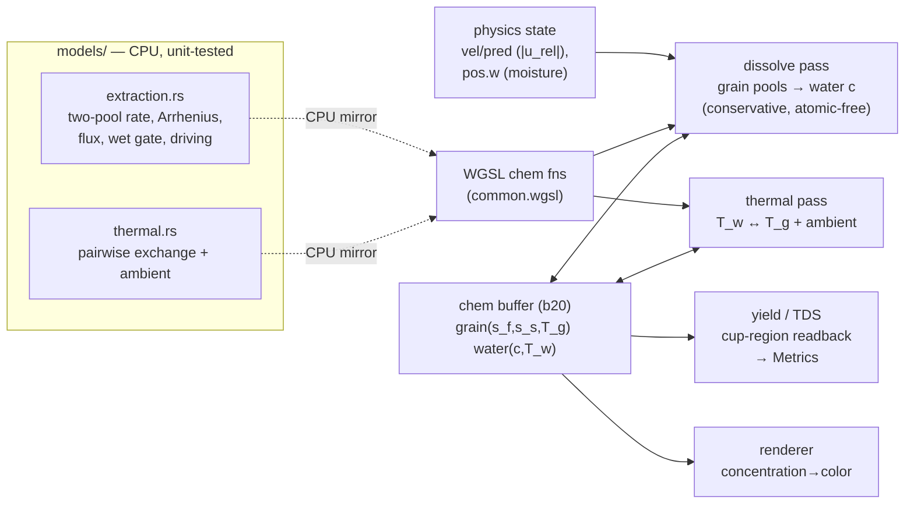

ROUND 5 (final confirmation) of the Phase 1.5 (extraction + thermal) plan for a Rust + wgpu + WGSL two-species XPBD coffee simulator. Rounds 1–4 folded in.

Round 4 left ONE edit: the HTD "Two-pool dissolution" directional pseudo-code (and the KTD-2 intro headroom line) still used `V_w` for water volume. Now fixed — `water_headroom = max(c_sat−c,0)·(f_w·V_w)`, `c_w += Σtake/(f_w·V_w)`, with the `f_w==0` guard, consistent with KTD-2 precondition (d), R8/KTD-7/U5/U7 invariants, and the yield/TDS denominators. Verified no bare `c·V_w` or `·V_w` water-volume term remains.

Round 4 said: "After that edit, the only remaining open items are empirical/calibration points covered by U7's executable gates, and I would approve."

Confirm consistency and surface any remaining paper-correctness issue. First line: **APPROVE**, **REVISE**, or **REJECT**. If the only remaining items are empirical/calibration points settled by the plan's executable tests (U7), treat that as APPROVE and say so explicitly. Cite section/unit IDs; do not re-open resolved items.

## Revised Plan to Review

---
title: "feat: Phase 1.5 — extraction + thermal"
type: feat
status: active
date: 2026-06-04
origin: null
deepened: null
---

# feat: Phase 1.5 — extraction + thermal

## Summary

Add the **wetting→extraction pipeline's dissolution + solute transport + temperature-dependent
kinetics** to the two-species XPBD GPU solver (`solver_xpbd.md` step 5, `models.md` build-phase 3).
Coffee grains hold extractable solute in a **two-pool** model (fast surfaces/fines + slow interiors);
wet grains dissolve solute into the surrounding water at a rate gated by **flow** (the drag term's
relative velocity), **moisture**, and **temperature** (Arrhenius); the dissolved concentration `c`
**rides on the water particles** (Lagrangian, no numerical diffusion) and accumulates into **yield**
and **TDS** measured in the cup. A lumped **thermal** model carries temperature on the particles and
lets the natural pour-temperature drop reduce late-brew extraction.

This is a **passive scalar layer**: extraction/thermal **read** physics state (relative velocity,
moisture, positions) and **write only** solute `c` / temperature `T` / yield — they do **not** feed
back into momentum, incompressibility, contact, density, or mass. So unlike the geometry/coupling
phases, this phase cannot destabilize the sim; the invariant to protect is **solute (and thermal-
energy) conservation**, not momentum/volume. Extraction is **opt-in** (off by default) so every
existing suite stays byte-unchanged and green.

---

## Problem Frame

The solver has water incompressibility, the granular bed, mechanical coupling (drag/buoyancy/
exclusion), wetting/absorption, and SDF geometry — but **no extraction**. `src/models/` has
`permeability.rs`, `cohesion.rs`, `wetting.rs` but **no `extraction.rs`/`thermal.rs`** (a `grep` for
extraction/thermal/solute in `src/` returns only the `models/mod.rs` doc comment, the `state.rs` stub
fields, and the reserved `buffers.rs` slots). `engine::Metrics` (`src/engine/state.rs`) declares
`extraction_yield` and `tds` but `XpbdSolver::metrics()` leaves them `0.0` — nothing computes them.
`ParticleBuffers` (`src/utils/buffers.rs`) already reserves `concentration`/`temperature`/`moisture`
`Option<Arc<Buffer>>` slots for exactly this work.

The model shape is specified at the stub level (`models.md` §extraction/§thermal,
`solver_xpbd.md:35-39`): two-pool kinetics `ds/dt = k(T)·A·s·(1−c/c_sat)·g(|u_rel|)·wet(r)`, Arrhenius
`k(T)`, surface area `A∝1/d_p`, the flux bridge using the drag relative velocity (so extraction is
"independent of incompressibility-solve accuracy"), the moisture gate, Lagrangian solute advection,
and lumped bed↔water thermal feeding the Arrhenius term. Salvaged constants live in `KEEP.md §1`; the
gate band in `KEEP.md §5` / `solver_xpbd.md:64`.

The job: build the two model files (CPU, unit-tested), carry per-particle solute/temperature on the
GPU, run a **conservation-clean grain→water dissolution pass** (atomic-free, mirroring the Phase-1.4
wetting transfer), a thermal exchange pass, and a yield/TDS readout — all within the 8-storage-buffer
budget, the 256-byte `Params` byte-match (now full), and opt-in so suites stay green.

---

## Requirements

- **R1** — `src/models/extraction.rs` (NEW, pure CPU functions + tests like `wetting.rs`): two-pool
  dissolution rate with a **bounded** per-step law `release = s·(1 − e^{−k_eff·dt})` (no overshoot at
  any `dt`), where `k_eff = k0·k_T(T)·area(d_p)·driving(c)·flux(|u_rel|)·wet(s)`; Arrhenius `k_T`
  (normalized so `k_T(T_ref)=1`); `area ∝ 1/d_p`; `driving(c)=max(1−c/c_sat,0)`; saturating
  `flux(u)=u/(u+u_half)`; moisture gate `wet(s)` (dry grain → 0); pool split (fast fraction). Constants
  from `KEEP.md §1` (re-validate).
- **R2** — `src/models/thermal.rs` (NEW, pure CPU + tests): **capacity-weighted** pairwise heat
  exchange. A pair exchanges a heat amount `q = κ·(T_j − T_i)·dt`; each side applies `ΔT_i = +q/C_i`,
  `ΔT_j = −q/C_j` with per-species heat capacity `C = mass·specific_heat`. Equivalently the per-particle
  GPU form `ΔT_i = (κ·dt/C_i)·Σ_neighbors(T_j − T_i)`, which is **energy-conserving for unequal
  capacities** (each pair contributes `+q` to `E_i = C_i·T_i` and `−q` to `E_j`, summing to zero). Plus
  ambient loss `ΔT = −clamp(h_amb·dt,0,1)·(T − T_amb)`. Bounded/stable for any `dt` by clamping the
  **pair heat `q` symmetrically** (using both capacities), not a per-particle ΔT clamp (which would break
  ±q antisymmetry — Codex R2); symmetric `ΔT = α·(T_j−T_i)` is **wrong** unless `C_i = C_j` (Codex R1).
- **R3** — Per-particle GPU chem/thermal state in **one** new `vec4` storage buffer: grain lanes
  `(s_f, s_s, T_g, _)`, water lanes `(c, T_w, _, _)`. Seeded at build (grain pools from the soluble
  dose split by fast fraction; water `c=0`, `T_w=pour_T`; grain `T_g=pour_T` or ambient). Exposed via
  `ParticleBuffers.concentration`/`temperature` for the renderer.
- **R4** — A **conservative grain→water dissolution pass**: solute leaving grain pools exactly equals
  solute added to water `c` (atomic-free, two-sided/frozen-snapshot, water-normalized — the Phase-1.4
  wetting pattern). The `(1−c/c_sat)` driving force is enforced as the **water-side headroom cap**, so
  `c` never exceeds `c_sat`. The flux signal `g(|u_rel|)` is **recomputed** in the pass's neighbor loop.
- **R5** — A **thermal exchange pass**: water↔grain pairwise exchange + ambient loss; updates `T_w`/
  `T_g`; the dissolution pass reads `T` for `k_T`. Lagrangian transport of `c`/`T` is automatic (they
  ride dedicated per-particle lanes untouched by other kernels — no advection kernel).
- **R6** — **Yield + TDS** accumulation: yield = total dissolved solute / total soluble dose; TDS =
  solute mass in the cup / water mass in the cup. Populated into `Metrics.extraction_yield`/`tds` via a
  cached cup-region readback in `sample_diagnostics` (no stalling sync in `metrics()`).
- **R7** — **Opt-in / no regression.** Extraction + thermal are a no-op by default (e.g. `extract_rate
  = 0`), gated to mixed wet-bed scenes, so the water / bed / coupling / wetting / geometry suites and
  scenes stay byte-unchanged and green.
- **R8** — **Conservation as a gate.** Water is never removed (drained water just pools in the cup,
  still carrying its `c`), so the conserved quantity is `Σ(grain s_f+s_s) + Σ(active water c·f_w·V_w)` —
  invariant to float tolerance over a full brew (no separate "drained" term). Capacity-weighted thermal
  energy `Σ C_i·T_i` is invariant in closed exchange. These are gating tests, not diagnostics.
- **R9** — **Calibration to band.** A full V60 brew lands yield **~18–22%**, TDS **~1.2–1.4%**, `c`
  capped at `c_sat=0.08`; a cooler pour temperature measurably lowers extraction.

**Success gate** (`solver_xpbd.md:64`): causal levers correct; yield ~18–22%, TDS ~1.2–1.4%; solute
conserved over a full brew; temperature drop lowers extraction; `Params` byte-match assert holds;
existing suites green; `clippy -D warnings` + `fmt --check` clean.

---

## Key Technical Decisions

### KTD-1 — Passive scalar layer: extraction/thermal read physics, never feed back
Extraction and thermal **only read** physics state (relative velocity, moisture `pos.w`,
positions/neighbors, `T`) and **only write** solute `c`, temperature `T`, grain pools, and yield/TDS.
They do **not** modify momentum, velocity, position, the density target, particle mass, or grain
volume. **What is conserved is an *extractable-solute scalar inventory* (and a thermal-energy
inventory) — NOT total mechanical mass/momentum.** The solver *intentionally neglects* the small
density/inertia effect of dissolved solute: ~4 g of solute into ~250 ml is ≈1.3% TDS, a <1.5% density
perturbation, below the sim's other modeling errors — so `c` is a passive tracer (the standard dilute-
solution approximation). This is a deliberate, bounded mass-model simplification, stated so it is not a
*silent* inconsistency. The benefit: the pass is **stable-by-construction** — it cannot inject the
momentum/position energy that the SDF push-out and buoyancy could. Temperature is likewise passive this
phase (T→viscosity/density back-coupling deferred).

### KTD-2 — Reuse the Phase-1.4 wetting transfer; driving force == conservation cap
The dissolution pass mirrors `wetting.wgsl` (`wet_count` → `wet_water`/`wet_grain`): a count pre-pass
for eligible opposite-species neighbors, then two passes that recompute the **identical per-pair
transfer off a frozen snapshot** and each write only their own slot → atomic-free, exact conservation.
The two-sided cap is `take = min(grain_release / N_w, water_headroom / N_g)` where
`water_headroom = max(c_sat − c, 0)·(f_w·V_w)` (the remaining-water volume, KTD-2 precondition (d)).
**This makes the `(1−c/c_sat)` driving force and solute
conservation the same mechanism**: a water at `c_sat` has zero headroom → accepts nothing → grains
can't over-release into it. Bounded rate `(1−e^{−k·dt})`, **no force-dump of the remainder** (the
Phase-1.4 leak bug), no float atomics.

**The frozen snapshot is a SEPARATE buffer (Codex R2 blocker).** Wetting reads `pred.w` and writes
`pos.w` — two physical buffers — so its snapshot is honest. The chem state is one logical buffer, so a
single `chem` read+written by both passes would let `dissolve_water` see already-depleted grain pools
→ conservation/determinism break. Fix: a dedicated **`chem_frozen` (binding 22)**. The models stage
copies `chem → chem_frozen` before each sub-stage; **both transfer passes read `chem_frozen`, write only
their own slot in the live `chem`** (grain pass → grain slots, water pass → water slots; disjoint, so
in-place writes to `chem` don't race). Thermal does the same (read `chem_frozen`, write `chem`).

Conservation-exactness preconditions, which both passes MUST satisfy identically (Codex R1): (a) the
**eligibility predicate** for counting `N_w`/`N_g` and for the transfer loop is byte-identical on the
count pass and both transfer passes (same range `h`, same species/moisture test, reading `chem_frozen`);
(b) **`N=0` particles emit/accept nothing** (guard the divide); (c) the grain decrements each pool by
`take · release_p/release_total` (**proportional pool share**, `release_total = release_f + release_s`),
guarded for `release_total = 0`; (d) the **water volume is `f_w·V_w`** (the Phase-1.4 remaining-fraction),
so `water_headroom = max(c_sat − c, 0)·(f_w·V_w)` and the water pass does `c += take/(f_w·V_w)` with an
`f_w=0` guard (Codex R2). Because both passes compute `take` as the same pure function of `chem_frozen`
+ the frozen counts + per-grain aggregate flux (KTD-3), grain-loss == water-gain exactly.

### KTD-3 — Flux is a PER-GRAIN aggregate, computed once and stored (not per-pair)
The extraction rate uses the flow signal `g(|u_rel|)`. The drag relative velocity is computed inline
per-pair and never stored (verified). To keep the two-sided transfer symmetric, **flux must be a
per-grain scalar** the water pass can recompute identically (Codex R2): a per-pair flux would make
`release` per-pair and break the "both passes compute the same per-grain `release`" symmetry. So
**`diss_count` computes, per grain, both `N_w` AND an aggregate flux** `flux_g = |v_grain − mean(v_water
neighbors)|` (or mean pairwise `|u_rel|`) from the **finalized `vel` (binding 3)** over the same range
`h`, and stores `(N, flux_g)` in the `diss_neighbors` scratch (a `vec2`). Both transfer passes then read
each grain's stored `flux_g` + `chem_frozen` pools + `T` + moisture and recompute the **identical**
per-grain `release` → `take` agrees on both sides. The finalized `vel` is a *real* relative velocity (the
bridge's intent: "independent of incompressibility-solve accuracy"), not the density-solve residual.

### KTD-4 — One vec4 chem buffer (binding 20); Lagrangian advection is free
Per-particle chem state packs into **one** `var<storage, read_write> chem: array<vec4<f32>>` at binding
20 (next free): grain `(s_f, s_s, T_g, _)`, water `(c, T_w, _, _)` — **separate f32 lanes, not bit-
packing** (the Codex-flagged hazard). Solute/temperature **advect for free**: they live on the
particle's own lane and are *untouched* by every existing kernel (unlike moisture on `pos.w`, which
needed preservation), so position advection carries them automatically — **no advection kernel, no
`.w`-preservation edits**. Only the new chem passes touch binding 20, on **dedicated lean bind groups**,
so the six kernels already at 8/8 storage buffers are not modified.

### KTD-5 — Constants live in a grown `Params` (byte-matched), not a second uniform
`Params` is full at exactly 256 B. The extraction/thermal constants (`k0`, Arrhenius `Ea/R`, `T_ref`,
`c_sat`, fast fraction, `area` ref, `u_half`, `extract_rate` gate; thermal `h_wg`, `h_amb`, `T_amb`,
`pour_T`, `s_on`) — ~14 scalars ≈ 56 B — grow `Params` to the next 16-byte-aligned size (**≈ 320 B**),
updating the Rust struct, the WGSL mirror, and the `size_of` assert in lockstep (the Phase-1.4
procedure). Chosen over a second uniform because the chem passes already read `Params` (dt, h,
grain_diameter) — one uniform read, one byte-match to maintain. (A second `ChemParams` uniform is the
documented alternative if `Params` growth proves awkward.)

### KTD-6 — Opt-in, mixed-gated (suites stay byte-unchanged)
Like `absorb_rate` (wetting) and `num_solids` (SDF), extraction/thermal default **off**
(`extract_rate = 0`, thermal exchange `0`/identity) and the whole stage is gated `mixed &&
extract_rate > 0` in the substep loop. Existing scenes don't opt in → zero new passes run → byte-
unchanged. Constants default to the `KEEP.md` values but the **rate gate** is what activates them.

### KTD-7 — Conservation is a gate, not a diagnostic
The conserved **solute inventory** is `Σ(grain s_f+s_s) + Σ(active water c·f_w·V_w)` (water is never
removed, so cup solute is already in the water term — no separate "drained" term, KTD-1/R8), invariant
to float tolerance over a full brew; capacity-weighted thermal energy `Σ C_i·T_i` invariant in closed
exchange. Written as **failing-first gating tests** (the reviewer rejects silent leaks). The atomic-free
two-sided transfer (KTD-2) is what makes exact conservation achievable without atomics.

---

## High-Level Technical Design

### Data flow



### Substep loop placement (extends the Phase-1.4 models stage)

```
predict → grid → water density+exclusion (iters) → drag/buoyancy → bed contact → finalize → xsph
  └─ models stage (gated mixed && k_abs>0):  wetting: wet_count → wet_water → wet_grain
  └─ models stage (gated mixed && extract_rate>0):                              # NEW, this phase
       copy chem→chem_frozen; diss_count → dissolve_grain → dissolve_water      # read frozen, write live chem
       copy chem→chem_frozen; thermal_exchange                                  # read frozen, write live chem
```
Runs **after** wetting (reads the post-finalize relative velocity + post-wetting moisture). No solute-
advection pass (KTD-4). Single-species / opted-out scenes skip the whole stage → byte-unchanged.

### Two-pool dissolution (directional pseudo-code, not implementation spec)

```
# Per grain g, per pool p∈{fast,slow}, this substep (reads T_g or local T_w, moisture s, neighbors):
k_T   = exp(-(Ea/R) * (1/T - 1/T_ref))            # Arrhenius, normalized: k_T(T_ref)=1
area  = area_ref * (d_ref / d_p)                  # surface area ∝ 1/grind
flux  = u_rel / (u_rel + u_half)                  # saturating in the drag relative velocity
wet   = smoothstep(0, s_on, saturation(g))        # dry grain (s≈0) → 0
k_eff = extract_rate * k0_p * k_T * area * flux * wet
release_p = s_p * (1 - exp(-k_eff * dt))          # bounded; never exceeds the pool
release_total = release_f + release_s

# Conservative two-sided transfer (frozen snapshot; mirrors wetting; atomic-free):
#   N_w = # eligible water neighbors of g ; N_g = # eligible grain neighbors of a water
#   IDENTICAL eligibility predicate (range h, species, moisture, frozen snapshot) on all 3 passes.
#   if N_w==0 (grain) or N_g==0 (water) or f_w==0 (water): no transfer (guard the divides).
#   per (g,w) pair:  take = min( release_total / N_w ,  max(c_sat - c_w, 0)*(f_w*V_w) / N_g )
# dissolve_grain: per pool, s_p -= (Σ_waters take) * release_p/release_total   # PROPORTIONAL pool share;
#                 guard release_total==0 ⇒ no depletion                        # pools deplete, ≥ 0
# dissolve_water: c_w += (Σ_grains take) / (f_w*V_w)                           # concentration rises, ≤ c_sat
```
`driving(c)` is realized as the water-headroom term in `take` (KTD-2): grain-loss == water-gain exactly,
each pool depletes proportionally, and no water exceeds `c_sat`. Water is never removed, so cup solute
stays in the active water term — the yield/TDS readout (R6) reads it there, nothing is "drained away."

### Thermal (directional)

```
# Per particle i (water or grain), pairwise over neighbors + ambient. C_i = mass_i * specific_heat_i.
dT  = (kappa * dt / C_i) * Σ_neighbors (T_j - T_i)        # CAPACITY-WEIGHTED: ΔE_i = C_i·dT = kappa·dt·Σ(T_j-T_i)
dT += -clamp(h_amb*dt, 0, 1) * (T_i - T_amb)              # loss to ambient/dripper
T_i += dT                                                  # (clamp kappa*dt*N/C_i for stability)
```
Energy-conserving with **unequal** water/grain heat capacities: pair `(i,j)` adds `+kappa·dt·(T_j−T_i)`
to `E_i` and the antisymmetric `+kappa·dt·(T_i−T_j)` to `E_j`, summing to zero (ambient loss aside).
A plain symmetric `ΔT = α·(T_j−T_i)` is NOT energy-conserving unless `C_i=C_j` (Codex R1). `k_T` reads
`T`, so the natural cooling lowers late-brew extraction (R9).

### Storage-buffer budget (binding 0 = uniform, excluded)

New storage buffers: `chem` (live, binding **20**), `diss_neighbors` (binding **21**, a `vec2` scratch =
per-grain `(N, flux_g)` — dedicated so it never collides with `wet_neighbors`/b17), `chem_frozen`
(snapshot, binding **22**). The models stage copies `chem → chem_frozen` before dissolution and again
before thermal. Exact storage bindings per new pass (binding 0 = uniform `params`, not counted):

| New kernel | storage bindings | count |
|---|---|---|
| `diss_count` | pred(2), vel(3), phase(11), cell_start(8), sorted_indices(9), diss_neighbors(21) | 6/8 |
| `dissolve_grain` | pred(2), phase(11), cell_start(8), sorted_indices(9), chem(20), chem_frozen(22), diss_neighbors(21) | 7/8 |
| `dissolve_water` | pred(2), phase(11), cell_start(8), sorted_indices(9), chem(20), chem_frozen(22), diss_neighbors(21) | 7/8 |
| `thermal_exchange` | pred(2), phase(11), cell_start(8), sorted_indices(9), chem(20), chem_frozen(22) | 6/8 |
| existing 8/8 kernels (`bed_project`, `compute_lambda/dp`, `drag_*`, `buoyancy_grain`) | **untouched** | — |

`vel`(3) is needed only by `diss_count` (to compute the per-grain aggregate flux `flux_g`, KTD-3); the
transfer passes then read `flux_g` from `diss_neighbors`, so they need `pred`(2) (positions + moisture
`f_w`) but **not** `vel` — keeping them at 7/8. The new passes get dedicated lean bind groups (like
`wet_*`); `Params` grows in place (KTD-5); no new uniform; the two `chem → chem_frozen` snapshot copies
per substep are cheap.

### Chem buffer lane layout (`chem` b20 live + `chem_frozen` b22 snapshot, same layout)

```
grain (phase 1):  x = s_f (fast pool)   y = s_s (slow pool)   z = T_g   w = _
water (phase 0):  x = c   (concentration) y = T_w             z = _     w = _
```
`diss_neighbors` (b21, `vec2`): grain → `(N_w, flux_g)`, water → `(N_g, _)`.

---

## Output Structure

```
src/models/extraction.rs       # CREATE: two-pool rate, Arrhenius, area, flux, wet gate (CPU + tests)
src/models/thermal.rs          # CREATE: pairwise exchange + ambient loss (CPU + tests)
src/models/mod.rs              # MODIFY: register modules; Materials extraction/thermal fields
src/utils/config.rs           # MODIFY: extract_rate (opt-in gate) + numerics
src/solvers/xpbd/mod.rs       # MODIFY: Params growth, chem buffer (b20) + seeding, pipelines/bind groups, substep wiring, yield/TDS readback, ParticleBuffers c/T
src/solvers/xpbd/common.wgsl  # MODIFY: Params mirror; chem binding + WGSL extraction/thermal fns
src/solvers/xpbd/extraction.wgsl # CREATE: diss_count, dissolve_grain, dissolve_water, thermal_exchange
src/engine/state.rs           # MODIFY (if needed): nothing structural — Metrics fields already exist
tests/xpbd_extraction.rs      # CREATE: conservation, dry-grain, c_sat cap, yield/TDS band, temp-drop, no-regression
examples/brew.rs              # CREATE (or extend coupling_render/water_app): a V60 brew measuring yield/TDS
```

---

## Implementation Units

### U1. `models/extraction.rs` — two-pool kinetics (CPU)

**Goal:** The pure-function extraction math: bounded two-pool release, Arrhenius, area, saturating flux,
moisture gate, driving force, pool split. CPU-testable, the mirror of the GPU pass.

**Requirements:** R1.
**Dependencies:** none.
**Files:** `src/models/extraction.rs`, `src/models/mod.rs` (register).

**Approach:** `#[inline] pub fn` scalars (mirror `wetting.rs`/`permeability.rs`): `arrhenius(t, ea_over_r,
t_ref) -> f32` (returns 1 at `t_ref`), `area_factor(d_p, d_ref) -> f32` (`d_ref/d_p`), `flux_factor(u_rel,
u_half) -> f32` (`u/(u+u_half)`, 0 at 0), `wet_gate(saturation, s_on) -> f32` (smoothstep, 0 when dry),
`driving(c, c_sat) -> f32` (`max(1−c/c_sat, 0)`), `release(pool, k_eff, dt) -> f32` (`pool·(1−e^{−k·dt})`,
clamped to `pool`), and a `split(extractable, fast_fraction) -> (s_f, s_s)`. Constants live in `Materials`
(U3), passed in; functions stay parameterized (the fairness contract). Re-validate `KEEP.md §1` values.

**Patterns to follow:** `src/models/wetting.rs` (bounded `absorb_demand` `(1−e^{−k·dt})`),
`src/models/permeability.rs` (monotonicity test), `src/models/cohesion.rs` (endpoint tests).

**Test scenarios:**
- `release` is bounded: at huge `dt` it approaches but never exceeds the pool; at `dt=0` it's 0; a
  depleted pool releases 0.
- `arrhenius` is 1 at `T_ref`, **monotonically increasing in T**, >1 above and <1 below `T_ref`.
- `flux_factor` is 0 at `u=0`, monotonic increasing, saturating (<1, → 1 as u→∞).
- `wet_gate` is 0 for a dry grain (`saturation≈0`) and rises to 1 when wet; `driving` is 1 at `c=0`, 0 at
  `c=c_sat`, clamped ≥0 above.
- `split` conserves: `s_f + s_s == extractable`; fast fraction respected.
- **Edge/guard (Codex R1):** `arrhenius` clamps its exponent so an extreme `T` returns a finite value
  (no `exp` overflow/NaN); `flux_factor` with `u_half=0` is finite (guard the divide); `driving` clamps
  ≥0 above `c_sat`; all functions return finite values for degenerate params.

**Verification:** `cargo test` for the `extraction` unit tests passes; each law's shape (bounded,
monotone, endpoints) holds.

---

### U2. `models/thermal.rs` — lumped heat exchange (CPU)

**Goal:** Pure-function thermal: bounded pairwise exchange + ambient loss, energy-conserving in a closed
pair.

**Requirements:** R2.
**Dependencies:** none.
**Files:** `src/models/thermal.rs`, `src/models/mod.rs` (register).

**Approach:** **capacity-weighted** so it conserves energy for unequal heat capacities (Codex R1).
`pair_flux(t_i, t_j, kappa, dt) -> q` = `kappa·(t_j − t_i)·dt` (the heat from j into i; antisymmetric:
`pair_flux(j,i) = −pair_flux(i,j)`); apply `ΔT_i = q / C_i`. Provide a convenience
`pair_delta(t_i, c_i, t_j, kappa, dt) -> ΔT_i = pair_flux/c_i`, and `ambient_delta(t, t_amb, h_amb, dt)
= −clamp(h_amb·dt,0,1)·(t − t_amb)`. Stability comes from clamping the **pair heat `q` symmetrically**
(`|q| ≤ ε·min(C_i,C_j)·|t_j−t_i|`) so the ±q stays antisymmetric — NOT a per-particle ΔT clamp (Codex
R2). Document that energy conservation requires the `q/C` weighting — a plain symmetric `ΔT` only
conserves when `C_i = C_j`.

**Patterns to follow:** `src/models/wetting.rs` bounded-rate style; `cohesion.rs` test style.

**Test scenarios:**
- `pair_flux` is antisymmetric (`pair_flux(a,b)=−pair_flux(b,a)`); 0 when `t_i==t_j`; 0 at `dt=0`.
- **Closed UNEQUAL-capacity pair (the gate):** with `C_i ≠ C_j`, `t_i += q/C_i`, `t_j += −q/C_j` →
  total enthalpy `C_i·t_i + C_j·t_j` conserved to tolerance; both converge to the capacity-weighted
  equilibrium `(C_i·t_i + C_j·t_j)/(C_i+C_j)` over many steps, never overshooting.
- `ambient_delta` always cools toward `t_amb`, never overshoots; 0 at `t==t_amb`.

**Verification:** `cargo test` passes; closed-pair energy conserved; relaxation monotone.

---

### U3. Materials/Config constants + Params growth (plumbing)

**Goal:** Add the extraction/thermal constants (active-by-default physical values in `Materials`; the
opt-in `extract_rate` gate in `Config`) and grow `Params` to carry them — no behavior yet.

**Requirements:** R1, R2, R6 (gate), R7.
**Dependencies:** U1, U2.
**Files:** `src/models/mod.rs` (`Materials`), `src/utils/config.rs` (`extract_rate` + numerics),
`src/solvers/xpbd/mod.rs` (`Params` struct + assert + literal), `src/solvers/xpbd/common.wgsl` (`Params`
mirror).

**Approach:** Add a `// --- extraction / thermal (Phase 1.5) ---` block to `Materials` (k0_fast,
k0_slow, ea_over_r, t_ref, c_sat, fast_fraction, area_ref/d_ref, u_half, soluble_fraction=0.28; thermal
kappa (conductance), **specific_heat_water, specific_heat_grain** for the capacity-weighted exchange
`C=mass·cp`, h_amb, t_amb, pour_t, s_on) defaulted to `KEEP.md §1` values (thermal constants are fresh —
see Open Questions). Add `extract_rate: f32 = 0.0` to
`Config` (the opt-in gate; comment mirrors `absorb_rate`). Grow `Params` (Rust + WGSL + the `size_of`
assert) to the next 16-byte-aligned size, populating the literal from Materials/Config (KTD-5). No pass
reads the new fields yet.

**Patterns to follow:** the `absorb_rate` opt-in (`config.rs`), the Phase-1.4 `Params` growth
(240→256, the 3-edit procedure: Rust struct + WGSL mirror + assert), `r_max`/`rho_ratio` in `Materials`.

**Test scenarios:** `Test expectation: none — plumbing.` Covered by the `size_of::<Params> == <new>`
compile assert + existing suites staying green (no field is read yet).

**Verification:** `cargo build` + `clippy` clean; the Params assert holds at the new size; WGSL compiles;
all existing suites green.

---

### U4. GPU chem state buffer + WGSL chem functions (plumbing)

**Goal:** The per-particle chem buffer (binding 20), its seeding, the `ParticleBuffers` c/T wiring, and
the WGSL extraction/thermal functions — no pass calls them yet.

**Requirements:** R3.
**Dependencies:** U3.
**Files:** `src/solvers/xpbd/mod.rs`, `src/solvers/xpbd/common.wgsl`.

**Approach:** Create `chem` (live, binding 20, `COPY_SRC` for readback) **and `chem_frozen`** (snapshot,
binding 22, `COPY_DST`) as `vec4` storage buffers, seeded in `build`: grain `(s_f, s_s, T_g, 0)` from
`soluble_fraction·grain_dose` split by `fast_fraction`, water `(0, T_w=pour_T, 0, 0)`; re-seed in
`reset`. Wire `ParticleBuffers.concentration`/`temperature` (views of `chem`) in `particles()`. Add
`@binding(20) chem` + `@binding(22) chem_frozen` + the WGSL `ex_*` functions (Arrhenius/area/flux/wet/
release) and `th_*` (capacity-weighted exchange/ambient) mirroring U1/U2. Do **not** call them from any
pass yet (so the 8/8 kernels' layouts are unchanged). (`diss_neighbors` b21 is created with the
dissolution passes in U5.)

**Patterns to follow:** the SDF `solids` buffer addition (create_buffer_init + struct field +
seeding/reset); the WGSL `solid_*` function block; `seed_block` for per-species init.

**Test scenarios:** `Test expectation: none — plumbing.` Covered by build success + the shader compiling
with the new binding/functions + existing suites green (chem unused).

**Verification:** builds; WGSL compiles; existing suites green; `read_concentration`/`read_temperature`
hooks return seeded values.

---

### U5. Dissolution pass — conservative grain→water solute transfer

**Goal:** The extraction core: wet grains release two-pool solute into overlapping water `c`,
conservation-clean (atomic-free), flux/temperature/moisture-gated, capped at `c_sat`.

**Requirements:** R4, R7, R8.
**Dependencies:** U4.
**Files:** `src/solvers/xpbd/extraction.wgsl` (CREATE: `diss_count`, `dissolve_grain`,
`dissolve_water`), `src/solvers/xpbd/mod.rs` (pipelines + lean bind groups + substep wiring),
`src/solvers/xpbd/common.wgsl` (include), `tests/xpbd_extraction.rs`.

**Approach:** Mirror `wetting.wgsl` (KTD-2) with an explicit frozen snapshot (KTD-2 blocker fix). The
stage copies `chem → chem_frozen` (b22), then: `diss_count` computes per grain `(N_w, flux_g)` — the
eligible water count and the **aggregate flux** from the finalized `vel`/b3 (KTD-3) — and per water `N_g`,
storing into `diss_neighbors` (b21, `vec2`); `dissolve_grain` reads `chem_frozen` (pools, T, moisture) +
`flux_g`, computes each pool's `release`, and decrements its pools in the **live `chem`**
**proportionally** (`s_p −= Σtake·release_p/release_total`, guarded); `dissolve_water` recomputes each
neighbor grain's **identical** `release`/`take` from `chem_frozen` + that grain's stored `flux_g`, and
increments its own `c` in live `chem` by `Σtake/(f_w·V_w)` (f_w guard). **All passes read `chem_frozen`,
write disjoint slots of live `chem`**, use the **identical eligibility predicate** (range `h`, species,
moisture), and **guard `N=0`/`release_total=0`/`f_w=0`**. The two-sided cap
`take = min(release_total/N_w, max(c_sat−c,0)·(f_w·V_w)/N_g)` unifies conservation + driving force +
the f_w coupling. Exact bindings per the budget table (≤7/8). Slot after the wetting block in `step()`,
gated `mixed && extract_rate > 0` (rebuild the grid + copy the snapshot first). Atomic-free; no
force-dump.

**Execution note:** Add the failing solute-conservation test before wiring the transfer.

**Patterns to follow:** `wetting.wgsl` (`wet_count`/`wet_water`/`wet_grain` frozen-snapshot two-sided
transfer), `coupling.wgsl` `drag_water` (the neighbor gather + relative-velocity computation),
`mod.rs:1429-1443` (the wetting substep block + grid rebuild + gating).

**Test scenarios:** (`tests/xpbd_extraction.rs`, GPU-gated via `GpuContext::new_headless()`)
- **Solute conservation (gate):** a mixed wet blob, extraction on, several steps → Σ(grain `s_f+s_s`) +
  Σ(water `c·f_w·V_w`) is invariant to tolerance every step (no leak, no force-dump). Covers R8.
- **Dry grain doesn't extract:** with moisture off (`absorb_rate=0` and grains seeded dry) the pools are
  unchanged and `c` stays 0 (the `wet` gate holds). Covers R1.
- **`c_sat` cap:** drive extraction hard in a closed cell → water `c` rises but never exceeds `c_sat`;
  grains stop releasing into saturated water (headroom cap). Covers R4.
- **No over-subscription:** one grain among many waters and vice-versa → no water exceeds `c_sat`, no
  pool goes negative (the two-sided `min`).
- **Flux dependence:** higher relative velocity → faster release (monotone), zero flow → minimal release
  (the `flux` bridge).
- **Saturated-adjacent-to-unsaturated water (Codex R1):** a saturated water (`c≈c_sat`) and an
  unsaturated water both overlapping one grain → the grain releases into the unsaturated one only; the
  saturated one's `c` doesn't exceed `c_sat`; solute still conserved.
- **`release_total = 0` guard:** a fully-depleted grain (both pools 0) → no transfer, no NaN, `c`
  unchanged.
- **CPU/GPU parity:** a tiny hand-computable pair graph (1–2 grains, 1–2 waters) → the GPU transfer
  matches the CPU `extraction.rs` `release`/`take` to tolerance (locks the WGSL mirror to the model).
- **No-op without opt-in (R7):** `extract_rate=0` → chem buffer unchanged; an existing scene's invariants
  hold.

**Verification:** conservation + cap + dry-gate + parity tests pass; existing suites unchanged;
`clippy`/`fmt` clean.

---

### U6. Thermal exchange pass + temperature-gated extraction

**Goal:** Per-particle heat exchange + ambient loss; the dissolution `k_T` reads the evolving `T`, so a
cooler pour lowers late extraction.

**Requirements:** R5, R8, R9.
**Dependencies:** U5.
**Files:** `src/solvers/xpbd/extraction.wgsl` (`thermal_exchange`), `src/solvers/xpbd/mod.rs` (pipeline +
bind group + substep wiring), `tests/xpbd_extraction.rs`.

**Approach:** copy `chem → chem_frozen` first, then `thermal_exchange` gathers neighbors (counting-sort
grid), reading temperatures from `chem_frozen` and writing `T` into live `chem`. Capacity-weighted:
per pair compute the heat `q_ij = κ·(T_j − T_i)·dt`, **clamp `|q_ij|` symmetrically using both
capacities** (e.g. `|q| ≤ ε·min(C_i,C_j)·|T_j−T_i|`) so the ±q stays antisymmetric (a per-particle ΔT
clamp would break antisymmetry and energy conservation — Codex R2), then `ΔT_i = Σ q_ij / C_i` + ambient
loss. `C_i = mass·specific_heat` per species (water mass scales with `f_w`; wet-grain mass includes
absorbed water `ρ·V_abs`). One-step `T` lag vs dissolution is acceptable (doc order extraction→thermal).
Bindings: `pred(2), phase(11), cell_start(8), sorted_indices(9), chem(20), chem_frozen(22)` = 6/8.

**Test scenarios:**
- **Relaxation:** a hot water blob next to cooler grains converges toward the capacity-weighted
  equilibrium temperature; ambient loss cools the whole system toward `T_amb`.
- **Energy conservation with UNEQUAL capacities (gate):** with ambient loss off and water/grain heat
  capacities deliberately different, total enthalpy `Σ C_i·T_i` is invariant across exchange to
  tolerance (a plain symmetric ΔT would fail this). Covers R8.
- **Temperature drop lowers extraction (gate):** two identical brews, one with a lower `pour_T` (or
  faster ambient loss) → lower final yield. Covers R9.

**Verification:** relaxation + energy + temp-drop tests pass.

---

### U7. Yield/TDS accumulation + brew scene + calibration

**Goal:** Populate `Metrics.extraction_yield`/`tds` from a cup-region readout, add a brew scene/example,
and calibrate constants to the band.

**Requirements:** R6, R9.
**Dependencies:** U5, U6.
**Files:** `src/solvers/xpbd/mod.rs` (`read_concentration`/`read_temperature` hooks; cup-region
accumulation cached in `sample_diagnostics`; `metrics()` populates yield/tds), `examples/brew.rs`
(CREATE or extend), `tests/xpbd_extraction.rs`.

**Approach:** Add readback hooks mirroring `read_moisture` (chem `c`/`T` + `pos.w` for `f_w`). In
`sample_diagnostics` (the non-stalling cache point), compute yield = `Σ(active water c·f_w·V_w)` / total
soluble dose, TDS = `Σ(cup water c·f_w·V_w)` / `Σ(cup water f_w·V_w·ρ)` using the cup geometry (r<3,
y∈[−8,−3.5] from the V60 cup) — **all water volumes scaled by the Phase-1.4 remaining fraction `f_w`**
(Codex R2) — cached into the diagnostics struct; `metrics()` reads the cache (no GPU sync). A `brew`
example drives `Scene::v60()` with extraction on (the calibrated permeable-bed mats from the SDF phase)
and prints yield/TDS over the brew. Calibrate `k0`/`extract_rate`/`c_sat`/`fast_fraction` to land in band.

**Test scenarios:**
- **Yield in band (gate):** a full V60 brew → yield ∈ [18%, 22%] (loose), `c ≤ c_sat`. Covers R9.
- **TDS in band:** cup TDS ∈ ~[1.2%, 1.4%] (loose band; calibration-dependent).
- **Solute conserved over the full brew (gate):** `Σ(grain s_f+s_s) + Σ(active water c·f_w·V_w)` invariant
  end-to-end (water is never removed, so cup solute is in the active-water term — no "drained" term).
  Covers R8.
- **Metrics populated:** `metrics().extraction_yield`/`tds` are non-zero and finite after a brew (were
  always 0 before).

**Verification:** brew lands in band; metrics populated; conservation holds; example renders/prints a
believable brew.

---

## Implementation Order

1. **U1** — `extraction.rs` (CPU). *Gate:* bounded/monotone/endpoint unit tests green.
2. **U2** — `thermal.rs` (CPU). *Gate:* closed-pair energy conserved; relaxation monotone.
3. **U3** — Materials/Config + Params growth. *Gate:* builds; Params assert at new size; suites green.
4. **U4** — Chem buffer (b20) + WGSL fns (plumbing). *Gate:* compiles; chem seeded; suites green.
5. **U5** — Dissolution pass. *Gate:* solute conserved; dry-gate; `c_sat` cap; no-op without opt-in.
6. **U6** — Thermal pass. *Gate:* relaxation; energy conserved; temp-drop lowers extraction.
7. **U7** — Yield/TDS + brew + calibration. *Gate:* yield/TDS in band; solute conserved over the brew;
   metrics populated.

---

## Scope Boundaries

**In scope:** two-pool extraction kinetics + thermal models (CPU); per-particle GPU solute/temperature
state; the conservative dissolution pass; the thermal pass; Lagrangian advection (free); yield/TDS
readout + `Metrics` wiring; a brew scene; calibration to the band; opt-in gating.

### Deferred to Follow-Up Work
- **Channeling, fines migration, bloom** (Phase 1.6, `solver_xpbd.md` step 6).
- **Virtual-mass + concentration-gradient interphase forces** (step 3/4, separately deferred) — note the
  concentration-gradient force is the *one* future place composition could feed back into physics.
- **Per-roast `c_sat` / pool-split material presets** (a `materials/` + `assets/calibration/` follow-on).
- **A GPU reduction for yield/TDS** (CPU cup-region readback now; a single-workgroup reduction is a perf
  follow-on).
- **The fine-bed drawdown calibration** (its own phase; the SDF phase's coarse permeable bed is the brew
  testbed for now).

### Out of scope
- **Any extraction→physics back-coupling** — no TDS→density, no `c`/`T`→viscosity, no grain-mass-loss→
  shrink→permeability. Extraction/thermal are passive (KTD-1).
- **Momentum/incompressibility/contact changes** — untouched.
- **Raising the 8-storage-buffer limit** (disallowed); **float atomics** (not used); **perf optimization**
  (deferred until all features built).

---

## Risks & Mitigations

- **R-1 — Solute leak (the reviewer's hard line).** A non-symmetric transfer or a force-dumped remainder
  silently violates conservation. *Mitigation:* reuse the proven Phase-1.4 frozen-snapshot two-sided
  transfer verbatim (KTD-2); conservation is a failing-first gate (KTD-7/U5); no force-dump.
- **R-2 — `c_sat` overshoot / over-subscription** with many waters per grain or vice-versa. *Mitigation:*
  the two-sided `min` with the water-headroom cap; `diss_count` normalizes by eligible-neighbor count;
  tested (U5).
- **R-3 — Arrhenius/flux numerical blow-up** (exp overflow at extreme T; divide issues). *Mitigation:*
  normalized Arrhenius (`k_T(T_ref)=1`), clamp the exponent; `flux=u/(u+u_half)` is bounded in [0,1);
  the bounded `(1−e^{−k·dt})` release caps any rate; CPU tests assert finiteness.
- **R-4 — `Params` byte-drift** on the growth. *Mitigation:* the `size_of` compile assert + field-for-
  field WGSL mirror review (the Phase-1.4 procedure); U3 verifies before any pass uses the fields.
- **R-5 — Calibration doesn't land in band** (the `KEEP.md` values are v1/MPM-tuned; the length scale
  `≈27.7 units/m` couples to extraction timescales). *Mitigation:* U7 is an explicit calibration unit
  with loose bands; constants are `Materials` knobs; flag re-tuning as expected, not a failure.
- **R-6 — Cup accumulation instability** (ISSUES #1: v1 cup blow-up on drip). *Mitigation:* that was a
  v1 global-pressure symptom (designed out by local XPBD); extraction is passive (KTD-1) so it adds no
  cup forces — but the brew test asserts finiteness/no-overflow in the cup.

---

## Open Questions

- `T_ref` and the brew-water `pour_T` / `T_amb` absolute scale — no thermal constants are recorded in
  `KEEP.md` (only kinetics). Pick a convenient normalized scale (e.g. `T_ref = pour_T`, ambient below)
  and calibrate; revisit if SI thermal calibration is wanted. (Resolve in U2/U3, empirical.)
- Per-particle grain `T_g` vs a single lumped bed temperature — plan uses per-particle `T_g` (fits the
  gather framework, no global reduction); revisit if a single bed lump is preferred. (U6.)
- Yield/TDS reporting split: water is never removed (KTD-1/R8), so **yield = Σ(active water c·f_w·V_w) /
  total soluble dose** over all water; **TDS** is the cup-region subset. Open only as a *reporting*
  nicety (in-bed vs cup), not a conservation question. (U7.)
- Whether `extract_rate` and the kinetics constants want a `Materials` preset per roast now or later
  (deferred to follow-up). (U3/U7.)

---

## Sources & Research

- `KEEP.md §1` (kinetics: yield 0.28, fast 0.18/s, slow 0.018/s, fast-fraction 0.30, c_sat 0.08,
  pore→water 4.0/s), `§5` (band: yield 18–22%, TDS 1.2–1.4%), `§2` (length scale `≈27.7 units/m` couples
  to extraction timescales — re-validate).
- Model spec: `docs/plans/models.md` (`extraction.rs`/`thermal.rs` sections), `docs/plans/solver_xpbd.md:35-64`
  (wetting→extraction pipeline, substep step 7, build-phase-5 gate).
- Conservation template: `src/solvers/xpbd/wetting.wgsl` (`wet_count`/`wet_water`/`wet_grain` frozen-
  snapshot two-sided transfer); `docs/plans/2026-06-03-001-feat-wetting-cohesion-plan.md` (KTD-1/3, Params
  growth procedure).
- Flux signal: `src/solvers/xpbd/coupling.wgsl` (`drag_delta_for_pair`, `vel_frozen`) — relative velocity
  computed inline, not stored (must recompute).
- State/output: `src/engine/state.rs` (`extraction_yield`/`tds` stubs), `src/utils/buffers.rs`
  (`concentration`/`temperature`/`moisture` reserved slots), `src/solvers/xpbd/mod.rs` (`metrics()`,
  `read_moisture`/`sample_diagnostics`/`diagnostics` patterns; the `solids` buffer addition as the
  buffer/seed/reset template; the substep models stage).
- Models pattern: `src/models/{wetting,permeability,cohesion}.rs` (pure fn + `#[cfg(test)]`).
- Constraints: `AGENTS.md` (8 storage buffers, no float atomics, Params byte-match, no test rot),
  `docs/PERF_NOTES.md` (dispatch count = browser-cost lever). Conservation is a recorded hard gate
  (memory: "extraction must conserve solute mass; thermal must conserve energy").
- v1 issue: `docs/ISSUES.md` #1 (cup blow-up — a v1 global-pressure symptom, designed out).
- Brew testbed: `Scene::v60()` (drains into the cup, calibrated permeable bed from the SDF phase).
