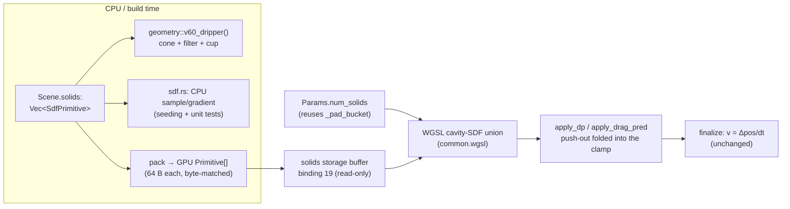

You are rigorously reviewing an implementation plan for a Rust + wgpu 29 + WGSL real-time pour-over coffee simulator (the `coffee-sim` rewrite). The plan adds general static solid-object boundaries defined via analytic SDFs (a V60 dripper cone + grains-only filter cone + catch cup as the first instances) to an existing two-species XPBD GPU solver.

Respond with a verdict on the FIRST LINE: **APPROVE**, **REVISE**, or **REJECT**. Then explain, rigorously and specifically, citing the plan's section/unit IDs.

The reviewer should weigh these project-specific facts (all verified against the codebase):
- Two-species XPBD GPU solver: phase 0=water, 1=grain. WGSL split common/water/bed/coupling/wetting.wgsl, concatenated via include_str!. Counting-sort neighbor grid.
- HARD constraints: max 8 storage buffers PER SHADER STAGE (device limit pinned to wgpu defaults; raising it is forbidden — it was v1's fatal mistake); NO portable WGSL float atomics; `Params` uniform must stay EXACTLY 256 bytes, byte-identical Rust(`#[repr(C)]`)↔WGSL, enforced by `const _: () = assert!(size_of::<Params>()==256)`.
- The ONLY boundary handler today is an axis-aligned box clamp inside `apply_dp` (common.wgsl:300-336) and re-applied in `apply_drag_pred` (coupling.wgsl:372-379). The clamp delta gives the boundary normal; grains get Coulomb friction (`floor_mu`); velocity is derived from the position delta in `finalize` (never explicitly reflected). Every writer of pred/pos MUST preserve the `.w` lane (moisture).
- `apply_dp` currently uses 5/8 storage buffers; `apply_drag_pred` 3/8. Six kernels (bed_project, compute_lambda, compute_dp, drag_water, drag_grain, buoyancy_grain) are AT 8/8 and cannot take a new binding.
- Existing scenes (dam/pour/bed/water) and four GPU test suites (water/bed/coupling/wetting) must stay green; perf optimization is explicitly DEFERRED (do not optimize for speed).
- The user is a physics reviewer who rejects hand-waving and probes failure modes (clumping, artificial-pressure artifacts, conservation drift). Volume + momentum conservation are hard constraints.

Be especially critical of: (1) whether folding the SDF push-out into `apply_dp`/`apply_drag_pred` (vs a separate pass) is correct and conservation-clean, and any ordering hazard between SDF push-out and the box clamp; (2) the cavity-SDF sign convention and the true-Euclidean cone distance (vs v1's radial approximation) — correctness at the apex, open top, and apex hole; (3) the storage-buffer budget after adding binding 19 to those two passes; (4) the Params byte-match after renaming `_pad_bucket`→`num_solids` and the 64-byte Primitive struct; (5) selectivity correctness (filter blocks grains, passes water) and whether grains seeded inside the cone can escape; (6) momentum/volume conservation as water drains through the filter into the cup; (7) any missing failure mode, test gap, or unstated assumption.

## Plan to Review

---
title: "feat: General static solid-object (SDF) boundaries"
type: feat
status: active
date: 2026-06-04
origin: null
deepened: null
---

# feat: General static solid-object (SDF) boundaries

## Summary

Add a **general static solid-object boundary system** to the two-species XPBD GPU solver: composable
analytic SDF primitives (a truncated-cone cavity, a cylinder cavity to start) carried on the `Scene`,
uploaded to the GPU as a small read-only primitive array, and resolved as a **selective position-level
push-out** that generalizes the existing axis-aligned box clamp. The first instances are the **V60
dripper**: a rigid support cone, a grains-only filter cone (water passes, grounds are trapped), and a
catch cup that water drains into. The system is built so that adding a flat-bottom dripper, a Kalita,
or a second cup later is just new primitive data — not new solver code.

This is the deferred `geometry/` phase (`docs/plans/engine.md:14-30`, `docs/plans/utils.md:20-32`). It
deliberately uses **analytic primitives**, not the baked SDF textures the current stubs/docs still
describe (the baked path is stale and carries an aliasing risk; see KTD-1). Perf is **out of scope** —
correctness and structure first, per the standing project decision.

---

## Problem Frame

Boundary handling today is a single axis-aligned box clamp to `params.box_min/box_max`, living in
`apply_dp` (`src/solvers/xpbd/common.wgsl:300-336`) and re-applied in the drag subcycle's
`apply_drag_pred` (`src/solvers/xpbd/coupling.wgsl:372-379`). The box clamp *is* the boundary normal
response: `clamped = clamp(proposed, box)`, the clamp delta gives the normal, and grains get Coulomb
floor friction (`params.floor_mu`) along the tangent. Velocity is never explicitly reflected — `finalize`
(`common.wgsl:338-368`) derives `v = (clamped_pos − prev_pos)/dt`, so the into-wall component zeroes
itself.

`Scene` (`src/engine/scene.rs:25-39`) describes only an AABB box plus AABB seed regions. There is no way
to express a cone, a cup, or a filter, so the simulator cannot model a real dripper. `src/utils/sdf.rs`
and `src/utils/geometry/mod.rs` are inert `todo!()` stubs reserved for exactly this work. The salvaged
v1 geometry values live in `KEEP.md §3-4`; the physics regression band in `KEEP.md §5`.

The job: let a `Scene` carry analytic solid geometry, evaluate it on the GPU, and resolve collisions as a
selective (per-species) push-out — without breaking the 8-storage-buffer ceiling, the no-float-atomics
rule, the 256-byte `Params` byte-match, or any existing scene/suite.

---

## Requirements

- **R1** — Define composable analytic SDF primitives with `sample(p)→signed distance` and
  `gradient(p)→normal`, signed so the **allowed cavity interior is positive**. Truncated cone and
  cylinder are required for V60; the primitive enum + dispatch must make adding plane/box/sphere a
  pure-data extension. (`src/utils/sdf.rs`)
- **R2** — Use **true Euclidean** distance to the cone surface (point-to-segment in the `(r,y)`
  half-plane), not v1's radial `inner_r − r` approximation, so penetration depth and gradient are
  consistent. Open top and apex hole are non-colliding (free entry / free fall-through).
- **R3** — `Scene` carries a list of solids; each solid has a **species mask** (all / grains-only),
  a friction coefficient, and its primitive params. A V60 preset builds support cone + grains-only
  filter cone + cup. (`src/engine/scene.rs`, `src/utils/geometry/mod.rs`)
- **R4** — The geometry reaches WGSL as a **dedicated read-only storage buffer** of fixed-size
  primitives (analytic eval per particle), with a `num_solids` scalar in `Params`. `Params` stays
  exactly 256 bytes (reuse the dead `_pad_bucket` slot).
- **R5** — Particle-vs-SDF collision is a **selective position-level push-out folded into the existing
  clamp sites** (`apply_dp`, `apply_drag_pred`): push a penetrating particle out along the SDF gradient
  by the penetration depth, reuse the box-clamp's grain Coulomb-friction machinery, and preserve the
  moisture lane `.w`. Momentum/conservation-clean; selective by `phase[i]` (filter blocks grains,
  passes water).
- **R6** — **No regression.** A scene with no solids makes the SDF path a strict no-op; the
  water / bed / coupling / wetting suites and the dam / pour / bed / water scenes stay green and
  behaviorally unchanged.
- **R7** — A V60 scene drains end-to-end: water passes the filter and reaches the cup; grains are
  trapped above the apex; no particle penetrates a wall beyond tolerance; water volume is conserved.
- **R8** — Update the stale "baked SDF texture" language (`src/utils/sdf.rs`, `src/utils/geometry/mod.rs`,
  `docs/plans/utils.md`, `KEEP.md §3`, `docs/ARCHITECTURE.md:42`) to reflect the analytic decision.

**Success gate:** A V60 scene builds and its dripper SDF loads; a dropped particle rests on the cone
within `KEEP.md §5`'s penetration band (<4 mm equiv.); water reaches the cup while grains stay trapped;
existing scenes and all four GPU suites remain green; `cargo fmt --check`, `clippy -D warnings`, and
`size_of::<Params>() == 256` all hold.

---

## Key Technical Decisions

### KTD-1 — Analytic primitives, not a baked SDF texture
v1 baked a 128³ SDF texture and trilinearly sampled it (`KEEP.md §3`: "trilinear 3D-texture sampling
for gradients"); a circular cone on a Cartesian grid picked up a fourfold aliasing artifact that trapped
water on the wall, and v1's late history moved to analytic evaluation. We evaluate a small array of
analytic primitives per particle. This is exact (no grid alias), cheap for a handful of solids, needs no
asset pipeline, and matches `utils/sdf.rs`'s stated purpose. **The current stubs and docs still say
"baked"** — that language is stale and is corrected in U6/R8. *Rationale also from `docs/solutions`-style
learnings: the learnings pass found no recorded decision for this, only the contradictory "baked" docs —
so the divergence must be written down here.*

### KTD-2 — Cavity-SDF sign convention (interior positive)
Every solid is a **cavity**: the allowed free-space region is the interior, the boundary is the cavity
surface, and `sample(p) > 0` inside (allowed), `< 0` outside/through the wall (forbidden). This unifies
the cone, the cup, and conceptually the domain box (a box cavity), and makes "push out" always "push
toward `+gradient`" by `(contact_offset − d)` when `d < contact_offset`. The gradient points into the
cavity. Safe-normalize (`KEEP.md §3`: return ZERO when `len ≤ EPSILON`) guards NaN normals at the apex.

### KTD-3 — Generalize the box clamp; do not add a dispatch
The push-out is **folded into `apply_dp` and `apply_drag_pred`**, the two existing position-clamp sites,
rather than added as a standalone compute pass. Reasons: (a) a separate pass after `apply_dp` would let
the box clamp shove a particle back through a cone wall (ordering hazard); (b) the sim is already ~93
dispatches/frame and dispatch count is the tracked browser-cost lever (`docs/PERF_NOTES.md`) — fold, don't
add; (c) it reuses the clamp's normal-from-delta + `floor_mu` friction + `.w` preservation verbatim.
`apply_dp` is 5/8 storage buffers and `apply_drag_pred` is 3/8, so each can take the +1 geometry binding.
Running it every constraint iteration also lets the boundary **co-converge** with the density/bed solve,
matching how exclusion already co-converges. (Alternative — a dedicated pass — is in Alternatives.)

### KTD-4 — Geometry is its own read-only storage buffer; count rides in Params
`Params` is full at 256 B (only `_pad_bucket` is reclaimable) and a variable-length primitive list cannot
live in a fixed uniform anyway. Solids go in a new `var<storage, read> solids: array<Primitive>` at the
next free binding (**19**), uploaded once at build via `create_buffer_init` (geometry is static; re-upload
in `reset`). `num_solids` reuses the `_pad_bucket` slot in `Params` so the byte-match stays 256. Each
`Primitive` is a fixed 64-byte, vec4-aligned record (kind tag + species mask + friction + three `vec4`
param slots) — byte-identical Rust `#[repr(C)]` ↔ WGSL.

### KTD-5 — Selectivity is a phase gate; the outlet is geometric; the drain is deferred
The filter "passes water" by **excluding water from its species mask** (`mask & (1<<phase[i])`), the same
phase-tag mechanism the coupling/wetting layers use. The apex outlet needs **no special flag**: the
truncated-cone cavity simply has no wall below `hole_radius`, so water falls through the apex hole
geometrically (replacing v1's MPM-specific "rim band" vertical-clamp hack). A real drain (removing /
recycling water) is a separate future particle-lifecycle concern keyed on an outlet AABB in `Scene`; it is
orthogonal to the SDF system and out of scope — but the cup-as-solid + apex-hole geometry leaves a clean
seam for it.

---

## High-Level Technical Design

### Data flow



### Where it sits in the substep loop (mixed scene)

```
predict (gravity; mirror pos.w → pred.w)
compute_coupling_scale
for iters: { water density ; grain_exclude ; apply_dp* ; residual }   # *SDF push-out folded in
for subiters: { copy vel→vel_frozen ; drag_water ; drag_grain }
buoyancy
apply_drag_pred*                                                       # *SDF push-out folded in
bed contact subcycle
finalize ; xsph
```
No new dispatch. The two starred sites gain the SDF resolve; everything else is untouched. When
`num_solids == 0` the SDF loop runs zero iterations → byte-unchanged (R6).

### Cone cavity-SDF (directional pseudo-code, not implementation spec)

```
# Truncated-cone cavity, axis +Y, open top, apex hole. Allowed interior is positive.
fn cone_cavity(p, prim):
    r  = length(p.xz - center.xz)
    y  = p.y
    if y > top_y or y < apex_y: return BIG          # open top / below apex → no constraint
    inner = max(lerp(apex_r, top_r, (y-apex_y)/height) - thickness, hole_radius)
    if y near apex and r < hole_radius: return BIG   # apex hole → free fall-through
    # true Euclidean dist to the inner cavity surface = revolved point-to-segment in (r,y):
    d2d, n2d = dist_and_normal_to_segment((r, y), (apex_inner_r, apex_y), (top_inner_r, top_y))
    signed  = (r <= inner) ? +d2d : -d2d             # interior positive
    grad    = safe_normalize(vec3(n2d.x * (p.xz-center.xz)/r, n2d.y))
    return signed, grad
```
Cylinder cup is the analogous open-top capped cylinder (side wall + floor; rim open). Union over
species-applicable solids = take the most-penetrated (min signed distance); the V60 solids are disjoint
in space, so min-pick and additive push-out coincide.

### Storage-buffer budget (binding 0 = uniform, excluded from the 8 cap)

| Kernel | Before | After | Within 8? |
|---|---|---|---|
| `apply_dp` (gains `solids`) | 5/8 | **6/8** | ✓ |
| `apply_drag_pred` (gains `solids`) | 3/8 | **4/8** | ✓ |
| `finalize`, `predict` | 6/8 | unchanged | ✓ |
| `bed_project`, `compute_lambda`, `compute_dp`, `drag_*`, `buoyancy_grain` | 8/8 | **untouched** | ✓ |

Only the two clamp sites gain the geometry binding; the six kernels already at 8/8 are not touched.

### Params growth

`_pad_bucket: u32` (dead since the counting-sort change) → `num_solids: u32`. No size change;
`const _: () = assert!(size_of::<Params>() == 256)` (`mod.rs:90-91`) still holds. WGSL `Params`
(`common.wgsl:15-68`) mirror updated in lockstep.

### GPU `Primitive` record (64 B, vec4-aligned; byte-matched Rust ↔ WGSL)

```
kind: u32          species_mask: u32   friction: f32   _pad: f32     # 16 B header
a: vec4   # cone:(apex_y, apex_r, top_y, top_r)  cyl:(floor_y, rim_y, radius, _)
b: vec4   # cone:(thickness, hole_radius, center_x, center_z)  cyl:(center_x, center_z, _, _)
c: vec4   # reserved (restitution / future params)
```

---

## Output Structure

```
src/utils/sdf.rs              # MODIFY: SdfPrimitive, SolidKind, cavity sample/gradient, union, safe-normalize, CPU tests
src/utils/geometry/mod.rs     # MODIFY: v60_dripper() preset (cone+filter+cup); de-stub; analytic docstrings
src/engine/scene.rs           # MODIFY: Scene.solids field; re-export types; v60() builds geometry + seeds bed-in-cone
src/solvers/xpbd/mod.rs       # MODIFY: GPU Primitive struct, solids buffer (binding 19), num_solids in Params, bind groups
src/solvers/xpbd/common.wgsl  # MODIFY: Params field + binding 19; WGSL cavity-SDF fns + union; push-out in apply_dp
src/solvers/xpbd/coupling.wgsl# MODIFY: push-out in apply_drag_pred
tests/xpbd_geometry.rs        # CREATE: GPU collision/selectivity/drain/no-regression suite
examples/v60_render.rs        # CREATE (or extend coupling_render): eyeball the V60 drain
```

---

## Implementation Units

### U1. SDF primitive set + cavity sample/gradient + union (CPU)

**Goal:** The analytic math core: `SdfPrimitive` / `SolidKind`, true-Euclidean cavity distance + gradient
for a truncated cone and a cylinder cup, a species-filtered union helper, safe-normalize. Pure CPU,
testable without a GPU.

**Requirements:** R1, R2.
**Dependencies:** none.
**Files:** `src/utils/sdf.rs`.

**Approach:** Define `SolidKind { Cone, Cylinder }`, `SdfPrimitive { kind, species_mask: u32, friction: f32,
params }`. Implement `sample(prim, p) -> f32` and `gradient(prim, p) -> [f32;3]` with the cavity sign
convention (KTD-2): interior positive. Cone uses revolved point-to-segment distance in the `(r,y)`
half-plane (R2); open top (`y > top_y`) and apex hole (`r < hole_radius` near apex) return a large positive
sentinel (non-colliding). Cylinder cup = open-top capped cylinder (side + floor). `nearest(solids, p,
phase) -> (signed, grad, friction)` reduces over solids whose `species_mask & (1<<phase)` is set, taking
the most-penetrated. Safe-normalize returns `[0,0,0]` when `len ≤ EPSILON`.

**Patterns to follow:** `KEEP.md §3` safe-normalize; the cone math forms in `KEEP.md §4`
(`radius_at_y`, `inner_radius_at_y`). Keep it dependency-free (uses `glam` like the rest of `utils`).

**Test scenarios:**
- Cone: a point on the centerline well inside → `sample > 0`; a point pushed radially past the inner wall →
  `sample < 0`; a point exactly on the inner surface → `|sample| < 1e-4`.
- Cone gradient is unit-length inside the wall band and points toward the cavity interior (positive
  `+gradient` reduces `r` / climbs the slope normal); at the apex, `gradient` is finite (safe-normalize, no
  NaN).
- Cone: a point above `top_y` and a point in the apex hole return the large-positive sentinel (free).
- Cone Euclidean check: for a point near the slanted wall, `sample` ≈ true perpendicular distance to the
  segment, strictly less than the radial `inner_r − r` (proves R2, not the radial approx).
- Cylinder cup: inside → positive; outside the radius or below the floor → negative; on the wall/floor →
  ~0; gradient points inward / upward respectively.
- Union: a grains-only solid is skipped for `phase == water` and active for `phase == grain`; with disjoint
  solids, `nearest` returns the single penetrated solid.

**Verification:** `cargo test` for the `sdf` unit tests passes; signed distance, sign, and gradient match
hand-computed values at the listed points; no NaN at the apex.

---

### U2. V60 geometry preset + de-stub builders

**Goal:** `geometry::v60_dripper()` returns the three solids (support cone all-species, filter cone
grains-only, cup cylinder) from the salvaged dims; replace the `todo!()` stub; correct the "baked"
docstrings to "analytic".

**Requirements:** R3, R8.
**Dependencies:** U1.
**Files:** `src/utils/geometry/mod.rs`.

**Approach:** Build `Vec<SdfPrimitive>`:
- **Support cone** (`species_mask = water|grain`): apex `y = −3.0`, apex inner radius `0.42` (= outlet
  radius), top `y = +3.0`, top inner radius `4.6834`, `thickness` small, `hole_radius ≈ 0.42`. Wall friction
  per `floor_mu`-class value.
- **Filter cone** (`species_mask = grain` only): `KEEP.md §4` — center `(0,−0.35,0)`, `top_y 2.75`,
  `bot_y −3.02`, `top_radius 4.10`, `bot_radius 0.0` (tip), `thickness 0.08`, `hole_radius ≈ 0`.
- **Cup** (`species_mask = water|grain`): cylinder, axis at origin, radius `3.0`, floor `y = −8.0`, rim
  `y = −3.5`.
All values tagged **reference (re-validate)** per `KEEP.md`'s caveat. Update the docstrings in this file
and `src/utils/sdf.rs` from "baked dripper SDFs / baked SDF" to the analytic description.

**Patterns to follow:** `KEEP.md §4` dims verbatim; the v1-mined support-cone + cup dims.

**Test scenarios:**
- `v60_dripper()` returns 3 solids with the expected kinds and species masks (filter is grains-only).
- A point on the cone centerline inside the cavity is allowed for both species; a grain just inside the
  filter surface is forbidden (filter active for grains) while the same point is allowed for water.
- A point below the apex hole (in the outlet) is free for water (drains).

**Verification:** unit tests pass; the preset's solids reproduce the `KEEP.md §4` dimensions.

---

### U3. Scene geometry field + V60 scene

**Goal:** `Scene` carries solids; existing scenes set none; `v60()` builds the dripper geometry,
origin-centered domain, bed seeded inside the cone, and a water column above it.

**Requirements:** R3, R6.
**Dependencies:** U2.
**Files:** `src/engine/scene.rs`.

**Approach:** Add `solids: Vec<SdfPrimitive>` to `Scene` (re-export `SdfPrimitive`/`SolidKind`); every
existing constructor (`dam_break`, `bed_drop`, `dam_through_sand`, `pour_over`, `Default`) sets
`solids: vec![]`. Extend `v60()`: set `box_min/box_max` to the origin-centered domain `[−7,−10,−7]..[7,10,7]`,
`solids = geometry::v60_dripper()`, and seed (a) a **grain bed** as an AABB sized to sit inside the cone
cavity with `KEEP.md §4`'s 0.4–0.6-unit margins (so all grains start inside; the SDF + gravity settle them
onto the filter) around `y ∈ [−3, 0]`, and (b) a **water column** AABB above the bed inside the cavity
(`y ∈ [0.5, 2.8]`, radius < inner − margin). Keep gravity consistent with the existing scenes (SI
calibration deferred).

**Patterns to follow:** `pour_over()` (`scene.rs:122-141`) for the bed + water-column seeding shape;
`bed_drop()` for grain-region seeding.

**Test scenarios:**
- `Scene::v60()` has exactly 3 solids; `box_min/box_max` enclose all solid bounds (cup floor `−8` ≥
  `box_min.y`); seed regions are non-empty and lie inside the cone cavity (every seed-region corner has
  `cone.sample ≥ 0` for its species after the margin).
- Every other constructor has `solids.is_empty()` (R6 guard at the scene layer).

**Verification:** unit tests pass; `v60()` builds without panic; existing constructors unchanged except the
empty `solids` field.

---

### U4. GPU geometry buffer + Params plumbing + WGSL SDF functions

**Goal:** Upload solids to a read-only storage buffer (binding 19), add `num_solids` to `Params` (reusing
`_pad_bucket`), and add the WGSL cavity-SDF functions + union — **plumbing only**, no collision yet.

**Requirements:** R4.
**Dependencies:** U1, U3.
**Files:** `src/solvers/xpbd/mod.rs`, `src/solvers/xpbd/common.wgsl`.

**Approach:** Define the 64-byte `Primitive` Rust `#[repr(C)]` `Pod`/`Zeroable` struct (KTD-4) and its WGSL
mirror; pack `Scene.solids` into `Vec<Primitive>` and upload via `create_buffer_init` (`STORAGE` read-only)
in `build`, and re-upload in `reset` (static geometry). Empty solids → a 1-element dummy buffer (min size)
with `num_solids = 0`. Rename `_pad_bucket → num_solids` in both Rust `Params` and WGSL `Params`; keep the
`size_of == 256` assert. Add `@group(0) @binding(19) var<storage, read> solids: array<Primitive>;` and the
`cone_cavity` / `cyl_cavity` / `solid_union` WGSL functions (mirrors of U1; cavity-positive sign,
safe-normalize). Do **not** call them from any pass yet.

**Patterns to follow:** buffer creation `mod.rs:271-283`, `create_buffer_init` usage at `mod.rs:580-623`;
`Params` byte-match `mod.rs:33-91` + `common.wgsl:15-68`; binding declarations in `common.wgsl`.

**Test scenarios:** `Test expectation: none — plumbing.` Covered by build success + the byte-match assert +
existing suites staying green (the buffer is bound nowhere yet, so behavior is byte-unchanged).

**Verification:** `cargo build` + `clippy -D warnings` clean; `size_of::<Params>() == 256` holds; the WGSL
module compiles with the new functions + binding; all existing suites still pass.

---

### U5. SDF collision folded into the clamp sites

**Goal:** Generalize the box clamp into a selective SDF push-out in `apply_dp` and `apply_drag_pred`:
push penetrating particles out along the gradient, reuse grain Coulomb friction, preserve `.w`, gated to
a no-op when `num_solids == 0`.

**Requirements:** R5, R6.
**Dependencies:** U4.
**Files:** `src/solvers/xpbd/common.wgsl`, `src/solvers/xpbd/coupling.wgsl`, `src/solvers/xpbd/mod.rs`
(add binding 19 to the `apply_dp` and `apply_drag_pred` bind groups), `tests/xpbd_geometry.rs`.

**Approach:** In `apply_dp`, after forming `proposed = pred + relaxed dp`: if `num_solids > 0`, evaluate
`solid_union(proposed, phase[i])`; if `signed < contact_offset`, set `proposed += (contact_offset − signed)
· grad`. Then the existing box clamp runs (domain box is always-valid outer bound). For grains, derive the
boundary normal from the **net** push (SDF + box delta) and apply the existing `floor_mu` tangential
Coulomb removal. Write `pred[i] = vec4(newp, pred[i].w)` (preserve moisture). Apply the identical resolve in
`apply_drag_pred` after its advance (`coupling.wgsl:378`) so drag/buoyancy can't shove grains through a
wall. Add binding 19 to both passes' bind-group entry lists (`apply_dp` → 6/8, `apply_drag_pred` → 4/8).

**Execution note:** Add the failing GPU collision test (particle rests on the cone) before wiring the
push-out.

**Patterns to follow:** the box-clamp + grain-friction block `common.wgsl:300-336` (mirror its
normal-from-delta + `floor_mu` logic); `apply_drag_pred` clamp `coupling.wgsl:378`; bind-group construction
`mod.rs:740-1018`.

**Test scenarios:** (`tests/xpbd_geometry.rs`, GPU-gated via `GpuContext::new_headless()`)
- **Rests on the cone:** a single water particle dropped above the cone wall settles with `sample(p) ≥
  −tol` (penetration within `KEEP.md §5`'s <4 mm band) and near-zero velocity. Covers R5.
- **Push-out direction:** a particle initialized just through the wall is pushed toward the cavity interior
  (`r` decreases / climbs the slope normal), not launched tangentially; positions/velocities finite.
- **Grain repose:** a grain on the slanted cone wall does not slide indefinitely (friction holds it within a
  tolerance), exercising the `floor_mu` reuse.
- **No-op without solids:** an existing scene (e.g. `pour_over`) with `solids` empty produces the same
  in-box / finiteness / no-overflow invariants as before (R6); a representative coupling invariant still
  holds.
- **CPU/WGSL parity (optional):** sample a few points on CPU (`sdf.rs`) and compare against a GPU readback
  of the WGSL SDF within tolerance.

**Verification:** the new GPU tests pass (skip cleanly with no adapter); existing four suites + scenes
unchanged; `clippy`/`fmt` clean.

---

### U6. V60 selectivity + cup drain (integration) + example + doc fixes

**Goal:** End-to-end V60 behavior — water passes the filter and reaches the cup, grains trapped above the
apex, volume conserved — plus an eyeball example and the stale-doc cleanup.

**Requirements:** R7, R8.
**Dependencies:** U5, U3.
**Files:** `tests/xpbd_geometry.rs`, `examples/v60_render.rs` (or extend `examples/coupling_render.rs`),
`docs/plans/utils.md`, `KEEP.md`, `docs/ARCHITECTURE.md`.

**Approach:** Drive `Scene::v60()` for N frames. Assert the selective-filter + drain behavior. Add a render
example (mirror `coupling_render.rs`'s offscreen-PPM or windowed path) with a `SCENE=v60` knob to visually
confirm. Finish R8: change "baked SDF texture" language in `docs/plans/utils.md`, `KEEP.md §3`, and
`docs/ARCHITECTURE.md:42` to the analytic approach, cross-referencing this plan + KTD-1.

**Test scenarios:**
- **Filter selectivity:** after N frames, water particles appear below the filter surface / in the outlet
  while grains' minimum `y` stays above the filter floor within tol (grounds trapped, water passes).
  Covers R7.
- **Water reaches the cup:** ≥1 water particle ends inside the cup volume (`r < 3`, `y ∈ [−8,−3.5]`);
  finiteness; no grid overflow.
- **Grains don't leak the apex:** the count of grains below the apex `y = −3` (through the outlet) is ≈ 0.
- **Volume conservation:** total water volume (Σ `f_w·V_w`) is conserved to tolerance across the drain (no
  particles lost/duplicated); momentum finite. Mirror the coupling/wetting conservation reductions.
- **Repose on the cone (no solids escape):** outside-fraction < 1% of grains (per `KEEP.md §5`).

**Verification:** the V60 integration tests pass; the example renders a recognizable drain; the "baked"
language is gone from the listed docs; full suite green.

---

## Implementation Order

1. **U1** — CPU SDF math (cone + cylinder cavity, union). *Gate:* unit tests green; Euclidean (not radial);
   no apex NaN.
2. **U2** — V60 preset + de-stub. *Gate:* 3 solids with correct masks/dims; docstrings analytic.
3. **U3** — Scene field + `v60()` scene. *Gate:* `v60()` builds; seeds inside the cone; existing scenes have
   empty solids.
4. **U4** — GPU buffer + Params + WGSL functions (plumbing). *Gate:* builds; `Params == 256`; suites green
   (buffer unused).
5. **U5** — Push-out folded into `apply_dp`/`apply_drag_pred`. *Gate:* particle rests on the cone; correct
   push direction; no penetration; no-op without solids; existing suites green.
6. **U6** — V60 selectivity + cup drain + example + doc fixes. *Gate:* water reaches the cup; grains trapped;
   volume conserved; "baked" docs corrected.

---

## Scope Boundaries

**In scope:** analytic cone + cylinder cavity SDFs; species-filtered union; the V60 preset (support cone +
grains-only filter + cup); `Scene.solids`; the GPU geometry buffer + `num_solids`; the selective push-out
folded into the two clamp sites; a V60 scene + tests + example; the stale-doc fix.

### Deferred to Follow-Up Work
- **Plane / box / sphere primitives** and Kalita / flat-bottom dripper presets (pure-data extensions once
  the cone+cylinder dispatch exists — add a `SolidKind` arm + a builder).
- **A real drain** (removing / recycling water that exits the apex, outlet-AABB-keyed particle lifecycle) —
  orthogonal to the SDF system; the cup-as-solid + apex hole leave the seam.
- **Active pour emission** (a spout firing water at `(0,7.3,0)` over time) — the V60 scene pre-seeds a water
  column for now; emission wiring is its own feature.
- **Per-solid restitution tuning** and SI unit calibration of the V60 dims (`KEEP.md §2`) — values ship as
  re-validate references; bouncing is inelastic (position-derived velocity) by default.
- **Dynamic / moving solids** — geometry is static (build-time upload).

### Out of scope
- **Perf optimization** — deferred until all features are built (standing project decision); do not optimize
  the SDF eval or fuse passes for speed in this plan.
- **Raising the device storage-buffer limit** — disallowed (WASM portability); the design fits within 8.
- **Float atomics** — not used; the push-out is a single-sided per-particle projection needing none.
- **Extraction / TDS chemistry in the cup** — the cup catches water; solute modeling is a later phase.

---

## Risks & Mitigations

- **R-1 — Cone gradient instability at the apex / seams.** The revolved point-to-segment normal can degenerate
  on the axis or at the segment ends. *Mitigation:* safe-normalize → ZERO (`KEEP.md §3`); the apex hole and
  open top return the non-colliding sentinel so the degenerate region is never a collision; CPU unit tests
  assert finiteness there (U1).
- **R-2 — Box clamp vs SDF push-out fighting.** Resolving SDF then box-clamping could oscillate near where a
  solid meets the domain bound. *Mitigation:* the domain box is the outer bound and the V60 solids sit well
  inside it; resolve SDF first, box-clamp second (box only ever tightens outward escapes); the repose test
  (U5) catches oscillation.
- **R-3 — Bed seeded outside the cone escapes.** Grains seeded beyond the inner radius (or above the open
  top) would fall out instead of settling. *Mitigation:* seed the bed as a conservative inner AABB with
  `KEEP.md §4`'s 0.4–0.6-unit margins (U3); the outside-fraction < 1% test (U6) guards it.
- **R-4 — Origin-centered (negative `box_min`) domain breaks the grid.** Existing scenes use corner-origin
  boxes; the V60 frame is negative-cornered. *Mitigation:* `grid_origin = box_min` already offsets the grid
  (`mod.rs:520-523`); verify no overflow on the V60 scene (U3/U5 `diagnostics().overflow`); flagged as an
  open question.
- **R-5 — `Params` byte-drift.** Renaming `_pad_bucket → num_solids` or the new `Primitive` struct could
  desync Rust/WGSL. *Mitigation:* the `size_of == 256` compile assert + a `Primitive` size assert; field-for-
  field mirror review (U4).
- **R-6 — Filter selectivity wrong (water trapped, or grains leak).** A sign/mask error inverts the gate.
  *Mitigation:* U2 unit test (filter active for grains, inactive for water) + U6 integration (water in cup,
  grains above apex); both directions asserted.

---

## Open Questions

- Does the counting-sort grid handle the origin-centered (negative `box_min`) V60 domain without overflow,
  or does the V60 scene need a shifted frame? (Resolve in U3 — empirical, `diagnostics().overflow`.)
- `contact_offset` for the SDF push-out: reuse the bed's contact offset, or a separate geometry offset? (U5,
  empirical — start with the bed value.)
- Bed-in-cone settling: does a pre-seeded inner-AABB bed settle cleanly onto the filter, or is cone-aware
  rejection seeding needed? (U3/U6 — start with the AABB+margins approach; escalate only if the
  outside-fraction test fails.)
- Should the support cone and filter share one cone evaluation (filter = support inset by paper thickness),
  or stay two independent solids? (U2 — two solids is simpler/more general; revisit only if they conflict.)

---

## Sources & Research

- `KEEP.md §3` (validated SDF math: safe-normalize, cone+cylinder interior eval), `§4` (V60 filter dims +
  bed-seating margins), `§5` (regression band: penetration <4 mm, outside-fraction <1%, side-jet <1.5%).
- Existing boundary handler: `src/solvers/xpbd/common.wgsl:300-368` (`apply_dp`, `finalize`),
  `src/solvers/xpbd/coupling.wgsl:372-379` (`apply_drag_pred`).
- GPU wiring patterns: `src/solvers/xpbd/mod.rs:271-283` (buffers), `:33-91` (`Params` + assert),
  `:690-1018` (pipelines/bind groups), `:1095-1428` (dispatch).
- `Scene`: `src/engine/scene.rs:1-142`. Stubs: `src/utils/sdf.rs`, `src/utils/geometry/mod.rs`.
- Test harness exemplars: `tests/xpbd_bed.rs`, `tests/xpbd_coupling.rs` (GPU-gate, readback hooks,
  conservation reductions, the 0.6-margin in-box check).
- Constraints: `AGENTS.md:28-35` (8 buffers, no atomics, no test rot, smallest correct change),
  `src/utils/gpu.rs:68-77` (don't raise the limit), `docs/PERF_NOTES.md` (~93 dispatches/frame).
- Stale-doc divergence (analytic vs baked): `docs/plans/utils.md:20-32`, `docs/ARCHITECTURE.md:42`,
  the `sdf.rs`/`geometry/mod.rs` docstrings — corrected in U6/R8.
- Deferred-phase origin: `docs/plans/2026-06-03-001-feat-wetting-cohesion-plan.md` ("V60 cone geometry —
  separate geometry phase"), `docs/plans/engine.md:14-30`.
