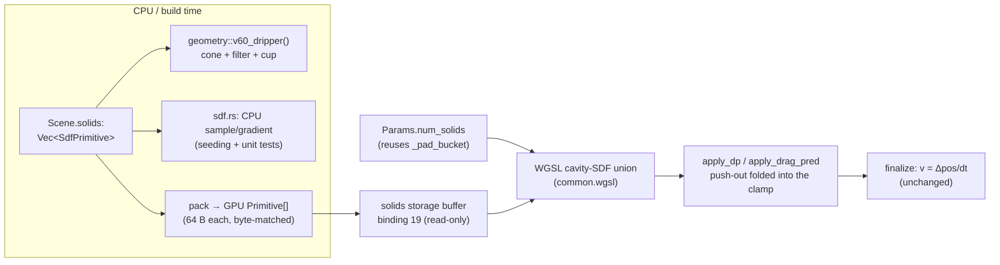

Reading additional input from stdin...
OpenAI Codex v0.137.0
--------
workdir: /Users/cxc/Github/coffee-sim
model: gpt-5.5
provider: openai
approval: never
sandbox: read-only
reasoning effort: high
reasoning summaries: none
session id: 019e93c4-9967-7963-b7b5-7288f0832360
--------
user
ROUND 4 review of an SDF-boundary plan for a Rust + wgpu + WGSL two-species XPBD coffee simulator (V60 cone + grains-only filter + cup). Rounds 1–3 folded in.

Round 3 left 1 blocker + 2 cleanups; all addressed here:
1. **Closed-tip Euclidean distance (blocker)** — the KTD-2 pseudo-code no longer early-returns the tip for `y < apex_y`. It now uses an **endpoint-clamped point-to-segment** distance for all `y ≤ top_y` (clamps to the tip endpoint on-axis, to the slanted surface off-axis → true Euclidean everywhere), with the sign forced negative below the apex via an explicit `inside = (y ≥ apex_y) && (r ≤ inner)` test, and the gradient flipped to always point into the cavity. KTD-5 + U1 updated; U1 now tests both the exact on-axis tip case AND an off-axis below-apex point whose closest point is on the slant.
2. **U5 scope wording** — changed from "non-intersecting solids" to "nested / non-crossing cavity solids fully inside the domain box" (aligns with KTD-3; the V60's filter-inside-support pair is allowed).
3. **U2 wording** — "a grain just inside the filter surface is forbidden" → "just outside / through the filter wall (outside the filter cavity but inside the support cone)", consistent with the positive-inside convention.

Verify resolution and surface any remaining correctness issue. First line: **APPROVE**, **REVISE**, or **REJECT**, then explain citing section/unit IDs. Do not re-litigate the already-resolved round-1/2 blockers unless this revision broke one.

Hard constraints (verified): ≤8 storage buffers/stage; no float atomics; Params exactly 256 B byte-matched w/ compile assert; boundary folds into apply_dp/apply_drag_pred reusing box-clamp normal+friction; preserve `.w` lane; per-pipeline auto-layout bind groups; existing suites/scenes green; perf deferred. The user is a physics reviewer who rejects hand-waving.

## Revised Plan to Review

---
title: "feat: General static solid-object (SDF) boundaries"
type: feat
status: active
date: 2026-06-04
origin: null
deepened: null
---

# feat: General static solid-object (SDF) boundaries

## Summary

Add a **general static solid-object boundary system** to the two-species XPBD GPU solver: composable
analytic SDF primitives (a truncated-cone cavity, a cylinder cavity to start) carried on the `Scene`,
uploaded to the GPU as a small read-only primitive array, and resolved as a **selective position-level
push-out** that generalizes the existing axis-aligned box clamp. The first instances are the **V60
dripper**: a rigid support cone, a grains-only filter cone (water passes, grounds are trapped), and a
catch cup that water drains into. The system is built so that adding a flat-bottom dripper, a Kalita,
or a second cup later is just new primitive data — not new solver code.

This is the deferred `geometry/` phase (`docs/plans/engine.md:14-30`, `docs/plans/utils.md:20-32`). It
deliberately uses **analytic primitives**, not the baked SDF textures the current stubs/docs still
describe (the baked path is stale and carries an aliasing risk; see KTD-1). Perf is **out of scope** —
correctness and structure first, per the standing project decision.

---

## Problem Frame

Boundary handling today is a single axis-aligned box clamp to `params.box_min/box_max`, living in
`apply_dp` (`src/solvers/xpbd/common.wgsl:300-336`) and re-applied in the drag subcycle's
`apply_drag_pred` (`src/solvers/xpbd/coupling.wgsl:372-379`). The box clamp *is* the boundary normal
response: `clamped = clamp(proposed, box)`, the clamp delta gives the normal, and grains get Coulomb
floor friction (`params.floor_mu`) along the tangent. Velocity is never explicitly reflected — `finalize`
(`common.wgsl:338-368`) derives `v = (clamped_pos − prev_pos)/dt`, so the into-wall component zeroes
itself.

`Scene` (`src/engine/scene.rs:25-39`) describes only an AABB box plus AABB seed regions. There is no way
to express a cone, a cup, or a filter, so the simulator cannot model a real dripper. `src/utils/sdf.rs`
and `src/utils/geometry/mod.rs` are inert `todo!()` stubs reserved for exactly this work. The salvaged
v1 geometry values live in `KEEP.md §3-4`; the physics regression band in `KEEP.md §5`.

The job: let a `Scene` carry analytic solid geometry, evaluate it on the GPU, and resolve collisions as a
selective (per-species) push-out — without breaking the 8-storage-buffer ceiling, the no-float-atomics
rule, the 256-byte `Params` byte-match, or any existing scene/suite.

---

## Requirements

- **R1** — Define composable analytic SDF primitives with `sample(p)→signed distance` and
  `gradient(p)→normal`, signed so the **allowed cavity interior is positive**. Truncated cone and
  cylinder are required for V60; the primitive enum + dispatch must make adding plane/box/sphere a
  pure-data extension. (`src/utils/sdf.rs`)
- **R2** — Use **true Euclidean** distance to the cone surface (point-to-segment in the `(r,y)`
  half-plane), not v1's radial `inner_r − r` approximation, so penetration depth and gradient are
  consistent. The open **top** is always non-colliding (free entry). The **apex** is per-solid:
  an **open-outlet** cone (support cone, `apex_open` flag set) frees particles below the apex hole
  (water falls through); a **closed-tip** cone (filter, `apex_open` clear, `bot_radius → 0`)
  constrains to the converging tip so nothing leaks past it. The gradient must be **sign-aware**
  (always points toward increasing signed distance, i.e. into the cavity, on both sides of the wall)
  and **axis-guarded** (the radial direction is undefined at `r = 0` and must be zeroed *before* the
  3D gradient is formed, not only via the final safe-normalize).
- **R3** — `Scene` carries a list of solids; each solid has a **species mask** (all / grains-only),
  a friction coefficient, and its primitive params. A V60 preset builds support cone + grains-only
  filter cone + cup. (`src/engine/scene.rs`, `src/utils/geometry/mod.rs`)
- **R4** — The geometry reaches WGSL as a **dedicated read-only storage buffer** of fixed-size
  primitives (analytic eval per particle), with a `num_solids` scalar in `Params`. `Params` stays
  exactly 256 bytes (reuse the dead `_pad_bucket` slot).
- **R5** — Particle-vs-SDF collision is a **selective position-level push-out folded into the existing
  clamp sites** (`apply_dp`, `apply_drag_pred`): push a penetrating particle out along the SDF gradient
  by the penetration depth, apply grain Coulomb friction along the boundary tangent using the **active
  solid's** friction coefficient, and preserve the moisture lane `.w`. The push-out is a **unilateral
  boundary constraint** — like the existing box clamp, it imparts an external boundary impulse, so it
  conserves **particle count and volume** but is *not* closed-system momentum conservation (see KTD-6).
  Selective by `phase[i]` (filter blocks grains, passes water).
- **R6** — **No regression.** A scene with no solids makes the SDF path a strict no-op; the
  water / bed / coupling / wetting suites and the dam / pour / bed / water scenes stay green and
  behaviorally unchanged.
- **R7** — A V60 scene drains end-to-end: water passes the filter and reaches the cup; grains are
  trapped above the apex; no particle penetrates a wall beyond tolerance. **Volume is conserved** over
  the drain — with absorption **disabled** for the isolating drain test (so free water `Σ f_w·V_w` is
  the whole budget), and a separate wetting-on check conserves the **full** `Σ f_w·V_w + Σ V_abs` total
  (absorbed water lives in grain moisture lanes).
- **R8** — Update the stale "baked SDF texture" language (`src/utils/sdf.rs`, `src/utils/geometry/mod.rs`,
  `docs/plans/utils.md`, `KEEP.md §3`, `docs/ARCHITECTURE.md:42`) to reflect the analytic decision.

**Success gate:** A V60 scene builds and its dripper SDF loads; a dropped particle rests on the cone
within `KEEP.md §5`'s penetration band (<4 mm equiv.); water reaches the cup while grains stay trapped;
existing scenes and all four GPU suites remain green; `cargo fmt --check`, `clippy -D warnings`, and
`size_of::<Params>() == 256` all hold.

---

## Key Technical Decisions

### KTD-1 — Analytic primitives, not a baked SDF texture
v1 baked a 128³ SDF texture and trilinearly sampled it (`KEEP.md §3`: "trilinear 3D-texture sampling
for gradients"); a circular cone on a Cartesian grid picked up a fourfold aliasing artifact that trapped
water on the wall, and v1's late history moved to analytic evaluation. We evaluate a small array of
analytic primitives per particle. This is exact (no grid alias), cheap for a handful of solids, needs no
asset pipeline, and matches `utils/sdf.rs`'s stated purpose. **The current stubs and docs still say
"baked"** — that language is stale and is corrected in U6/R8. *Rationale also from `docs/solutions`-style
learnings: the learnings pass found no recorded decision for this, only the contradictory "baked" docs —
so the divergence must be written down here.*

### KTD-2 — Cavity-SDF sign convention (interior positive), with a sign-aware, axis-guarded gradient
Every solid is a **cavity**: the allowed free-space region is the interior, the boundary is the cavity
surface, and `sample(p) > 0` inside (allowed), `< 0` outside/through the wall (forbidden). This unifies
the cone, the cup, and conceptually the domain box (a box cavity), and makes "push out" always "push
toward `+gradient`" by `(contact_offset − d)` when `d < contact_offset`.

The gradient **must always point toward increasing signed distance** (into the cavity) — on *both*
sides of the wall, not just inside — so the sign of the 2D segment-normal is tied to the cavity-interior
test, not assumed. Two guards are mandatory (Codex R1): (a) the radial unit direction `r̂ = (x,z)/r` is
undefined at `r = 0`; **zero it explicitly when `r < EPSILON` before forming the 3D gradient** (dividing
by `r` first NaNs before any final normalize can help); (b) the final `safe_normalize` returns ZERO when
`len ≤ EPSILON` (`KEEP.md §3`). On the axis the gradient is purely vertical (or zero), never NaN.

### KTD-3 — Generalize the box clamp; do not add a dispatch
The push-out is **folded into `apply_dp` and `apply_drag_pred`**, the two existing position-clamp sites,
rather than added as a standalone compute pass. Reasons: (a) a separate pass after `apply_dp` would let
the box clamp shove a particle back through a cone wall (ordering hazard); (b) the sim is already ~93
dispatches/frame and dispatch count is the tracked browser-cost lever (`docs/PERF_NOTES.md`) — fold, don't
add; (c) it reuses the clamp's normal-from-delta + `floor_mu` friction + `.w` preservation verbatim.
`apply_dp` is 5/8 storage buffers and `apply_drag_pred` is 3/8, so each can take the +1 geometry binding.
Running it every constraint iteration also lets the boundary **co-converge** with the density/bed solve,
matching how exclusion already co-converges. (Alternative — a dedicated pass — is in Alternatives.)

**Ordering + the re-penetration hazard (Codex R5).** Per step: resolve SDF push-out → domain box clamp →
grain tangential friction → **re-evaluate the SDF and re-project** if the friction move pushed the
particle back through a wall. Without that post-friction recheck, the tangential slide can reintroduce
penetration (the existing code only re-clamps to the *box* after friction). This sequence is correct for
the V60 (solids sit well inside the domain; the grain solids are **nested, non-crossing** — filter inside
support); the **general guarantee is explicitly scoped to nested / non-crossing cavity solids fully inside
the domain box** — crossing (concave-intersecting) solids or solids touching the box are out of scope (a
single relaxation step does not guarantee escaping a concave intersection).

### KTD-4 — Geometry is its own read-only storage buffer; count rides in Params
`Params` is full at 256 B (only `_pad_bucket` is reclaimable) and a variable-length primitive list cannot
live in a fixed uniform anyway. Solids go in a new `var<storage, read> solids: array<Primitive>` at the
next free binding (**19**), uploaded once at build via `create_buffer_init` (geometry is static; re-upload
in `reset`). `num_solids` reuses the `_pad_bucket` slot in `Params` so the byte-match stays 256. Each
`Primitive` is a fixed 64-byte, vec4-aligned record (kind tag + species mask + friction + three `vec4`
param slots) — byte-identical Rust `#[repr(C)]` ↔ WGSL.

### KTD-5 — Selectivity is a phase gate; open-outlet vs closed-tip apex; the drain is deferred
The filter "passes water" by **excluding water from its species mask** (`mask & (1<<phase[i])`), the same
phase-tag mechanism the coupling/wetting layers use. The apex behaviour is a **per-solid flag**
(`apex_open`), which is the fix for Codex R2:
- **Support cone** = `apex_open` set, `hole_radius = 0.42`: below the hole there is no wall, so water
  funnels through the apex outlet geometrically (replacing v1's MPM-specific "rim band" vertical-clamp
  hack). It constrains both species on the wall, but grains never reach the hole because the filter
  catches them first.
- **Filter cone** = `apex_open` clear, `bot_radius → 0` (closed tip), grains-only: the converging cavity
  surface plus the closed tip constrain grains all the way down, so **nothing leaks past the tip**. A
  closed-tip cone does **not** free particles below its apex; below the apex is **signed negative**
  (outside the cavity). The distance is the **endpoint-clamped** point-to-segment distance, which is the
  true Euclidean distance everywhere — it clamps to the tip endpoint on-axis (handling the exact
  `(0, apex_y−ε, 0)` case, gradient up) and to the slanted surface off-axis (Codex rounds 2–3). No
  special tip branch is needed beyond forcing the below-apex sign negative.

A real drain (removing / recycling water) is a separate future particle-lifecycle concern keyed on an
outlet AABB in `Scene`; it is orthogonal to the SDF system and out of scope — but the cup-as-solid +
apex-hole geometry leaves a clean seam for it.

### KTD-6 — Boundary impulses, not closed-system momentum conservation (Codex R6)
The SDF push-out is a **unilateral constraint against a static solid**: it imparts an external boundary
impulse exactly as the existing box clamp does. The invariant it preserves is **particle count + volume**
(no particle is created, destroyed, or duplicated) and **finiteness** — *not* total-momentum
conservation, which only holds for the internal (pairwise) coupling/wetting passes and the no-solid case.
Tests therefore assert volume conservation + bounded/finite momentum (drift accounted by gravity + the
boundary impulse), and reserve closed-system Σmv conservation for the no-solid / internal-coupling cases
that already test it. Overstating this as "momentum-clean" (the prior R5 wording) was wrong.

---

## High-Level Technical Design

### Data flow



### Where it sits in the substep loop (mixed scene)

```
predict (gravity; mirror pos.w → pred.w)
compute_coupling_scale
for iters: { water density ; grain_exclude ; apply_dp* ; residual }   # *SDF push-out folded in
for subiters: { copy vel→vel_frozen ; drag_water ; drag_grain }
buoyancy
apply_drag_pred*                                                       # *SDF push-out folded in
bed contact subcycle
finalize ; xsph
```
No new dispatch. The two starred sites gain the SDF resolve; everything else is untouched. When
`num_solids == 0` the SDF loop runs zero iterations → byte-unchanged (R6).

### Cone cavity-SDF (directional pseudo-code, not implementation spec)

```
# Truncated-cone cavity, axis +Y. Open top always; apex is open-outlet OR closed-tip per `apex_open`.
# Allowed interior is positive. Returns (signed_distance, gradient).
fn cone_cavity(p, prim):
    rel = p.xz - center.xz
    r   = length(rel)
    y   = p.y
    rhat = (r < EPS) ? vec2(0,0) : rel / r           # axis guard (Codex R1): zero BEFORE building grad
    if y > top_y: return BIG                          # open top → free entry (both cone kinds)
    if apex_open:                                     # support-cone water outlet:
        if y < apex_y: return BIG                     #   below the apex → water falls through
        if (y - apex_y) < hole_band and r < hole_radius: return BIG   #   apex hole
    # Endpoint-CLAMPED point-to-segment handles ALL y ≤ top_y: the closest point lands on the slanted
    # surface, OR clamps to the tip / top endpoint. Do NOT early-return the tip for y < apex_y — that
    # gives the wrong Euclidean distance off-axis (Codex round 3); the clamp does it correctly.
    seg = segment((apex_inner_r, apex_y), (top_inner_r, top_y))  # apex_inner_r → 0 for a closed tip
    cp  = closest_point_on_segment((r, y), seg)        # clamps to endpoints (tip on-axis, slant off-axis)
    d2d = distance((r, y), cp)
    inner  = max(lerp(apex_r, top_r, (y-apex_y)/height) - thickness, hole_radius)
    inside = (y >= apex_y) and (r <= inner)            # in the cavity region; below the apex ⇒ outside
    signed = inside ? +d2d : -d2d                      # cavity-interior test drives the sign...
    dir    = (r, y) - cp
    n2d    = inside ? normalize(dir) : -normalize(dir) # ...and the gradient → always points into the cavity
    grad   = safe_normalize(vec3(n2d.x * rhat.x, n2d.y, n2d.x * rhat.y))
    return signed, grad
```
Cylinder cup is the analogous capped cylinder (side wall + floor; rim open). Union over
species-applicable solids = take the most-penetrated (**min** signed distance, an intersection-of-cavities
composition: a particle must be inside *all* applicable cavities) **and return that solid's friction**. The
V60's grain solids are **nested, non-crossing** (the filter sits inside the support cone), so the min-signed
operator is the binding constraint each iteration and converges correctly — they are not "disjoint."

### Storage-buffer budget (binding 0 = uniform, excluded from the 8 cap)

| Kernel | Before | After | Within 8? |
|---|---|---|---|
| `apply_dp` (gains `solids`) | 5/8 | **6/8** | ✓ |
| `apply_drag_pred` (gains `solids`) | 3/8 | **4/8** | ✓ |
| `finalize`, `predict` | 6/8 | unchanged | ✓ |
| `bed_project`, `compute_lambda`, `compute_dp`, `drag_*`, `buoyancy_grain` | 8/8 | **untouched** | ✓ |

Only the two clamp sites gain the geometry binding; the six kernels already at 8/8 are not touched.

### Params growth

`_pad_bucket: u32` (dead since the counting-sort change) → `num_solids: u32`. No size change;
`const _: () = assert!(size_of::<Params>() == 256)` (`mod.rs:90-91`) still holds. WGSL `Params`
(`common.wgsl:15-68`) mirror updated in lockstep.

### GPU `Primitive` record (64 B, vec4-aligned; byte-matched Rust ↔ WGSL)

```
kind: u32          species_mask: u32   friction: f32   flags: u32    # 16 B header
                                                       # flags bit0 = apex_open (outlet vs closed tip)
a: vec4   # cone:(apex_y, apex_r, top_y, top_r)  cyl:(floor_y, rim_y, radius, _)
b: vec4   # cone:(thickness, hole_radius, center_x, center_z)  cyl:(center_x, center_z, _, _)
c: vec4   # reserved (restitution / future params)
```
Asserted `size_of::<Primitive>() == 64`, byte-identical Rust ↔ WGSL (Codex acceptable-parts note).

---

## Output Structure

```
src/utils/sdf.rs              # MODIFY: SdfPrimitive, SolidKind, cavity sample/gradient, union, safe-normalize, CPU tests
src/utils/geometry/mod.rs     # MODIFY: v60_dripper() preset (cone+filter+cup); de-stub; analytic docstrings
src/engine/scene.rs           # MODIFY: Scene.solids field; re-export types; v60() builds geometry + seeds bed-in-cone
src/solvers/xpbd/mod.rs       # MODIFY: GPU Primitive struct, solids buffer (binding 19), num_solids in Params, bind groups
src/solvers/xpbd/common.wgsl  # MODIFY: Params field + binding 19; WGSL cavity-SDF fns + union; push-out in apply_dp
src/solvers/xpbd/coupling.wgsl# MODIFY: push-out in apply_drag_pred
tests/xpbd_geometry.rs        # CREATE: GPU collision/selectivity/drain/no-regression suite
examples/v60_render.rs        # CREATE (or extend coupling_render): eyeball the V60 drain
```

---

## Implementation Units

### U1. SDF primitive set + cavity sample/gradient + union (CPU)

**Goal:** The analytic math core: `SdfPrimitive` / `SolidKind`, true-Euclidean cavity distance + gradient
for a truncated cone and a cylinder cup, a species-filtered union helper, safe-normalize. Pure CPU,
testable without a GPU.

**Requirements:** R1, R2.
**Dependencies:** none.
**Files:** `src/utils/sdf.rs`.

**Approach:** Define `SolidKind { Cone, Cylinder }`, `SdfPrimitive { kind, species_mask: u32, friction: f32,
apex_open: bool, params }`. Implement `sample(prim, p) -> f32` and `gradient(prim, p) -> [f32;3]` with the
cavity sign convention (KTD-2): interior positive, gradient always toward the interior (flip the segment
normal by the inside test), and the **axis guard** (zero `r̂` when `r < EPS` *before* building the 3D
gradient — Codex R1). Cone uses revolved point-to-segment distance in the `(r,y)` half-plane (R2). The
open top (`y > top_y`) is always free; the apex is per `apex_open` (KTD-5): an **open-outlet** cone frees
particles below the apex hole, a **closed-tip** cone does not (the converging surface constrains grains to
the tip). Cylinder cup = capped cylinder (side + floor). `nearest(solids, p, phase) -> (signed, grad,
friction)` reduces over solids whose `species_mask & (1<<phase)` is set, taking the most-penetrated and
returning **that solid's friction** (Codex R4). Safe-normalize returns `[0,0,0]` when `len ≤ EPSILON`.

**Patterns to follow:** `KEEP.md §3` safe-normalize; the cone math forms in `KEEP.md §4`
(`radius_at_y`, `inner_radius_at_y`). Keep it dependency-free (uses `glam` like the rest of `utils`).

**Test scenarios:**
- Cone: a point on the centerline well inside → `sample > 0`; a point pushed radially past the inner wall →
  `sample < 0`; a point exactly on the inner surface → `|sample| < 1e-4`.
- **Gradient sign-awareness (Codex R1):** assert `sample(p + ε·grad) > sample(p)` at a point **inside** the
  cavity *and* at a point just **outside** (through the wall) — the gradient climbs the signed distance on
  both sides.
- **Axis guard (Codex R1):** `gradient` exactly on the axis (`r = 0`) and at the apex is finite and unit
  (or zero) — explicitly assert no NaN/Inf, since this is the documented failure mode.
- **Open-outlet vs closed-tip (Codex R2, rounds 2–3):** an `apex_open` cone returns the free sentinel below
  the apex hole. A closed-tip (filter) cone returns **negative** (forbidden) for below-apex points, with two
  cases proving the clamp gives true Euclidean distance: (a) the **exact on-axis** point `(0, apex_y−ε, 0)`
  → distance clamps to the tip, gradient points **up**; (b) an **off-axis below-apex** point whose closest
  point is on the **slanted segment** (not the tip) → `sample` equals the true perpendicular distance to the
  segment and the gradient is the inward surface normal, not radial-toward-the-tip.
- Cone: a point above `top_y` returns the free sentinel (open top, both cone kinds).
- Cone Euclidean check: for a point near the slanted wall, `sample` ≈ true perpendicular distance to the
  segment, strictly less than the radial `inner_r − r` (proves R2, not the radial approx).
- Cylinder cup: inside → positive; outside the radius or below the floor → negative; on the wall/floor →
  ~0; gradient points inward / upward respectively.
- Union: a grains-only solid is skipped for `phase == water` and active for `phase == grain`; `nearest`
  returns the most-penetrated (min signed) solid **and its friction coefficient**.
- **Nested-pair (Codex round 2 cleanup):** a grain in the overlap region where both the filter and the
  support cone bind it gets the **min** signed distance (the tighter filter), and the union converges to
  satisfying both nested cavities.

**Verification:** `cargo test` for the `sdf` unit tests passes; signed distance, sign, and gradient match
hand-computed values at the listed points; no NaN at the axis/apex; a closed-tip cone never frees a point
below its tip.

---

### U2. V60 geometry preset + de-stub builders

**Goal:** `geometry::v60_dripper()` returns the three solids (support cone all-species, filter cone
grains-only, cup cylinder) from the salvaged dims; replace the `todo!()` stub; correct the "baked"
docstrings to "analytic".

**Requirements:** R3, R8.
**Dependencies:** U1.
**Files:** `src/utils/geometry/mod.rs`.

**Approach:** Build `Vec<SdfPrimitive>`:
- **Support cone** — `species_mask = water|grain`, **`apex_open = true`**: apex `y = −3.0`, apex inner
  radius `0.42` (= outlet `hole_radius`), top `y = +3.0`, top inner radius `4.6834`, `thickness` small.
  Water funnels through the `0.42` outlet; grains never reach it (the filter catches them). Wall friction
  a `floor_mu`-class value.
- **Filter cone** — `species_mask = grain` only, **`apex_open = false` (closed tip)**: `KEEP.md §4` —
  center `(0,−0.35,0)`, `top_y 2.75`, `bot_y −3.02`, `top_radius 4.10`, `bot_radius 0.0` (tip),
  `thickness 0.08`, `hole_radius = 0`. The closed tip is what traps grounds (Codex R2). Higher grain
  friction (paper grips grounds).
- **Cup** — `species_mask = water|grain`: cylinder, axis at origin, radius `3.0`, floor `y = −8.0`, rim
  `y = −3.5`.
All values tagged **reference (re-validate)** per `KEEP.md`'s caveat. Update the docstrings in this file
and `src/utils/sdf.rs` from "baked dripper SDFs / baked SDF" to the analytic description.

**Patterns to follow:** `KEEP.md §4` dims verbatim; the v1-mined support-cone + cup dims.

**Test scenarios:**
- `v60_dripper()` returns 3 solids with the expected kinds, species masks (filter is grains-only), and
  `apex_open` flags (support `true`, filter `false`).
- A point on the cone centerline inside the cavity is allowed for both species; a grain **just outside /
  through the filter wall** (outside the filter cavity but inside the support cone) is forbidden (filter
  active for grains) while the same point is allowed for water (filter not in water's mask).
- A point below the support-cone apex hole (in the outlet) is free for **water** (drains); a point below
  the **filter** tip is *forbidden* for grains (closed tip — Codex R2).

**Verification:** unit tests pass; the preset's solids reproduce the `KEEP.md §4` dimensions and the
open-outlet/closed-tip distinction.

---

### U3. Scene geometry field + V60 scene

**Goal:** `Scene` carries solids; existing scenes set none; `v60()` builds the dripper geometry,
origin-centered domain, bed seeded inside the cone, and a water column above it.

**Requirements:** R3, R6.
**Dependencies:** U2.
**Files:** `src/engine/scene.rs`.

**Approach:** Add `solids: Vec<SdfPrimitive>` to `Scene` (re-export `SdfPrimitive`/`SolidKind`); every
existing constructor (`dam_break`, `bed_drop`, `dam_through_sand`, `pour_over`, `Default`) sets
`solids: vec![]`. Extend `v60()`: set `box_min/box_max` to the origin-centered domain `[−7,−10,−7]..[7,10,7]`,
`solids = geometry::v60_dripper()`, and seed a **grain bed** + a **water column above it**, both *inside the
cone cavity*. Because a `bot_radius → 0` filter cone admits **no** finite-width AABB reaching the apex
(Codex R3), seed via **cone-aware rejection**: lay the AABB lattice as today but **drop lattice points whose
`cone.sample(p, species) < margin`** for their species (margin from `KEEP.md §4`'s 0.4–0.6 units). This
needs a small `seed_block` change to accept an optional per-region solid clip. The bed lands in the wide
mid-section and settles down onto the filter; the water column sits above it within the cavity. Keep
gravity consistent with the existing scenes (SI calibration deferred).

**Patterns to follow:** `pour_over()` (`scene.rs:122-141`) for the bed + water-column shape; `bed_drop()`
for grain seeding; `seed_block()` (`mod.rs:231-268`) — extend it with the optional rejection clip.

**Test scenarios:**
- `Scene::v60()` has exactly 3 solids with the expected masks/`apex_open`; `box_min/box_max` enclose all
  solid bounds (cup floor `−8` ≥ `box_min.y`).
- **Cone-aware seeding (Codex R3):** after seeding, **every** seeded particle is inside the cavity for its
  species (`cone.sample(p, species) ≥ margin`) — not merely the AABB corners; the rejection clip drops the
  out-of-cavity lattice points. Seed counts are non-empty for both species.
- Every other constructor has `solids.is_empty()` (R6 guard at the scene layer).

**Verification:** unit tests pass; `v60()` builds without panic; existing constructors unchanged except the
empty `solids` field.

---

### U4. GPU geometry buffer + Params plumbing + WGSL SDF functions

**Goal:** Upload solids to a read-only storage buffer (binding 19), add `num_solids` to `Params` (reusing
`_pad_bucket`), and add the WGSL cavity-SDF functions + union — **plumbing only**, no collision yet.

**Requirements:** R4.
**Dependencies:** U1, U3.
**Files:** `src/solvers/xpbd/mod.rs`, `src/solvers/xpbd/common.wgsl`.

**Approach:** Define the 64-byte `Primitive` Rust `#[repr(C)]` `Pod`/`Zeroable` struct (KTD-4) and its WGSL
mirror; pack `Scene.solids` into `Vec<Primitive>` and upload via `create_buffer_init` (`STORAGE` read-only)
in `build`, and re-upload in `reset` (static geometry). Empty solids → a 1-element dummy buffer (min size)
with `num_solids = 0`. Rename `_pad_bucket → num_solids` in both Rust `Params` and WGSL `Params`; keep the
`size_of::<Params>() == 256` assert and add a `size_of::<Primitive>() == 64` assert (Codex acceptable-parts
note). Add `@group(0) @binding(19) var<storage, read> solids: array<Primitive>;` and the
`cone_cavity` / `cyl_cavity` / `solid_union` WGSL functions (mirrors of U1; cavity-positive sign, the
axis-guarded sign-aware gradient, safe-normalize). Do **not** call them from any pass yet — so the six
kernels already at 8/8 (`bed_project`, `compute_lambda`, `compute_dp`, `drag_water`, `drag_grain`,
`buoyancy_grain`) never reference `solids` and their auto-derived layouts stay at 8 (Codex acceptable-parts).

**Patterns to follow:** buffer creation `mod.rs:271-283`, `create_buffer_init` usage at `mod.rs:580-623`;
`Params` byte-match `mod.rs:33-91` + `common.wgsl:15-68`; binding declarations in `common.wgsl`.

**Test scenarios:** `Test expectation: none — plumbing.` Covered by build success + the byte-match assert +
existing suites staying green (the buffer is bound nowhere yet, so behavior is byte-unchanged).

**Verification:** `cargo build` + `clippy -D warnings` clean; `size_of::<Params>() == 256` and
`size_of::<Primitive>() == 64` hold; the WGSL module compiles with the new functions + binding; all
existing suites still pass; the six 8/8 kernels do not reference `solids` (their bind groups are
unchanged), confirming binding 19 is scoped to nowhere yet (and, in U5, only to the two clamp sites).

---

### U5. SDF collision folded into the clamp sites

**Goal:** Generalize the box clamp into a selective SDF push-out in `apply_dp` and `apply_drag_pred`:
push penetrating particles out along the gradient, reuse grain Coulomb friction, preserve `.w`, gated to
a no-op when `num_solids == 0`.

**Requirements:** R5, R6.
**Dependencies:** U4.
**Files:** `src/solvers/xpbd/common.wgsl`, `src/solvers/xpbd/coupling.wgsl`, `src/solvers/xpbd/mod.rs`
(add binding 19 to the `apply_dp` and `apply_drag_pred` bind groups), `tests/xpbd_geometry.rs`.

**Approach:** In `apply_dp`, after forming `proposed = pred + relaxed dp`: if `num_solids > 0`, evaluate
`(signed, grad, mu_solid) = solid_union(proposed, phase[i])`; if `signed < contact_offset`, set
`proposed += (contact_offset − signed) · grad`. Then the existing box clamp runs (domain box is the
always-valid outer bound). For grains, derive the boundary normal from the **net** push (SDF + box delta)
and apply Coulomb tangential removal using **the active boundary's friction**: `mu_solid` when the SDF push
dominated, `floor_mu` when the box clamp did (Codex R4 — the per-solid `friction` field is actually used,
not silently dropped). **After** the friction tangential move, **re-evaluate `solid_union` and re-project**
if it re-penetrated (`signed < contact_offset`), then re-clamp to the box — without this the tangential
slide can reintroduce SDF penetration (Codex R5). Write `pred[i] = vec4(newp, pred[i].w)` (preserve
moisture). Apply the identical resolve in `apply_drag_pred` after its advance (`coupling.wgsl:378`) so
drag/buoyancy can't shove grains through a wall. Add binding 19 to both passes' bind-group entry lists
(`apply_dp` → 6/8, `apply_drag_pred` → 4/8). The correctness guarantee is **scoped to nested / non-crossing
cavity solids fully inside the domain box** (KTD-3); the V60's nested filter-inside-support pair satisfies it.

**Execution note:** Add the failing GPU collision test (particle rests on the cone) before wiring the
push-out.

**Patterns to follow:** the box-clamp + grain-friction block `common.wgsl:300-336` (mirror its
normal-from-delta + `floor_mu` logic); `apply_drag_pred` clamp `coupling.wgsl:378`; bind-group construction
`mod.rs:740-1018`.

**Test scenarios:** (`tests/xpbd_geometry.rs`, GPU-gated via `GpuContext::new_headless()`)
- **Rests on the cone:** a single water particle dropped above the cone wall settles with `sample(p) ≥
  −tol` (penetration within `KEEP.md §5`'s <4 mm band) and near-zero velocity. Covers R5.
- **Push-out direction:** a particle initialized just through the wall is pushed toward the cavity interior
  (`r` decreases / climbs the slope normal), not launched tangentially; positions/velocities finite.
- **Grain repose + per-solid friction:** a grain on the slanted cone wall does not slide indefinitely
  (friction holds it within a tolerance), exercising the **per-solid** `mu_solid` (Codex R4); a high-friction
  filter holds grains more than a low-friction wall.
- **No re-penetration after friction (Codex R5):** after the friction tangential move, the grain's final
  position satisfies `cone.sample ≥ −tol` — the post-friction SDF recheck prevents the slide from
  reintroducing penetration.
- **No-op without solids:** an existing scene (e.g. `pour_over`) with `solids` empty produces the same
  in-box / finiteness / no-overflow invariants as before (R6); a representative coupling invariant still
  holds.
- **CPU/WGSL parity (optional):** sample a few points on CPU (`sdf.rs`) and compare against a GPU readback
  of the WGSL SDF within tolerance.

**Verification:** the new GPU tests pass (skip cleanly with no adapter); existing four suites + scenes
unchanged; `clippy`/`fmt` clean.

---

### U6. V60 selectivity + cup drain (integration) + example + doc fixes

**Goal:** End-to-end V60 behavior — water passes the filter and reaches the cup, grains trapped above the
apex, volume conserved — plus an eyeball example and the stale-doc cleanup.

**Requirements:** R7, R8.
**Dependencies:** U5, U3.
**Files:** `tests/xpbd_geometry.rs`, `examples/v60_render.rs` (or extend `examples/coupling_render.rs`),
`docs/plans/utils.md`, `KEEP.md`, `docs/ARCHITECTURE.md`.

**Approach:** Drive `Scene::v60()` for N frames. Assert the selective-filter + drain behavior. Add a render
example (mirror `coupling_render.rs`'s offscreen-PPM or windowed path) with a `SCENE=v60` knob to visually
confirm. Finish R8: change "baked SDF texture" language in `docs/plans/utils.md`, `KEEP.md §3`, and
`docs/ARCHITECTURE.md:42` to the analytic approach, cross-referencing this plan + KTD-1.

**Test scenarios:**
- **Filter selectivity:** after N frames, water particles appear below the filter surface / in the outlet
  while grains' minimum `y` stays above the filter floor within tol (grounds trapped, water passes).
  Covers R7.
- **Water reaches the cup:** ≥1 water particle ends inside the cup volume (`r < 3`, `y ∈ [−8,−3.5]`);
  finiteness; no grid overflow.
- **Grains don't leak the apex (Codex R2):** the count of grains below the filter tip / support apex
  `y = −3` is ≈ 0 — the closed filter tip traps them.
- **Volume conservation (Codex R7):** run the drain with **absorption disabled** (`absorb_rate = 0`) and
  assert free water `Σ f_w·V_w` is conserved to tolerance across the drain (particle count unchanged; none
  lost/duplicated). A **separate wetting-on** check asserts the **full** `Σ f_w·V_w + Σ V_abs` total is
  conserved (free water moves into grain moisture lanes). Mirror the coupling/wetting conservation
  reductions (`examples/coupling_render.rs` already computes the full total).
- **Boundary-impulse, not closed-system momentum (Codex R6):** assert total momentum stays **finite and
  bounded** (the wall is an external impulse — KTD-6); do **not** assert Σmv is conserved with solids
  present.
- **Repose on the cone (no solids escape):** outside-fraction < 1% of grains (per `KEEP.md §5`).

**Verification:** the V60 integration tests pass; the example renders a recognizable drain; the "baked"
language is gone from the listed docs; full suite green.

---

## Implementation Order

1. **U1** — CPU SDF math (cone + cylinder cavity, union). *Gate:* unit tests green; Euclidean (not radial);
   no apex NaN.
2. **U2** — V60 preset + de-stub. *Gate:* 3 solids with correct masks/dims; docstrings analytic.
3. **U3** — Scene field + `v60()` scene. *Gate:* `v60()` builds; seeds inside the cone; existing scenes have
   empty solids.
4. **U4** — GPU buffer + Params + WGSL functions (plumbing). *Gate:* builds; `Params == 256`; suites green
   (buffer unused).
5. **U5** — Push-out folded into `apply_dp`/`apply_drag_pred`. *Gate:* particle rests on the cone; correct
   push direction; no penetration; no-op without solids; existing suites green.
6. **U6** — V60 selectivity + cup drain + example + doc fixes. *Gate:* water reaches the cup; grains trapped;
   volume conserved; "baked" docs corrected.

---

## Scope Boundaries

**In scope:** analytic cone + cylinder cavity SDFs; species-filtered union; the V60 preset (support cone +
grains-only filter + cup); `Scene.solids`; the GPU geometry buffer + `num_solids`; the selective push-out
folded into the two clamp sites; a V60 scene + tests + example; the stale-doc fix.

### Deferred to Follow-Up Work
- **Plane / box / sphere primitives** and Kalita / flat-bottom dripper presets (pure-data extensions once
  the cone+cylinder dispatch exists — add a `SolidKind` arm + a builder).
- **A real drain** (removing / recycling water that exits the apex, outlet-AABB-keyed particle lifecycle) —
  orthogonal to the SDF system; the cup-as-solid + apex hole leave the seam.
- **Active pour emission** (a spout firing water at `(0,7.3,0)` over time) — the V60 scene pre-seeds a water
  column for now; emission wiring is its own feature.
- **Per-solid restitution tuning** and SI unit calibration of the V60 dims (`KEEP.md §2`) — values ship as
  re-validate references; bouncing is inelastic (position-derived velocity) by default.
- **Dynamic / moving solids** — geometry is static (build-time upload).

### Out of scope
- **Perf optimization** — deferred until all features are built (standing project decision); do not optimize
  the SDF eval or fuse passes for speed in this plan.
- **Raising the device storage-buffer limit** — disallowed (WASM portability); the design fits within 8.
- **Float atomics** — not used; the push-out is a single-sided per-particle projection needing none.
- **Extraction / TDS chemistry in the cup** — the cup catches water; solute modeling is a later phase.

---

## Risks & Mitigations

- **R-1 — Cone gradient instability at the apex / seams.** The revolved point-to-segment normal can degenerate
  on the axis or at the segment ends. *Mitigation:* safe-normalize → ZERO (`KEEP.md §3`); the apex hole and
  open top return the non-colliding sentinel so the degenerate region is never a collision; CPU unit tests
  assert finiteness there (U1).
- **R-2 — Box clamp / friction vs SDF push-out fighting.** Resolving SDF then box-clamping could oscillate
  near where a solid meets the domain bound, and the friction tangential move can reintroduce SDF
  penetration. *Mitigation:* the guarantee is **scoped to non-intersecting solids fully inside the box**
  (KTD-3, satisfied by the V60); order is SDF → box → friction → **post-friction SDF recheck + re-project**
  (KTD-3/U5); the repose + no-re-penetration tests (U5) catch oscillation.
- **R-3 — Bed seeded outside the cone escapes.** Grains seeded beyond the inner radius (or above the open
  top) would fall out instead of settling. *Mitigation:* **cone-aware rejection seeding is mandatory** (U3)
  — every lattice point with `cone.sample < margin` for its species is dropped (margins from `KEEP.md §4`);
  there is no AABB-only fallback. The "all seeded particles inside the cavity" test (U3) + the
  outside-fraction < 1% test (U6) guard it.
- **R-4 — Origin-centered (negative `box_min`) domain breaks the grid.** Existing scenes use corner-origin
  boxes; the V60 frame is negative-cornered. *Mitigation:* `grid_origin = box_min` already offsets the grid
  (`mod.rs:520-523`); verify no overflow on the V60 scene (U3/U5 `diagnostics().overflow`); flagged as an
  open question.
- **R-5 — `Params` byte-drift.** Renaming `_pad_bucket → num_solids` or the new `Primitive` struct could
  desync Rust/WGSL. *Mitigation:* the `size_of == 256` compile assert + a `Primitive` size assert; field-for-
  field mirror review (U4).
- **R-6 — Filter selectivity wrong (water trapped, or grains leak).** A sign/mask error inverts the gate.
  *Mitigation:* U2 unit test (filter active for grains, inactive for water) + U6 integration (water in cup,
  grains above apex); both directions asserted.

---

## Open Questions

- Does the counting-sort grid handle the origin-centered (negative `box_min`) V60 domain without overflow,
  or does the V60 scene need a shifted frame? (Resolve in U3 — empirical, `diagnostics().overflow`.)
- `contact_offset` for the SDF push-out: reuse the bed's contact offset, or a separate geometry offset? (U5,
  empirical — start with the bed value.)
- Does a rejection-seeded bed settle cleanly onto the filter within a few frames, or does it need a short
  pre-settle before the water column is released? (U3/U6 — empirical; rejection seeding itself is settled,
  not optional.)
- Should the support cone and filter share one cone evaluation (filter = support inset by paper thickness),
  or stay two independent solids? (U2 — two solids is simpler/more general; revisit only if they conflict.)

---

## Sources & Research

- `KEEP.md §3` (validated SDF math: safe-normalize, cone+cylinder interior eval), `§4` (V60 filter dims +
  bed-seating margins), `§5` (regression band: penetration <4 mm, outside-fraction <1%, side-jet <1.5%).
- Existing boundary handler: `src/solvers/xpbd/common.wgsl:300-368` (`apply_dp`, `finalize`),
  `src/solvers/xpbd/coupling.wgsl:372-379` (`apply_drag_pred`).
- GPU wiring patterns: `src/solvers/xpbd/mod.rs:271-283` (buffers), `:33-91` (`Params` + assert),
  `:690-1018` (pipelines/bind groups), `:1095-1428` (dispatch).
- `Scene`: `src/engine/scene.rs:1-142`. Stubs: `src/utils/sdf.rs`, `src/utils/geometry/mod.rs`.
- Test harness exemplars: `tests/xpbd_bed.rs`, `tests/xpbd_coupling.rs` (GPU-gate, readback hooks,
  conservation reductions, the 0.6-margin in-box check).
- Constraints: `AGENTS.md:28-35` (8 buffers, no atomics, no test rot, smallest correct change),
  `src/utils/gpu.rs:68-77` (don't raise the limit), `docs/PERF_NOTES.md` (~93 dispatches/frame).
- Stale-doc divergence (analytic vs baked): `docs/plans/utils.md:20-32`, `docs/ARCHITECTURE.md:42`,
  the `sdf.rs`/`geometry/mod.rs` docstrings — corrected in U6/R8.
- Deferred-phase origin: `docs/plans/2026-06-03-001-feat-wetting-cohesion-plan.md` ("V60 cone geometry —
  separate geometry phase"), `docs/plans/engine.md:14-30`.
codex
I’m going to treat this as a plan-review pass, not an implementation pass. I’ll stay focused on the revised KTD/U sections and only call out issues that still affect correctness.
codex
I’m checking one detail against the existing WGSL shape: whether the second clamp site already has the phase/species context it needs for the proposed selective SDF gate. That affects whether U5 is actually implementable without adding another buffer.
exec
/bin/zsh -lc "sed -n '1,460p' src/solvers/xpbd/coupling.wgsl" in /Users/cxc/Github/coffee-sim
exec
/bin/zsh -lc "sed -n '1,390p' src/solvers/xpbd/common.wgsl" in /Users/cxc/Github/coffee-sim
 succeeded in 0ms:
// Water/bed coupling (XPBD step 3, mechanical subset). Concatenated after common/water/bed.
//
// Two mechanisms, both active only in mixed (water+grain) scenes:
//  1. compute_fractions — per-particle solid fraction α_s = Σ_grain V_g W (clamped to the packing
//     limit). The water density solve (water.wgsl) reads it and targets ρ₀·(1−α_s), so pore water
//     packs to the pore fraction (drainage-ready) instead of full ρ₀ (which would be expelled).
//  2. grain exclusion (A.2) — a two-way geometric non-penetration between water and grain
//     particles: water can't pass through grain bodies, so it rests on / sits in the bed. Run as a
//     symmetric pair of gathers (exclude_water + exclude_grain) reading the same predicted
//     positions, with opposite-mass weights → momentum-conserving without float atomics.
//  3. implicit drag — symmetric frozen-velocity gathers using the Kozeny-Carman-resolved drag
//     rate in params.drag_gamma. The same pair scale is used by both phases, so each pair impulse
//     is equal-and-opposite to float tolerance.
//  4. buoyancy / pressure-gradient lift — symmetric gathers over the converged water λ field.
//     PBF λ is non-positive under compression in this solver, so pressure is −λ. The grain pass
//     applies +J/m_g and the water pass applies −J/m_w for the same pair, avoiding float atomics.

@compute @workgroup_size(256)
fn compute_fractions(@builtin(global_invocation_id) gid: vec3<u32>) {
    let i = gid.x;
    if (i >= params.particle_count) { return; }
    let h = params.h;
    let xi = pred[i].xyz;
    var a_s = 0.0;
    let base = cell_coord(xi);
    for (var dz = -1; dz <= 1; dz = dz + 1) {
        for (var dy = -1; dy <= 1; dy = dy + 1) {
            for (var dx = -1; dx <= 1; dx = dx + 1) {
                let nc = base + vec3<i32>(dx, dy, dz);
                if (nc.x < 0 || nc.y < 0 || nc.z < 0) { continue; }
                let dims = vec3<i32>(params.grid_dims.xyz);
                if (nc.x >= dims.x || nc.y >= dims.y || nc.z >= dims.z) { continue; }
                let cid = cell_id(nc);
                let lo = cell_start[cid];
                let hi = cell_start[cid + 1u];
                for (var s = lo; s < hi; s = s + 1u) {
                    let j = sorted_indices[s];
                    if (j == i) { continue; }
                    if (phase[j] != PHASE_GRAIN) { continue; } // solid fraction from grains only
                    let r = length(xi - pred[j].xyz);
                    if (r >= h) { continue; }
                    // Swollen grains occupy more space: use the effective volume V_eff = V_dry + V_abs
                    // (grain pred.w = V_abs). Dry grains (V_abs=0) ⇒ params.grain_volume, unchanged.
                    a_s = a_s + grain_eff_volume(pred[j].w) * w_poly6(r, h);
                }
            }
        }
    }
    alpha_s[i] = min(a_s, params.packing_limit);
}

// Water↔grain contact separation for one pair, opposite-mass weighted. Both passes call this with
// the same (xi, xj) so the pair impulse is identical and conservation holds (to float tolerance).
fn exclusion_push(xi: vec3<f32>, xj: vec3<f32>, w_self: f32) -> vec3<f32> {
    let d_wg = params.water_grain_distance; // water–grain contact distance (< grain spacing ⇒ pores)
    let dvec = xi - xj;
    var r = length(dvec);
    if (r >= d_wg) { return vec3<f32>(0.0); }
    var n: vec3<f32>;
    if (r < 1e-6) {
        n = vec3<f32>(0.0, 1.0, 0.0); // coincident → push apart vertically (deterministic)
        r = 1e-6;
    } else {
        n = dvec / r;
    }
    return params.exclusion_relax * (d_wg - r) * w_self * n;
}

@compute @workgroup_size(256)
fn exclude_water(@builtin(global_invocation_id) gid: vec3<u32>) {
    let i = gid.x;
    if (i >= params.particle_count) { return; }
    if (status.converged != 0u) { return; }
    if (phase[i] != PHASE_WATER) { return; }
    // Effective masses (swelling): heavier wet grains / lighter shrunk water shift the split. Dry
    // (V_abs=0, f_w=1) ⇒ the original particle_mass/grain_mass split. w_self computed per neighbor.
    let m_w = water_eff_mass(pred[i].w);
    let xi = pred[i].xyz;
    var push = vec3<f32>(0.0);
    let base = cell_coord(xi);
    for (var dz = -1; dz <= 1; dz = dz + 1) {
        for (var dy = -1; dy <= 1; dy = dy + 1) {
            for (var dx = -1; dx <= 1; dx = dx + 1) {
                let nc = base + vec3<i32>(dx, dy, dz);
                if (nc.x < 0 || nc.y < 0 || nc.z < 0) { continue; }
                let dims = vec3<i32>(params.grid_dims.xyz);
                if (nc.x >= dims.x || nc.y >= dims.y || nc.z >= dims.z) { continue; }
                let cid = cell_id(nc);
                let lo = cell_start[cid];
                let hi = cell_start[cid + 1u];
                for (var s = lo; s < hi; s = s + 1u) {
                    let j = sorted_indices[s];
                    if (phase[j] != PHASE_GRAIN) { continue; }
                    let m_g = grain_eff_mass(pred[j].w);
                    push = push + exclusion_push(xi, pred[j].xyz, m_g / (m_w + m_g));
                }
            }
        }
    }
    // Add onto the water density Δp already in dp (compute_dp wrote it this iteration).
    dp[i] = dp[i] + vec4<f32>(push, 0.0);
}

@compute @workgroup_size(256)
fn exclude_grain(@builtin(global_invocation_id) gid: vec3<u32>) {
    let i = gid.x;
    if (i >= params.particle_count) { return; }
    if (status.converged != 0u) { return; }
    if (phase[i] != PHASE_GRAIN) { return; }
    // Effective masses (swelling), mirror of exclude_water. Same per-pair m_w/m_g read from pred.w on
    // both sides ⇒ the antisymmetric correction still conserves momentum exactly.
    let m_g = grain_eff_mass(pred[i].w);
    let xi = pred[i].xyz;
    var push = vec3<f32>(0.0);
    let base = cell_coord(xi);
    for (var dz = -1; dz <= 1; dz = dz + 1) {
        for (var dy = -1; dy <= 1; dy = dy + 1) {
            for (var dx = -1; dx <= 1; dx = dx + 1) {
                let nc = base + vec3<i32>(dx, dy, dz);
                if (nc.x < 0 || nc.y < 0 || nc.z < 0) { continue; }
                let dims = vec3<i32>(params.grid_dims.xyz);
                if (nc.x >= dims.x || nc.y >= dims.y || nc.z >= dims.z) { continue; }
                let cid = cell_id(nc);
                let lo = cell_start[cid];
                let hi = cell_start[cid + 1u];
                for (var s = lo; s < hi; s = s + 1u) {
                    let j = sorted_indices[s];
                    if (phase[j] != PHASE_WATER) { continue; }
                    // Mirror of the water-side push for this pair (swapped args give −n); grain's
                    // opposite-mass weight m_w/(m_w+m_g) → exact pair antisymmetry.
                    let m_w = water_eff_mass(pred[j].w);
                    push = push + exclusion_push(xi, pred[j].xyz, m_w / (m_w + m_g));
                }
            }
        }
    }
    // Grains get no water-density Δp (compute_dp skips them), so SET dp here (the bed contact
    // subcycle that follows will overwrite it again). Always write, so a grain with no water
    // neighbors gets dp=0 rather than a stale value.
    dp[i] = vec4<f32>(push, 0.0);
}

fn beta_from_rate(rate: f32) -> f32 {
    let x = max(rate * params.dt, 0.0);
    return x / (1.0 + x); // implicit: rate→∞ ⇒ β→1 (no overshoot); bounds rate·dt
}

fn drag_pair_beta() -> f32 {
    return beta_from_rate(params.drag_gamma);
}

// Live-porosity drag (wetting only): the local drag rate scales with local permeability k(φ_f),
// φ_f = 1−α_s, relative to the reference porosity the build-time rate was resolved at. The K-C
// d²/180 cancels in the ratio, so this is a pure porosity factor. As the bed wets/swells, α_s↑ ⇒
// φ_f↓ ⇒ k↓ ⇒ rate↑ ⇒ drainage slows. (Bulk-correct; a harmonic-k pair blend would be sharper at a
// porosity discontinuity — deferred.)
const WET_REF_POROSITY: f32 = 0.40; // must match Materials.porosity (build-time drag resolution)
fn porosity_drag_factor(a_s: f32) -> f32 {
    let phi = clamp(1.0 - a_s, 0.05, 0.999); // clamp away from 0 (K-C diverges)
    let pr = WET_REF_POROSITY;
    let num = pr * pr * pr * (1.0 - phi) * (1.0 - phi);
    let den = phi * phi * phi * (1.0 - pr) * (1.0 - pr);
    return num / max(den, 1.0e-12); // k_ref / k_local
}

@compute @workgroup_size(256)
fn compute_coupling_scale(@builtin(global_invocation_id) gid: vec3<u32>) {
    let i = gid.x;
    if (i >= params.particle_count) { return; }
    let ph_i = phase[i];
    let xi = pred[i].xyz;
    // Per-particle drag blend: global rate, or the local-porosity rate when wetting is active. The
    // result is the FULL per-pair scale (the multi-neighbor cap is folded in below), so drag uses
    // min(scale_i, scale_j) directly — which, for the global rate, equals the old beta·min(c_i,c_j).
    var beta_i = drag_pair_beta();
    if (params.k_abs > 0.0) {
        beta_i = beta_from_rate(params.drag_gamma * porosity_drag_factor(alpha_s[i]));
    }
    var n = 0.0;

    let base = cell_coord(xi);
    for (var dz = -1; dz <= 1; dz = dz + 1) {
        for (var dy = -1; dy <= 1; dy = dy + 1) {
            for (var dx = -1; dx <= 1; dx = dx + 1) {
                let nc = base + vec3<i32>(dx, dy, dz);
                if (nc.x < 0 || nc.y < 0 || nc.z < 0) { continue; }
                let dims = vec3<i32>(params.grid_dims.xyz);
                if (nc.x >= dims.x || nc.y >= dims.y || nc.z >= dims.z) { continue; }
                let cid = cell_id(nc);
                let lo = cell_start[cid];
                let hi = cell_start[cid + 1u];
                for (var s = lo; s < hi; s = s + 1u) {
                    let j = sorted_indices[s];
                    if (j == i) { continue; }
                    if (phase[j] == ph_i) { continue; }
                    let r = length(xi - pred[j].xyz);
                    if (r >= params.h) { continue; }
                    n = n + 1.0;
                }
            }
        }
    }

    // Cap so Σ_j min(scale_i, scale_j) ≤ β_max (anti-overshoot). min(beta_i, β_max/N) = beta_i·c_i
    // with the old cap c_i = min(1, β_max/(N·beta_i)), so the global-rate path is unchanged.
    coupling_scale[i] = min(beta_i, params.drag_beta_max / max(n, 1.0));
}

fn drag_delta_for_pair(i: u32, j: u32, self_phase: u32) -> vec3<f32> {
    // coupling_scale already folds in the (possibly local-porosity) rate + the cap, so the symmetric
    // pair scale is just min of the two. Effective masses (swelling) keep momentum conserved.
    let s = min(coupling_scale[i], coupling_scale[j]);
    let m_i = eff_mass(self_phase, pred[i].w);
    let m_j = eff_mass(phase[j], pred[j].w);
    return s * (m_j / (m_i + m_j)) * (vel_frozen[j].xyz - vel_frozen[i].xyz);
}

@compute @workgroup_size(256)
fn drag_water(@builtin(global_invocation_id) gid: vec3<u32>) {
    let i = gid.x;
    if (i >= params.particle_count) { return; }
    if (phase[i] != PHASE_WATER) { return; }
    let xi = pred[i].xyz;
    var dv = vec3<f32>(0.0);

    let base = cell_coord(xi);
    for (var dz = -1; dz <= 1; dz = dz + 1) {
        for (var dy = -1; dy <= 1; dy = dy + 1) {
            for (var dx = -1; dx <= 1; dx = dx + 1) {
                let nc = base + vec3<i32>(dx, dy, dz);
                if (nc.x < 0 || nc.y < 0 || nc.z < 0) { continue; }
                let dims = vec3<i32>(params.grid_dims.xyz);
                if (nc.x >= dims.x || nc.y >= dims.y || nc.z >= dims.z) { continue; }
                let cid = cell_id(nc);
                let lo = cell_start[cid];
                let hi = cell_start[cid + 1u];
                for (var s = lo; s < hi; s = s + 1u) {
                    let j = sorted_indices[s];
                    if (phase[j] != PHASE_GRAIN) { continue; }
                    let r = length(xi - pred[j].xyz);
                    if (r >= params.h) { continue; }
                    dv = dv + drag_delta_for_pair(i, j, PHASE_WATER);
                }
            }
        }
    }

    vel[i] = vec4<f32>(vel_frozen[i].xyz + dv, 0.0);
    fluid_impulse[i] = fluid_impulse[i]; // keep drag_water's auto-layout at the shared 8 buffers
}

@compute @workgroup_size(256)
fn drag_grain(@builtin(global_invocation_id) gid: vec3<u32>) {
    let i = gid.x;
    if (i >= params.particle_count) { return; }
    if (phase[i] != PHASE_GRAIN) { return; }
    let xi = pred[i].xyz;
    var dv = vec3<f32>(0.0);

    let base = cell_coord(xi);
    for (var dz = -1; dz <= 1; dz = dz + 1) {
        for (var dy = -1; dy <= 1; dy = dy + 1) {
            for (var dx = -1; dx <= 1; dx = dx + 1) {
                let nc = base + vec3<i32>(dx, dy, dz);
                if (nc.x < 0 || nc.y < 0 || nc.z < 0) { continue; }
                let dims = vec3<i32>(params.grid_dims.xyz);
                if (nc.x >= dims.x || nc.y >= dims.y || nc.z >= dims.z) { continue; }
                let cid = cell_id(nc);
                let lo = cell_start[cid];
                let hi = cell_start[cid + 1u];
                for (var s = lo; s < hi; s = s + 1u) {
                    let j = sorted_indices[s];
                    if (phase[j] != PHASE_WATER) { continue; }
                    let r = length(xi - pred[j].xyz);
                    if (r >= params.h) { continue; }
                    dv = dv + drag_delta_for_pair(i, j, PHASE_GRAIN);
                }
            }
        }
    }

    vel[i] = vec4<f32>(vel_frozen[i].xyz + dv, 0.0);
    fluid_impulse[i] = fluid_impulse[i] + params.grain_mass * length(dv);
}

fn pressure_for_water(i: u32) -> f32 {
    return max(-lambda[i], 0.0);
}

@compute @workgroup_size(256)
fn buoyancy_grain(@builtin(global_invocation_id) gid: vec3<u32>) {
    let i = gid.x;
    if (i >= params.particle_count) { return; }
    if (phase[i] != PHASE_GRAIN) { return; }
    let xi = pred[i].xyz;
    var impulse = vec3<f32>(0.0);

    let base = cell_coord(xi);
    for (var dz = -1; dz <= 1; dz = dz + 1) {
        for (var dy = -1; dy <= 1; dy = dy + 1) {
            for (var dx = -1; dx <= 1; dx = dx + 1) {
                let nc = base + vec3<i32>(dx, dy, dz);
                if (nc.x < 0 || nc.y < 0 || nc.z < 0) { continue; }
                let dims = vec3<i32>(params.grid_dims.xyz);
                if (nc.x >= dims.x || nc.y >= dims.y || nc.z >= dims.z) { continue; }
                let cid = cell_id(nc);
                let lo = cell_start[cid];
                let hi = cell_start[cid + 1u];
                for (var s = lo; s < hi; s = s + 1u) {
                    let j = sorted_indices[s];
                    if (phase[j] != PHASE_WATER) { continue; }
                    let d = xi - pred[j].xyz;
                    let r = length(d);
                    if (r >= params.h) { continue; }
                    impulse = impulse + params.buoyancy_scale * pressure_for_water(j) *
                        spiky_grad(d, params.h, params.spiky_r_min);
                }
            }
        }
    }

    let m_g = grain_eff_mass(pred[i].w); // swelling: heavier wet grain accelerates less
    // Density-aware: a denser-than-water grain is buoyed less (sinks); same factor on the water side
    // (per pair) keeps momentum conserved. Uniform over this grain's pairs, so scale the total.
    let dv = grain_buoyancy_factor(pred[i].w) * impulse / m_g;
    vel[i] = vec4<f32>(vel_frozen[i].xyz + dv, 0.0);
    fluid_impulse[i] = fluid_impulse[i] + m_g * length(dv);
}

@compute @workgroup_size(256)
fn buoyancy_water(@builtin(global_invocation_id) gid: vec3<u32>) {
    let i = gid.x;
    if (i >= params.particle_count) { return; }
    if (phase[i] != PHASE_WATER) { return; }
    let xi = pred[i].xyz;
    let pressure = pressure_for_water(i);
    var impulse = vec3<f32>(0.0);

    let base = cell_coord(xi);
    for (var dz = -1; dz <= 1; dz = dz + 1) {
        for (var dy = -1; dy <= 1; dy = dy + 1) {
            for (var dx = -1; dx <= 1; dx = dx + 1) {
                let nc = base + vec3<i32>(dx, dy, dz);
                if (nc.x < 0 || nc.y < 0 || nc.z < 0) { continue; }
                let dims = vec3<i32>(params.grid_dims.xyz);
                if (nc.x >= dims.x || nc.y >= dims.y || nc.z >= dims.z) { continue; }
                let cid = cell_id(nc);
                let lo = cell_start[cid];
                let hi = cell_start[cid + 1u];
                for (var s = lo; s < hi; s = s + 1u) {
                    let j = sorted_indices[s];
                    if (phase[j] != PHASE_GRAIN) { continue; }
                    let d = xi - pred[j].xyz;
                    let r = length(d);
                    if (r >= params.h) { continue; }
                    // Grain pass pair: J_gw = s*p_w*∇W(x_g − x_w). Here d = x_w − x_g, so
                    // ∇W(d) = −∇W(x_g − x_w), making this exactly −J_gw for the same pair. The grain's
                    // density factor matches the grain-pass scaling → equal-and-opposite per pair.
                    impulse = impulse + grain_buoyancy_factor(pred[j].w) * params.buoyancy_scale *
                        pressure * spiky_grad(d, params.h, params.spiky_r_min);
                }
            }
        }
    }

    // Effective water mass, floored so a near-empty (absorbed) particle can't blow up the divide.
    let m_w = max(water_eff_mass(pred[i].w), params.particle_mass * params.pbf_eps);
    vel[i] = vec4<f32>(vel_frozen[i].xyz + impulse / m_w, 0.0);
}

@compute @workgroup_size(256)
fn apply_drag_pred(@builtin(global_invocation_id) gid: vec3<u32>) {
    let i = gid.x;
    if (i >= params.particle_count) { return; }
    let dv = vel[i].xyz - vel_frozen[i].xyz;
    // Preserve the moisture snapshot in pred.w — this runs in the drag/buoyancy subcycle before
    // absorption, so zeroing .w here would wipe the per-frame snapshot the wetting passes read.
    pred[i] = vec4<f32>(clamp(pred[i].xyz + params.dt * dv, params.box_min.xyz, params.box_max.xyz), pred[i].w);
}

 succeeded in 0ms:
// Shared core for the unified XPBD solver: params/status/bindings, SPH + grid math, and the
// kernels both species use (predict, grid build, apply_dp, finalize). The water-incompressibility
// kernels live in `water.wgsl`; the granular-bed kernel in `bed.wgsl`. The three files are
// concatenated into one shader module at build time (WGSL has no imports), so this file declares
// everything the others reference.
//
// Two species share one particle system + neighbor grid, tagged by `phase`: water solves a
// density constraint (water.wgsl); grains solve contact + friction + cohesion (bed.wgsl). A
// scene is single-species for now, so the step loop runs only that species' passes — but the
// per-particle `phase` guards keep each kernel correct regardless of who calls it.

const PHASE_WATER: u32 = 0u;
const PHASE_GRAIN: u32 = 1u;

struct Params {
    box_min: vec4<f32>,
    box_max: vec4<f32>,
    gravity: vec4<f32>,
    grid_origin: vec4<f32>,   // = box_min
    grid_dims: vec4<u32>,     // nx, ny, nz, num_cells
    dt: f32,
    h: f32,
    rest_density: f32,
    particle_mass: f32,
    s_corr_k: f32,
    s_corr_n: f32,
    s_corr_wq: f32,           // W_poly6(Δq, h)
    relaxation_eps: f32,
    position_relaxation: f32, // ω
    xsph_c: f32,
    max_speed: f32,
    spiky_r_min: f32,         // ε_r · h
    cell_size: f32,           // = h
    particle_count: u32,
    _pad_bucket: u32,         // (was bucket_capacity; counting-sort grid has no fixed buckets)
    min_iters: u32,
    max_iters: u32,
    residual_tolerance: f32,
    lambda_noncohesive: u32,
    max_correction: f32,
    velocity_damping: f32,
    // --- granular bed (grain phase) ---
    grain_diameter: f32,      // contact diameter d (separation kicks in below this)
    friction_mu: f32,         // grain–grain Coulomb coefficient
    floor_mu: f32,            // grain–boundary (floor/wall) Coulomb coefficient
    dry_cohesion: f32,        // weak short-range attraction strength (0 = none)
    cohesion_range: f32,      // cohesion/contact search reach (absolute; d ≤ r < this)
    rolling_damping: f32,     // grain velocity retained per frame (rolling-resistance proxy)
    grain_sleep_speed: f32,   // static-yield dead-band: below this a grain is treated as at rest
    // --- water/bed coupling (mixed scenes) ---
    grain_mass: f32,
    grain_volume: f32,        // (π/6)·grain_diameter³ — effective volume for the α_s sum
    packing_limit: f32,       // α_s clamp (~0.64)
    exclusion_relax: f32,     // under-relaxation on the A.2 correction
    drag_gamma: f32,
    drag_beta_max: f32,
    buoyancy_scale: f32,
    wake_threshold: f32,
    water_grain_distance: f32, // water↔grain exclusion contact (≤ grain spacing lets water thread pores)
    // --- wetting / cohesion (Phase 1.4) ---
    r_max: f32,                // moisture ratio at saturation (mass water / mass dry grain)
    rho_ratio: f32,            // ρ_s/ρ_w — converts absorbed water mass → swelling volume
    s_peak: f32,               // saturation at the cohesion-curve peak
    c_max: f32,                // peak wet cohesion strength (0 until calibrated)
    k_abs: f32,                // absorption rate constant (1/s)
    absorb_roundoff: f32,      // f_w deactivation floor (exact-conservation; ≪ pbf_eps)
    pbf_eps: f32,              // PBF skips water with remaining fraction ≤ this
};

struct Status {
    overflow: atomic<u32>,
    max_occupancy: atomic<u32>,
    converged: u32,
    iters_done: u32,
    effective_iters: u32,
    residual_bits: u32,
    _pad0: u32,
    _pad1: u32,
};

@group(0) @binding(0) var<uniform> params: Params;
@group(0) @binding(1) var<storage, read_write> pos: array<vec4<f32>>;
@group(0) @binding(2) var<storage, read_write> pred: array<vec4<f32>>;
@group(0) @binding(3) var<storage, read_write> vel: array<vec4<f32>>;
@group(0) @binding(4) var<storage, read_write> vel_smoothed: array<vec4<f32>>;
@group(0) @binding(5) var<storage, read_write> lambda: array<f32>;
@group(0) @binding(6) var<storage, read_write> dp: array<vec4<f32>>;
@group(0) @binding(7) var<storage, read_write> c_residual: array<f32>;
// Counting-sort spatial hash (no fixed buckets / overflow): cell_start is the exclusive prefix sum
// of per-cell counts (num_cells+1 entries), and sorted_indices holds particle indices grouped by
// cell. Gather cell c = sorted_indices[cell_start[c] .. cell_start[c+1]]. cell_count (binding 18) is
// the transient counter used only while (re)building the grid.
@group(0) @binding(8) var<storage, read_write> cell_start: array<u32>;
@group(0) @binding(9) var<storage, read_write> sorted_indices: array<u32>;
@group(0) @binding(10) var<storage, read_write> status: Status;
@group(0) @binding(11) var<storage, read_write> phase: array<u32>;
// Per-grain accumulated normal-correction magnitude this frame (reset in predict). The Coulomb
// friction budget is μ·normal_impulse — load-scaled and non-zero at static rest, unlike μ·overlap.
@group(0) @binding(12) var<storage, read_write> normal_impulse: array<f32>;
// Per-particle solid fraction α_s = Σ grain V_g W (clamped to the packing limit). Computed each
// iteration by compute_fractions in mixed scenes; zero in single-species scenes (so the water
// density solve is unmodulated there). The water target becomes ρ₀·(1−α_s) → pore water packs to
// the pore fraction (drainage-ready), and the geometric exclusion keeps water out of grain bodies.
@group(0) @binding(13) var<storage, read_write> alpha_s: array<f32>;
// Per-grain accumulated |water↔grain drag impulse| this frame; it wakes the static dead-band
// under fluid load. Reset in predict, written by drag_grain, read in finalize.
@group(0) @binding(14) var<storage, read_write> fluid_impulse: array<f32>;
// Frozen velocity snapshot for symmetric water↔grain drag gathers. Both drag passes read the
// same snapshot so every pair computes equal-and-opposite impulses without atomics.
@group(0) @binding(15) var<storage, read_write> vel_frozen: array<vec4<f32>>;
// Per-particle drag blend cap computed from the opposite-phase neighbor count.
@group(0) @binding(16) var<storage, read_write> coupling_scale: array<f32>;
// Per-particle count of ELIGIBLE opposite-species neighbors for absorption (wetting): water → N_w
// (# unsaturated grains), grain → N_g (# non-empty waters). Written by wet_count, read by both
// transfer passes so the two-sided allocation take_wg is identical (and conservation-safe).
@group(0) @binding(17) var<storage, read_write> wet_neighbors: array<u32>;
// Transient per-cell particle counter for the counting-sort grid build (count → scan → scatter).
@group(0) @binding(18) var<storage, read_write> cell_count: array<atomic<u32>>;

const PI: f32 = 3.14159265358979;

fn w_poly6(r: f32, h: f32) -> f32 {
    if (r >= h) { return 0.0; }
    let t = h * h - r * r;
    let coeff = 315.0 / (64.0 * PI * pow(h, 9.0));
    return coeff * t * t * t;
}

// True spiky gradient ∇W(d) for d = x_i − x_j (decreases with r ⇒ negative along d), with an
// r→0 safeguard so near-coincident particles still get a finite separation force.
fn spiky_grad(d: vec3<f32>, h: f32, r_min: f32) -> vec3<f32> {
    let len = length(d);
    if (len >= h) { return vec3<f32>(0.0); }
    var r = len;
    var dir: vec3<f32>;
    if (len < r_min) {
        r = r_min;
        if (len < 1e-8) {
            dir = vec3<f32>(1.0, 0.0, 0.0); // deterministic fallback direction
        } else {
            dir = d / len;
        }
    } else {
        dir = d / len;
    }
    let coeff = 45.0 / (PI * pow(h, 6.0));
    let t = h - r;
    return -coeff * t * t * dir;
}

// --- Phase-1.4 swelling + effective mass (from the moisture lane: grain pred.w = V_abs, water = f_w).
// A grain swells by exactly the absorbed volume; its mass gains the absorbed water's mass; a water
// shrinks proportionally. Dry/full state (V_abs=0, f_w=1) ⇒ the original constants exactly.
fn grain_eff_volume(v_abs: f32) -> f32 { return params.grain_volume + v_abs; }
fn grain_eff_diameter(v_abs: f32) -> f32 {
    return params.grain_diameter * pow(grain_eff_volume(v_abs) / params.grain_volume, 1.0 / 3.0);
}
fn grain_eff_mass(v_abs: f32) -> f32 { return params.grain_mass + params.rest_density * v_abs; }
fn water_eff_mass(f_w: f32) -> f32 { return params.particle_mass * f_w; }
// Effective mass of a particle from its phase + moisture-lane value `w` (grain V_abs / water f_w).
fn eff_mass(ph: u32, w: f32) -> f32 {
    if (ph == PHASE_GRAIN) { return grain_eff_mass(w); }
    return water_eff_mass(w);
}

// Density-aware buoyancy scaling: the buoyant acceleration is ∝ ρ_water/ρ_grain, so a grain DENSER
// than water (dry coffee, ρ≈several×) is barely buoyed and still sinks, while a saturated grain
// (ρ→ρ_water) is neutrally buoyant. Clamped ≤ 1. Both buoyancy passes apply the grain's factor per
// pair, so the impulse stays equal-and-opposite (momentum conserved). Fixes the dam over-lift where
// the uncalibrated λ proxy launched denser-than-water grains out of the column.
fn grain_buoyancy_factor(v_abs: f32) -> f32 {
    let rho_g = grain_eff_mass(v_abs) / max(grain_eff_volume(v_abs), 1.0e-6);
    return clamp(params.rest_density / max(rho_g, 1.0e-6), 0.0, 1.0);
}

// Saturation→cohesion curve (mirrors models::cohesion::for_saturation): a piecewise-linear bump,
// 0 at dry (s=0) and full saturation (s=1), peak c_max at s_peak, with s = V_abs / V_cap.
fn wet_cohesion(v_abs: f32) -> f32 {
    let v_cap = params.r_max * params.rho_ratio * params.grain_volume;
    let s = clamp(v_abs / max(v_cap, 1.0e-12), 0.0, 1.0);
    let sp = clamp(params.s_peak, 1.0e-6, 1.0 - 1.0e-6);
    var g: f32;
    if (s <= sp) {
        g = s / sp;
    } else {
        g = (1.0 - s) / (1.0 - sp);
    }
    return params.c_max * g;
}

fn cell_coord(p: vec3<f32>) -> vec3<i32> {
    let rel = (p - params.grid_origin.xyz) / params.cell_size;
    let dims = vec3<i32>(params.grid_dims.xyz);
    let c = vec3<i32>(floor(rel));
    return clamp(c, vec3<i32>(0, 0, 0), dims - vec3<i32>(1, 1, 1));
}

fn cell_id(c: vec3<i32>) -> u32 {
    let dims = params.grid_dims;
    return u32(c.x) + dims.x * (u32(c.y) + dims.y * u32(c.z));
}

@compute @workgroup_size(256)
fn predict(@builtin(global_invocation_id) gid: vec3<u32>) {
    let i = gid.x;
    if (i == 0u) {
        atomicStore(&status.overflow, 0u);
        atomicStore(&status.max_occupancy, 0u);
        status.converged = 0u;
        status.iters_done = 0u;
        status.effective_iters = params.max_iters;
        status.residual_bits = 0u;
    }
    if (i >= params.particle_count) { return; }
    normal_impulse[i] = 0.0; // reset the per-frame friction-budget accumulator (grains)
    fluid_impulse[i] = 0.0; // reset the per-frame water↔grain wake signal
    let p = pos[i].xyz;
    let v = vel[i].xyz;
    let g = params.gravity.xyz;
    let np = p + params.dt * v + (params.dt * params.dt) * g;
    // Mirror the moisture lane (pos.w) into pred.w so the predicted-state kernels can read it; the
    // absorption passes treat pred.w as the frozen per-frame snapshot.
    pred[i] = vec4<f32>(np, pos[i].w);
}

@compute @workgroup_size(256)
fn grid_clear(@builtin(global_invocation_id) gid: vec3<u32>) {
    let c = gid.x;
    if (c >= params.grid_dims.w) { return; }
    atomicStore(&cell_count[c], 0u);
}

// Counting-sort grid build: grid_clear (zero cell_count) → grid_count → grid_scan → grid_clear →
// grid_scatter. No fixed buckets, so no overflow and no wasted memory — every neighbor is gathered.

@compute @workgroup_size(256)
fn grid_count(@builtin(global_invocation_id) gid: vec3<u32>) {
    let i = gid.x;
    if (i >= params.particle_count) { return; }
    let cell = cell_id(cell_coord(pred[i].xyz));
    let slot = atomicAdd(&cell_count[cell], 1u);
    atomicMax(&status.max_occupancy, slot + 1u);
}

var<workgroup> scan_tmp: array<u32, 256>;
var<workgroup> scan_total: u32;

// Single-workgroup exclusive prefix sum of cell_count → cell_start (num_cells+1; the last entry is
// the total). Dispatched as ONE workgroup; each thread scans a contiguous chunk, thread 0 scans the
// 256 chunk sums, then each thread writes its chunk's prefixes.
@compute @workgroup_size(256)
fn grid_scan(@builtin(local_invocation_id) lid: vec3<u32>) {
    let n = params.grid_dims.w;
    let tid = lid.x;
    let threads = 256u;
    let chunk = (n + threads - 1u) / threads;
    let begin = tid * chunk;

    var s = 0u;
    for (var k = 0u; k < chunk; k = k + 1u) {
        let idx = begin + k;
        if (idx < n) { s = s + atomicLoad(&cell_count[idx]); }
    }
    scan_tmp[tid] = s;
    workgroupBarrier();

    if (tid == 0u) {
        var acc = 0u;
        for (var t = 0u; t < threads; t = t + 1u) {
            let v = scan_tmp[t];
            scan_tmp[t] = acc;
            acc = acc + v;
        }
        scan_total = acc;
    }
    workgroupBarrier();

    var run = scan_tmp[tid];
    for (var k = 0u; k < chunk; k = k + 1u) {
        let idx = begin + k;
        if (idx < n) {
            cell_start[idx] = run;
            run = run + atomicLoad(&cell_count[idx]);
        }
    }
    if (tid == 0u) { cell_start[n] = scan_total; }
}

@compute @workgroup_size(256)
fn grid_scatter(@builtin(global_invocation_id) gid: vec3<u32>) {
    let i = gid.x;
    if (i >= params.particle_count) { return; }
    let cell = cell_id(cell_coord(pred[i].xyz));
    // cell_count was re-zeroed after the scan, so it serves as the per-cell write cursor here.
    let local = atomicAdd(&cell_count[cell], 1u);
    sorted_indices[cell_start[cell] + local] = i;
}

@compute @workgroup_size(256)
fn apply_dp(@builtin(global_invocation_id) gid: vec3<u32>) {
    let i = gid.x;
    if (i >= params.particle_count) { return; }
    if (status.converged != 0u) { return; }
    // Cap the per-iteration correction so no single overcorrection can launch a particle.
    var d = params.position_relaxation * dp[i].xyz;
    let dl = length(d);
    if (dl > params.max_correction) {
        d = d * (params.max_correction / dl);
    }
    let proposed = pred[i].xyz + d;
    let clamped = clamp(proposed, params.box_min.xyz, params.box_max.xyz);

    if (phase[i] == PHASE_GRAIN) {
        // The box clamp IS the boundary normal response; its magnitude is the normal correction.
        // Apply Coulomb friction along the wall: remove the grain's tangential drift (relative to
        // its frame-start position) up to floor_mu · |normal correction|. This is what stops the
        // pile from sliding flat on the floor — without it there is no angle of repose.
        let push = clamped - proposed;
        let nmag = length(push);
        var newp = clamped;
        if (nmag > 1e-6) {
            let n = push / nmag;
            let disp = newp - pos[i].xyz;
            let tang = disp - dot(disp, n) * n;
            let tlen = length(tang);
            if (tlen > 1e-8) {
                let remove = min(tlen, params.floor_mu * nmag);
                newp = newp - (tang / tlen) * remove;
            }
            newp = clamp(newp, params.box_min.xyz, params.box_max.xyz);
        }
        pred[i] = vec4<f32>(newp, pred[i].w); // preserve the moisture snapshot in pred.w
    } else {
        pred[i] = vec4<f32>(clamped, pred[i].w); // preserve the moisture snapshot in pred.w
    }
}

@compute @workgroup_size(256)
fn finalize(@builtin(global_invocation_id) gid: vec3<u32>) {
    let i = gid.x;
    if (i >= params.particle_count) { return; }
    let xi = pred[i].xyz;
    var v = ((xi - pos[i].xyz) / params.dt) * params.velocity_damping;

    if (phase[i] == PHASE_GRAIN) {
        let pen = c_residual[i]; // final normalized penetration from the last bed_project
        // Rolling-resistance proxy: bleed grain kinetic energy so spheres don't roll the pile
        // shallow — but ONLY while in contact. An airborne grain isn't rolling, so damping its
        // free-fall would just rob the impact of the energy it needs to flow into a heap.
        if (pen > 1e-4) {
            v = v * params.rolling_damping;
        }
        // Static-yield regularization (NOT freezing): below a small speed a grain is treated as
        // at rest. Gravity and the contact solve still run for it every frame, so an unsupported
        // grain immediately re-accelerates and penetration is never masked — this only removes
        // the sub-threshold numerical jitter a Jacobi contact pile never fully shakes off.
        if (fluid_impulse[i] <= params.wake_threshold && length(v) < params.grain_sleep_speed) {
            v = vec3<f32>(0.0);
        }
    }

    let sp = length(v);
    if (sp > params.max_speed) {
        v = v * (params.max_speed / sp);
    }
    vel[i] = vec4<f32>(v, 0.0);
    pos[i] = vec4<f32>(xi, pos[i].w); // preserve the persistent moisture lane (pos.w)
}

exec
/bin/zsh -lc "rg -n \"fn apply_drag_pred|apply_drag_pred|@group\\(0\\).*phase|var<storage.*phase|struct Params|_pad_bucket|fn apply_dp\" src/solvers/xpbd -S" in /Users/cxc/Github/coffee-sim
 succeeded in 0ms:
src/solvers/xpbd/mod.rs:35:struct Params {
src/solvers/xpbd/mod.rs:55:    _pad_bucket: u32, // (was bucket_capacity; the counting-sort grid has no fixed buckets)
src/solvers/xpbd/mod.rs:125:    apply_drag_pred: wgpu::ComputePipeline,
src/solvers/xpbd/mod.rs:152:    apply_drag_pred: wgpu::BindGroup,
src/solvers/xpbd/mod.rs:539:            _pad_bucket: 0,
src/solvers/xpbd/mod.rs:730:            apply_drag_pred: make("apply_drag_pred"),
src/solvers/xpbd/mod.rs:943:            apply_drag_pred: bg(
src/solvers/xpbd/mod.rs:944:                &pipelines.apply_drag_pred,
src/solvers/xpbd/mod.rs:1236:                            &p.apply_drag_pred,
src/solvers/xpbd/mod.rs:1237:                            &b.apply_drag_pred,
src/solvers/xpbd/mod.rs:1238:                            "apply_drag_pred",
src/solvers/xpbd/mod.rs:1279:                        &p.apply_drag_pred,
src/solvers/xpbd/mod.rs:1280:                        &b.apply_drag_pred,
src/solvers/xpbd/mod.rs:1281:                        "apply_drag_pred",
src/solvers/xpbd/coupling.wgsl:372:fn apply_drag_pred(@builtin(global_invocation_id) gid: vec3<u32>) {
src/solvers/xpbd/common.wgsl:15:struct Params {
src/solvers/xpbd/common.wgsl:35:    _pad_bucket: u32,         // (was bucket_capacity; counting-sort grid has no fixed buckets)
src/solvers/xpbd/common.wgsl:96:@group(0) @binding(11) var<storage, read_write> phase: array<u32>;
src/solvers/xpbd/common.wgsl:300:fn apply_dp(@builtin(global_invocation_id) gid: vec3<u32>) {

codex
REVISE

The round-3 blocker is substantively resolved in **KTD-2/KTD-5/U1**: the closed-tip cone now uses endpoint-clamped point-to-segment distance for all `y <= top_y`, forces below-apex points negative, and tests both the on-axis tip and off-axis slant-closest cases. **U2** wording is also now consistent with positive-inside convention.

Remaining correctness issues:

1. **KTD-2 / U1: `normalize(dir)` can still NaN before `safe_normalize`.**  
   The pseudo-code fixes `rhat`, but `n2d = normalize(dir)` is still unsafe when `dir == 0`, including exact wall points and the closed-tip apex. The final 3D `safe_normalize` cannot recover from NaNs already produced in `n2d`. Make this explicitly `safe_normalize2(dir)` before the sign flip.

2. **U5 / Storage table: `apply_drag_pred` needs more than binding 19.**  
   Existing [`apply_drag_pred`](/Users/cxc/Github/coffee-sim/src/solvers/xpbd/coupling.wgsl:372) does not reference `phase` or `pos`. A selective SDF resolve needs `phase[i]`; an “identical” grain-friction resolve needs `pos[i]` if it mirrors [`apply_dp`](/Users/cxc/Github/coffee-sim/src/solvers/xpbd/common.wgsl:300). So U5 should say `apply_drag_pred` gains `solids + phase + pos`, making it **6/8**, not 4/8. Still within the hard cap, but the plan currently under-specifies the bind group and would fail selectivity/friction as written.

3. **KTD-2 / U1 / U2: cone radius contract is inconsistent.**  
   U2 calls the V60 values “inner radius”, but the pseudo-code computes `inner = lerp(apex_r, top_r) - thickness`. Pick one contract. For collision correctness, the segment used for Euclidean distance and the `inside` radius must be the same physical boundary. Otherwise `sample == 0` and the wall location can disagree by `thickness`.

Cleanup: **R-2 Risk** still says “non-intersecting solids fully inside the box”; change it to the revised **nested / non-crossing cavity solids fully inside the domain box** wording so it matches **KTD-3/U5**.
tokens used
35,705
REVISE

The round-3 blocker is substantively resolved in **KTD-2/KTD-5/U1**: the closed-tip cone now uses endpoint-clamped point-to-segment distance for all `y <= top_y`, forces below-apex points negative, and tests both the on-axis tip and off-axis slant-closest cases. **U2** wording is also now consistent with positive-inside convention.

Remaining correctness issues:

1. **KTD-2 / U1: `normalize(dir)` can still NaN before `safe_normalize`.**  
   The pseudo-code fixes `rhat`, but `n2d = normalize(dir)` is still unsafe when `dir == 0`, including exact wall points and the closed-tip apex. The final 3D `safe_normalize` cannot recover from NaNs already produced in `n2d`. Make this explicitly `safe_normalize2(dir)` before the sign flip.

2. **U5 / Storage table: `apply_drag_pred` needs more than binding 19.**  
   Existing [`apply_drag_pred`](/Users/cxc/Github/coffee-sim/src/solvers/xpbd/coupling.wgsl:372) does not reference `phase` or `pos`. A selective SDF resolve needs `phase[i]`; an “identical” grain-friction resolve needs `pos[i]` if it mirrors [`apply_dp`](/Users/cxc/Github/coffee-sim/src/solvers/xpbd/common.wgsl:300). So U5 should say `apply_drag_pred` gains `solids + phase + pos`, making it **6/8**, not 4/8. Still within the hard cap, but the plan currently under-specifies the bind group and would fail selectivity/friction as written.

3. **KTD-2 / U1 / U2: cone radius contract is inconsistent.**  
   U2 calls the V60 values “inner radius”, but the pseudo-code computes `inner = lerp(apex_r, top_r) - thickness`. Pick one contract. For collision correctness, the segment used for Euclidean distance and the `inside` radius must be the same physical boundary. Otherwise `sample == 0` and the wall location can disagree by `thickness`.

Cleanup: **R-2 Risk** still says “non-intersecting solids fully inside the box”; change it to the revised **nested / non-crossing cavity solids fully inside the domain box** wording so it matches **KTD-3/U5**.
EXIT=0
