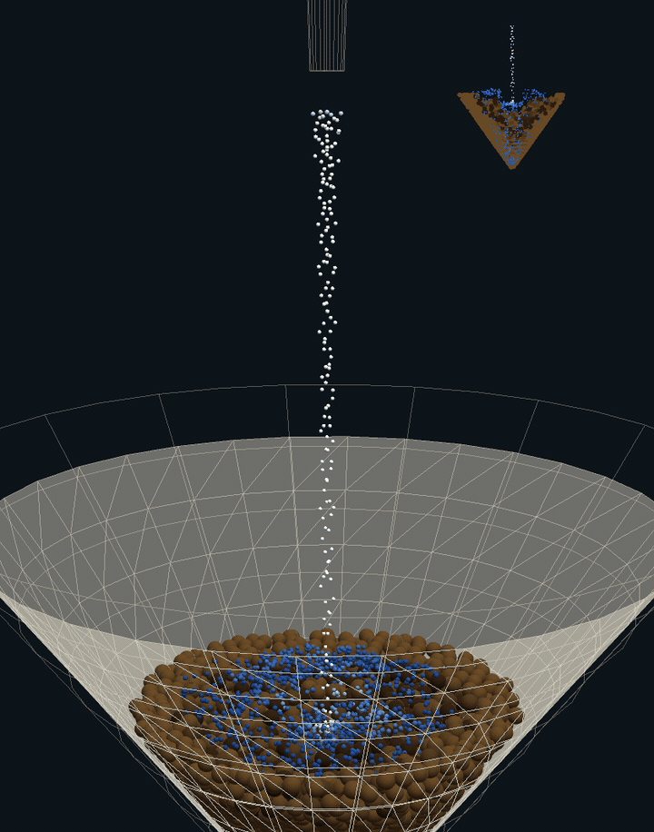

# Coffee Sim

`coffee-sim` is a browser-based pour-over coffee simulation powered by Rust,
WebAssembly, and WebGPU.



## Features

- 3D V60-style pour-over scene
- WebGPU MPM particle simulation
- interactive pour controls
- orbit, zoom, and pan camera controls
- built-in benchmark and debug scenes
- browser-based diagnostics overlay

## Quick Start

Prerequisites:

- Rust: <https://rustup.rs/>
- the `wasm32-unknown-unknown` Rust target
- `wasm-pack`
- a local static file server
- a browser with WebGPU support

Clone the repo and install the WebAssembly tooling:

```bash
git clone https://github.com/craigxchen/coffee-sim.git
cd coffee-sim
rustup target add wasm32-unknown-unknown
cargo install wasm-pack --locked
```

Build the browser bundle:

```bash
wasm-pack build crates/sim-wasm --target web --release --out-dir www-3d/pkg
```

Serve the app with any static file server. For example, with Python 3:

```bash
cd crates/sim-wasm/www-3d
python3 -m http.server 8080
```

Open <http://localhost:8080>.

## Controls

- Drag to orbit the camera.
- Scroll to zoom.
- Use `W/A/S/D` to pan.
- Use pause and reset from the sidebar.
- Switch between Center Pour, Water Only, and the Debug Scenes tab.
- Adjust water velocity in meters per second.
- Move the spout in X/Z with the plane control and adjust spout height with the
  height slider.
- Show Debug Stats to inspect simulation diagnostics.

## Project Layout

- `crates/sim-core`: shared math/types
- `crates/sim-wasm`: WASM API, WebGPU renderer, browser UI, and simulation
- `crates/sim-wasm/www-3d`: browser app
- `docs/ARCHITECTURE.md`: implementation notes

## Development

Useful checks:

```bash
cargo fmt --check
cargo clippy -p coffee-sim-wasm -- -D warnings
cargo test -p coffee-sim-wasm --lib
wasm-pack build crates/sim-wasm --target web --release --out-dir www-3d/pkg
```

## More Info

- [Architecture](docs/ARCHITECTURE.md)
