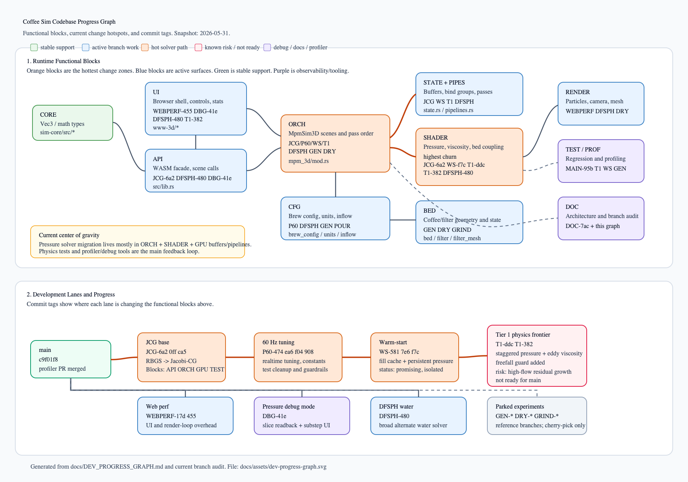
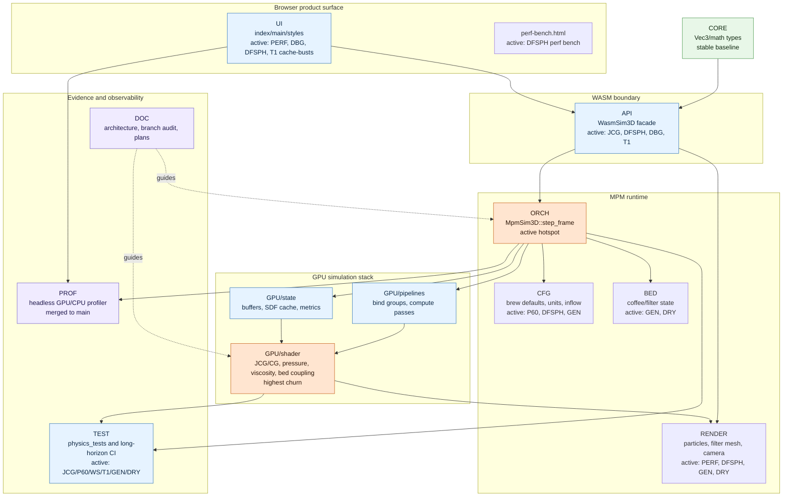
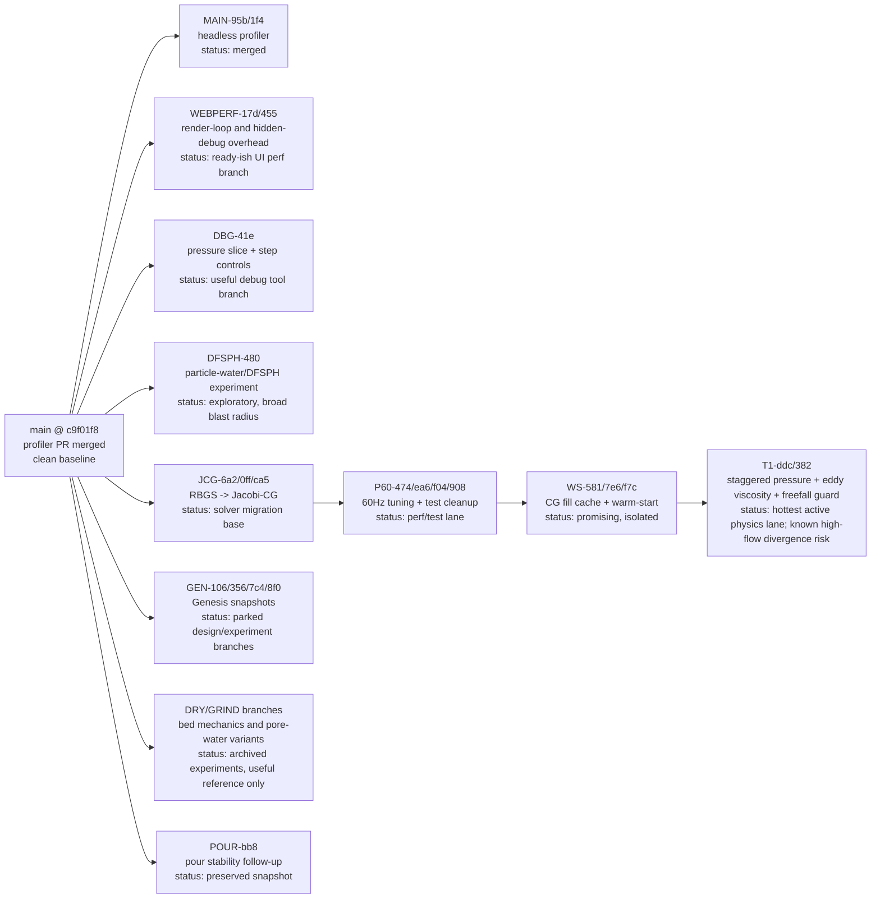

# Development Progress Graph

Snapshot date: 2026-05-31.

This map describes the active codebase as functional blocks, then tags the
current branch work by the blocks each commit touches. It is intentionally a
working map, not a release note.

## Block Key

| Tag | Functional block | Main files |
| --- | --- | --- |
| `CORE` | shared math/types | `crates/sim-core/src/*` |
| `API` | WASM API facade | `crates/sim-wasm/src/lib.rs` |
| `UI` | browser shell, controls, diagnostics | `crates/sim-wasm/www-3d/*` |
| `RENDER` | WebGPU render path and camera | `crates/sim-wasm/src/renderer.rs` |
| `ORCH` | MPM scene setup and frame orchestration | `crates/sim-wasm/src/mpm_3d/mod.rs` |
| `CFG` | recipe, units, inflow controls | `brew_config.rs`, `units.rs`, `inflow.rs` |
| `BED` | coffee bed and filter geometry | `bed.rs`, `filter.rs`, `filter_mesh.rs` |
| `GPU` | buffers, bind groups, kernels | `state.rs`, `pipelines.rs`, `shader.rs` |
| `TEST` | solver regression and CI harnesses | `physics_tests.rs`, `.github/workflows/*` |
| `PROF` | headless profiler | `profiler.rs`, `Cargo.toml`, `Cargo.lock` |
| `DOC` | docs/plans/changelog | `docs/*`, `README.md`, `CHANGELOG.md`, plan docs |

## Functional Graph

## Dev Lane Graph

## Progress Read

Mainline is clean and now includes the profiler PR. The strongest current
development line is the pressure-solver migration: RBGS was replaced with a sparse
Jacobi-CG path, then tuned for 60 Hz, then extended with fill caching and
warm-starting. The newest tier, `codex/perf-60hz-tier1`, is the active physics
frontier: it experiments with a staggered pressure projection and eddy viscosity,
but it is explicitly not ready for main because the branch notes a high-flow
residual-growth/SPD bug.

Browser-side work is less coupled to physics: `codex/perf-improvements` reduces
render/debug overhead, and `codex/pressure-debug-mode` adds pressure slice
readback plus substep stepping for solver inspection. `codex/dfsph-water` is a
separate broad water-solver experiment and should be compared rather than merged
blindly into the Jacobi-CG lane.

Older dry-bed branches preserve alternate mechanics and pore-water designs. Keep
them as reference branches; do not use them as integration bases without a
specific cherry-pick plan.

Verification observed during the cleanup pass:
- `cargo fmt --check` passed on the newly packaged active work after formatting.
- `cargo test -p coffee-sim-wasm --lib shader_parses_with_naga` passed on
  `warmstart-ref`, `codex/pressure-debug-mode`, and `codex/perf-60hz-tier1`.
- Full `cargo clippy`, full lib tests, and `wasm-pack build` were not rerun for
  this graph.

## Commit Tags

### Mainline and profiler

| Commit tag | Branch | Blocks touched | What changed |
| --- | --- | --- | --- |
| `MAIN-95b` `95bb9aa` | `main` | `PROF`, `ORCH` | Adds headless MPM GPU/CPU profiler and dependencies. |
| `MAIN-1f4` `1f41ce8` | `main` | `PROF` | Refines profiler reporting and fallback/unattributed GPU output. |
| `MAIN-c9f` `c9f01f8` | `main` | merge only | Merges profiler PR #16. |

### Jacobi-CG and 60 Hz solver lane

| Commit tag | Branch line | Blocks touched | What changed |
| --- | --- | --- | --- |
| `JCG-6a2` `6a2ddbe` | `codex/rbgs-to-jacobi-cg` | `API`, `ORCH`, `GPU`, `TEST` | Replaces RBGS pressure solve with Jacobi-CG. |
| `JCG-0ff` `0ffe65a` | `codex/rbgs-to-jacobi-cg` | `API`, `CFG`, `ORCH`, `GPU`, `TEST` | Continues sparse CG port and adds long-horizon workflow. |
| `JCG-ca5` `ca52ca7` | `codex/rbgs-to-jacobi-cg` | `CFG`, `ORCH`, `GPU`, `TEST` | Adds solver guardrails around the CG port. |
| `P60-474` `474d875` | `codex/perf-60hz` | `UI`, `RENDER`, `CFG`, `ORCH`, `GPU`, `TEST` | Real-time tuning and review cleanup. |
| `P60-ea6` `ea68f9d` | `codex/perf-60hz` | `GPU` | Names solver/classification constants in WGSL. |
| `P60-f04` `f040de3` | `codex/perf-60hz` | `TEST` | Tightens J-clamp bounds in quiescent-bed tests. |
| `P60-908` `908bbf7` | `codex/perf-60hz` | `TEST` | Removes ignored physics tests from the lane. |
| `WS-581` `581d011` | `warmstart-ref` | `GPU` | Caches CG operator fill fraction for matvec speedup. |
| `WS-7e6` `7e6ddad` | `warmstart-ref` | `GPU` | Documents classify-before-init invariant for fill cache. |
| `WS-f7c` `f7c9d3c` | `warmstart-ref` | `UI`, `ORCH`, `GPU`, `TEST` | Warm-starts pressure CG from previous substep and tests residual improvement. |
| `T1-ddc` `ddcb04c` | `codex/perf-60hz-tier1` | `API`, `UI`, `ORCH`, `GPU` | Adds staggered pressure projection and eddy viscosity experiment. |
| `T1-382` `382278d` | `codex/perf-60hz-tier1` | `UI`, `ORCH`, `GPU` | Keeps fast freefall out of staggered pressure domain. |

### Browser performance and debug tooling

| Commit tag | Branch | Blocks touched | What changed |
| --- | --- | --- | --- |
| `WEBPERF-17d` `17d01ea` | `codex/perf-improvements` | `UI`, `RENDER`, `ORCH` | Improves web render loop performance. |
| `WEBPERF-455` `455c3e8` | `codex/perf-improvements` | `UI` | Skips hidden debug UI reads and centralizes DPR/timeseries refresh. |
| `DBG-41e` `41eb990` | `codex/pressure-debug-mode` | `API`, `UI`, `ORCH`, `GPU` | Adds debug stepping and pressure-slice readback UI. |

### Parallel physics experiments

| Commit tag | Branch | Blocks touched | What changed |
| --- | --- | --- | --- |
| `DFSPH-480` `4804a01` | `codex/dfsph-water` | `API`, `UI`, `RENDER`, `CFG`, `ORCH`, `GPU`, `TEST` | Broad DFSPH water experiment plus perf bench. |
| `POUR-bb8` `bb840fa` | `codex/pour-stability-follow-up` | `CFG`, `ORCH` | Snapshot pour stability follow-up. |
| `GEN-106` `1061c12` | `codex/genesis-bed-constraints` | `API`, `UI`, `RENDER`, `CFG`, `BED`, `ORCH`, `GPU`, `TEST`, `DOC` | Bed constraint experiment snapshot. |
| `GEN-356` `35612ff` | `codex/genesis-inflow-slug` | `API`, `UI`, `RENDER`, `CFG`, `BED`, `ORCH`, `GPU`, `TEST`, `DOC` | Inflow slug experiment snapshot. |
| `GEN-7c4` `7c4c768` | `codex/genesis-pourover-plan` | `API`, `UI`, `RENDER`, `CFG`, `BED`, `ORCH`, `GPU`, `TEST`, `DOC` | Pourover planning experiment snapshot. |
| `GEN-8f0` `8f042c6` | `codex/genesis-pressure-residual` | `API`, `UI`, `RENDER`, `CFG`, `BED`, `ORCH`, `GPU`, `TEST`, `DOC` | Pressure residual experiment snapshot. |

### Older bed-mechanics reference branches

| Commit tag | Branch family | Blocks touched | What changed |
| --- | --- | --- | --- |
| `GRIND-38e` `38ea5ca` | `grind-size-bed-drop` | `BED`, `ORCH`, `GPU` | Grid-coupled bed particle rewrite variant. |
| `GRIND-564` `5648e5d` | `grind-size-bed-drop` | `BED`, `ORCH`, `GPU`, `TEST` | Dual-field bed coupling and seating fixes. |
| `GRIND-c07` `c07433e` | `grind-size-bed-drop` | `BED`, `ORCH`, `GPU`, `TEST` | Later duplicate/variant of dual-field coupling. |
| `GRIND-d96` `d96fde3` | `grind-size-bed-drop` | `ORCH`, `GPU` | Reduces bed/water heuristics and broadens bed uptake. |
| `GRIND-3f1` `3f1c873` | `grind-size-bed-drop` | `ORCH`, `GPU`, `DOC` | Hot-path optimization and SDF classification cache. |
| `GRIND-4ac` `4ac6275` | `grind-size-bed-drop` | `ORCH`, `GPU` | Redistributes bed pore water through local storage. |
| `GRIND-609` `60912e7` | `grind-size-bed-drop` | `API`, `UI`, `RENDER`, `CFG`, `BED`, `ORCH`, `GPU`, `TEST` | Adds dry elastic bed deformation state. |
| `GRIND-ddc` `ddc0877` | `grind-size-bed-drop` | `BED`, `GPU`, `TEST` | Adds dry bed plastic yield projection. |
| `GRIND-247` `2477f42` | `grind-size-bed-drop` | `API`, `UI`, `BED`, `ORCH`, `GPU`, `TEST`, `DOC` | Snapshot of granular bed branch state. |
| `DRY-8f3` `8f3ece2` | `dry-bed-dual-grid` | `BED`, `ORCH`, `GPU`, `TEST`, `DOC` | Rewrites dry bed mechanics on dual solid grid. |
| `DRY-4ca` `4ca518b` | `dry-bed-dual-grid` | `BED`, `GPU`, `TEST`, `DOC` | Seats bed geometry and retains wet granular strength. |
| `DRY-81d` `81dc1c5` | `dry-bed-dual-grid` | `TEST`, `DOC` | Adds settled free-water pool regression. |
| `DRY-2ee` `2ee41f3` | `dry-bed-dual-grid` | `RENDER`, `BED`, `GPU` | Renders coffee grounds with explicit particle sizes. |
| `DRY-c97` `c974988` | `dry-bed-dual-grid` | `CFG` | Densifies and de-patterns the water stream. |
| `DRY-d97` `d972cb1` | `dry-bed-dual-grid` | `BED`, `ORCH`, `TEST` | Stabilizes filter scaffold and isolates bed diagnostics. |
| `IDRY-4c7` `4c725a5` | `integration/dry-bed-mechanics` | `BED`, `ORCH`, `GPU` | Alternate grid-coupled bed particle rewrite. |
| `IDRY-e36` `e36dd62` | `integration/dry-bed-mechanics` | `BED`, `ORCH`, `GPU`, `TEST` | Alternate dual-field bed coupling and seating fixes. |
| `IDRY-094` `0948ee4` | `integration/dry-bed-mechanics` | `ORCH`, `GPU` | Alternate pore-water redistribution. |
| `IDRY-06a` `06a5661` | `integration/dry-bed-mechanics` | `API`, `UI`, `RENDER`, `CFG`, `BED`, `ORCH`, `GPU`, `TEST` | Alternate dry elastic bed deformation state. |
| `IDRY-666` `6666608` | `integration/dry-bed-mechanics` | `BED`, `GPU`, `TEST` | Alternate dry bed plastic yield projection. |
| `IDRY-865` `86519b3` | `integration/dry-bed-mechanics` | `BED`, `ORCH`, `GPU`, `TEST`, `DOC` | Preserves dry-bed mechanics work and session notes. |

### Documentation branch

| Commit tag | Branch | Blocks touched | What changed |
| --- | --- | --- | --- |
| `DOC-7ac` `7ac2930` | `integration-docs-audit` | `DOC` | Adds architecture docs, branch audit, and planning docs. |
