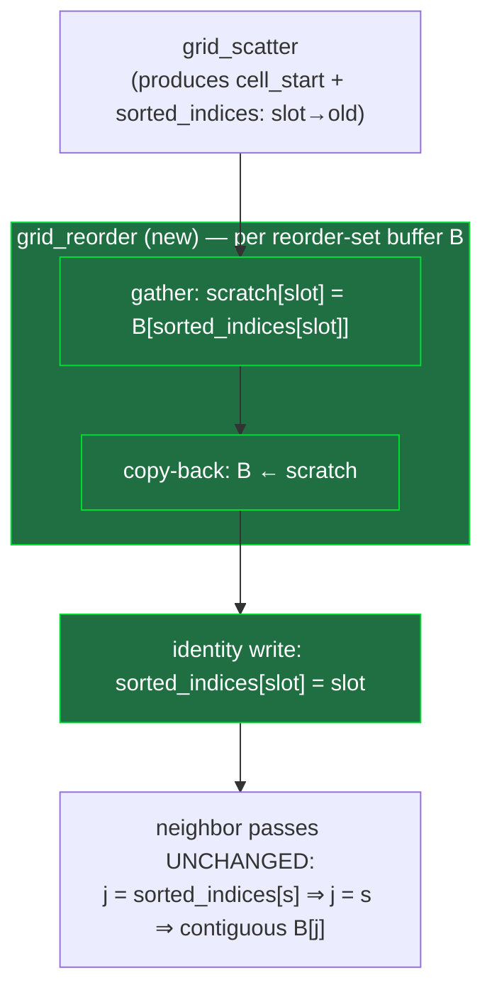

# feat: Particle-Reorder Memory Locality (XPBD neighbor gather)

Reorder particle payloads into cell-sorted order at each grid rebuild so the PBF
density-solve neighbor gathers read contiguous memory, flattening the super-linear
µs/Kpart-vs-particle-count curve toward the 200k target. This is a **memory-layout change,
not a numerics change** — physics behavior stays invariant.

---

## Summary

The two PBF density passes (`compute_lambda` + `compute_dp`) are ~93% of frame time and their
per-particle cost climbs ~2.3× from 5k→80k particles (total cost ≈ N^1.25). The counting-sort
grid orders neighbor *indices* but never the particle *payloads*, so `pred[j]`, `lambda[j]`,
etc. are gathered from scattered memory — cache misses that worsen as N outgrows cache. The fix
("sort particles, not indices") permutes the payload into cell order at each rebuild and writes
`sorted_indices` to identity, so the **existing** gather loops read contiguously with zero
shader-loop edits.

The R6 identity audit (in the origin doc) is complete and resolved the two risky unknowns up
front: the reorder set is **seven** buffers — the persistent state plus the two frame/loop
accumulators (`fluid_impulse`, `normal_impulse`) that are read after a reorder point — and the
determinism stance is **accept non-deterministic scatter** (no consumer needs a stable ID).

Success is the **curve**, not a point: µs/Kpart across ≥4 counts on both `dam_break` and
`v60pour`, with the fitted exponent bending from ~1.25 toward ~1.0 and the `compute_lambda +
compute_dp` share dropping, while `max_occupancy` stays unchanged (attribution guard).

---

## Problem Frame

See origin for the full diagnosis. In brief: the cost is memory locality, not hash geometry
(the counting-sort grid is correctly sized; `max_occupancy` stays flat ~24 across resolutions).
The neighbor gather `sorted_indices[s] → pred[j]` chases scattered `j` because payloads are
never reordered. Particle-reorder is the only lever that attacks *scaling* (the super-linear
term) rather than the constant multiplier, and it is not yet on the `docs/PERF_NOTES.md` list.

---

## Requirements Traceability

| Origin req | Where addressed |
|---|---|
| R1 (reorder on rebuild, 7-buffer set, cell-linear) | U3 |
| R2 (identity `sorted_indices`, zero neighbor-loop edits) | U3 |
| R3 (single shared mapping, scratch + copy-back, chunk hazard) | U3 |
| R4 (≤8 storage buffers/stage) | U3 |
| R5 (emission consistency) | U3 (test scenarios) |
| R6 (identity audit) | **Done in origin** — informs U3 reorder set, U2 test reframe |
| R7 (set-invariant test reframe, not loosened) | U2 |
| R8 (accept non-deterministic scatter) | **Resolved in origin** — no work; informs U2 |
| R9 (named small-N rule) | U4 |
| R-SC1/2/3 (curve gate, attribution guard, invariants) | U1 (harness), U4 (gate) |

---

## High-Level Technical Design

The reorder is a new step inserted **immediately after every `grid_scatter`** (at every rebuild
site). It consumes the freshly-built `sorted_indices` (slot → old index), permutes the
seven-buffer reorder set into cell order via a reused scratch buffer + copy-back, then rewrites
`sorted_indices` to identity so the unchanged neighbor loops gather contiguously.

**Reorder-set buffers** (7), with their bindings in `src/solvers/xpbd/common.wgsl`:
`pos`(1), `pred`(2), `vel`(3), `phase`(11), `normal_impulse`(12), `fluid_impulse`(14),
`chem`(20). The three `vec4` channels (`pos`/`pred`/`vel`/`chem`) share one `vec4` scratch
reused sequentially; `phase`/`fluid_impulse`/`normal_impulse` share one scalar scratch. Gather →
copy-back per channel keeps each `grid_reorder` dispatch within the 8-storage-buffer budget
(`sorted_indices` + 1 src + 1 dst = 3), and one shared mapping (`sorted_indices`, read-only
until the final identity write) closes the chunk hazard (R3).

**Rebuild sites** the reorder attaches to (all in `src/solvers/xpbd/mod.rs::step`): the water
loop (every 4 iters), the drag block, the buoyancy block, the bed loop (every `bed_regrid`),
the wetting block, and the extraction block. The reorder is correctness-decoupled from cadence
(skipping it at a rebuild only forfeits locality that window), so "reorder every *k* rebuilds"
remains an available perf knob (deferred).

**Why the accumulators must be in the set** (the audit's catch): `fluid_impulse` is reset in
`predict`, accumulated in the drag block, and read in `finalize` — with the buoyancy and bed
rebuilds in between; `normal_impulse` accumulates across bed iterations that rebuild mid-loop.
Omitting either silently misattributes the value to the wrong particle (passes invariants,
subtly wrong).

---

## Key Technical Decisions

- **Cell-linear, reuse existing `cell_id`.** No Morton in this cut — the dominant win is
  within-cell contiguity, which cell-linear already delivers. Morton (cross-cell locality) is
  a gated follow-up.
- **Identity `sorted_indices`, no neighbor-loop edits.** After reorder, write
  `sorted_indices[slot] = slot` so the 5 neighbor shaders are untouched; `j = sorted_indices[s]`
  becomes a contiguous `pred[s]` read. Dropping the indirection (`j = s`) is deferred.
- **Scratch + copy-back, single reused scratch per element-size.** Two scratch buffers (one
  `vec4`, one scalar) reused sequentially across channels; gather from the pre-reorder source,
  copy back, never read a half-reordered buffer. `copy_buffer_to_buffer` doesn't count against
  the storage-buffer budget, so only the gather kernels are budget-constrained.
- **Seven-buffer reorder set** including `fluid_impulse`/`normal_impulse` (audit result).
  Always reordering the two accumulators is a harmless no-op in scenes that don't use them.
- **Accept non-deterministic scatter** (R8). Tests reframe to identify-by-phase (U2); the
  deterministic stable-key scatter stays an unused escape hatch.
- **Reorder at every rebuild** for the first cut; cadence is a deferred perf knob, not a
  correctness lever.

---

## Implementation Units

### U1. Extend the scaling probe to the curve-shape success gate

**Goal:** Make success measurable as a *curve* on both scenes, and capture the pre-change
baseline.

**Requirements:** R-SC1, R-SC2.

**Dependencies:** none.

**Files:** `examples/scaling_probe.rs` (extend), `docs/PERF_NOTES.md` (baseline table).

**Approach:** Sweep ≥4 particle counts (~2k / 20k / 80k / toward 200k) over **both**
`Scene::dam_break()` (water-only) and `Scene::v60_pour()` (mixed, settled/poured to a
representative fill). For each point report: µs/Kpart, the `compute_lambda + compute_dp` share
of frame time, and `max_occupancy`. Fit and print the cost exponent (log-log slope of total
µs vs N). Capture the baseline curve in `docs/PERF_NOTES.md`. The probe already exists for
`dam_break`; this generalizes the scene + adds the exponent fit, the pass-share, and the
v60pour sweep.

**Patterns to follow:** existing `examples/scaling_probe.rs`; `examples/pour.rs` for driving a
v60pour fill; `solver.profile()` / `solver.diagnostics()` for per-pass µs and `max_occupancy`.

**Technical design (directional):** candidates-examined is *provably unchanged* by reorder
(positions, hence cell occupancy, are untouched), so `max_occupancy` is the cheap observable
for the attribution guard — assert it is identical pre/post rather than instrumenting a
per-particle candidate counter.

**Test scenarios:**
- Probe runs headless on both scenes and emits the columns (µs/Kpart, share, max_occ, exponent)
  for every sweep point without panicking; skips cleanly when no GPU adapter is present.
- v60pour sweep reaches a representative fill (active count grows to the bed+pour set) before
  the timing window, so the measured passes are neighbor-dense.
- Test expectation: this is diagnostic tooling — no invariant assertions; correctness is "the
  numbers are produced and the baseline is recorded."

**Verification:** baseline curve for both scenes recorded in `docs/PERF_NOTES.md`, including the
fitted exponent (~1.25 expected on dam_break) and the ~93% pass share.

---

### U2. Reframe index-dependent tests to identify-by-phase (set-invariant)

**Goal:** Make the per-particle test assertions survive a reorder by keying off species/state
within each post-step snapshot instead of a hardcoded slot — **without loosening** them.
Behavior-preserving on current code, so it lands green before U3.

**Requirements:** R7 (and enables R-SC3).

**Dependencies:** none (lands before U3).

**Execution note:** Refactor-first — these reframes must pass on the *current* (pre-reorder)
solver, then stay green after U3. Run the suite before and after.

**Files:** `tests/xpbd_wetting.rs`, `tests/xpbd_extraction.rs`, `tests/xpbd_coupling.rs`,
`tests/xpbd_integrator.rs` (audit each; reframe only the read-by-hardcoded-index assertions).

**Approach:** Replace post-step `read_moisture()[0]` / `read_chem()[1][0]`-style reads with
"identify the target particle by `read_phases()` in the *same* post-step snapshot, then read its
field." For loops that track one particle across steps (e.g. the wetting monotonicity check),
re-identify each step (the slot may move). Write-by-index *before* stepping is unaffected (sets
ICs; the payload travels together) and needs no change. Keep assertion strength identical —
swap the *index source*, not the tolerance.

**Patterns to follow:** `tests/xpbd_extraction.rs` already does this
(`let phase = solver.read_phases(); prewet(&solver, &phase, …)`) — generalize that pattern to
the read-back side.

**Test scenarios:**
- Wetting monotonicity (`tests/xpbd_wetting.rs`): the 2-particle grain+water case identifies the
  grain by `phase == GRAIN` each step and asserts its `V_abs` monotonic + capped — passes on
  current code.
- Extraction temperature dependence (`tests/xpbd_extraction.rs`): identifies the sampled water
  by phase rather than slot `[1]`; hot > cool assertion unchanged.
- Coupling / integrator: audit for any hardcoded post-step index read; reframe or confirm
  already set-invariant.
- Whole reframed suite is green on the **current** solver (no behavior change).

**Verification:** `cargo test` green before U3; no assertion was weakened (diff shows index-source
changes only, not tolerance changes).

---

### U3. The reorder pass: gather + identity `sorted_indices`, wired at every rebuild

**Goal:** Permute the seven-buffer reorder set into cell order after every `grid_scatter` and
write `sorted_indices` to identity, so neighbor gathers become contiguous with no neighbor-loop
edits.

**Requirements:** R1, R2, R3, R4, R5.

**Dependencies:** U2 (tests must be identity-safe first); U1 (to measure the effect).

**Files:** `src/solvers/xpbd/common.wgsl` (new `grid_reorder` kernel(s) + scratch bindings +
identity-write kernel), `src/solvers/xpbd/mod.rs` (scratch buffers, pipelines, bind groups, and
insert the reorder after each `grid_scatter` in `step`).

**Approach:**
1. Add `vec4` scratch + scalar scratch storage buffers (new bindings), sized to capacity.
2. `grid_reorder` kernel(s): for each reorder-set channel `B`, `scratch[slot] =
   B[sorted_indices[slot]]` over `0..active_count`, then `copy_buffer_to_buffer(scratch → B)`.
   Keep each kernel's bind group ≤ 8 storage buffers (`sorted_indices` + 1 src + 1 dst).
3. Final `grid_reorder_identity` write: `sorted_indices[slot] = slot`, **after** all gathers.
4. In `step`, insert the reorder sequence immediately after every `grid_scatter` dispatch (water
   loop, drag, buoyancy, bed, wetting, extraction). The neighbor shaders are unchanged.

**Technical design (directional):** gather direction is `scratch[new_slot] =
B[sorted_indices[new_slot]]` (contiguous write, scattered read) — the single scattered pass per
rebuild that replaces ~40 scattered gathers/frame. `cell_start` is untouched by the reorder and
stays valid; the next rebuild's `grid_scatter` recomputes `sorted_indices` from scratch, so the
identity write does not corrupt it. New particles appended by emission fold into cell order at
the next rebuild; the reorder must cover `0..active_count`.

**Patterns to follow:** existing `grid_scatter` / `grid_clear` kernels and their pipeline +
bind-group construction in `src/solvers/xpbd/mod.rs`; the `dispatch_pass` helper for wiring; the
`vel_frozen` / `chem_frozen` `copy_buffer_to_buffer` snapshots for the copy-back idiom.

**Test scenarios:**
- *Permutation correctness:* after a step (≥1 rebuild), the multiset of particle positions
  equals the pre-step multiset — no particle lost or duplicated. (New unit test; can disable the
  reorder via a build flag/branch to compare, or assert the multiset invariant directly.)
- *Payload integrity:* a particle's `(pos, vel, phase, chem, pos.w moisture)` travel together —
  seed a uniquely-markable particle, step, locate it by its marker, assert its full state is
  self-consistent (no cross-channel scramble).
- *Accumulator correctness (the audit catch):* a mixed drag scene where grain sleep depends on
  `fluid_impulse` — assert momentum conservation and that no grain spuriously sleeps/wakes vs.
  the pre-reorder reference (the regression that omitting `fluid_impulse`/`normal_impulse` would
  cause). Covers R1's accumulator inclusion.
- *Emission consistency:* a `v60_pour` run — particles emitted mid-run are present exactly once
  after subsequent reorders; `active_count` and the emitted-vs-in-domain balance hold (R5).
- *Invariants unchanged (R-SC3):* dam_break settles / incompressible / no eruption; bed repose;
  wetting monotonic; extraction yield — all pass (via the U2-reframed suite) within existing
  tolerances.
- *Determinism posture:* two runs of the same scene satisfy the invariants within tolerance
  (not asserted bit-identical) — confirms non-determinism is benign.

**Verification:** full suite green; the scaling probe (U1) shows the gather passes' share and
µs/Kpart dropping at high N; `max_occupancy` identical to baseline (attribution guard).

---

### U4. Verify the curve gate, apply the small-N rule, record results

**Goal:** Confirm success against the curve-shape criterion on both scenes, apply the pre-decided
small-N rule, and document the new lever.

**Requirements:** R-SC1, R-SC2, R-SC3, R9.

**Dependencies:** U1, U3.

**Files:** `docs/PERF_NOTES.md` (before/after curves + add particle-reorder to the lever list).

**Approach:** Run the U1 probe before/after on both scenes. Pass conditions: fitted exponent
bends from ~1.25 toward ~1.0 **and** the `compute_lambda + compute_dp` share drops, on both
`dam_break` and `v60pour`. Apply **R9** explicitly: measure 2k and 50k; a small *fixed*
overhead that amortizes is acceptable (absolute small-N frame still comfortably in budget); a
*multiplicative* non-amortizing small-N regression is not — if it occurs on a real shipping
scene, the escape valve is reorder-every-*k*-frames (deferred follow-up), and the threshold is
judged against budget, not relative delta. Attribution guard: `max_occupancy` and
candidates-examined unchanged (else investigate before claiming the win).

**Test scenarios:**
- Curve gate passes on `dam_break` (exponent ↓, share ↓).
- Curve gate passes on `v60pour` at scale (the real 200k target).
- Small-N (2k) check evaluated against the R9 rule and recorded (pass, or escape-valve decision).
- Attribution guard: `max_occupancy` matches baseline at every sweep point.
- Test expectation: verification/measurement unit — the "test" is the gate itself; record the
  numbers in `docs/PERF_NOTES.md`.

**Verification:** `docs/PERF_NOTES.md` shows before/after curves for both scenes, the R9
small-N decision, and particle-reorder added to the lever list.

---

## Scope Boundaries

**In scope:** the four units above — curve-shape harness, identity-safe test reframe, the
cell-linear reorder pass (7-buffer set, identity `sorted_indices`, scratch+copy-back, chunked),
and the verification gate.

**Deferred to follow-up work** (gated on whether the curve is flat enough):
- Morton / Z-order ordering (cross-cell locality).
- Dropping the `sorted_indices` indirection (`j = s`) across the 5 neighbor shaders.
- Ping-pong buffer swap (removes the copy-back; costs per-frame bind-group rebuilds).
- Reorder-every-*k*-frames (the R9 escape valve / dispatch-count reducer).
- Deterministic counting-sort scatter (R8 escape hatch — only if layout-reproducibility makes
  debugging painful).
- The separate `cell_size` grain-oversizing fix (`cell_size = h` when water is finer than grain).

**Out of scope:** changing the neighbor stencil or cell geometry; any physics numerics change;
device-scaling / adaptive budgets (`ARCHITECTURE.md §2`).

---

## Risks & Dependencies

- **Silent per-particle state scramble** (worst failure mode) — a missed identity consumer
  corrupts state while invariants pass. *Mitigated:* the R6 audit fixed the reorder set
  (accumulators included); U3's payload-integrity + accumulator-correctness tests and U2's
  set-invariant suite would catch a scramble.
- **Dispatch-count growth** — the reorder adds ~2–3 dispatches per rebuild (~5+ rebuilds/frame).
  The current frame is ~93 dispatches; the v1 lesson is that dispatch count predicts browser
  cost. *Mitigated/watched:* fuse channels into as few gather kernels as the 8-buffer budget
  allows; the deferred reorder-every-*k*-frames knob cuts this directly. U4 records the dispatch
  delta.
- **Small-N regression** — *mitigated:* R9 decision rule + escape valve, decided before the
  number is seen.
- **Chunk-ordering hazard** — *mitigated:* one shared `sorted_indices` mapping (read-only until
  the final identity write) + gather-from-source + copy-back (R3).
- **Assumption:** the reorder (O(N), once per rebuild) is cheap relative to the ~40 scattered
  gathers it accelerates; U1/U4 confirm or refute, R9 is the fallback.
- **Assumption:** `dam_break` is a faithful proxy for the v60pour water core; both are in the
  gate to guard the assumption.

---

## Verification & Success Criteria

- **Success = the curve** (R-SC1): µs/Kpart across ≥4 counts on `dam_break` and `v60pour`;
  exponent bends ~1.25 → ~1.0 and the `compute_lambda + compute_dp` share drops.
- **Attribution guard** (R-SC2): `max_occupancy` (and provably candidates-examined) unchanged.
- **Invariants** (R-SC3): the full physics suite green via the U2-reframed assertions, within
  existing tolerances — no test loosened.
- **Project gates** (`AGENTS.md`): `cargo fmt --check`, `cargo clippy --all-targets -D warnings`,
  `cargo test`, `cargo run --example phase0_noop`; every stage ≤ 8 storage buffers.
