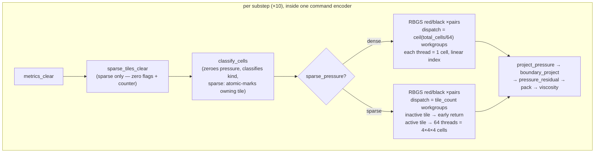

# perf: Sparse RBGS pressure solve via tile over-dispatch

## Summary

The MPM red/black Gauss-Seidel (RBGS) pressure solve dominates GPU time (~52 ms/frame, ~65% of the pass on a warm center pour). This plan reduces that cost by exploiting grid sparsity: most cells are air or solid, yet every RBGS sweep launches one workgroup per 64 cells across the full `[80, 115, 80]` grid. We first remove a redundant per-sweep write that costs bandwidth on every non-fluid cell (a measured ~1-line baseline), then add a tile-flagged sparse path that over-dispatches one workgroup per `4×4×4` tile and early-returns on inactive tiles. Indirect dispatch, runtime dense/sparse fallback, and particle sorting are explicitly deferred.

The solve is grid-bound, so the levers here are write/read traffic on the `grid` scratch buffer and per-tile work elimination — not launch-count reduction (v1 launches roughly the same number of workgroups as the dense path; only the deferred indirect v2 can cut launches).

---

## Problem Frame

`pressure_update` (`crates/sim-wasm/src/mpm_3d/shader.rs:1728`) is invoked for every cell, both parities, across `pressure_rbgs_pairs` iterations (default 40, raised to 80–100 by most scenes — `crates/sim-wasm/src/mpm_3d/mod.rs:327`) and `substeps` (default 10). That is roughly 1,600–2,000 full-grid sweeps per frame, each launching `dispatch_size(736000, 64) ≈ 11,500` workgroups (`crates/sim-wasm/src/mpm_3d/mod.rs:1642`).

Two inefficiencies fall out of the code:

1. Dense RBGS already early-outs cheaply for non-fluid cells (it returns before the 6-neighbor stencil at `shader.rs:1738`), but it still executes `pressure_store(idx, 0.0)` for every non-fluid cell on its parity sweep (`shader.rs:1739`). That store is redundant — `classify_cells` already zeroes every in-bounds cell each substep (`shader.rs:1543`) and no code reads a non-fluid cell's pressure *value* (fluid neighbors only sum `is_fluid_kind` neighbors, `shader.rs:1783`). Across ~1,000 parity sweeps/frame this re-zeroes ~660k non-fluid cells repeatedly for no effect.
2. Even with the per-cell early-out, every sweep still launches and schedules workgroups over the entire grid and pays one `cell_kind_load` (atomic load) per non-fluid cell. Skipping whole inactive tiles avoids that traffic for the cells that will never be touched.

The win is bandwidth on the `grid` atomic buffer (where pressure, kind, and divergence live as fixed-point lanes — `shader.rs:183`, `:217`, `:413`), not arithmetic.

---

## Requirements

Correctness

- R1. The sparse path produces bit-identical results to dense for the same input: pressure fixed-point slots, cell-kind slots, and projection residual metrics must match exactly after a controlled substep/frame.
- R2. Tile flags are rebuilt every substep (immediately after `classify_cells`), marked atomically, and each active tile is counted exactly once.
- R3. The baseline change (removing the redundant non-fluid `pressure_store`) is itself bit-identical to current behavior.
- R4. No halo: the sparse path updates exactly the same fluid cells as dense, relying on full-grid classification to initialize air/solid neighbor state.

Performance & measurement

- R5. The baseline change is measured independently (its share of `pressure_solve` time) before the tile scheme is judged.
- R6. Production `step_frame` is measured sparse-on vs sparse-off — not only timestamped pass totals — and active-tile fraction is measured across center-pour, water-block, free-stream, and a saturated/high-fill bed scene.
- R7. The binding acceptance gate is a measurable reduction in total production `step_frame` time on the `default_v60` center-pour scene — not `pressure_solve` alone, because the tile-marking and `sparse_tiles_clear` costs fall outside the `pressure_solve` timer (see Performance Plan). A ≥2× `pressure_solve` reduction is the secondary target, applied to a scene whose measured active-tile fraction is ≤ ~50% — "moderately sparse" is the fraction U5 measures, not an assumed label.

Resource safety

- R8. Sparse metadata adds no per-frame GPU→CPU readback and no per-frame buffer allocation; the metadata buffer is allocated once and lives for the sim's lifetime.
- R9. Storage-buffer usage stays within the already-requested limit of 10 (`mod.rs:50`); `required_limits()` is unchanged. `pipelines_fit_within_required_limits` (`physics_tests.rs:1504`) is behavioral — it builds the pipeline under `required_limits()` and asserts no validation error — so it passes unchanged with the 10th buffer; add an explicit storage-buffer-count assertion (`== 10`) if a regression guard on the count is wanted.
- R10. The sparse path is toggleable; the dense path remains the production default and the comparison/equivalence path.

---

## Key Technical Decisions

- KTD1. Baseline-first sequencing. Remove the redundant non-fluid `pressure_store(idx, 0.0)` (keeping the early return) as U1 and measure it before building tiles. It is bit-exact, needs no new buffers, and isolates how much of the 52 ms is redundant write traffic vs. launch/load overhead. If U1 alone reaches R7, the tile scheme's marginal value is reassessed at the U1 checkpoint (see Performance Plan).

- KTD2. Fixed over-dispatch, not indirect. `TILE_SIZE = 4` so one `@workgroup_size(64)` workgroup maps exactly to one `4×4×4` tile. The sparse RBGS dispatches `tile_count` workgroups; each checks its flag and returns if inactive. This avoids indirect-dispatch validation, a compacted active-tile list, and adapter capability gates in v1.

- KTD3. Dedicated `sparse_tiles` storage buffer, allocated once. Layout `[active_tile_count, reserved, tile_flags[tile_count]]` as `array<atomic<u32>>` at binding 12, created at sim construction and held in the buffers struct (RAII drop → no leak). It is GPU-only with on-demand readback in tests/profiler — no per-frame readback, because runtime fallback is deferred (KTD6). Rationale: this is the leak-safe and limit-safe option. `required_limits()` already requests 10 storage buffers while only 9 are bound (`mod.rs:50`, `shader.rs:54-63`), so the 10th slot is already provisioned and no limit change is required. See Alternatives for why packing into `metrics` is worse, and why grid-scratch reuse is rejected.

- KTD4. No tile halo. RBGS mutates only fluid cells; every fluid cell's tile is marked active, and a fluid cell's fluid neighbors are themselves fluid (hence in active tiles). Air/solid neighbors contribute Dirichlet-0 or are skipped regardless of tile activity. Full-grid `classify_cells` initializes neighbor kind/pressure, so no halo is needed (revisit only if exact equivalence tests prove otherwise).

- KTD5. Toggle via `MpmSettings.sparse_pressure` (default off in production). Both encode paths must honor it: production `step_frame` (`mod.rs:1639-1646`) and the profiler's hand-rolled pass list (`profiler.rs:333-347`). The profiler reads `COFFEE_SIM_PROFILE_SPARSE_PRESSURE` to set it.

- KTD6. Defer to v2: indirect dispatch (compacted active-tile list + indirect args buffer, requiring `required_limits` ≥ 12 and an adapter capability gate), runtime dense/sparse fallback (needs lagged `active_tile_count` readback to avoid a per-substep stall), and particle sorting (p2g/g2p are small relative to the solve).

---

## High-Level Technical Design

Per-substep pressure phase, dense vs. sparse. The only structural changes are the added clear pass, tile marking inside `classify_cells`, and the dispatch geometry of the RBGS sweeps. Everything downstream of the solve is untouched.



Tile mapping (directional, not a spec). Cell index is x-fastest: `idx = ix + iy·gx + iz·gx·gy`. A tile is a `4×4×4` block; with `ntx = ceil(gx/4) = 20`, `nty = ceil(gy/4) = 29`, `ntz = ceil(gz/4) = 20`, `tile_count = 11,600`. Marking (in `classify_cells`): `tile_id = (ix/4) + (iy/4)·ntx + (iz/4)·ntx·nty`. Consumption (in sparse RBGS): `workgroup_id.x` is `tile_id`; invert to `(tx,ty,tz)`, base cell `(tx·4, ty·4, tz·4)`, then `local_invocation_id.x` (0–63) adds `(lx,ly,lz)`. The Y axis has a partial top tile (`29·4 = 116 > 115`), so every cell mapping needs a full in-bounds check.

---

## Implementation Units

### U1. Remove redundant non-fluid pressure re-zero (measured baseline)

- Goal: Eliminate the per-sweep `pressure_store(idx, 0.0)` for non-fluid cells in `pressure_update`, keeping the early return. Establish how much of `pressure_solve` time is redundant write traffic.
- Requirements: R3, R5.
- Dependencies: none.
- Files: `crates/sim-wasm/src/mpm_3d/shader.rs` (modify `pressure_update`); `crates/sim-wasm/src/mpm_3d/physics_tests.rs` (add equivalence test).
- Approach: In `pressure_update` (`shader.rs:1738-1741`), replace the non-fluid branch's `pressure_store(idx, 0.0); return;` with a bare `return;`. Safe because `classify_cells` zeroes every in-bounds cell each substep (`shader.rs:1543`), kind is fixed for the duration of a substep's RBGS, and non-fluid pressure values are never read (`shader.rs:1783`, and `project_pressure`/`pressure_residual` skip non-fluid). The `neighbor_count <= 0` fluid branch at `shader.rs:1788` still stores 0 and is unchanged.
- Patterns to follow: existing one-shot GPU readback in `physics_tests.rs:294-311` (metrics) for capturing the grid pressure lane.
- Test scenarios:
  - Bit-exact equivalence: run a fixed center-pour scene for one frame with the current code and with U1; the `grid` pressure fixed-point slots (`scratch_pressure_idx`) must be identical for every cell. Input: deterministic seeded scene, fixed `substeps`/`pressure_rbgs_pairs`. (Implemented as a stored-before/after comparison or by asserting equality against a dense reference computed both ways.)
  - Non-fluid cells read zero: assert a sampled set of known air and solid cells have pressure slot exactly 0 after a frame.
  - Covers R3.
- Verification: equivalence test passes; profiler `pressure_solve` and total `step_frame` recorded before/after on `default_v60` to quantify the baseline gain. U1 lands as its own commit and ships independently of the tile scheme; its measured `step_frame` delta feeds the baseline gate (Performance Plan) that decides whether U2 starts.

### U2. Sparse metadata buffer, clear pass, and tile marking

- Goal: Add the `sparse_tiles` buffer, a dedicated clear pass, and atomic tile marking inside `classify_cells`.
- Requirements: R2, R8, R9.
- Dependencies: U1, and the baseline gate must clear — U2 starts only if U1 alone falls short of the R7 `step_frame` target (see Performance Plan).
- Files: `crates/sim-wasm/src/mpm_3d/shader.rs` (buffer decl at binding 12, tile-id helpers, marking in `classify_cells`, new `sparse_tiles_clear` entry point); `crates/sim-wasm/src/mpm_3d/pipelines.rs` (layout entry `storage_entry(12)`, bind-group entry, `sparse_tiles_clear` pipeline); `crates/sim-wasm/src/mpm_3d/state.rs` (allocate the buffer sized to `1 + reserved + tile_count`, store in buffers struct; tile-count constants); `crates/sim-wasm/src/mpm_3d/mod.rs` (compute `tile_count`, dispatch the clear pass before `classify_cells`, leave `required_limits()` unchanged).
- Approach: Buffer is `array<atomic<u32>>` with slot 0 = `active_tile_count`, slot 1 reserved, slots `2..2+tile_count` = `tile_flags`. `sparse_tiles_clear` (one `@workgroup_size(64)` entry) zeroes the whole buffer, dispatched `dispatch_size(2 + tile_count, 64)` workgroups each substep before `classify_cells` — and only when `sparse_pressure` is enabled, so the dense default path adds zero dispatches. In `classify_cells`, after a cell is classified `CELL_SURFACE_FLUID`/`CELL_INTERIOR_FLUID`/`CELL_BED_COUPLED` (`shader.rs:1582`, `:1609`), compute `tile_id` and mark: `let old = atomicExchange(&tile_flags[tile_id], 1u); if old == 0u { atomicAdd(&active_tile_count, 1u); }`. Marking must be atomic — multiple cells map to one tile and identical non-atomic writes are still a WGSL race.
- Patterns to follow: `metrics` buffer allocation and binding (`state.rs`, `pipelines.rs:134`); `metrics_clear` entry point and dispatch (`shader.rs:2825`, `mod.rs:1607-1612`); bind-group layout helper `storage_entry` (`pipelines.rs:192`).
- Test scenarios:
  - Tile geometry: assert `tile_count == 11600` and that the partial Y tile is handled — the top tile layer covers `y ∈ {112,113,114}` with `y = 115` out of bounds. Input: default `grid_dims [80,115,80]`.
  - Atomic marking counts once: after one substep on a scene with a known fluid footprint, `active_tile_count` equals the number of distinct tiles containing ≥1 fluid cell (compute expected from the cell-kind slots).
  - Per-substep rebuild: run ≥2 substeps where fluid occupancy changes; assert flags reflect the current substep's footprint, not an accumulation across substeps (a tile that became all-air must read flag 0).
  - Marking covers all fluid kinds: a scene with bed-coupled cells marks their tiles.
  - Dense path adds no clear: with `sparse_pressure=false`, `sparse_tiles_clear` is not dispatched (assert the dense substep dispatch sequence is unchanged from current).
  - Covers R2.
- Verification: metadata tests pass; `cargo clippy -p coffee-sim-wasm -- -D warnings` clean; the buffer is allocated exactly once (no per-frame allocation in `step_frame`).

### U3. Sparse RBGS wrappers and production toggle

- Goal: Add `pressure_rbgs_red_sparse` / `pressure_rbgs_black_sparse`, map workgroup→tile and thread→cell, gate on the tile flag, and wire the `sparse_pressure` toggle into production `step_frame`.
- Requirements: R1, R2, R4, R10.
- Dependencies: U2.
- Files: `crates/sim-wasm/src/mpm_3d/shader.rs` (two sparse entry points + tile/cell inverse mapping); `crates/sim-wasm/src/mpm_3d/pipelines.rs` (two pipelines); `crates/sim-wasm/src/mpm_3d/mod.rs` (add `sparse_pressure: bool` to `MpmSettings`, default false; choose dense vs sparse pipelines and dispatch geometry in the substep loop, `mod.rs:1642`).
- Approach: Each sparse wrapper takes `workgroup_id.x` as `tile_id`; returns if `tile_id >= tile_count`; returns if `atomicLoad(&tile_flags[tile_id]) == 0u`; maps `local_invocation_id.x` to `(lx,ly,lz)` within the tile; computes the cell index with a full in-bounds check (partial Y tile); calls the existing `pressure_update(cell_idx, parity)` — no change to the per-cell math, which preserves exact equality. Red/black stay interleaved in a single compute pass (matching dense, `mod.rs:1642`), so existing inter-dispatch ordering within the pass is unchanged. Sparse dispatch is `dispatch_workgroups(tile_count, 1, 1)` (11,600 < 65,535, fits 1D). Bit-equality is expected because within one color sweep a cell reads only opposite-parity face neighbors, never another same-color cell — so reordering threads into tiles cannot change any result — and the single-pass red→black structure preserves the existing inter-dispatch storage visibility the black sweep relies on. The equivalence test must fail hard on any differing slot, not relax to an undefined tolerance; if it ever does differ, that falsifies this premise and is a bug to root-cause, not absorb.
- Patterns to follow: dense wrappers `pressure_rbgs_red`/`pressure_rbgs_black` (`shader.rs:1798-1810`); index decomposition in `classify_cells` (`shader.rs:1547-1550`).
- Test scenarios:
  - Exact dense-vs-sparse equivalence (primary): same seeded initial state, run one frame with `sparse_pressure=false` and `=true`; assert identical `grid` pressure fixed-point slots and cell-kind slots for every cell. Scenes: center pour, a hydrostatic/cup-wall rest scene, and a saturated/high-fill bed scene.
  - Residual parity: `pressure_residual` metrics (`METRIC_PROJECTION_RESIDUAL_*`) match exactly between paths (residual stays full-grid in v1).
  - Partial-tile correctness: assert fluid cells in the top Y tile layer (`y = 112..114`) are updated and `y = 115` is never indexed.
  - Inactive-tile no-op: a scene with isolated fluid leaves all-air tiles' pressure at 0 after the solve.
  - Covers R1, R4.
- Verification: equivalence tests pass for all three scenes; production default remains dense (`sparse_pressure=false`); `cargo test -p coffee-sim-wasm --lib` green.

### U4. Profiler sparse path and env toggle

- Goal: Mirror the sparse encode in the profiler's hand-rolled pass list and expose `COFFEE_SIM_PROFILE_SPARSE_PRESSURE`.
- Requirements: R6.
- Dependencies: U3.
- Files: `crates/sim-wasm/src/mpm_3d/profiler.rs` (read the env var into `MpmSettings.sparse_pressure`; in the `pressure_solve` timed pass, `profiler.rs:333-347`, select sparse pipelines and `tile_count` dispatch when enabled; add the `sparse_tiles_clear` pass before `classify_cells`, mirroring `mod.rs`).
- Approach: Follow the existing env pattern (`profiler.rs:60`, `env_u32_or`) and add a boolean read. The `pressure_solve` timestamped pass already excludes `classify_cells` (timed separately at `profiler.rs:328`), so the added tile-marking cost shows up under `classify_cells`, not `pressure_solve` — intended. Document the env var in the profiler module header (`profiler.rs:17-21`).
- Patterns to follow: env reads and pass-construction in `profiler.rs`; production substep encode in `mod.rs:1607-1646` as the structure to mirror.
- Test scenarios: Test expectation: none — this is profiler harness/instrumentation with no behavioral change to the simulation. Equivalence is covered by U3; correct wiring is verified by the measurement runs below.
- Verification: both profiler runs complete and emit per-pass timestamps —
  - `COFFEE_SIM_PROFILE_SPARSE_PRESSURE=0 cargo test -p coffee-sim-wasm --lib --release profile_mpm_pipeline -- --ignored --nocapture`
  - `COFFEE_SIM_PROFILE_SPARSE_PRESSURE=1 cargo test -p coffee-sim-wasm --lib --release profile_mpm_pipeline -- --ignored --nocapture`

### U5. Active-tile fraction measurement and acceptance

- Goal: Capture active-tile fraction across representative scenes and record the sparse-on vs sparse-off `pressure_solve` and `step_frame` deltas, to drive the acceptance decision.
- Requirements: R5, R6, R7.
- Dependencies: U3 (sparse path), U4 (profiler measurement).
- Files: `crates/sim-wasm/src/mpm_3d/physics_tests.rs` (a measurement/diagnostic test that reads `active_tile_count` on demand across scenes); optionally a short note appended to `docs/PERF_NOTES.md` recording the curve.
- Approach: For each scene (center pour, water block, free stream, saturated/high-fill bed), run a warm frame and read back `active_tile_count` via the on-demand readback pattern; report `active_tile_count / tile_count`. Cross the fraction against the measured `pressure_solve` speedup to disambiguate work-bound (fraction predicts speedup) from launch/occupancy-bound (low fraction but small speedup → v1 ceiling, indicates v2/indirect is the real lever). Do not silently cap or sample scenes — log every scene measured.
- Patterns to follow: on-demand readback in `physics_tests.rs:294-311`; scene setup helpers already used by physics tests; `docs/PERF_NOTES.md` for the levers log.
- Test scenarios:
  - Active-tile fraction is reported per scene and is in `(0, 1]`; sparse scenes (center pour) report a small fraction; high-fill/saturated scenes report a large fraction.
  - Sanity: `active_tile_count` is monotonic with fluid footprint across two scenes of known relative fill.
  - Test expectation for the perf assertion itself: measurement/diagnostic, not a hard pass/fail gate (timing is environment-dependent); the acceptance call (R7) is made from the recorded numbers, not asserted in CI.
- Verification: fraction table recorded for all four scenes; sparse-on vs sparse-off `pressure_solve` and production `step_frame` deltas recorded; acceptance decision (≥2× on a moderately sparse scene + measurable `step_frame` gain) documented.

---

## Performance Plan

- Baseline gate (hard go/no-go between U1 and U2, not just narrative): land U1 alone and measure first. U2 starts only if U1's `step_frame` improvement on `default_v60` falls short of ~60% of the R7 `step_frame` target; if U1 alone clears that bar, stop and defer U2–U5. This gate is encoded as U2's start condition (see U2 Dependencies).
- Honest measurement: the `pressure_solve` timer excludes the sparse path's added costs — atomic tile-marking is timed under `classify_cells`, and `sparse_tiles_clear` runs before it. A `pressure_solve` win can therefore mask a `step_frame` regression. Always report the whole-pipeline `step_frame` delta (sparse-on vs off) next to the `pressure_solve` delta; `step_frame` is the acceptance gate (R7).
- Tile-marking contention: on high-fill scenes (50–80% active) the single `active_tile_count` global atomic is incremented by hundreds of thousands of cells per substep and may serialize. Per-tile `tile_flags` use `atomicExchange` (no global contention); only the counter contends. If U5 shows `classify_cells` time growing materially with fill, the counter is the suspect (it is telemetry-only in v1 and could be dropped or made approximate).
- v1 does not reduce launch count. Over-dispatch launches ~`tile_count` (11,600) workgroups per sweep vs. dense's ~11,500 — essentially equal. v1's gain is cheaper inactive workgroups (one atomic load + return) plus eliminated kind-load and zero-write traffic on inactive regions. Only the deferred indirect v2 can reduce launches.
- Disambiguation rule (U5): if active-tile fraction is low (e.g., ~10%) but speedup is well under the fraction-implied ceiling, the solve is launch/occupancy-bound and the result argues for v2, not against sparsity. Report both numbers together.
- Expected shape: sparse center-pour activates a small tile fraction and should improve substantially; saturated/high-fill scenes may activate 50–80% of tiles and could regress after overhead — that regression is measured and reported in v1 (runtime fallback is v2, KTD6).

---

## Alternatives Considered

- Pack tile flags + counter into the existing `metrics` buffer. Rejected for v1. `metrics` is a 48-byte buffer (`METRICS_SLOT_COUNT = 12`) whose full extent is copied on every readback (`mod.rs:1918`, `:2054`) and cleared by a dispatch sized to `METRICS_SLOT_COUNT` (`mod.rs:1593`). Appending ~11,600 hot, GPU-only tile flags would force either a ~46 KB/frame over-copy or a fragile split of "readback length" vs "buffer length" vs "clear length" threaded through 4+ call sites — more aliasing risk than a dedicated buffer, for no slot savings (the 10th slot is already provisioned).
- Store tile flags in `grid` scratch lanes. Rejected. `grid` lanes are per-cell and alias momentum/pressure/kind across the substep; reusing them for per-tile state recreates the exact lifecycle/aliasing hazard the dedicated buffer avoids, and blocks a clean v2 indirect path.
- Indirect dispatch in v1. Rejected for v1 (KTD6). It would cut launch count but adds indirect-args validation, a compacted active-tile list, `required_limits` ≥ 12, and an adapter capability gate. Over-dispatch is the cheaper experiment that tells us whether tile sparsity is worth the indirect machinery.

---

## Risks & Dependencies

- Storage-buffer ceiling. After U2 the pipeline binds 10/10 storage buffers against `required_limits` (`mod.rs:50`). No headroom remains: the deferred v2 needs a `required_limits` bump and an adapter capability gate (tracked in Open Questions). Note the pipeline already requests 10, above the WebGPU spec baseline of 8, so — like the current dense solve — the sparse path is exercised under native/profiler limits; this plan does not change browser deployability. Mitigation: keep `pipelines_fit_within_required_limits` (`physics_tests.rs:1504`) green (it is behavioral, not count-based); document the v2 limit raise in KTD6.
- Tile-id mapping drift. The marking mapping (`classify_cells`) and the inverse (sparse RBGS) must agree exactly, or cells are skipped or double-mapped. Mitigation: U3's exact-equivalence tests catch any mismatch as a pressure/kind diff; partial-Y-tile scenario specifically targets the boundary.
- Dual encode paths. Production `step_frame` and the profiler hand-roll separate pass lists; the sparse path and toggle must be implemented in both (KTD5). Mitigation: U3 wires production, U4 mirrors the profiler; equivalence tests run against the production path.
- Null/ambiguous result. A small v1 gain may mean "insufficient sparsity" or "launch-bound." Mitigation: the U5 disambiguation rule reports active-tile fraction alongside speedup so the decision is grounded.

---

## Verification

Standard checks before landing (per `AGENTS.md`):

```bash
cargo fmt --check
cargo clippy -p coffee-sim-wasm -- -D warnings
cargo test -p coffee-sim-wasm --lib
```

Profiler comparison (sparse off vs on):

```bash
COFFEE_SIM_PROFILE_SPARSE_PRESSURE=0 cargo test -p coffee-sim-wasm --lib --release profile_mpm_pipeline -- --ignored --nocapture
COFFEE_SIM_PROFILE_SPARSE_PRESSURE=1 cargo test -p coffee-sim-wasm --lib --release profile_mpm_pipeline -- --ignored --nocapture
```

Acceptance (R7): a measurable total `step_frame` reduction on `default_v60` is the binding gate; a ≥2× `pressure_solve` reduction is the secondary target on a scene measured at ≤ ~50% active-tile fraction. Record sparse-on vs off `step_frame` and `pressure_solve` deltas plus the active-tile-fraction-vs-speedup numbers.

---

## Open Questions

- v2 reachability before spending the last slot. U2 consumes the 10th (final provisioned) storage slot, yet the plan's admitted launch-count lever (indirect v2) and the high-fill fallback both need more buffers — `required_limits` ≥ 12 plus an adapter capability gate. Is the team willing to raise `required_limits` and add that gate later? If not, v1's metadata buffer has no reachable launch-count payoff, which strengthens the U1-only outcome (KTD1). Resolve before committing U2.
- Post-U5 exit decision. The dense path + toggle (KTD5) is scaffolding, not a permanent posture. After U5 measures, pick one explicitly: (a) promote sparse to the production default and keep dense behind a test-only equivalence flag; (b) revert U2–U5 and keep only the U1 baseline; (c) keep dense default with sparse as a measured opt-in pending v2. Naming the criterion up front prevents the dual encode path becoming permanent dead-weight by default.

---

## Scope Boundaries

In scope: the RBGS-only sparse path, the redundant-zero-write baseline, the dedicated `sparse_tiles` buffer, the production toggle, profiler measurement, and equivalence/metadata tests.

### Deferred to Follow-Up Work

- Indirect-dispatch v2 (compacted active-tile list + indirect args; `required_limits` ≥ 12; adapter/downlevel capability gate; counter semantics: init dispatch count to 0, compact via `idx = atomicAdd(&count, 1u)`, dispatch exactly `count` workgroups; avoid binding the indirect buffer as writable storage during the indirect solve).
- Runtime dense/sparse fallback for high-fill scenes (requires lagged `active_tile_count` readback to avoid a per-substep stall).
- Particle sorting / reorder for p2g/g2p locality (small relative to the solve per prior profiling).
- Sparsifying `classify_cells`, `project_pressure`, or `pressure_residual` (kept full-grid in v1 to preserve pressure/kind/residual initialization and exact equality).
