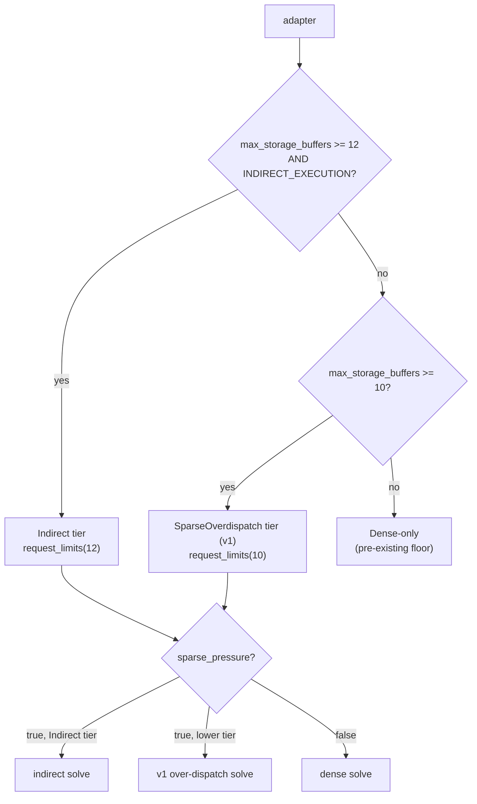
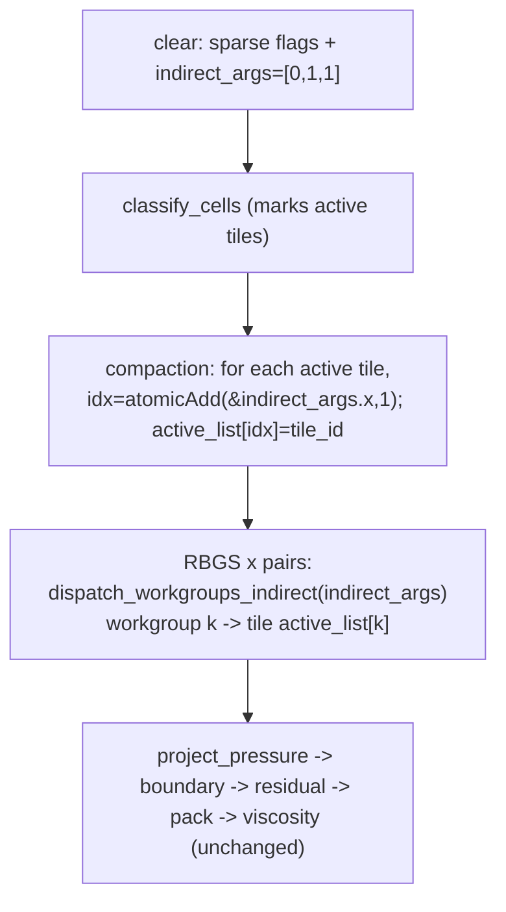

# perf: Indirect-dispatch sparse RBGS pressure solve (v2)

## Outcome — implemented, measured, reverted (2026-06-06)

U1–U5 were fully implemented and validated (compaction exact, equivalence within
the dense noise floor, ~106/11,600 tiles dispatched), but the indirect path was
**reverted** at the keep/exit gate. Clean same-session three-way on Apple M5 / Metal
(`pressure_solve`): dense 40.5 ms → v1-sparse 20.9 ms (1.93×) → indirect 19.3 ms
(only **~1.10×** over v1-sparse, far short of the ~2.2× the Pre-flight Gate projected).

Root cause, confirmed by A/B: the ~9.8 ms gap is **inherent per-`dispatch_workgroups_indirect`
overhead on the Metal+wgpu stack** (~1,800 indirect calls/frame), *not* wgpu's
`VALIDATION_INDIRECT_CALL` pass — disabling that flag recovered only ~2%. Indirect's
per-call overhead essentially trades places with v1-sparse's early-return overhead,
leaving a non-recoverable ~10% edge. Per the keep/exit criterion, ~10% does not justify
the third code path + tier machinery (capability gate, 12-buffer tier, second bind group,
compaction, dual pipeline layouts). v1-sparse (PR #18, 1.93× over dense) is the shipped
sparse path. The implementation lives on branch `perf/indirect-dispatch-pressure` for
reference; do not re-attempt indirect dispatch on this stack without new hardware/driver
evidence that per-call overhead has dropped.

---

## Summary

The v1 sparse pressure solve (PR #18) over-dispatches one workgroup per tile across **all** ~11,600 tiles and early-returns on the ~99% that are inactive. Measurement showed the solve is launch/occupancy-bound: center pour activates only ~1.1% of tiles yet the speedup is just 1.84× (a purely work-bound model predicts ~90×). v2 removes the launch overhead: a per-substep compaction pass builds a list of just the active tiles and an indirect-args buffer, and the RBGS sweeps dispatch **exactly the active-tile count** of workgroups via `dispatch_workgroups_indirect`. Indirect is capability-gated and falls back to the shipped v1 sparse path, then dense, on adapters that lack it.

---

## Problem Frame

v1's sparse RBGS (`crates/sim-wasm/src/mpm_3d/shader.rs`, `pressure_rbgs_red_sparse`/`pressure_rbgs_black_sparse`) is dispatched as `dispatch_workgroups(tile_count, 1, 1)` — ~11,600 workgroups per sweep, ~1,600–2,000 sweeps/frame. ~99% of those workgroups do a flag `atomicLoad` and return. The win v1 captured (1.84× on `pressure_solve`) came from skipping the per-cell stencil work and grid traffic of inactive regions, but it could not reduce the **launch count** — every sweep still schedules all 11,600 workgroups.

The U5 disambiguation in the v1 plan (`docs/plans/2026-06-06-001-perf-sparse-rbgs-pressure-solve-plan.md`) identified this as the remaining lever: ~1.1% active tiles → an indirect dispatch of ~131 workgroups instead of 11,600 should cut the residual launch/occupancy cost. The ~1.1% active fraction and 1.84× figures are the recorded center-pour measurements from PR #18 (the `sparse_active_tile_fraction_by_scene` test and the `COFFEE_SIM_PROFILE_SPARSE_PRESSURE` A/B). This plan implements that.

Caveat the plan takes seriously: "launch-bound" is an *inference* from low-fraction-but-small-speedup, not a measurement that isolates launch scheduling from GPU occupancy or memory latency. If the residual is occupancy/latency-bound, indirect dispatch recovers little and the v2 machinery is not worth it. The Pre-flight Gate below de-risks that attribution cheaply before any of U1–U5 is built.

---

## Pre-flight Gate (de-risk before building)

Before implementing U1–U5, run a cheap launch-isolation measurement — the v2 analogue of v1's baseline gate. Without building the indirect machinery, dispatch the **existing** v1 sparse red/black sweeps with an artificially reduced workgroup count (e.g., a temporary hack dispatching a fixed small count near the measured active-tile count instead of `tile_count`, accepting that the tile mapping is wrong — this measures launch cost only, not correct output) on the center-pour scene, and measure the `pressure_solve` delta vs the full `tile_count` dispatch.

- If shrinking the dispatch count alone moves `pressure_solve` materially → the launch-bound attribution holds; proceed to U1.
- If it barely moves → the residual is occupancy/memory-latency-bound (too few active workgroups to saturate the GPU, or grid traffic dominated); indirect dispatch will not help. Stop and reconsider before spending the capability gate, the 12-buffer raise, and the third code path.

This gate is a throwaway measurement, not shipped code. U1 depends on it clearing.

Account for the compaction's own cost in the projection: the compaction pass (U3) dispatches over all ~11,600 tiles once per substep (~10×/frame) to find the ~131 active. The net win is `(per-sweep launch savings × ~1,600–2,000 sweeps/frame) − (one full-tile compaction dispatch × ~10 substeps/frame)`. Compaction runs far fewer times than the sweeps, so it should be a small tax — but it must be measured (U5), and because compaction + clear land outside the `pressure_solve` timer, acceptance (R7) is judged on total `step_frame`, not `pressure_solve` alone.

---

## Requirements

Behavior

- R1. The indirect path dispatches exactly `active_tile_count` workgroups per RBGS sweep (read from the indirect-args buffer), each processing one active 4×4×4 tile — not `tile_count`.
- R2. Indirect results are equivalent to the dense and v1-sparse paths **within the sim's run-to-run noise floor** (the MPM step is nondeterministic run-to-run — see v1 plan; bit-exact equality is not testable).
- R5. Counter semantics: the indirect-args dispatch-X is initialized to 0 each substep; compaction appends each active tile via `idx = atomicAdd(&dispatch_x, 1u); active_list[idx] = tile_id`; the solve dispatches exactly `dispatch_x` workgroups (`y = z = 1`).
- R8. `MpmSettings.sparse_pressure` (default off) stays the user knob; the indirect-vs-over-dispatch-vs-dense choice is auto-selected from adapter capability, not a new user flag.

Capability & resources

- R3. Indirect runs only when the adapter supports `max_storage_buffers_per_shader_stage >= 12` AND `DownlevelFlags::INDIRECT_EXECUTION`. Otherwise the solve falls back to the v1 sparse over-dispatch path; if even that is unavailable, to dense. Device creation must never request limits/features the adapter lacks.
- R4. The indirect-args buffer is never bound as a writable storage resource during an indirect solve dispatch — only when written by the compaction pass. It carries `BufferUsages::INDIRECT`.
- R6. `required_limits()` requests 12 storage buffers on the indirect tier and 10 otherwise; the three `request_device` sites (`renderer.rs`, `profiler.rs`, `physics_tests.rs`) and the fit-within-limits invariant test are updated to the tier model.

Measurement

- R7. Measured on center pour: indirect vs v1-sparse vs dense `pressure_solve` and total `step_frame`. Indirect should reduce launch overhead and beat v1-sparse (target: meaningfully past 1.84× toward the work-bound ceiling). Recorded sparse-on (indirect) vs off, same machine.

---

## Key Technical Decisions

- KTD1. Three-tier, capability-gated, auto-selected. A `PressureTier` (Indirect / SparseOverdispatch / Dense) is resolved once from the adapter. `sparse_pressure=true` uses Indirect when the tier allows, else SparseOverdispatch (v1); `sparse_pressure=false` is Dense. The user knob stays a bool; the implementation tier is internal. Rationale: v1 sparse already wins (1.84×) wherever 10 buffers are available, so it is the natural fallback — indirect is pure acceleration on top.

- KTD2. Raise `required_limits` storage buffers 10 → 12 on the Indirect tier (per the buffer-budget decision). Gate the raise on the adapter: `pressure_tier(adapter)` checks `adapter.limits()` and `adapter.downlevel_capabilities().flags` before any site requests 12, so device creation can't fail. The 10-buffer SparseOverdispatch/Dense path is unchanged from v1.

- KTD3. Two new GPU resources for the Indirect tier:
  - `active_tile_list: array<u32>` (length `tile_count`) — the compacted active tile ids. Bound (read) by the indirect solve and (write) by the compaction pass. Placed in a **second bind group** so the solve can bind it without binding the indirect-args buffer.
  - `indirect_args` (`[x, y, z]` = 3×u32, `STORAGE | INDIRECT | COPY_DST`) — written by compaction, consumed by `dispatch_workgroups_indirect`. It is **not** part of any bind group bound during the solve dispatch (satisfies R4 / the WebGPU usage-scope rule that an INDIRECT buffer can't also be a writable storage binding in the same dispatch).

- KTD4. Per-substep pipeline on the Indirect tier: clear (sparse flags + `indirect_args` → `[0,1,1]`) → `classify_cells` (marks flags, as v1) → compaction (build `active_tile_list` + `indirect_args.x`) → for each pair, indirect red/black via `dispatch_workgroups_indirect`. Only the dispatch source and the clear/compaction passes differ from v1.

- KTD5. The indirect RBGS wrapper reuses v1's tile→cell mapping verbatim; the only change is the tile id source: `tile_id = active_tile_list[workgroup_id.x]` instead of `workgroup_id.x`, and the flag-gate / `tile_id >= tile_count` guard is dropped because the list contains only valid active tiles. Identical per-cell `pressure_update`, so the same equivalence argument as v1 holds.

- KTD6. Equivalence is verified as a **noise-floor** test (indirect-vs-dense divergence ≤ dense-vs-dense divergence), carried over from v1 — the pre-existing run-to-run nondeterminism makes bit-exact comparison ill-posed.

---

## High-Level Technical Design

Tier resolution (once, at device/sim setup):



Per-substep pressure phase, Indirect tier (only the marked passes differ from v1):



Buffer/usage shape (directional). `active_tile_list` is bound (group 1) during both compaction and solve; `indirect_args` is bound as writable storage **only** during compaction and is referenced as the indirect source — never bound — during the solve. The dense/v1 paths keep the single-group, 10-buffer layout.

---

## Implementation Units

### U1. PressureTier capability gate and tier-aware required_limits

- Goal: Resolve `PressureTier` from the adapter and make `required_limits` tier-dependent, so device creation requests 12 storage buffers only when the adapter supports indirect + 12, else 10.
- Requirements: R3, R6.
- Dependencies: the Pre-flight Gate must clear (launch-bound attribution confirmed).
- Files: `crates/sim-wasm/src/mpm_3d/mod.rs` (add `PressureTier` enum, `pressure_tier(&wgpu::Adapter)`, change `required_limits()` → `required_limits(tier)`, add a `tier` param to `MpmSim3D::new`); `crates/sim-wasm/src/renderer.rs` (resolve the tier from the adapter at device creation and store it on `Renderer` so it can be passed into the sim — the adapter is currently dropped after `new`, so a field must hold the resolved tier); `crates/sim-wasm/src/lib.rs` (pass the renderer's tier into `MpmSim3D::new`); `crates/sim-wasm/src/mpm_3d/profiler.rs`, `crates/sim-wasm/src/mpm_3d/physics_tests.rs` (compute tier from adapter before `request_device`, pass tier-aware limits and the tier into the sim); `crates/sim-wasm/src/mpm_3d/physics_tests.rs` (tier unit tests).
- Approach: `pressure_tier` checks `adapter.limits().max_storage_buffers_per_shader_stage >= 12` and `adapter.downlevel_capabilities().flags.contains(DownlevelFlags::INDIRECT_EXECUTION)` → Indirect; else `>= 10` → SparseOverdispatch; else Dense. The tier is resolved at device-creation time (where the adapter is in scope) and **passed into `MpmSim3D::new` as a parameter** — it cannot be derived from `device.limits()`, because `INDIRECT_EXECUTION` is an adapter downlevel flag, not a granted device limit, so a sim reading only `device.limits()` would mis-select Indirect on a 12-buffer adapter that lacks indirect and hit a validation error at `dispatch_workgroups_indirect`. Note on the browser backend: `downlevel_capabilities()` reports full compliance (indirect always "present"), so the browser is gated out of the Indirect tier by the 12-buffer check alone (the WebGPU spec baseline is 8). The wgpu 29.0.1 API names are confirmed to exist (`Adapter::downlevel_capabilities`, `DownlevelFlags::INDIRECT_EXECUTION`, `ComputePass::dispatch_workgroups_indirect`, `BufferUsages::INDIRECT`).
- Patterns to follow: existing `required_limits()` (`mod.rs`) and the three `request_device` call sites; the `pipelines_fit_within_required_limits` / `pipelines_exceed_spec_default_limits` tests (`physics_tests.rs`).
- Test scenarios:
  - On the test adapter, `pressure_tier` returns a tier consistent with its reported caps; `required_limits(Indirect).max_storage_buffers_per_shader_stage == 12` and `== 10` for the other tiers.
  - A forced/constructed lower-tier path requests 10 buffers and still builds the sim (no validation error).
  - `pipelines_fit_within_required_limits` updated: indirect-tier pipeline builds under `required_limits(Indirect)`; the 10-buffer path still builds under `required_limits(SparseOverdispatch)`.
  - Covers R3, R6.
- Verification: device creation succeeds on all reachable tiers; tier unit tests pass; `cargo clippy -p coffee-sim-wasm -- -D warnings` clean.

### U2. Active-tile-list + indirect-args buffers and tier-aware bind groups

- Goal: Allocate `active_tile_list` and `indirect_args` (Indirect tier only) and restructure pipeline/bind-group construction so the solve can read the list without binding the indirect-args buffer.
- Requirements: R4, R6.
- Dependencies: U1.
- Files: `crates/sim-wasm/src/mpm_3d/state.rs` (allocate the two buffers when tier is Indirect; `active_tile_list` length `tile_count`, `indirect_args` 3×u32 with `STORAGE|INDIRECT|COPY_DST`); `crates/sim-wasm/src/mpm_3d/pipelines.rs` (second bind group + layout for `active_tile_list`; keep `indirect_args` out of any group bound during the solve; tier-aware construction so the 10-buffer path is byte-for-byte the v1 layout).
- Approach: Add a `group(1)` holding `active_tile_list` (read_write storage), bound during compaction and the indirect solve. This requires **two distinct pipeline layouts**: the indirect/compaction pipelines use a `group(0)+group(1)` layout (and must `set_bind_group(1, ...)`), while every existing pipeline keeps the single-`group(0)` layout unchanged — that is what makes "non-Indirect layout byte-for-byte v1" true (today all pipelines share one layout via `make()`, so the split must be explicit). Keep `indirect_args` in neither group bound during the solve — it is written by the compaction pass (bound there as writable storage) and used only as the `dispatch_workgroups_indirect` source; it therefore needs its own small layout/group for compaction or a dedicated compaction pipeline layout, never appearing in a group bound during the solve dispatch. On non-Indirect tiers, neither buffer nor `group(1)` exists and the bind group/layout match v1 exactly.
- Patterns to follow: v1 `sparse_tiles` buffer allocation + binding (`state.rs`, `pipelines.rs`); `storage_entry` helper.
- Test scenarios:
  - Indirect-tier sim constructs without validation error; buffer sizes match (`active_tile_list` = `tile_count` u32; `indirect_args` = 3 u32).
  - The non-Indirect bind group/layout is unchanged from v1 (the dense/v1-sparse paths still build and run — guarded by the existing suite staying green).
  - Buffers allocated once (no per-frame allocation).
  - Covers R4, R6.
- Verification: indirect-tier pipelines build; existing dense/sparse suite green; clippy clean.

### U3. Compaction pass — build active-tile list + indirect args

- Goal: Add the per-substep compaction that fills `active_tile_list` and sets `indirect_args = [active_count, 1, 1]`, plus the per-substep init of `indirect_args` to `[0, 1, 1]`.
- Requirements: R1, R5.
- Dependencies: U2.
- Files: `crates/sim-wasm/src/mpm_3d/shader.rs` (compaction entry point + an `indirect_args` init, or fold the init into the existing clear); `crates/sim-wasm/src/mpm_3d/pipelines.rs` (compaction pipeline); `crates/sim-wasm/src/mpm_3d/physics_tests.rs` (compaction correctness test).
- Approach: Init writes `indirect_args = [0, 1, 1]` each substep (extend `sparse_tiles_clear` or a tiny dedicated pass). Compaction dispatches over `tile_count` threads; each thread reads its tile flag and, if active, `let i = atomicAdd(&indirect_args[0], 1u); active_tile_list[i] = tile_id`. After compaction, `indirect_args[0]` equals the active-tile count and `active_tile_list[0..count]` holds the active ids (order unspecified — fine, RBGS is order-independent across tiles).
- Patterns to follow: v1 `classify_cells` tile marking (`mark_tile_active`); v1 `sparse_tiles_clear`.
- Test scenarios:
  - Primary correctness guard (do NOT rely on the noise-floor equivalence for this): on a *turbulent* center-pour frame, the set of `active_tile_list[0..count]` ids exactly equals the set of set tile flags, and `indirect_args[0]` equals that count. A dropped/duplicated tile from an `atomicAdd` race or off-by-one is a set mismatch here — whereas it might stay within the noise-floor budget in U4, so this set assertion is the real guard against the compaction's most likely bug.
  - `indirect_args[0]` also matches the v1 `active_tile_count` telemetry.
  - `indirect_args[1] == 1 && indirect_args[2] == 1`.
  - Re-runs each substep: a tile that goes inactive is absent from the list next substep (init resets x to 0).
  - Empty case: a frame with no fluid yields `indirect_args[0] == 0` (indirect dispatch of 0 workgroups is a no-op).
  - Covers R1, R5.
- Verification: compaction test passes; `active_tile_list`/`indirect_args` readback matches flags.

### U4. Indirect RBGS dispatch + tier-gated wiring (production + profiler)

- Goal: Add the indirect sparse RBGS wrappers and wire `dispatch_workgroups_indirect` into both encode paths, selecting indirect / v1-sparse / dense by tier + `sparse_pressure`.
- Requirements: R1, R2, R7, R8.
- Dependencies: U3.
- Files: `crates/sim-wasm/src/mpm_3d/shader.rs` (`pressure_rbgs_red_indirect`/`black_indirect`: `tile_id = active_tile_list[workgroup_id.x]`, then the v1 tile→cell mapping + `pressure_update`); `crates/sim-wasm/src/mpm_3d/pipelines.rs` (two indirect pipelines); `crates/sim-wasm/src/mpm_3d/mod.rs` (step_frame: on Indirect tier + `sparse_pressure`, run compaction then `dispatch_workgroups_indirect(indirect_args, 0)` per sweep; else v1/dense branch); `crates/sim-wasm/src/mpm_3d/profiler.rs` (mirror the indirect encode; `COFFEE_SIM_PROFILE_SPARSE_PRESSURE=1` uses indirect when the tier allows).
- Approach: The indirect wrapper is v1's sparse wrapper minus the flag gate, with the tile id read from `active_tile_list`. Red/black stay interleaved in one pass; `dispatch_workgroups_indirect` reads `[x,y,z]` from `indirect_args`. `indirect_args` must not be in the bound group during these dispatches (enforced by U2's layout). The compaction + init passes run once per substep before the pairs.
- Patterns to follow: v1 `pressure_rbgs_sparse` (`shader.rs`); v1 dense-vs-sparse dispatch branch in `step_frame` (`mod.rs`) and `pressure_solve` pass (`profiler.rs`).
- Test scenarios:
  - Noise-floor equivalence: indirect-vs-dense per-particle divergence ≤ dense-vs-dense divergence (×~2 + slack) across early frames on center pour — same shape as the v1 `sparse_pressure_tracks_dense_within_nondeterminism` test.
  - Indirect-vs-v1-sparse: both sparse paths track each other within the noise floor (cross-check the two sparse implementations agree).
  - Production default stays dense (`sparse_pressure=false`); indirect only fires on `sparse_pressure=true` + Indirect tier.
  - Fallback (real, not just branch selection): construct a sim under `required_limits(SparseOverdispatch)` — a genuinely 10-buffer device created with reduced limits, not a 12-buffer device with the dispatch branch forced — and assert the pipelines build and `sparse_pressure=true` runs the v1 over-dispatch path tracking dense within noise. The override must drive `required_limits(tier)` into `request_device`, or the reduced-limit device path (the actual field failure case) never executes on the capable dev machine.
  - Covers R1, R2, R8.
- Verification: equivalence + fallback tests pass; production default dense; full suite green; clippy + fmt clean.

### U5. Measurement and acceptance (indirect vs v1-sparse vs dense)

- Goal: Record the launch-count reduction and the `pressure_solve`/`step_frame` deltas for indirect vs v1-sparse vs dense, to confirm v2 beats v1 and to settle the work-bound vs launch-bound question.
- Requirements: R7.
- Dependencies: U4.
- Files: `crates/sim-wasm/src/mpm_3d/physics_tests.rs` (a measurement test asserting the indirect dispatch count equals `active_tile_count`, far below `tile_count`); profiler runs recorded in the PR/commit.
- Approach: Assert `indirect_args[0]` (workgroups dispatched) equals the active-tile count and is ≪ `tile_count` (e.g., center pour ~131 vs 11,600). Run the profiler three ways on center pour — dense, v1-sparse (force SparseOverdispatch), indirect — and record `pressure_solve` + `step_frame`. Report whether indirect closes the gap toward the work-bound ceiling.
- Patterns to follow: v1 `sparse_active_tile_fraction_by_scene`; the profiler `COFFEE_SIM_PROFILE_SPARSE_PRESSURE` A/B.
- Test scenarios:
  - Dispatched workgroup count == active-tile count == set-flag count, and ≪ `tile_count` on center pour.
  - Test expectation for the perf assertion itself: diagnostic, not a hard CI gate (timing is environment-dependent); acceptance (R7) is read from the recorded numbers.
- Verification: dispatch-count assertion passes; three-way profiler numbers recorded; acceptance decision documented.

---

## Risks & Dependencies

- Bind-group restructuring regresses the v1/dense paths. Adding `group(1)` and tier-aware construction touches shared pipeline setup. Mitigation: the non-Indirect layout must remain byte-for-byte v1; the existing dense/sparse suite staying green is the guard (U2).
- Indirect-args usage-scope violation. If `indirect_args` is bound as storage during the solve, WebGPU rejects the dispatch. Mitigation: keep it out of every group bound during the solve (KTD3); the equivalence test would surface a validation failure immediately.
- Capability gate must be consistent across three device sites + tests. A site that requests 12 on an incapable adapter fails device creation. Mitigation: single `pressure_tier`/`required_limits(tier)`; each site computes the tier from the adapter first.
- Fallback tiers are hard to exercise on a capable machine. The M5 likely supports Indirect, so SparseOverdispatch/Dense fallback needs a test-only tier override to cover. Mitigation: U1/U4 fallback tests force a lower tier.
- Run-to-run nondeterminism (pre-existing). Equivalence stays noise-floor, not bit-exact (KTD6); the direct compaction-set assertion (U3) is the correctness guard the noise floor can't provide.
- Compaction global-atomic contention. The single `atomicAdd(&indirect_args.x, 1)` is now load-bearing for correctness (it drives the dispatch count), not just telemetry as in v1. At ~1.6% active tiles the contention is light (~hundreds of increments/substep), but a future high-fill scene could serialize it. Mitigation: U5 measures compaction time vs active-tile fraction; if it grows materially, switch to a workgroup-local prefix-sum compaction.
- Indirect-validation binding-slot competition. With native validation enabled, wgpu inserts an internal validation pipeline per `dispatch_workgroups_indirect` that binds its own resources. At the 12/12 storage-buffer ceiling this could push the device over the limit when the indirect path runs. Mitigation: confirm headroom on the target adapter, or disable indirect validation via `InstanceFlags` for the profiler/measurement run; surface as an open question for the profiler path.
- wgpu 29.0.1 API confirmed. `Adapter::downlevel_capabilities`, `DownlevelFlags::INDIRECT_EXECUTION`, `ComputePass::dispatch_workgroups_indirect`, `BufferUsages::INDIRECT` all exist; the usage-scope rule (INDIRECT + writable-storage in the same dispatch is rejected) is real, validating KTD3; a 0-workgroup indirect dispatch is a valid no-op. No remaining API unknown.

---

## Alternatives Considered

- Repack into the existing `sparse_tiles` buffer to stay at 10/10 (no limit raise). Rejected per the buffer-budget decision: the active-tile list could append to `sparse_tiles`, but the indirect-args buffer still needs separate INDIRECT handling, and the two-dedicated-buffer + limit-raise design is simpler to reason about. Trade-off accepted: narrower adapter compatibility, covered by the v1-sparse fallback.
- Indirect-args via buffer-to-buffer copy from `sparse_tiles[0]` instead of an `atomicAdd` compaction. Rejected: we need the compacted active-tile **list** regardless (the solve must map workgroup → tile id), and the `atomicAdd` builds the list and the count in one pass; a copy would only produce the count, still leaving the list to build.
- Skip v2, keep v1 only. Rejected by the request: v1 is launch-bound, and indirect is the identified lever toward the work-bound ceiling.

---

## Verification

Standard checks (per `AGENTS.md`):

```bash
cargo fmt --check
cargo clippy -p coffee-sim-wasm -- -D warnings
cargo test -p coffee-sim-wasm --lib
```

Profiler three-way comparison on center pour (dense / v1-sparse / indirect), recording `pressure_solve` and `step_frame`:

```bash
COFFEE_SIM_PROFILE_SPARSE_PRESSURE=0 cargo test -p coffee-sim-wasm --lib --release profile_mpm_pipeline -- --ignored --nocapture
COFFEE_SIM_PROFILE_SPARSE_PRESSURE=1 cargo test -p coffee-sim-wasm --lib --release profile_mpm_pipeline -- --ignored --nocapture
```

Acceptance (R7): the indirect path dispatches ~active-tile count workgroups (≪ `tile_count`) and improves `pressure_solve`/`step_frame` over v1-sparse on center pour, recorded on one machine.

---

## Scope Boundaries

In scope: the capability gate + tier model, the two new buffers + bind-group restructuring, the compaction pass, the indirect RBGS dispatch in both encode paths, and equivalence/compaction/measurement tests. The v1 over-dispatch sparse path stays as the capability-gated fallback.

### Keep / Exit Criterion

Two gates bound the investment, mirroring v1's baseline-first discipline:

- Before building: the Pre-flight Gate must show launch count materially drives `pressure_solve`. If not, do not build U1–U5.
- After U5: keep the indirect tier only if it improves total `step_frame` on center pour over v1-sparse by a meaningful margin (name the threshold at U5 from the Pre-flight numbers). If it does not clear the bar, revert U2–U4 and keep v1-sparse as the shipped sparse path — do not leave the third code path, the 12-buffer narrowing, and the second bind group as permanent dead weight by default.

### Deferred to Follow-Up Work

- Runtime dense/sparse fallback for any future high-fill scene (lagged `active_tile_count` readback) — independent of indirect dispatch; no realistic V60 scene currently exceeds ~1.6% active tiles.
- Fixing the pre-existing run-to-run nondeterminism (GPU race under turbulent flow) — separate correctness investigation, not perf.
- Browser/WebGPU-baseline support for the indirect tier (the 12-buffer requirement is above the spec baseline of 8; the v1-sparse and dense fallbacks cover non-indirect adapters).
- Sparsifying `classify_cells` / `project_pressure` / `pressure_residual` (kept full-grid).
