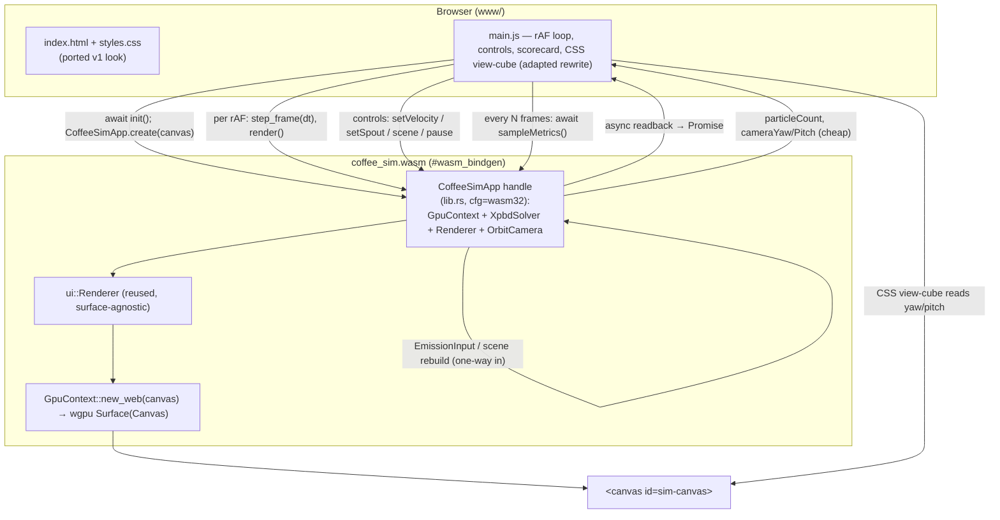
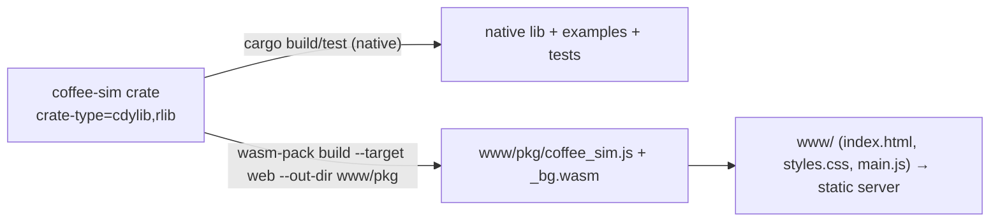

# feat: Web UI Port — Browser Build + v1 Frontend Look on the XPBD Rewrite

## Summary

Bring the **original v1 web UI's look** to the rewrite by standing up the rewrite's (currently
deferred) **wasm + WebGPU browser build** and porting the original web frontend to drive the new
XPBD solver. The rewrite is native-only today (`src/ui/` is winit + wgpu); the original is a
working browser app (`crates/sim-wasm/www-3d/` on the `main` branch) built on the **same wgpu 29.x
line** (the rewrite's `29.0.1` requirement currently resolves to 29.0.3), so the WebGPU/canvas
plumbing is a close template rather than a research project.

The work is a thin shell around code that already exists, not a rewrite of the renderer or solver:
- The rewrite's `ui::Renderer` is **surface-agnostic** (`render(target_view, particles, camera)` —
  no winit coupling) and already draws sphere-impostor particles. It is reused as-is.
- The browser owns the page, the controls, and the `requestAnimationFrame` loop (as v1 did); wasm
  is the **simulate + render core**. `winit` stays a native-only dependency.
- A `#[wasm_bindgen]` handle (`CoffeeSimApp`) owns a `GpuContext` + `XpbdSolver` + `ui::Renderer` +
  `OrbitCamera` **directly** (mirroring `examples/water_app.rs`, not `Simulator`, which doesn't
  expose the reset/scene/device/state access a web shell needs), and exposes a slimmed version of
  v1's `WasmSim3D` method set to JS.
- `www/index.html` + `styles.css` are ported near-verbatim for the look; `main.js` is an **adapted
  rewrite** (it strips v1's metrics-readback, debug panel, timeseries, evaluation hooks, and the
  bad `=10` storage-buffer preflight).

**Scope (the confirmed "core visible UI first" decision):** sidebar (pause/reset, scene buttons,
water-velocity slider, spout pad + height, Particles/FPS), the viewer canvas, the CSS view-cube,
the cross-section overlay frame, and a **brew scorecard** wired to the rewrite's real metrics
(extraction yield, TDS, evenness, drawdown time) **via a web-safe async readback** (the native
metrics path blocks the thread and cannot run on the browser main thread). The MPM-specific
debug-stats panel and the timeseries drawer are **deferred**.

---

## Problem Frame

`docs/ARCHITECTURE.md` §2 names a browser build (wasm + WebGPU) as the eventual reach goal but
deferred it "until the sim is in good shape." The XPBD primary solver is now substantially complete,
and the next block in the build order (§6) is `vis/scorecard`. The user wants the rewrite to **look
like the original web app**, whose look *is* an HTML/CSS web UI — so matching it means bringing the
deferred web build online and porting the frontend.

The original (`crates/sim-wasm/` on `main`, read via `git show main:<path>`) is the blueprint: a
`#[wasm_bindgen]` core (`lib.rs`/`renderer.rs`) that JS drives via `requestAnimationFrame`, a
canvas-backed `wgpu::Surface`, and a hand-written `www-3d/` frontend (no bundler; built with
`wasm-pack --target web`). Because it is the same wgpu 29 line, the surface/init code is a direct
template.

The mismatches to bridge: the original is **MPM** (its debug stats — projection residual, `div u`,
pressure pairs — don't exist in XPBD) and its scenes differ from the rewrite's `Scene`
constructors; and the rewrite's metrics path is **blocking** (fine natively, fatal on the browser
main thread). The core UI ports directly; the MPM-specific surfaces remap or defer; the metrics
path gets a web-safe async variant.

---

## Requirements

**Build & portability**
- R1. The crate builds for **both** native (`cargo build`/`cargo test`, unchanged) and
  `wasm32-unknown-unknown` (`wasm-pack build --target web`), sharing solver/renderer code via
  `cfg(target_arch)` gating. `winit`/`pollster` become native-only deps; wasm deps are web-only;
  winit-importing example targets are excluded from the wasm build.
- R2. The browser build targets **WebGPU** (not WebGL2), runs against `wgpu::Limits::default()`
  (WebGPU baseline, ≤ 8 storage buffers/stage), and **never raises the device storage-buffer
  limit** (v1's fatal web mistake — `project_v1_lessons`; the ported `main.js` must drop v1's
  `REQUIRED_STORAGE_BUFFERS_PER_SHADER_STAGE = 10` preflight).
- R3. Native behavior is unchanged: full `cargo test` green except the documented pre-existing
  reds; the native render path (which already uses `wgpu::CurrentSurfaceTexture`) is untouched.

**Browser core (wasm)**
- R4. A WebGPU surface is created from an HTML `<canvas>` and the adapter/device are requested
  **asynchronously** (no `pollster::block_on` on wasm; `wasm-bindgen-futures`). The per-frame
  surface acquire handles `CurrentSurfaceTexture` statuses (reconfigure on outdated/suboptimal,
  skip on timeout/occluded).
- R5. A `#[wasm_bindgen]` handle owning `GpuContext + XpbdSolver + Renderer + OrbitCamera`
  exposes: async construction from a canvas, `step_frame(dt)`, `render()`, `reset()`,
  `resize`/`resizeWithCssSize`, camera orbit/zoom/pan + yaw/pitch getters, scene loaders, the
  control setters below, and a particle-count getter — driving the solver **only** through
  `EmissionInput`/scene rebuild and reading back **only** canonical state (one-way data flow).
- R6. The scorecard metrics (extraction yield, TDS, evenness, drawdown time) are read **without
  blocking the main thread** — via an async GPU-readback path that resolves to JS (mirroring v1's
  `Promise`-returning `sampleMetrics`), sampled at a modest cadence; particle count (cheap, no
  readback) updates every frame.

**Controls & scenes (look the same)**
- R7. The **water-velocity (m/s) slider** and the **2D spout-position pad + height** drive the
  pour: `flow_rate_sim = π·nozzle_radius²·discharge_coeff·(speed_m_s · SIM_UNITS_PER_METER)` →
  `EmissionInput.flow_rate` (sim-volume/s; the solver internally derives exit speed as
  `flow / A_eff`); spout x/z/height → `EmissionInput.kettle_pos`.
- R8. Pause/Reset and the scene buttons work: **Center Pour → `Scene::v60_pour()`** (continuous
  pour via a `PourScript`), **Water Only → `Scene::dam_break()`**.

**Look**
- R9. The ported `index.html` + `styles.css` reproduce the original's core layout and theme
  (sidebar + viewer grid, panel styling, CSS view-cube driven by camera yaw/pitch, cross-section
  overlay frame) for the in-scope surfaces. The cross-section region is partial-parity at first
  (frame present, rendered image deferred — see Scope Boundaries).

---

## Key Technical Decisions

- KTD-1 — **Single crate, dual target via `crate-type = ["cdylib", "rlib"]` + cfg-gating.** No new
  crate — mirror v1's `["cdylib", "rlib"]` so the same crate produces the native lib/tests (`rlib`)
  and the browser `.wasm` (`cdylib`). `src/lib.rs` **already exists and exports the crate API** — it
  is *extended* with a `#[cfg(target_arch = "wasm32")]` wasm-bindgen module, not created.
  `winit`/`pollster` move under `[target.'cfg(not(target_arch = "wasm32"))'.dependencies]`; wasm
  deps (`wasm-bindgen`, `wasm-bindgen-futures`, `web-sys`, `js-sys`, `console_error_panic_hook`,
  `console_log`/`log`) go under the wasm-cfg target. The winit-importing **example targets**
  (`examples/water_app.rs`, etc.) must be excluded from the wasm build (per-`[[example]]`
  `required-features`, or simply never `--target wasm32` them). `cargo check --target
  wasm32-unknown-unknown` already passes today, so the lib core is wasm-clean; the build work is
  adding the exports + frontend, not unblocking compilation.
- KTD-2 — **Bypass winit on the web; JS owns the rAF loop.** winit-on-web only buys cross-platform
  input/window plumbing the JS frontend already owns. The browser holds the canvas, the rAF loop,
  resize, and DOM events, and calls wasm exports — exactly v1's shape. winit stays native-only.
- KTD-3 — **Reuse `ui::Renderer` unchanged; the web shell owns its surface.** `Renderer::render`
  takes a `TextureView` (surface-agnostic, no winit). The new GPU code is (a) a
  `GpuContext::new_web(canvas)` that builds the surface from `wgpu::SurfaceTarget::Canvas` and
  `.await`s adapter/device, and (b) a web frame-acquire in the handle that configures the surface
  from `surface.get_capabilities(&adapter)` (`Fifo`) and `match`es `CurrentSurfaceTexture`. The
  native acquire already uses the enum form (in `examples/water_app.rs`) — **no native reshape is
  needed**; the v1 `Renderer::new` async surface block is the template for the web path. Particle
  data stays GPU-side and never crosses to JS; the CSS view-cube reads only camera yaw/pitch.
- KTD-4 — **wgpu-29 web instance + version note.** `web_sys_unstable_apis` is **not** needed (wgpu
  29 vendors its WebGPU bindings). The web instance uses `Instance::new(InstanceDescriptor {
  backends: Backends::BROWSER_WEBGPU, ..new_without_display_handle() })` to force WebGPU.
  `Depth32Float` (the renderer's depth format) is WebGPU-baseline. Validate against the resolved
  wgpu (currently **29.0.3** under the `29.0.1` requirement), not an assumed 29.0.1 exact.
- KTD-5 — **The handle owns `GpuContext + XpbdSolver` directly, not `Simulator`.** `Simulator`
  privately owns its `GpuContext` and exposes only `step()` + `switch_solver()` — no reset, scene
  replacement, device access (needed for surface reconfigure), or state/particle access. So
  `CoffeeSimApp` mirrors `examples/water_app.rs`: it holds `GpuContext`, builds `XpbdSolver` per
  scene, calls `solver.step`/`particles`/`metrics`, and rebuilds the solver on scene change/reset.
  (Solver-switch is out of scope for this UI; if wanted later, extend `Simulator` instead.)
- KTD-6 — **Web-safe async metrics (the scorecard cannot use `sample_diagnostics`).** The native
  `sample_diagnostics()` refreshes yield/TDS/evenness/drawdown via a **blocking** readback
  (`map_async` + `device.poll(Wait)` + `recv()`) — on the browser main thread that hangs. The web
  scorecard instead uses an **async** readback: an exported method maps the metrics buffer with a
  callback and resolves a `Promise`/pending value the rAF loop reads a frame or two later (v1 did
  exactly this with `sampleMetrics(delay_frames) -> Promise`). Sample at a modest cadence (e.g.
  every N frames), not every frame. Particle count is cheap (no readback) and updates per frame.
- KTD-7 — **Preserve the m/s water-velocity control via an exact conversion.** Keep the slider's
  m/s label/feel; convert with `flow_rate_sim = π·nozzle_radius²·discharge_coeff·(speed_m_s ·
  SIM_UNITS_PER_METER)` → `EmissionInput.flow_rate`. This is the inverse of the solver's internal
  `exit_speed = flow / A_eff`, matching v1's exit-speed→flow mapping. `ML_PER_SIM_UNIT3` is used
  **only** for display/optional capping — not in the sim conversion. (Alternative — relabel to
  "Flow (mL/s)" — is the fallback if the conversion is awkward.)
- KTD-8 — **CSS view-cube, not the GPU gizmo, on web.** To match v1's look, drive the CSS
  `.view-cube` from `cameraYaw`/`cameraPitch` getters and **skip the GPU gizmo pass on web** so they
  don't double up. (`OrbitCamera` exposes `yaw`/`pitch`.)
- KTD-9 — **Build with `wasm-pack --target web` into `www/pkg/`; no bundler.** Matches v1: a plain
  ES-module `main.js` imports `./pkg/coffee_sim.js`; serve `www/` statically. A `navigator.gpu`
  preflight shows a fallback message instead of initializing when WebGPU is absent. `getrandom`'s
  `wasm_js` backend rustflag (`.cargo/config.toml`) is a **possible future guard** — wasm
  compilation passes without it today, so add it only if a wasm build error demands it.

---

## High-Level Technical Design

### Runtime architecture (browser)



### Build pipeline



Native and wasm share all solver/renderer/engine code; only the GpuContext init path, the surface
acquire, the metrics readback (blocking native vs async web), and the `winit` app shell differ by
`cfg`.

---

## Output Structure

```text
coffee-sim/
├── Cargo.toml                # + [lib] crate-type; deps split by target cfg; example wasm exclusion
├── .cargo/config.toml        # (only if needed) getrandom wasm_js rustflag
├── src/
│   ├── lib.rs                # EXTEND with #[cfg(wasm32)] CoffeeSimApp wasm-bindgen module
│   ├── utils/gpu.rs          # + new_web(canvas); async request() split (native still block_on)
│   └── ui/render.rs          # unchanged (already surface-agnostic + enum acquire in the shell)
└── www/                      # ported frontend (new; mirrors crates/sim-wasm/www-3d on main)
    ├── index.html            # core layout, ported near-verbatim
    ├── styles.css            # theme/layout, ported near-verbatim (debug/timeseries chrome removed)
    ├── main.js               # ADAPTED REWRITE: init, rAF loop, controls → new API, async scorecard
    └── pkg/                  # wasm-pack output (gitignored build artifact)
```

---

## Implementation Units

### U1. Dual-target build (cdylib + cfg-split deps + wasm-bindgen seam)

- **Goal:** Build the crate for `wasm32-unknown-unknown` alongside native, with deps split by target
  and a wasm-bindgen entry point stubbed in the existing `lib.rs`.
- **Requirements:** R1, R2.
- **Dependencies:** none.
- **Files:**
  - `Cargo.toml` — add `[lib] crate-type = ["cdylib", "rlib"]`; move `winit` + `pollster` under
    `[target.'cfg(not(target_arch = "wasm32"))'.dependencies]`; add
    `[target.'cfg(target_arch = "wasm32")'.dependencies]` (`wasm-bindgen`, `wasm-bindgen-futures`,
    `web-sys` with `HtmlCanvasElement`/`Window`/`Document`, `js-sys`, `console_error_panic_hook`,
    `console_log` + `log`); exclude winit-importing examples from the wasm build (per-`[[example]]`
    `required-features`, or document "examples are native-only, never `--target wasm32`").
  - `src/lib.rs` — **extend** (it exists, re-exporting the crate API): add
    `#[cfg(target_arch = "wasm32")] mod web;` and a trivial exported symbol + `set_once()` panic
    hook so the cdylib has an entry point (filled out in U3).
  - `.gitignore` — ignore `www/pkg/`.
- **Approach:** The lib core already `cargo check`s for wasm32, so this is additive: relocate the
  native-only deps, add the wasm deps, and seam in the web module. `getrandom`'s `wasm_js` rustflag
  is deferred to a `.cargo/config.toml` only if a real wasm build error appears (KTD-9).
- **Patterns to follow:** v1 `crates/sim-wasm/Cargo.toml` (`git show main:crates/sim-wasm/Cargo.toml`)
  — same wasm dep set + `crate-type`.
- **Test scenarios:**
  - Covers R1. *Native build/tests unaffected:* `cargo build`, `cargo build --tests`, `cargo build
    --examples` succeed (deps merely relocated under a cfg).
  - Covers R1. *Wasm lib + exports link:* `cargo build --target wasm32-unknown-unknown` (lib only)
    and `wasm-pack build --target web` compile with the stub handle; winit examples are not built
    for wasm.
  - Test expectation: none beyond the build gates (scaffolding unit, no behavior).

### U2. GpuContext web surface + async init + web frame acquire

- **Goal:** Create the WebGPU surface from a canvas, request adapter/device asynchronously, and
  provide a web frame-acquire/config path — without disturbing native.
- **Requirements:** R3, R4.
- **Dependencies:** U1.
- **Files:**
  - `src/utils/gpu.rs` — factor adapter/device acquisition into an `async fn request(...)` shared
    by both targets; native `new_headless`/`new_windowed` keep wrapping it in `pollster::block_on`
    (unchanged); add `#[cfg(target_arch = "wasm32")] pub async fn new_web(canvas:
    web_sys::HtmlCanvasElement) -> GpuContext` using `Instance::new(BROWSER_WEBGPU)` +
    `create_surface(SurfaceTarget::Canvas(canvas))` + `.await`. Keep `wgpu::Limits::default()` (R2);
    request no optional features on web (so `timestamps_supported` is false → no timestamp resources
    are constructed at runtime).
  - The web surface acquire/config helper lives with the handle (U3) but the capabilities-based
    config + `CurrentSurfaceTexture` match pattern is specified here.
- **Approach:** The async split is the documented porting seam (`gpu.rs` already notes
  `pollster::block_on` is the only native-specific step). v1's `Renderer::new`
  (`git show main:crates/sim-wasm/src/renderer.rs`) is the verbatim template (same wgpu 29). Native
  acquire is already enum-based in `examples/water_app.rs` — leave it.
- **Patterns to follow:** `GpuContext::from_adapter`/`new_headless`; v1 `Renderer::new`;
  `examples/water_app.rs` surface acquire (enum form).
- **Test scenarios:**
  - Covers R3. *Native init unchanged:* existing GPU-gated tests (e.g. `tests/xpbd_water.rs`,
    `tests/render_smoke.rs`) still build and pass — `request` extraction is behavior-preserving.
  - Covers R2. *Limits guard:* a native unit test asserts the shared device descriptor uses
    `Limits::default()` (no raised storage-buffer limit — pins the v1 trap).
  - Covers R4. *Web init compiles:* `new_web` + the acquire helper compile for wasm32 (runtime
    verified in the browser smoke, U5).

### U3. The `CoffeeSimApp` wasm-bindgen handle (GpuContext + XpbdSolver direct)

- **Goal:** Expose the solver + renderer + camera to JS with v1's method shape, owning the GPU
  pieces directly so reset/scene-rebuild/render all work; preserve one-way data flow.
- **Requirements:** R5, R7, R8.
- **Dependencies:** U2.
- **Files:**
  - `src/lib.rs` / `src/web.rs` (`#[cfg(target_arch = "wasm32")]`) — `#[wasm_bindgen]` struct
    `CoffeeSimApp { gpu: GpuContext, solver: XpbdSolver, renderer: ui::Renderer, camera: OrbitCamera,
    surface + config, scene/materials/config, pour: PourScript, control state, sim_time }`. Methods
    (JS `js_name`): `create(canvas) async`, `reset`, `step_frame(dt)` (build `EmissionInput` from
    control state → `solver.step`), `render()` (acquire frame via the U2 helper →
    `renderer.render`, skip the gizmo pass), `resize`/`resize_with_css_size`,
    `orbit/zoom/pan_camera`, `camera_yaw`/`camera_pitch`, scene loaders (`load_center_pour` →
    `Scene::v60_pour()` rebuild + center `PourScript`; `load_water_only` → `Scene::dam_break()`
    rebuild), control setters (`set_water_velocity_m_s` → flow via KTD-7; `set_spout_position` →
    `kettle_pos`) + getters, `particle_count`.
  - `src/emission/` or a small `src/web` helper — the **velocity→flow** and **spout-pad→kettle_pos**
    conversions as plain (non-wasm) Rust fns so they unit-test natively.
- **Approach:** Mirror `examples/water_app.rs` ownership (`GpuContext` + `XpbdSolver`, rebuild on
  scene change) and v1's `WasmSim3D` `js_name`s (`git show main:crates/sim-wasm/src/lib.rs`) so
  `main.js` ports with minimal renaming. Reset/scene-load rebuild the solver (`XpbdSolver::build`) —
  RAII handles, no explicit GPU teardown — rather than calling a Simulator API that doesn't exist
  (KTD-5); **scene-load/reset also re-frames the camera + resets control defaults** for the new
  scene's bounds. Never write solver state from JS (R5).
- **Patterns to follow:** `examples/water_app.rs` + `examples/pour.rs` (solver ownership +
  `EmissionInput` from a `PourScript`); v1 `WasmSim3D`; `src/emission/{mod.rs,pour.rs}`.
- **Test scenarios:**
  - Covers R7. *Velocity→flow conversion (native unit test):* `π·r²·discharge·(v·SIM_UNITS_PER_METER)`
    yields the expected `flow_rate` for known inputs; monotone; zero at v=0; does **not** apply
    `ML_PER_SIM_UNIT3`. Round-trips against the solver's internal `exit_speed = flow / A_eff`.
  - Covers R7. *Spout-pad mapping:* normalized pad (u,v) → `kettle_pos` x/z within the V60 box;
    height → `kettle_pos.y`; boundaries clamp.
  - Covers R8. *Scene selection:* `load_center_pour`/`load_water_only` rebuild the expected `Scene`
    + pour config (assert on the chosen scene/PourScript, no GPU needed).
  - Covers R5. *Particle count getter:* returns the solver's active count; no readback/blocking.
  - Covers R5. *One-way data flow:* code structure + review — JS-facing setters only mutate control
    state or rebuild scenes; no direct solver-state writes.

### U4. Web-safe async metrics (scorecard data path)

- **Goal:** Feed the scorecard yield/TDS/evenness/drawdown to JS without blocking the main thread.
- **Requirements:** R6.
- **Dependencies:** U3.
- **Files:**
  - `src/lib.rs` / `src/web.rs` — an exported async metrics method (`sample_metrics() -> Promise`
    or an `async fn` that wasm-bindgen turns into a Promise) that triggers the GPU readback with
    `map_async` + a callback (no `device.poll(Wait)`/`recv()`), then resolves a JS object with
    `extraction_yield`/`tds`/`evenness`/`drawdown_time`. The rAF loop calls it every N frames and
    updates the scorecard when it resolves.
  - `src/solvers/xpbd/mod.rs` — note there is **no single "metrics buffer"**: yield/TDS/evenness/
    drawdown are computed CPU-side from `chem`/`pos`/`vel`/`phase` readbacks inside
    `sample_diagnostics()`. **Factor that CPU metric computation into a shared helper** used by both
    the native blocking path and the web async path (so the numbers can't drift). The web path
    snapshots those buffers via `map_async` (no `device.poll(Wait)`/`recv()`), then runs the shared
    helper. Clone the `Arc<Device>/Arc<Queue>` + buffer handles and copy the metadata the helper
    needs so the returned `Promise` does not hold `&mut CoffeeSimApp` across the `.await`. Keep
    `sample_diagnostics()` itself out of any wasm-facing path.
- **Approach:** Mirror v1's async `sampleMetrics(delay_frames) -> js_sys::Promise` /
  `waterDiagnostics()` (`git show main:crates/sim-wasm/src/lib.rs`): on web, GPU readback is
  inherently async (the browser drives polling; `Maintain::Wait` does not block). Avoid overlapping
  readbacks on one reusable buffer — snapshot per request, or gate so only one sampling is in flight
  at a time. Keep the native `sample_diagnostics()` blocking path for tests/native unchanged.
- **Patterns to follow:** v1 `sampleMetrics`/`waterDiagnostics` async readback; the existing
  `sample_diagnostics()` buffer/readback in `src/solvers/xpbd/mod.rs` (the source of yield/TDS/
  evenness/drawdown).
- **Test scenarios:**
  - Covers R6. *No blocking call on web (review/structure):* the web metrics path uses
    `map_async` + callback and never calls `device.poll(Wait)`/`recv()` on the main thread.
  - Covers R6. *Metric values match the native source:* a native test confirms the values the web
    path would surface equal those `sample_diagnostics()` computes for the same state (the readback
    differs, the numbers don't).
  - *Cadence:* sampling every N frames does not stall the rAF loop (browser smoke, U5).

### U5. Frontend port (`www/` chrome + adapted main.js + build)

- **Goal:** Port the original core UI's HTML/CSS so the rewrite looks the same, rewrite `main.js` to
  drive the new handle (incl. the async scorecard), and build with `wasm-pack`.
- **Requirements:** R8, R9, R2 (drop the `=10` preflight).
- **Dependencies:** U3, U4.
- **Files:**
  - `www/index.html` (new) — port the core DOM from `git show
    main:crates/sim-wasm/www-3d/index.html`: `main.layout` (sidebar + viewer), `#toggle`/`#reset`,
    the **main** scene panel (`#scene-center-pour`, `#scene-free-stream` = "Water Only"),
    water-velocity slider, spout pad + height, `.stats` (Particles/FPS), the **scorecard** rows
    (yield/TDS/evenness/drawdown), `#sim-canvas`, `.cross-section-overlay`, `.view-cube`. **Omit**
    `#scene-panel-debug`, `#debug-stats`, `#timeseries-drawer`.
  - `www/styles.css` (new) — port the in-scope styles + theme tokens (`--sidebar-width`, panel/ink/
    accent colors, serif font, mobile breakpoint); drop styles for omitted panels.
  - `www/main.js` (new — **adapted rewrite**, not a copy) — `import init, { CoffeeSimApp } from
    "./pkg/coffee_sim.js"`; `navigator.gpu` preflight; `await init()` → `CoffeeSimApp.create(canvas)`;
    rAF loop (`step_frame(1/60)`, `render()`, `updateViewCube()` from yaw/pitch, `updateFps()`, and
    an every-N-frames `await sampleMetrics()` updating the scorecard); wire each control (pause flag,
    reset, scenes, water-velocity, spout pad/height, canvas orbit/zoom/pan, DPR-aware resize).
    **Strip** v1's metrics-readback wiring, `#debug-stats`/timeseries/evaluation code, and the
    `REQUIRED_STORAGE_BUFFERS_PER_SHADER_STAGE = 10` preflight (R2).
  - Build: `wasm-pack build --target web --out-dir www/pkg --release` (documented; `pkg/` gitignored).
- **Approach:** `index.html`/`styles.css` are near-verbatim for the look; `main.js` keeps v1's loop
  + control-wiring + CSS view-cube structure but is reconstructed against the new (smaller) API and
  the async scorecard. The cross-section overlay ships as the **CSS frame/label only** (the render
  pass is deferred — Scope Boundaries; explicitly partial-parity there).
- **Patterns to follow:** the three v1 `www-3d/` files (structure, rAF loop, `updateViewCube`,
  control handlers, DPR resize), minus the stripped couplings.
- **Test scenarios:**
  - Covers R9. *Visual parity (manual, WebGPU browser):* sidebar+viewer layout, theme, view-cube,
    cross-section frame match v1 side-by-side for the in-scope surfaces.
  - Covers R8. *Controls drive the sim (manual):* pause/reset; Center Pour/Water Only switch scenes;
    velocity slider changes the stream; spout pad/height move the pour; orbit/zoom/pan + view-cube
    tracking work.
  - Covers R6. *Scorecard (manual):* Particles + FPS update every frame; yield/TDS/evenness/drawdown
    update at the sample cadence without stutter.
  - Covers R2. *No 10-buffer preflight:* the ported `main.js` contains no storage-buffer-limit
    preflight; the app runs against baseline limits.
  - *WebGPU-absent fallback:* with `navigator.gpu` undefined, the preflight shows a message and does
    not `init()`.
  - Test expectation: web verification is **manual in a WebGPU browser** (no headless WebGPU in CI);
    `wasm-pack build` success + the U1–U4 native unit tests cover the automatable surface.

---

## Alternatives Considered

- **Native UI (egui/custom).** Faster, but cannot match the original's HTML/CSS look and diverges
  from the web goal. Rejected.
- **winit-on-web** (`spawn_app`). Viable in winit 0.30, but adds an abstraction between JS and the
  render core when JS already owns the page. Rejected (KTD-2); winit stays native-only.
- **`CoffeeSimApp { sim: Simulator }`.** Cleaner conceptually, but `Simulator` exposes only
  `step()`/`switch_solver()` and privately owns its `GpuContext` — no reset, scene-replace, device,
  or state access. Using `GpuContext + XpbdSolver` directly (KTD-5, mirroring `water_app`) is what
  actually compiles and gives the handle the access it needs. Extending `Simulator` is a larger,
  unneeded change for a single-solver UI.
- **Blocking metrics on web (reuse `sample_diagnostics`).** Rejected — it `device.poll(Wait)`s on
  the main thread and hangs the browser; the async readback (KTD-6) is mandatory.
- **Port v1's `renderer.rs`.** The rewrite's `ui::Renderer` is already surface-agnostic and within
  the 8-buffer budget; reuse (KTD-3) avoids duplicating it and re-introducing v1's render-buffer
  layout.
- **Relabel the velocity slider to "Flow (mL/s)."** Simpler, but changes the visible control; kept
  the m/s label via the exact conversion (KTD-7), with relabel as the fallback.

---

## Scope Boundaries

**In scope:** the dual-target build, the canvas surface + async init + web frame acquire, the
`CoffeeSimApp` handle (GpuContext + XpbdSolver direct), the web-safe async metrics path, and the
**core visible frontend** (sidebar controls, viewer, CSS view-cube, cross-section overlay frame,
brew scorecard wired to real XPBD metrics), built with `wasm-pack --target web`.

### Deferred to Follow-Up Work
- **MPM debug-stats panel** (`#debug-stats`, ~40 rows). Most have no XPBD analogue; an XPBD-specific
  debug panel can come later.
- **Timeseries charts drawer** (`#timeseries-drawer`) — needs a JS charting layer + sampling cadence.
- **Cross-section render pass.** The CSS overlay frame ships now; the actual GPU cross-section
  viewport (a second render pipeline with a clip plane, which v1 had and the rewrite's `Renderer`
  lacks) is deferred. **Explicit partial-parity:** the cross-section region shows the frame but not
  the rendered cross-section image until this lands.
- **Debug-scene grid** (13 MPM debug scenes) — no rewrite analogue.
- **Concentration→color and screen-space fluid** rendering (`vis.md` phase 3) — separate `vis` work.
- **Solver-switch UI** — single solver for now; would mean extending `Simulator`.

### Outside this phase
- **Device-scaling** — deferred in `ARCHITECTURE.md` §2; not needed for a first browser build.
- **Browser performance profiling** — deferred (`PERF_NOTES.md`); timestamp queries are native-only.
- **Deployment/hosting / CI wasm build** — local `wasm-pack` + static server only.

---

## Risks & Dependencies

- **Async GPU readback on web (the biggest correctness risk).** The native metrics path blocks; the
  web path must be genuinely async. *Mitigation:* KTD-6 / U4 — `map_async` + callback resolving a
  Promise (v1's proven pattern), sampled at a cadence; native `sample_diagnostics()` untouched.
- **8-storage-buffer ceiling (v1's fatal web mistake).** *Mitigation:* the rewrite already pins
  `Limits::default()` on native (over-budget passes fail on the dev machine); the ported `main.js`
  drops v1's `=10` preflight (R2); never raise the device limit.
- **`Simulator` API gap.** Designing the handle on `Simulator` would not compile. *Mitigation:*
  KTD-5 — own `GpuContext + XpbdSolver` directly (mirror `water_app`).
- **Example targets + native-only winit.** Moving winit to native-only could break `--target wasm32`
  if examples are pulled in. *Mitigation:* exclude examples from the wasm build (U1); native build
  keeps them.
- **wasm toolchain version match** (wasm-bindgen ↔ CLI). *Mitigation:* use `wasm-pack` (pins the
  matching CLI) (KTD-9). `getrandom wasm_js` is a possible future guard, not a current blocker —
  wasm32 check passes today; add the rustflag only if a build error appears.
- **wgpu version drift.** Repo resolves wgpu **29.0.3** under `29.0.1`. *Mitigation:* validate web
  APIs against the resolved version (KTD-4), not assumed 29.0.1.
- **Cross-section partial-parity.** The region won't fully "look the same" until the render pass
  lands. *Mitigation:* explicit caveat in Scope + R9; ships the frame now.
- **No headless WebGPU in CI.** *Mitigation:* push logic to native-testable Rust (velocity→flow,
  spout mapping, scene selection, metric-value equivalence); frontend is manual browser smoke; keep
  the native suite green (R3).

**Verification gates (AGENTS.md):** `cargo fmt --check`; `cargo clippy --all-targets -- -D warnings`
(native); `cargo test` (native, no new failures beyond the documented pre-existing reds);
`cargo build --target wasm32-unknown-unknown` (lib) + `wasm-pack build --target web` succeed; manual
WebGPU-browser smoke. Stay within `wgpu::Limits::default()` / 8 storage buffers.

---

## Sources & Research

- **Original v1 frontend (the blueprint), on `main`:** `crates/sim-wasm/Cargo.toml` (wasm dep set +
  `crate-type`, wgpu 29 line), `crates/sim-wasm/src/lib.rs` (the `WasmSim3D` API to mirror — incl.
  the async `sampleMetrics`/`waterDiagnostics` Promise pattern, KTD-6),
  `crates/sim-wasm/src/renderer.rs` (canvas→surface async template),
  `crates/sim-wasm/www-3d/{index.html,styles.css,main.js}` (look + rAF loop + control wiring; note
  the `=10` preflight to strip). Read via `git show main:<path>`.
- **Rewrite reusable surfaces:** `src/ui/render.rs` (surface-agnostic `render(target_view,…)`,
  `Depth32Float`), `src/ui/camera.rs` (`OrbitCamera` yaw/pitch), `src/engine/simulator.rs` (the
  `step()`/`switch_solver()`-only API that drove KTD-5), `src/engine/scene.rs`
  (`Scene::v60_pour`/`dam_break`), `src/engine/state.rs` (`Metrics`), `src/solvers/xpbd/mod.rs`
  (`metrics()` cached + `sample_diagnostics()` **blocking** readback — KTD-6; `exit_speed = flow /
  A_eff` — KTD-7), `src/emission/{mod.rs,pour.rs}` (`EmissionInput`, `PourScript`),
  `src/utils/config.rs` (`nozzle_radius`/`discharge_coeff`), `src/utils/gpu.rs` (the
  `pollster::block_on` async seams), `examples/water_app.rs` (the ownership pattern the handle
  mirrors), `KEEP.md` (`SIM_UNITS_PER_METER`, `ML_PER_SIM_UNIT3`).
- **External research (load-bearing — shaped KTD-1/2/3/4/9):** wgpu 29 (`CurrentSurfaceTexture`
  enum — already in the native shell; `InstanceDescriptor::new_without_display_handle()` +
  `Backends::BROWSER_WEBGPU`; `web_sys_unstable_apis` not required), `SurfaceTarget::Canvas`, winit
  0.30 web (`spawn_app`, bypassed), `wasm-pack --target web`, WebGPU Baseline across major browsers
  (Jan 2026), `Depth32Float` baseline, timestamp-query native-only.
- **Codex cross-review** (`.deliberate/codex_review_webui.md`, REVISE): folded in — `lib.rs` exists
  (extend, U1); the `get_current_texture` reshape is already native (KTD-3, no native-reshape unit);
  the handle must own `GpuContext + XpbdSolver` not `Simulator` (KTD-5); the scorecard needs a
  web-safe async readback, not blocking `sample_diagnostics` (KTD-6/U4); the exact velocity→flow
  formula (KTD-7); build blockers overstated — wasm32 check already passes, `getrandom` is a future
  guard (KTD-1/9); `main.js` is an adapted rewrite, not near-verbatim (U5); wgpu resolves to 29.0.3
  (KTD-4); cross-section partial-parity made explicit (Scope/R9).
- **Learnings:** `project_v1_lessons` (8-buffer ceiling; never raise the device limit), `gpu.rs`
  doc comments (async-init seam), `AGENTS.md` (one-way data flow; WASM/WebGPU portability is a goal;
  `Limits::default()`), `docs/ARCHITECTURE.md` §2 (web build deferred but planned), `docs/plans/vis.md`.
