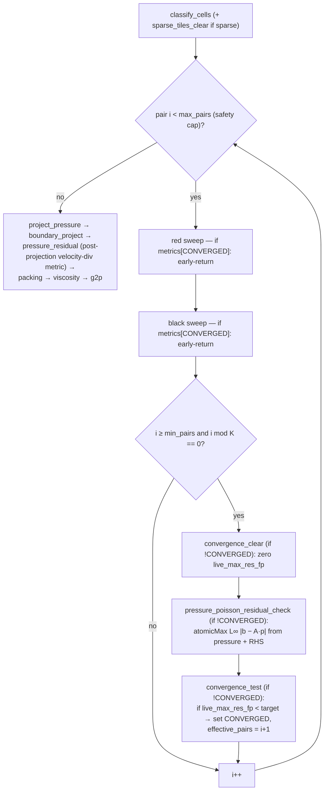

# feat: Target-converged RBGS pressure solve (adaptive iterations for incompressibility realism)

> **DEFERRED (2026-06-07).** Codex review found that the realism ceiling is set by a discrete
> operator inconsistency (compact stride-1 solve vs central stride-2 projection), not by the
> iteration count — so adaptive iterations cannot deliver the realism goal until that is fixed.
> The fix is planned in `docs/plans/2026-06-07-002-feat-staggered-mac-pressure-projection-plan.md`
> (staggered MAC grid). Once operators are consistent, the in-loop residual genuinely tracks
> post-projection divergence and this plan layers cleanly on top. Resume after 002 lands.

## Summary

The MPM pressure projection runs a **fixed** number of red/black Gauss-Seidel (RBGS) sweeps
every substep (`for _ in 0..pressure_pairs`, `crates/sim-wasm/src/mpm_3d/mod.rs:1663`), tuned
per scene to 40–100. A fixed count is the wrong control variable for a solver: steady frames
*over*-iterate, and hard transients — the pour stream hitting the surface, splashes, sudden
displacement — end **under-converged**, leaving residual divergence that reads as
compressibility, jitter, and lopsided surfaces. The per-scene counts exist *only* because
there is no convergence criterion to iterate against.

This plan makes the solve **target-converged**: each substep iterates the RBGS loop until the
worst-cell (L∞) **algebraic Poisson residual** drops below a single, physically-motivated
target — i.e. uniform incompressibility quality on *every* substep — with `max_pairs` as a
generous safety cap that should fire only on pathological frames. **The goal is realism, not
performance:** hard frames converge properly instead of capping under-resolved; steady frames
stop once they hit the same quality bar. The iteration count becomes a diagnostic *output*,
not a tuning *input*.

Early exit is realized with a **GPU convergence flag** — periodic residual probes set a flag
each RBGS sweep (and each probe) reads at its top and early-returns on — so there is **no
mid-solve CPU readback** (no pipeline stall) and **no indirect dispatch** (a reverted
dead-end on this stack). Early exit is what makes a high safety cap affordable: easy frames
stop early, only hard frames climb toward the cap.

Ships **default-on**: this is a fidelity improvement we want everywhere. Physics tests that
assert the old fixed-count behavior are re-baselined to the new target-converged behavior.

---

## Problem Frame

**Today.** Pressure projection records a fixed `pressure_pairs` red/black sweeps into one
command encoder / one compute pass and submits the frame as a batch (no mid-solve readback by
design). `pressure_residual` runs **once** after `project_pressure` and writes the
post-projection **velocity-divergence** L∞/mean into the `metrics` buffer (`shader.rs:1998`).
Per-scene counts (`mod.rs:361-485`) range 40–100; one carries the telling comment that
free-water pools "need tighter projection convergence" — a per-scene *quality* need expressed,
for lack of a better lever, as an iteration count.

**The realism gap.** A fixed count cannot guarantee a convergence *quality*. Whatever count
is tuned for the steady state is too few when divergence spikes (pour impact, splash), so
those substeps leave incompressibility error that manifests visually. Raising the fixed count
to cover the worst case would over-iterate every calm frame and still be a guess.

**The fix.** Replace "iterate N times" with "iterate until the L∞ Poisson residual ≤ target,
capped at `max_pairs`." The target is a single physical quality bar; `max_pairs` is a runaway
guard. Because the algebraic Poisson residual `r = b − A·p` is **proportional to the
post-projection velocity divergence** (projection sets `u ← u* − dt·∇p`, so the leftover
`∇·u ∝ (b − A·p)`), the in-loop probe is a pre-correction predictor of the *actual*
incompressibility error — the realism quantity — which is what makes a target on it physically
meaningful, not merely a linear-algebra stopping rule.

**Mechanism constraints (institutional learnings).** Keep the solve in one encoder / one
compute pass. Early exit must be GPU-side: **no mid-solve CPU readback** (stalls the pipeline),
**no indirect dispatch** (implemented and reverted on this stack — ~10% gain, per-call
overhead; do not re-attempt). And **no new GPU storage-buffer binding** — the shader already
binds 10 storage buffers vs WebGPU's 8-per-stage default, so convergence state must reuse the
already-bound `metrics` buffer.

---

## Requirements

- **R1.** Each substep iterates RBGS until the L∞ algebraic Poisson residual over fluid cells
  is `< pressure_residual_target`, or until `max_pairs` is reached, with a small `min_pairs`
  floor before the first convergence check.
- **R2.** Early exit is GPU-side via a convergence flag in the `metrics` buffer — **no
  mid-solve CPU readback, no indirect dispatch**. (This is the enabler for a high safety cap.)
- **R3.** Convergence is gated on the **L∞ (max single-cell) algebraic Poisson residual**
  `|b − A·p|` computed from the *current pressure field* and stored RHS — **not** the
  post-projection velocity divergence the existing `pressure_residual` measures, and not the
  mean.
- **R4.** The **residual target is the single physical quality knob.** Convergence quality is
  uniform across substeps (every substep reaches the target, or the safety cap). The target is
  calibrated so steady-state frames are no worse than today and hard transients improve.
- **R5.** `max_pairs` is a **uniform, generous safety cap** (runaway guard), not a per-scene
  tuning knob. The per-scene fixed-iteration tuning is removed in favor of the target (with an
  optional per-scene target override for scenes that genuinely need tighter convergence, e.g.
  free-water pools).
- **R6.** The effective number of pairs executed per substep is observable as a **diagnostic**
  via the `metrics` buffer (the control loop does not depend on a per-frame readback).
- **R7.** No new GPU storage-buffer binding (reuse `metrics`).
- **R8.** The probe residual provably shrinks across RBGS sweeps and tracks the post-projection
  velocity divergence; a regression test demonstrates both (guarding against re-introducing the
  velocity-divergence-in-loop mistake, which would stay ~flat during the solve).
- **R9.** Ships **default-on**; physics tests are re-baselined to the target-converged
  behavior, and incompressibility / mass-conservation invariants hold at least as well as today.

---

## Key Technical Decisions

**KTD-1 — Target-driven, not count-driven.** The control variable is `pressure_residual_target`
(an L∞ Poisson-residual threshold); the loop iterates to it. `max_pairs` is a uniform safety
cap; `min_pairs` a small floor. The per-scene iteration counts (`mod.rs:361-485`) are removed —
they were a proxy for the missing convergence criterion. Rationale: a fixed count cannot
guarantee quality; a target does, and makes the iteration count an emergent diagnostic.

**KTD-2 — L∞ algebraic Poisson residual is the criterion, and it is physically meaningful.**
Convergence is `max_i |b_i − (A·p)_i| < target` over fluid cells, where `A·p` is the 7-point
Laplacian stencil on the *current pressure* and `b` is the stored RHS (`dx²·rhs`) — the residual
of the system `pressure_update` (`shader.rs:1837`) relaxes. Because this residual is
proportional to the post-projection velocity divergence (Problem Frame), the target maps
directly onto the *actual incompressibility error*. L∞ (not mean) because a single
high-residual cell is exactly what produces a visible artifact.

**KTD-3 — GPU convergence flag for early exit (no readback, no indirect dispatch).** A periodic
probe sets `metrics[CONVERGED]`; each RBGS sweep and each probe reads it at kernel top and
returns. Rationale: the only within-substep early-exit that honors the no-readback design and
the reverted-indirect-dispatch lesson. Early exit is the *enabler* — it makes a generous
`max_pairs` affordable, so calm frames don't pay for the headroom that hard frames need.

**KTD-4 — Encode up to `max_pairs`; rely on the GPU flag; no CPU predictor.** The loop encodes
`max_pairs` red/black pairs and the flag early-outs the unneeded tail. There is **no CPU
iteration predictor** — it would only have served a dispatch-count *performance* optimization,
it is not needed for realism, and its data path is broken anyway (`latest_metrics` is only ever
`default()`, `mod.rs:851/877/1763` — Codex round 1). Cost note: hard frames legitimately cost
more than today (more iterations), bounded by `max_pairs`; this is the accepted price of
converging them (see R-B). Per-dispatch overhead past convergence is paid but the expensive
stencil memory traffic is skipped via the flag.

**KTD-5 — Convergence state reuses the `metrics` buffer; all slot-count sites move together.**
Extend `METRICS_SLOT_COUNT` with `live_max_res_fp`, `converged_flag`, `effective_pairs`. The
count is duplicated as a Rust const (`state.rs:24`) **and** a WGSL const (`shader.rs:2912`),
and drives the `metrics_wg` dispatch width (`mod.rs:1599`) — all three must change in lockstep
(Codex round 1). Rationale: no new binding (8-buffer limit); `metrics` is already bound, atomic,
and cleared per substep.

**KTD-6 — 3-dispatch probe inside the pass; ordering is sound; all probe kernels honor the
flag.** Per check: (1) `convergence_clear` (1 thread) zeroes `live_max_res_fp`;
(2) `pressure_poisson_residual_check` (cell-dispatch) `atomicMax`es L∞ |residual| over fluid
cells; (3) `convergence_test` (1 thread) sets `converged_flag` + records the effective pair
index if below target. **All three early-return when the flag is set** (else a later probe
rescans and clobbers `effective_pairs` — Codex round 1). `clear_buffer` cannot run inside a
compute pass, so the per-check reset is a tiny GPU clear; the reduce-then-test split avoids an
intra-dispatch race. **Ordering (Codex round 1, confirmed):** correctness comes from
record-order execution + wgpu per-dispatch usage-scope barrier drains over the exclusive
read-write `metrics` buffer — not from atomics creating pass-wide ordering. The flag can only
affect commands recorded *after* the probe, which is the intended semantics. Probe runs every
`K` pairs from `min_pairs`, so its cost is `K`-amortized.

---

## High-Level Technical Design

One substep's pressure projection, target-converged. Directional — not implementation spec.

Convergence state (all in the existing `metrics` storage buffer; no new binding):

| Slot (new) | Writer | Reader | Reset |
| --- | --- | --- | --- |
| `live_max_res_fp` (Poisson residual) | `pressure_poisson_residual_check` (atomicMax) | `convergence_test` | `convergence_clear` each probe |
| `converged_flag` | `convergence_test` | RBGS sweeps + all probe kernels (early-out), CPU diag | `metrics_clear` (substep start) |
| `effective_pairs` (diagnostic) | `convergence_test` | CPU diagnostics | `metrics_clear` (substep start) |

The probe residual `live_max_res_fp` predicts the end-of-substep `pressure_residual`
velocity-divergence metric (they are proportional) — useful as a cross-check in tests.

---

## Implementation Units

### U1. Target-driven settings, uniforms, and removal of per-scene iteration tuning

**Goal:** Make the residual target the control knob; introduce the safety cap + floor; retire
per-scene iteration counts; default-on.

**Requirements:** R1, R4, R5, R9.

**Dependencies:** none.

**Files:**
- `crates/sim-wasm/src/mpm_3d/mod.rs` (MpmSettings: keep `pressure_residual_target` as the
  primary knob, default it to a physically-motivated positive L∞ value (default-on); add
  `pressure_rbgs_min_pairs` (small floor) and `pressure_residual_check_interval` (K); repurpose
  `pressure_rbgs_max_pairs` as the uniform safety cap with one generous default; **remove the
  per-scene `settings.pressure_rbgs_pairs = N` assignments at `:361-485`**, replacing the lone
  "needs tighter convergence" case with a per-scene `pressure_residual_target` override)
- `crates/sim-wasm/src/mpm_3d/state.rs` (MpmUniforms: add `pressure_adapt` vec4 `[target, min_pairs, max_pairs, check_interval]`, preserving `#[repr(C)]` vec4 alignment)
- `crates/sim-wasm/src/mpm_3d/mod.rs` (`write_uniforms`: populate the new field)
- `crates/sim-wasm/src/mpm_3d/shader.rs` (uniform accessors, mirroring `dt()`/`dx()`)

**Approach:** `set_pressure_residual_adaptation` stays the override entry point but is no longer
the only way to enable adaptation (default-on). Defaults: `target` ← a strict, physically
motivated L∞ Poisson-residual value (calibration task — see R-A; express it via the
post-projection-divergence equivalence so it has physical units); `max_pairs` ← one generous
uniform cap (e.g. ~2–3× the old max of 100); `min_pairs` ← small (e.g. 4–8); `K` ← e.g. 8.
Document the physical meaning of each default inline. `pressure_rbgs_pairs` may remain as a
legacy field feeding `min_pairs`/back-compat or be removed — decide during implementation.

**Patterns to follow:** existing `fluid_params`/`fp_params` vec4 packing; the per-scene
settings match arms (now setting targets, not counts).

**Test scenarios:**
- Defaults: a fresh solver has `target > 0`, `min_pairs ≤ max_pairs`, `K ≥ 1`.
- Per-scene override: the free-water-pool scene gets a tighter `target` than the default.
- Removed tuning: no scene sets a fixed iteration count any more (the iteration count is now an output).
- Uniform round-trip: the packed `pressure_adapt` reaches the shader accessors with expected values.

**Verification:** `cargo test -p coffee-sim-wasm --lib` settings/uniform tests pass.

---

### U2. GPU convergence state in the `metrics` buffer (no new binding)

**Goal:** Carve convergence slots out of `metrics`; keep all slot-count sites in sync.

**Requirements:** R2, R6, R7.

**Dependencies:** none (parallel to U1).

**Files:**
- `crates/sim-wasm/src/mpm_3d/state.rs` (extend `METRICS_SLOT_COUNT` (`:24`); add `METRIC_LIVE_MAX_RES_IDX`, `METRIC_CONVERGED_FLAG_IDX`, `METRIC_EFFECTIVE_PAIRS_IDX`; resize the metrics buffer allocation; doc the layout)
- `crates/sim-wasm/src/mpm_3d/shader.rs` (**update the hardcoded `const METRICS_SLOT_COUNT: u32 = 12u;` at `:2912`** to match the Rust const — two independent constants, Codex round 1)
- `crates/sim-wasm/src/mpm_3d/mod.rs` (`metrics_wg` width derived from the count at `:1599` — confirm it covers the larger count; decode new slots near `:221-235`; expose `effective_pairs`/`converged` on the metrics struct)

**Approach:** All three slot-count sites — Rust const (`state.rs:24`), WGSL const
(`shader.rs:2912`), `metrics_wg` (`mod.rs:1599`) — change in lockstep. New slots are zeroed by
`metrics_clear` at substep start; `live_max_res_fp` is additionally re-zeroed per probe by
`convergence_clear` (U3).

**Test scenarios:**
- `metrics_clear` zeroes the new slots (dispatch width covers extended count).
- Buffer size == `METRICS_SLOT_COUNT * 4` bytes; decode maps slots correctly.

**Verification:** existing residual-metrics test (`physics_tests.rs:2541`) still passes with the
enlarged buffer; new-slot decode asserted.

---

### U3. Convergence-probe shaders + early-out in RBGS sweeps

**Goal:** Add the 3-dispatch probe (algebraic Poisson residual) and make every sweep + probe
honor the convergence flag.

**Requirements:** R2, R3, R8.

**Dependencies:** U2 (slots), U1 (uniform target/accessors).

**Files:**
- `crates/sim-wasm/src/mpm_3d/shader.rs`:
  - `convergence_clear` (1-thread): `if !converged { atomicStore(live_max_res_fp, 0) }`
  - `pressure_poisson_residual_check` (cell-dispatch): for fluid cells, compute the **algebraic Poisson residual** `r_i = pressure_sum_neighbors − dx²·rhs − neighbor_count·p_i` using the **same stencil/weights/BCs as `pressure_update` (`:1786-1838`)** on the current pressure + stored RHS, then `atomicMax(live_max_res_fp, fp(|r_i|))`. Guard with `if converged { return; }`. **Does NOT reuse `velocity_divergence_with_solid_mirrors`** (that is post-projection velocity divergence — wrong/flat in-loop).
  - `convergence_test` (1-thread): `if !converged && live_max_res_fp < fp(target)` → set `converged_flag`, record effective pair index
  - early-out: `if atomicLoad(converged_flag) != 0 { return; }` at the top of `pressure_rbgs_red`, `pressure_rbgs_black`, `pressure_rbgs_sparse` (`:1841-1899`), **and all three probe kernels**
- `crates/sim-wasm/src/mpm_3d/pipelines.rs` (create 3 pipelines alongside `pressure_residual`/`pressure_rbgs_*` at `:17-22, 186-191`)

**Approach:** Factor the stencil out of `pressure_update` into a shared helper so the check
reuses identical neighbor classification / face weights / BC handling and computes the
*residual* rather than the relaxed value (any drift would make the convergence test lie — R-F).
Pick/define a fixed-point scale sized to the residual magnitude (the existing
`metrics_div_fp_scale()` is divergence-scaled; the residual may need its own). The early-out
read is one `atomicLoad` per invocation — cheap vs the 7-point stencil it guards.

**Patterns to follow:** `pressure_update` stencil (`:1766-1839`); `pressure_residual` fp
encoding/atomics; `make(...)` pipeline construction; sparse/dense parity in `pressure_rbgs_sparse`.

**Test scenarios:**
- Stencil parity: probe per-cell residual equals `neighbor_count·p_i − (pressure_sum − dx²·rhs)` for the same cell (matches `pressure_update`).
- Residual shrinks (R8): max |residual| decreases across successive red/black pairs on a seeded non-converged field — proves it's a real convergence signal (velocity divergence would stay ~flat in-loop).
- Tracks physical error (R8): the probe's L∞ residual correlates with the post-projection `pressure_residual` velocity divergence on the same state.
- L∞ correctness: one high-residual cell dominates `live_max_res_fp` (max, not mean).
- Flag set/unset vs target; `convergence_test` records the correct effective pair index.
- Early-out: with the flag pre-set, a red+black sweep AND a probe are no-ops (`effective_pairs` untouched).
- Sparse parity: dense and sparse early-out paths produce identical pressure fields.

**Verification:** shaders compile (pipeline-creation asserts, cf. `mod.rs:2294`); seeded-grid unit tests pass.

---

### U4. Target-converged dispatch loop + diagnostics

**Goal:** Rewrite the solve loop to iterate to the target (capped at `max_pairs`), interleave
the probe, let the GPU flag early-out, and surface the effective count.

**Requirements:** R1, R2, R6.

**Dependencies:** U1, U2, U3.

**Files:**
- `crates/sim-wasm/src/mpm_3d/mod.rs`:
  - the encode loop (`:1663-1682`): `for i in 0..max_pairs`, and every `K` pairs past `min_pairs` emit `convergence_clear` → `pressure_poisson_residual_check` → `convergence_test`; keep the final `project_pressure` / `boundary_project` / `pressure_residual` tail
  - surface the GPU-reported `effective_pairs` (metrics slot) wherever metrics are already read (profiler/diagnostics); keep `last_pressure_rbgs_pairs()` for compatibility (reporting the cap or the diagnostic effective count)
  - **no CPU predictor / no per-frame readback** (KTD-4)

**Approach:** The loop is bounded by the safety cap; the GPU flag stops real work once the
target is met. The probe writes `live_max_res_fp`; the final post-loop `pressure_residual`
writes the persistent velocity-divergence slots — distinct slots, no collision.

**Patterns to follow:** existing single-encoder/single-pass dispatch structure;
`last_pressure_rbgs_pairs` write sites (`:850, 876, 1588, 1762`); the profiler's metrics readback.

**Test scenarios:**
- Converges to target: on a settled scene, `effective_pairs < max_pairs` and the final post-projection residual is at/under the target-equivalent bound.
- Hard frame uses more: a disturbed/transient scene uses more pairs than a calm one (the realism mechanism), still bounded by `max_pairs`.
- Safety cap respected: a pathological scene reports `effective_pairs == max_pairs` and never exceeds it.
- Floor respected: `effective_pairs ≥ min_pairs`.
- Determinism: identical `effective_pairs` trajectories across two runs of the same seeded scene.

**Verification:** `cargo test -p coffee-sim-wasm --lib` green; convergence/cap/floor assertions hold.

---

### U5. Realism regression suite + physics re-baseline

**Goal:** Prove the solve reaches uniform target quality, hard frames improve, and physics
invariants hold; re-baseline tests that asserted the old fixed-count behavior.

**Requirements:** R3, R4, R8, R9.

**Dependencies:** U4.

**Execution note:** Characterize first — run the existing pressure/projection tests under the
new default to separate legitimate improvements from regressions.

**Files:**
- `crates/sim-wasm/src/mpm_3d/physics_tests.rs` (re-baseline `pressure_projection_residual_metrics_track_post_projection_cells` (`:2541`) and the settled-surface test (`:2363-2404`) to the target-converged behavior; add the cases below; reuse the helper at `:2590`)

**Approach:** Re-baseline = "behavior legitimately improved/uniform-ized"; a regression = "the
target default is wrong" (fix the target in U1, do not loosen the test). The L∞ Poisson-residual
target is the lever.

**Test scenarios:**
- Uniform quality (R4): across a window of substeps, the post-projection L∞ velocity divergence stays at/under the target-equivalent bound every substep (no under-converged outliers like today's hard frames).
- Hard transient improves (R4): on a pour-impact / disturbance scene, post-projection divergence is **lower** than the old fixed-count solve at the same moment (the realism win), and `effective_pairs` rose to achieve it.
- Steady not worse (R9): on a calm scene, post-projection divergence is no worse than today (target calibrated to steady-state quality).
- Probe is a real signal (R8): the in-loop L∞ Poisson residual decreases across sweeps and correlates with post-projection divergence (guards the velocity-divergence mistake).
- Mass conservation: total fluid mass over N frames conserved to existing tolerance.
- Safety cap only on pathological frames: under default settings, normal scenes do not routinely hit `max_pairs` (else the cap is masking a too-loose target or too-low cap).

**Verification:** full `cargo test -p coffee-sim-wasm --lib` green; no pre-existing unrelated red checks newly broken.

---

## Scope Boundaries

**In scope:** the MPM pressure-projection RBGS loop (dense + sparse), its settings/uniforms,
the convergence-probe shaders, the dispatch loop, and the physics tests that assert
pressure/projection behavior.

**Not in scope (true non-goals):**
- p2g/g2p, grid_update, viscosity, packing, boundary projection — untouched except at the loop boundary.
- The XPBD rewrite branch's constraint-iteration adaptation (separate solver/branch).
- Changing the RBGS update math, divergence/RHS formulation, or the sparse-tile scheme beyond the flag early-out and the shared-stencil refactor.
- **Performance optimization.** This is a realism feature; any speedups are incidental, not a goal (see R-B). The CPU dispatch-trimming predictor is explicitly excluded.

### Deferred to Follow-Up Work
- **Per-scene target calibration sweep** — measure the converged L∞ residual / acceptable
  incompressibility error per scene; set the global default + any per-scene overrides, ideally
  via the headless profiler.
- **Worst-case frame-time guard** — if hard frames hitting a high `max_pairs` cause objectionable
  hitching, consider amortizing the work; out of scope here (realism first).
- **Adaptive `K`** (probe more often near convergence) — only if probe cost matters.
- **Exposing target/cap to the web UI / config** — once defaults are proven.

---

## Risks & Mitigations

- **R-A: Target mis-calibration.** Too loose → realism doesn't improve / artifacts persist; too
  tight → the safety cap fires often and frames hitch. *Mitigation:* express the target via the
  post-projection-divergence equivalence so it has physical meaning; calibrate to steady-state
  quality (steady frames unchanged, hard frames improve); L∞ bounds worst-cell error; U5's
  "steady not worse" + "hard transient improves" + "cap only on pathological" tests bracket it.
- **R-B: Hard frames cost more (accepted, but monitor).** Converging transients properly means
  more iterations than today; the safety cap bounds it, but a high cap on a pathological frame
  can hitch. *Mitigation:* this is the intended realism/cost trade; keep the cap generous-but-finite,
  watch worst-case frame time, defer any amortization (Scope). Early exit keeps the *typical*
  frame from paying the headroom.
- **R-C: Probe overhead.** 3 extra dispatches every `K` pairs run on every frame. *Mitigation:*
  `K`-amortize; ensure probe cost is small vs a red/black sweep; the flag also early-outs probes.
- **R-D: `metrics` slot contention** between `live_max_res_fp` (Poisson residual) and the
  persistent end-of-substep velocity-divergence residual. *Mitigation:* distinct slots (U2);
  `convergence_clear` resets only the live slot; `metrics_clear` owns substep-start reset.
- **R-E: Slot-count desync** across the Rust const, WGSL const, and `metrics_wg` width.
  *Mitigation:* U2 changes all three in lockstep + a buffer-size assertion.
- **R-F: Probe residual ≠ update stencil → false quality guarantee.** If the probe's stencil
  drifts from `pressure_update`'s, the target is enforced on the wrong system. *Mitigation:*
  shared stencil helper (U3); the "stencil parity" + "residual shrinks" tests (R8) are the guards.
- **R-G: Removing per-scene counts regresses a scene that needed more convergence.** *Mitigation:*
  per-scene `pressure_residual_target` override (R5) preserves the free-water-pool "tighter
  convergence" intent as a *quality* setting; U5 "steady not worse" covers each scene.

---

## Open Questions (resolved / deferred)

- **Purpose** → resolved: incompressibility **realism** (uniform per-substep quality; hard-frame
  fidelity), **not** performance.
- **Control model** → resolved: target-driven; residual target is the knob, `max_pairs` is a
  safety cap, per-scene iteration counts removed (KTD-1).
- **Convergence quantity** → resolved: L∞ algebraic Poisson residual, proportional to
  post-projection divergence (KTD-2; Codex round 1 correction).
- **Early-exit mechanism** → resolved: GPU convergence flag, no readback, no indirect dispatch (KTD-3).
- **Default posture** → resolved: default-on (realism feature), tests re-baselined.
- **CPU predictor / per-frame readback** → resolved: excluded (perf-only; data path broken anyway).
- **Exact `target`, `min_pairs`, `max_pairs`, `K` values** → deferred to implementation/calibration
  (U1 ships physically-motivated defaults; tuning is follow-up).

---

## Sources & Research

External research **skipped** — internal GPU-solver work with strong local patterns and known
constraints captured as institutional learnings:

- **8-storage-buffer limit:** 10 buffers already bound → convergence state reuses `metrics`
  (KTD-5, R7).
- **Indirect dispatch reverted:** rules out indirect early-exit → GPU-flag design (KTD-3).
- Code anchors: `mod.rs:1663` (loop), `mod.rs:361-485` (per-scene counts being removed),
  `shader.rs:1766-1839` (`pressure_update` — the system being solved), `shader.rs:1998`
  (`pressure_residual` — post-projection velocity divergence), `state.rs:24` + `shader.rs:2912`
  (the two metrics slot-count constants).

**Codex cross-validation (round 1) — verdict REJECT on the prior (perf-framed) draft; findings
verified and folded in (some superseded by the realism re-scope):**
- In-loop probe must use the **algebraic Poisson residual**, not the velocity-divergence
  `pressure_residual` (RBGS only writes pressure; velocities change only at `project_pressure`).
  → KTD-2, U3. **Kept — central to the realism guarantee.**
- WGSL/Rust `METRICS_SLOT_COUNT` are independent constants; guard probe kernels (not just sweeps).
  → KTD-5, U2, U3. **Kept.**
- Dispatch ordering sound via record-order + usage-scope barrier drains (not atomics). → KTD-6.
  **Kept (confirmation).**
- `latest_metrics` never populated from readback; perf claim under-specified; default-on
  unjustified *for a perf feature*. → **Superseded:** the feature is realism, not perf, so the
  CPU predictor/readback is dropped entirely (KTD-4) and default-on is justified by fidelity, not
  a profiled speedup (R9). A round-2 review should re-evaluate against the realism framing.
