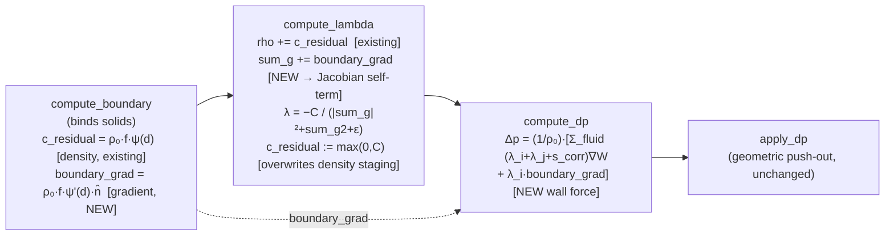

# fix: PBF solid-wall pressure force (structural anti-climb boundary condition)

## Summary

Water climbs and sticks to confining solid walls (the V60 cup/cone) in a thin sheet above the bulk pool surface. The root cause is in the PBF density/pressure constraint (`src/solvers/xpbd/water.wgsl`): the engine already treats a solid wall as contributing **virtual density** (`compute_boundary` stages `ρ₀·f_i·boundary_psi(d,h)`, the analytic poly6 kernel-mass occluded by the wall, which `compute_lambda` adds to `rho` — added originally to stop floor over-packing eruptions), but the wall contributes **no force**: the constraint gradient (`sum_g`/`sum_g2`) and the position correction (`compute_dp`) sum over fluid neighbors only. So a near-wall over-pressured column has no wall-normal pressure to balance it and relieves itself *up* the unblocked wall direction; the geometric `apply_dp` push-out then pins the climbed particles to the surface. A heuristic in `finalize` (`v.y = 0` for upward-moving water at a wall) currently masks the symptom.

This plan completes the boundary condition (Akinci 2012, analytic via the SDF — no boundary particles): add the analytic boundary **gradient** `g_b = ρ₀·f_i·ψ'(d)·n̂` to the constraint Jacobian and apply `λ_i·g_b` as a wall-normal pressure force in `compute_dp`. The wall then exerts a real pressure that balances the near-wall fluid → hydrostatic equilibrium → no climb. The `v.y=0` heuristic is then removed and its coverage replaced by a structural no-climb gate.

The boundary gradient is computed once per iteration in the existing cheap `compute_boundary` pass (which already evaluates the SDF) and staged into a new persistent scratch buffer the two hot density kernels read (**Route B**). This takes `compute_lambda` and `compute_dp` from 8 → 9 storage buffers per stage — within the project's real 16-buffer device limit.

---

## Problem Frame

**Symptom (observed in the V60 water-only scene under an active pour):** a thin layer of water creeps up the cup wall and persists above the bulk pool surface. Headless probe (radius-bin: wall water at `r≈3` vs bulk pool): baseline wall water reached `y ≈ −3.16` (above the cup rim at `−3.5`) while the pool sat ~3–4 units lower. The wall layer *accumulates* over time and recedes when the pour stops — i.e., a real climbing/sticking artifact, not a transient splash.

**Root cause (confirmed by reading the solver):**
- `compute_boundary` → `c_residual[i] = ρ₀·f_i·boundary_psi(d,h)`; `compute_lambda` does `rho += c_residual[i]`. The wall's **density** is accounted for (near-wall `C_i` reads correctly; this term prevents floor over-packing eruptions).
- `compute_lambda`'s constraint gradient `sum_g = Σ_fluid m_j·∇W` and `compute_dp`'s correction `Δp_i = (1/ρ₀)·Σ_fluid (λ_i+λ_j+s_corr)·∇W` have **no boundary term**. The wall exerts no pressure force in the solve.
- Result: over-dense near-wall fluid (`C_i>0`, `λ_i<0`) relieves along `Σ_fluid ∇W`, which — with no wall-side neighbor and no wall force — points up the wall. `apply_dp`'s geometric push-out pins the result to the surface; `finalize`'s wall response cancels the *radial* velocity but Coulomb friction `∝ |v_n|` is ~0 for a slider, so nothing returns it. The heuristic `v.y=0` only kills the resulting upward velocity after the position damage is done.

**Why a heuristic is the wrong fix:** the artifact is position-driven by the pressure solve. Velocity post-processing in `finalize` is too late and doesn't address the missing physics (the wall should push back).

**Current baseline note:** the `v.y=0` heuristic and the `Scene::v60_pour_water_only` scene used by the new gate are **currently uncommitted** in the working tree (added this session alongside the water↔grain coupling re-grounding). This plan removes the heuristic (U5) and reuses that scene (U6); both are the baseline this plan builds on.

---

## Requirements

- **R1.** The solid wall exerts a wall-normal **pressure force** in the PBF density/pressure solve, consistent with the existing density term (same `boundary_psi`, same `f_i` weighting, same `num_solids` gate, water-only).
- **R2.** Water no longer forms a climbing/sticking sheet above the pool surface on a confining wall (cup/cone), under an active pour and at rest.
- **R3.** The `finalize` `v.y=0` no-upward-wall-slip heuristic is **removed**; its coverage is replaced by a structural no-climb verification gate.
- **R4.** The existing boundary **density** compensation (floor over-packing / eruption prevention) is **preserved** — the force term is added alongside it, not in place of it.
- **R5.** AABB-only scenes (`num_solids == 0`) stay **byte-unchanged**; compression-only λ (`lambda_noncohesive`) preserved; the term is **water-only** (matches `compute_boundary`'s `PHASE_WATER` guard — grains keep their standoff + repose-friction wall handling).
- **R6.** Stays within the project's **16** storage-buffers-per-stage device limit and remains browser-portable (wgpu 29 / Tint); the requested device limit must actually be granted (headless adapter + target browsers).
- **R7.** No new instability: water incompressibility, long-run no-eruption, cone settling, V60 drainage, coupling, and wetting conservation all still hold.

---

## Key Technical Decisions

- **KTD-1 — Route B (stage the gradient from `compute_boundary`) over Route A (bind `solids` into the hot kernels).** `compute_lambda` and `compute_dp` are the two heaviest per-iteration kernels (they run `min..max` iters every substep). `compute_boundary` already runs once per iteration alongside them and already evaluates the SDF (`solid_union`) once per particle. Route B reuses that single SDF eval and stages the gradient; Route A would pay a fresh `solid_union` per particle *inside* both hot density loops. Chosen: **B** (user-confirmed). Cost: one persistent scratch buffer.
- **KTD-2 — Dedicated `boundary_grad` buffer, not packed into `c_residual`.** `c_residual` is double-purposed today: `compute_boundary` stages the boundary *density* there, `compute_lambda` reads it then **overwrites** it with the convergence residual (`max(0,c)`) for `residual_reduce`. Since `compute_dp` runs after `compute_lambda`, the gradient cannot ride in `c_residual` (it would be clobbered before `compute_dp` reads it). The gradient needs a buffer that survives the `compute_lambda → compute_dp` sequence → a new buffer. Keep the existing `c_residual` density-staging flow unchanged (minimal change); a future consolidation (carry both density and gradient in one vec4, freeing `c_residual`'s double duty) is deferred.
- **KTD-3 — The storage-buffer limit is 16, not 8.** `compute_lambda` and `compute_dp` are already at exactly 8 storage buffers (`pred, lambda, c_residual|dp, cell_start, sorted_indices, status, phase, alpha_s`); adding `boundary_grad` makes them 9. The project's real per-stage device limit is **16** (the long-standing "WebGPU baseline = 8, never exceed" assumption was over-conservative for this project's deployment target). The device must request and be granted `max_storage_buffers_per_shader_stage = 16`; 9 sits comfortably inside it. Verify the grant on the headless adapter and confirm in a target browser (no headless WebGPU in CI). Other compute passes already bind `solids` (`buoyancy_grain`, `apply_dp`, `apply_drag_pred`), so the device tolerates solids in compute passes.
- **KTD-4 — Analytic SDF boundary force (no boundary particles).** Mirror the existing analytic density term. The gradient is the spatial derivative of the staged density contribution: `g_b = ρ₀·f_i·ψ'(d)·n̂`, with `n̂ = hit.grad` (SDF gradient, points into the fluid) and `ψ'(d) = dψ/dd = −(315/256)·(1−t²)⁴/h`, `t = d/h` — the closed-form derivative of `boundary_psi` (note `poly'(t) = (1−t²)⁴`). Same `num_solids`/`PHASE_WATER`/range (`d < h`) gating as the density term. **Sign:** `g_b` points *toward* the wall (`ψ'<0`, `n̂` into fluid); the *repulsion* is `λ_i·g_b`, and over-density (`λ_i<0`) flips it to point *into the fluid* (away from the wall). `g_b` is the constraint gradient, not the force — do not negate it; `λ_i` carries the sign (confirmed by Codex r1).
- **KTD-5 — Boundary contributes to `sum_g` but NOT `sum_g2`.** In the PBF constraint Jacobian, the wall contributes to `∇_{p_i}C_i` (the self term, which flows into `dot(sum_g, sum_g)`), so `sum_g += g_b`. It does **not** add a `|∇_{p_b}C|²` term to `sum_g2` because the wall is not a degree of freedom (it does not move). This is the standard Akinci/Macklin treatment.
- **KTD-6 — Boundary force uses `λ_i` only.** `compute_dp` adds `λ_i · g_b` (no `λ_b` — the wall has no constraint multiplier; no `s_corr` — that is a fluid-fluid anti-clustering term). This is the wall-normal repulsion.
- **KTD-7 — Remove the heuristic only after the force is verified stable (sequencing).** Land U1–U4 (force in the solve) with the heuristic still present, confirm no eruption/instability, then remove the heuristic (U5) and confirm the force alone holds via the no-climb gate (U6). This keeps a safety net during the risky core-solver change.
- **KTD-8 — Preserve compression-only λ and the AABB byte-identical guarantee.** The force term is added strictly inside the `num_solids > 0` boundary path; scenes with no solids never dispatch `compute_boundary` and read a zeroed/absent term, so the water-core suite stays byte-unchanged.

---

## High-Level Technical Design

Per water density-solve iteration (unchanged order; the new data flow is the `boundary_grad` buffer threading `compute_boundary → compute_lambda → compute_dp`):

Force balance intuition: with the wall contributing both density (so `C_i` is correct) **and** gradient/force (so `Δp` includes a wall-normal repulsion `λ_i·g_b`), a near-wall over-pressured column is pushed *away from the wall* instead of *up* it → hydrostatic equilibrium → no climb. `finalize`'s `v.y=0` becomes unnecessary.

---

## Implementation Units

> Sequence (dependency order): **U1 → U2 → U3 → U4 → U5 → U6**. The force (U1–U4) lands and is verified stable before the heuristic is removed (U5), per KTD-7.

### U1. Analytic boundary-gradient derivative helper

**Goal:** Provide `ψ'(d)`, the closed-form derivative of `boundary_psi`, for the wall-force gradient magnitude.

**Requirements:** R1, R4.

**Dependencies:** none.

**Files:** `src/solvers/xpbd/common.wgsl` (add the derivative helper next to `boundary_psi`).

**Approach:** Add `boundary_psi_deriv(d, h) -> f32` returning `dψ/dd = −(315/256)·(1−t²)⁴/h`, `t = clamp(d/h, −1, 1)` (mirror `boundary_psi`'s clamping). This is the analytic derivative of the existing `boundary_psi` (`poly'(t) = (1−t²)⁴`), so the force is exactly consistent with the density term. Pure WGSL helper; no bindings.

**Patterns to follow:** the existing `boundary_psi` in `src/solvers/xpbd/common.wgsl` (same `t`, same clamping, same `315/256` constant).

**Test scenarios:** `Test expectation: none -- pure analytic helper, exercised through the U6 integration gates (the derivative's correctness shows up as no-climb + preserved stability; a standalone WGSL unit harness does not exist).`

**Verification:** compiles (native naga + browser Tint); consumed by U3.

---

### U2. Storage-buffer infrastructure: 16-buffer limit + `boundary_grad` buffer

**Goal:** Make room for the wall-force gradient: request the real 16-buffer device limit, allocate the persistent `boundary_grad` buffer, and bind it into the three boundary-aware passes.

**Requirements:** R6.

**Dependencies:** none (independent of U1).

**Files:** `src/utils/gpu.rs` (device `required_limits`: `max_storage_buffers_per_shader_stage = 16`; remove the stale "do NOT exceed 8" comment + the baseline-only doc note), `src/solvers/xpbd/common.wgsl` (declare the new `boundary_grad: array<vec4<f32>>` binding), `src/solvers/xpbd/mod.rs` (allocate the buffer sized to capacity).

**Approach:** Switch `required_limits` from `wgpu::Limits::default()` to a limits value that raises `max_storage_buffers_per_shader_stage` to 16 (keep all other limits at the WebGPU baseline). Allocate `boundary_grad` as a `vec4<f32>` per particle (`.xyz` = wall-force gradient; `.w` reserved/zero), sized to the particle-pool capacity like the other per-particle scratch buffers. Declare it at the next free binding in `common.wgsl`. **The grant is a HARD failure, not a soft assumption (Codex r1):** request the limit in `required_limits` and let `request_device` return `Err` if the adapter does not grant 16 — do NOT silently fall back to `Limits::default()`/8 or downgrade, which would leave a broken bind-group layout. (Already verified this session: the headless adapter grants 16 — `gpu.rs` is updated and a GPU test builds the device.) Note the browser-portability requirement (the target browser must grant 16; no headless WebGPU in CI, so this is a manual check at U6).

**Execution note (Codex r2 — bind-group sequencing):** Do NOT add `boundary_grad` to the `compute_boundary`/`compute_lambda`/`compute_dp` bind groups in this unit. The pipelines use auto-derived layouts (`layout: None`), so a binding the shader does not statically *use* is absent from the entry-point layout and adding the bind-group entry early **fails validation**. U2 only raises the limit + allocates the buffer (declaring the binding in `common.wgsl` is harmless — module-scope decls are fine). The bind-group entries are added in the units where the shader actually reads/writes it: `compute_boundary` in **U3**, `compute_lambda`/`compute_dp` in **U4**.

**Patterns to follow:** existing per-particle scratch buffer allocation in `src/solvers/xpbd/mod.rs` (e.g., `fluid_impulse`, `coupling_scale`); the binding-declaration style in `src/solvers/xpbd/common.wgsl`.

**Test scenarios:**
- Device builds successfully with the raised limit on the headless adapter (the existing GPU-gated test harness constructing a solver is sufficient — it fails at device request if 16 is not granted).
- AABB-only scenes still build + run (the buffer is allocated but unbound/unused until U3/U4) — covered by the existing water-core suite staying green. (The strict byte-equality guarantee is verified in U6 after the physics lands, not here.)

**Verification:** existing suite stays green (the buffer is inert this unit — allocated, not bound); device-request succeeds headless.

---

### U3. Stage the boundary gradient in `compute_boundary`

**Goal:** Compute and stage `g_b = ρ₀·f_i·ψ'(d)·n̂` for near-wall water, once per iteration, alongside the existing density staging.

**Requirements:** R1, R4, R5.

**Dependencies:** U1, U2.

**Files:** `src/solvers/xpbd/water.wgsl` (`compute_boundary`), `src/solvers/xpbd/mod.rs` (add `boundary_grad` to the `compute_boundary` bind group — done here, where the shader first *uses* it, per the U2 auto-layout note).

**Approach:** In `compute_boundary` (already binds `solids`, already computes `let hit = solid_union(pred[i].xyz, PHASE_WATER)` and the density when `hit.dist < h`), also write `boundary_grad[i] = ρ₀·f_i·boundary_psi_deriv(hit.dist, h)·hit.grad`. **Sign (do not flip — Codex r1 flagged this):** `boundary_psi_deriv < 0` (ψ rises toward the wall) and `hit.grad = n̂` points *into the fluid*, so `g_b` points *toward the wall*. That is correct: `g_b` is the gradient of the density contribution w.r.t. position, NOT the force. The force applied in `compute_dp` is `λ_i·g_b`, and over-density gives `λ_i < 0`, so `λ_i·g_b` points *into the fluid* (away from the wall) — the wall-normal repulsion. Do **not** negate `g_b` to "make it point away from the wall"; the `λ_i` sign supplies the repulsion. Zero `boundary_grad[i]` in the early-out paths (non-water, `f_i ≤ pbf_eps`, `hit.dist ≥ h`) exactly where `c_residual` is already zeroed, so the two stay consistent. Same `num_solids` gate (the pass only dispatches when solids exist).

**Technical design (directional, not literal):** `boundary_grad[i] = rho0 * f_i * boundary_psi_deriv(hit.dist, h) * hit.grad;` written in the same `if (hit.dist < params.h)` branch that already sets `c_residual[i]`; zeroed in the same early returns.

**Patterns to follow:** the existing `compute_boundary` density staging in `src/solvers/xpbd/water.wgsl` — mirror its guards and zeroing exactly.

**Test scenarios:** `Test expectation: none -- staging pass; correctness verified through U4's consumption and the U6 gates (no standalone WGSL harness).`

**Verification:** compiles; `boundary_grad` is non-zero only for near-wall water in solid scenes; consumed in U4.

---

### U4. Apply the wall pressure force in the constraint solve

**Goal:** Make the wall exert a wall-normal pressure: add the boundary gradient to the constraint Jacobian (`compute_lambda`) and apply `λ_i·g_b` as a position correction (`compute_dp`).

**Requirements:** R1, R2, R5, R7.

**Dependencies:** U3.

**Files:** `src/solvers/xpbd/water.wgsl` (`compute_lambda`, `compute_dp`), `src/solvers/xpbd/mod.rs` (add `boundary_grad` to the `compute_lambda` and `compute_dp` bind groups — done here, where the shaders first *use* it, per the U2 auto-layout note).

**Approach:**
- `compute_lambda`: after the fluid-neighbor loop, when `num_solids > 0`, add the staged gradient to the constraint Jacobian self-term: `sum_g += boundary_grad[i].xyz`. Do **not** add anything to `sum_g2` (KTD-5 — the wall is not a DOF). `λ` then accounts for the wall. The existing `rho += c_residual[i]` density term is unchanged.
- `compute_dp`: after the fluid-neighbor correction sum, when `num_solids > 0`, add `λ_i · boundary_grad[i].xyz` to the correction `sum` before `dp = sum / ρ₀` (KTD-6 — only `λ_i`, no `λ_b`, no `s_corr`). This is the wall-normal repulsion.
- Gate both strictly on `num_solids > 0` so AABB scenes are byte-unchanged (R5). Compression-only λ unchanged.

**Execution note:** This is the core physics change. After landing it (heuristic still present), run the eruption/incompressibility gates (water suite incl. `long_run_no_global_eruption`) and the V60 fill before proceeding — verify the wall force does not over-push or destabilize near walls/corners.

**Technical design (directional, not literal):**
- `compute_lambda`: `if (params.num_solids > 0u) { sum_g = sum_g + boundary_grad[i].xyz; }` (placed with the existing `rho += c_residual[i]` boundary block, before computing `denom`/`lam`).
- `compute_dp`: `if (params.num_solids > 0u) { sum = sum + lam_i * boundary_grad[i].xyz; }` (before `dp[i] = sum * inv_rho0`).

**Patterns to follow:** the existing `sum_g`/`sum_g2`/`denom` math in `compute_lambda` and the `sum`/`inv_rho0` correction in `compute_dp` (`src/solvers/xpbd/water.wgsl`); the `num_solids > 0` gating already used for the density term.

**Test scenarios:** (integration-level; the assertions live in U6)
- Near-wall hydrostatic column reaches equilibrium without climbing (the U6 no-climb gate).
- No eruption / incompressibility preserved with the force active and the heuristic still present (U6 re-run of the water eruption + cone-settle gates).
- AABB-only scene byte-unchanged (`num_solids==0` path untouched).

**Verification:** with the heuristic still in place, the full water + geometry suites stay green and the V60 water-only fill shows the climb already reduced (pre-U5 check).

---

### U5. Remove the `v.y=0` no-upward-wall-slip heuristic

**Goal:** Delete the heuristic now that the wall exerts a real pressure force.

**Requirements:** R3.

**Dependencies:** U4.

**Files:** `src/solvers/xpbd/common.wgsl` (`finalize` — remove the water `v.y > 0 → v.y = 0` wall block and its comment).

**Approach:** Remove the block added this session in `finalize`'s solid-wall velocity response (`if (phase[i] != PHASE_GRAIN && v.y > 0.0) { v.y = 0.0; }`). The wall's pressure force (U4) now provides the structural restoring behavior. Grain wall handling (standoff + repose friction) and the water normal-velocity cancel + Coulomb friction are unchanged.

**Test scenarios:** `Test expectation: none -- a deletion; its replacement coverage is the U6 no-climb gate, which must pass with the heuristic gone.`

**Verification:** the U6 no-climb gate passes with the heuristic removed (the force alone holds the boundary).

---

### U6. Verification: structural no-climb gate + regression sweep

**Goal:** Lock the structural fix with a gate that replaces the heuristic, confirm the existing boundary-density (eruption) behavior is preserved, and confirm no regression across the solver.

**Requirements:** R2, R3, R4, R7.

**Dependencies:** U4, U5.

**Files:** `tests/xpbd_emission.rs` (new quantile no-climb gate using `Scene::v60_pour_water_only` + the radius-bin probe), `tests/xpbd_geometry.rs` (the sign diagnostic + floor-wall corner fill test; reuse the V60 solids / a cup scene + `read_*` readbacks), `tests/xpbd_water.rs` (re-run; add a preserve-boundary-density assertion if not already covered). May need a small readback for `boundary_grad` + SDF normal for the sign probe (dev/test getter, like the existing `read_*` helpers).

**Approach:** Add a no-climb gate reusing the existing water-only V60 scene and the radius-bin probe pattern from the diagnosis: run a pour, bin grain-free water by horizontal radius, and assert wall-region water stays near the bulk pool surface. **Use a sustained/quantile metric, not raw `max_y` (Codex r1):** a single splash particle can spike `max_y` under an active pour, so gate on the wall-region **95th/99th-percentile height** over a steady window, with a **minimum-occupancy threshold** so the test only fires on a persistent sheet (not transient spray). Baseline (no fix) climbed to `−3.16`; the heuristic reached `−3.63`; the structural fix should keep the wall-region quantile height at/below the cup rim (`−3.5`) and within a small band of the bulk pool surface. Also add a **sign diagnostic** (Codex r1) and a **floor-wall corner fill** test. Assert the existing boundary-density eruption prevention is intact. Re-run the full affected suites.

**Test scenarios:**
- **No wall climb (replaces the heuristic):** V60 water-only pour, ~480 steps; over the steady window, the wall-region (`r∈[2.6,3.2]`) **95th/99th-percentile** water height stays ≤ the cup rim (`−3.5`) and within a small band of the bulk pool surface, gated by a minimum wall-region occupancy so transient splash does not trip or mask it. This is the gate that must pass with the heuristic removed.
- **Sign diagnostic (sign-sensitive core change):** for water near the cylinder wall, read back `boundary_grad` + the SDF normal and assert `dot(boundary_grad, n̂) < 0` (gradient points toward the wall), and for an over-dense particle (`λ_i < 0`) the applied correction `dot(λ_i·boundary_grad, n̂) > 0` (force points into the fluid). A small deterministic probe — integration gates alone are not sufficient for a sign-sensitive change.
- **Floor-wall corner fill (corner stability — strengthened per Codex r2):** fill the cup so water sits in the concave floor∧wall seam, including cases where `d_side ≈ d_floor` (the SDF union picks one face, so the boundary term is a one-sided approximation of the true two-plane occlusion there). Assert over a sustained window: (a) no eruption / finite state; (b) per-particle boundary correction magnitude near the seam stays bounded (no over-push); (c) seam particles stay density/incompressibility **in band** (catches systematic *under*-compensation, not just explosions); (d) no persistent seam sheet and no leak/climb along the *unselected* face — both the vertical and radial seam behavior stay plausible. This is the residual-risk gate for the analytic one-sided-normal corner.
- **Boundary density preserved (eruption prevention):** the dense/floor-corner fill does not erupt and stays finite with density in band — the original reason `compute_boundary` exists is not regressed.
- **Incompressibility / no eruption:** `tests/xpbd_water.rs` settles, interior density in band, `long_run_no_global_eruption` holds.
- **Cone settle + drainage:** `water_in_cone_settles_without_bouncing` and the V60 end-to-end drainage (water reaches the cup, grains trapped) still pass.
- **Coupling + wetting unaffected:** `tests/xpbd_coupling.rs` (all) and `tests/xpbd_wetting.rs` conservation (incl. the 2000-step saturated tail) stay green.
- **AABB byte-unchanged (explicit, per Codex r2):** for a solid-free scene (`num_solids==0`), run N steps before and after this change and assert **deterministic state byte-equality** (positions/velocities/moisture), not merely "the suite is green." The guarantee is structural: when `num_solids==0` the boundary pass does not dispatch and `compute_lambda`/`compute_dp` perform **no read and no arithmetic** on `boundary_grad` (it is gated behind `num_solids > 0u`; the buffer need not be zeroed for AABB scenes). Note the existing GPU non-determinism caveat (atomic scatter) — use the same set/nearest-neighbor comparison the reorder tests use if exact byte-equality is too strict.

**Verification:** new no-climb gate green with the heuristic removed; boundary-density/eruption gate green; water + geometry + coupling + wetting suites green; manual browser check (rebuild wasm) confirms the device grants 16 buffers and the wall layer no longer climbs.

---

## Scope Boundaries

**In scope:** the wall **pressure-force** term in the PBF water density/pressure constraint (gradient in `compute_lambda`, force in `compute_dp`), the analytic derivative helper, the staging buffer + 16-buffer limit, removal of the `v.y=0` heuristic, and verification.

### Deferred to Follow-Up Work
- **Consolidate `c_residual`'s double duty** — carry both boundary density and gradient in one `vec4` (`boundary_grad`), freeing `c_residual` to be purely the convergence residual. A clarity refactor, not needed for correctness; deferred to keep this change minimal.
- **Boundary handling for the grain phase** — grains use their own wall standoff + repose friction; a pressure-style boundary for grains is out of scope.
- **Sampled boundary particles (Akinci full)** — the analytic SDF term suffices for these primitive cavities (cone/cylinder); sampled boundary particles would only matter for arbitrary meshes.

### Non-Goals
- Surface tension / cohesion (compression-only λ is intentional — no meniscus pull).
- The pour-agitation / stream-coherence work (separate; the coupling re-grounding's deferred follow-up).
- Raising any device limit other than `max_storage_buffers_per_shader_stage`.

---

## Risks & Mitigations

- **Near-wall over-push / instability (highest).** A too-strong wall force could over-correct and destabilize fluid near walls/corners. *Mitigation:* the force is scaled by `λ_i` (the same multiplier that bounds the fluid-fluid correction) and the analytic `ψ'` (bounded, → 0 at `d=h`); land it with the heuristic still present (KTD-7) and gate on the eruption/long-run tests before removing the heuristic.
- **Concave corner (cup floor∧wall).** The SDF union's nearest-surface normal at a corner is one-sided; the force there may be imperfect. *Mitigation:* the existing density term already uses the same `hit.grad` at corners without issue; the floor-corner eruption gate (U6) guards it.
- **Buffer-limit portability.** Requesting 16 storage buffers/stage must be granted by the device/browser. *Mitigation:* the project's real limit is 16 (per the corrected constraint); verify the headless adapter grants it at device request (fail loud) and manually confirm in a target WebGPU browser (no headless WebGPU in CI). 9 ≪ 16, so headroom is comfortable.
- **Tint uniform-control-flow.** New per-particle work in `compute_lambda`/`compute_dp` must keep any barriers in uniform control flow (the `residual_reduce` lesson). *Mitigation:* the boundary term is straight-line per-particle math (no barriers); browser-compile check at U6.
- **Sign error in `g_b` (Codex r1 — the one dangerous spot).** `g_b` is the constraint *gradient* (points toward the wall); the *force* is `λ_i·g_b` (over-density `λ_i<0` → points into the fluid). Negating `g_b` to "point away from the wall" would double-flip and *add* to the climb. *Mitigation:* KTD-4/U3 spell out the sign explicitly; the U6 **sign diagnostic** (`dot(g_b, n̂)<0` and `dot(λ_i·g_b, n̂)>0`) asserts it deterministically rather than relying on the integration gate alone.

---

## Verification

- New **no-climb gate** (`tests/xpbd_emission.rs`, V60 water-only, radius-bin probe): wall-region water max-y ≤ rim and near the bulk pool surface, heuristic removed.
- **Boundary-density/eruption preserved**: V60 fill stays finite, density in band, no floor over-packing eruption.
- **Water core**: incompressibility in band, settles, `long_run_no_global_eruption`.
- **Geometry**: `water_in_cone_settles_without_bouncing`, V60 drainage end-to-end, grains trapped.
- **Coupling** (all) and **wetting** conservation (incl. 2000-step saturated tail) green.
- **Portability**: headless device grants 16 buffers; manual browser check (rebuilt wasm) shows the wall layer no longer climbs.
- `cargo fmt` + `clippy` clean.

---

## Sources & Research

- In-session diagnosis (this conversation): identified the density-only boundary term, the missing gradient/force, the position-driven (not velocity-driven) climb, and the radius-bin probe baseline (`−3.16` climb vs `−3.5` rim; heuristic `−3.63`).
- Akinci et al. 2012, *Versatile Rigid-Fluid Coupling for Incompressible SPH* — boundary particles contribute to both density and the pressure-gradient force; this plan's analytic-SDF term is the closed-form equivalent for primitive cavities.
- Existing engine pattern: the analytic `boundary_psi` density term (`src/solvers/xpbd/{water,common}.wgsl`) — the local precedent this fix completes (density → density + force).
- Project conventions: `docs/ARCHITECTURE.md`, `docs/plans/solver_xpbd.md`.
- **Codex review round 1** (gpt-5.5 high, read-only; `.deliberate/wall_review.md`) — **REVISE → folded**. Confirmed the core physics (derivative `ψ'(t)=−(315/256)(1−t²)⁴/h` correct; `sum_g` yes / `sum_g2` no correct; `compute_dp` `λ_i·g_b` only correct; Route B reasonable). Required revisions, all applied: (1) corrected the `g_b` sign wording (gradient points toward the wall; `λ_i·g_b` is the repulsion) in KTD-4/U3/Risks; (2) made the 16-buffer grant a hard failure in U2; (3) added a deterministic sign diagnostic to U6; (4) switched the no-climb gate to a 95th/99th-percentile + occupancy metric; (5) added a floor-wall corner fill test.
- **Codex review round 2** (gpt-5.5 high, read-only; `.deliberate/wall_review_r2.md`) — **REVISE → folded; physics confirmed acceptable**. Verified the round-1 revisions are substantively correct, that adding `g_b` to `sum_g` is the expected Jacobian for a fixed boundary (denominator change benign), and that per-iteration application is correct PBF (not a once-per-frame accumulation). Required plan-precision revisions, all applied: (1) fixed U2 sequencing — the `boundary_grad` bind-group entries move to U3/U4 where the shaders statically use them (auto-derived layouts reject an unused early binding); (2) strengthened the corner test to assert density-in-band / no-seam-sheet / no-leak-along-unselected-face with `d_side ≈ d_floor` sampling; (3) made the AABB guarantee an explicit byte-equality (set-comparison) test phrased as "no read / no arithmetic when `num_solids==0`."
- **Codex review round 3** (gpt-5.5 high, read-only; `.deliberate/wall_review_r3.md`) — **APPROVE**. Confirmed the round-2 revisions are incorporated correctly and the plan is implementation-ready (only a trivial R-ID typo, fixed).
