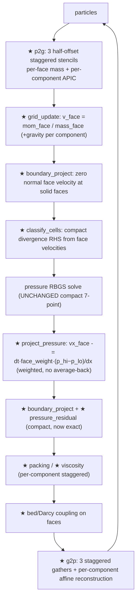

# feat: Staggered MAC grid for MPM pressure projection (consistent, divergence-free)

## Summary

The MPM grid velocity is **collocated** (one `vec4` velocity per cell, `grid_vel`), but the
pressure projection mixes incompatible discrete operators: a **compact stride-1** 7-point
Laplacian *solve* (`pressure_update`) against **central stride-2** divergence, gradient, and
divergence-metric stencils (`classify_cells:1730`, `project_pressure:1967`,
`velocity_divergence_with_solid_mirrors:932`). The projection removes `D·G` (a wide stride-2
Laplacian), which is **not** the operator `A` the solve relaxes, so even a perfectly converged
solve leaves a nonzero post-projection divergence floor — visible as compressibility, jitter,
and lopsided surfaces. This is the canonical "GPU Gems Ch. 38" collocated pitfall; the
consistency condition it violates is the adjoint relation `D = −Gᵀ` (see Sources).

This plan migrates the grid velocity to a **staggered MAC layout** — `vx` on x-faces, `vy` on
y-faces, `vz` on z-faces. On a MAC grid the natural divergence and gradient are both **compact
stride-1**, so `D·G` *is exactly* the compact 7-point Laplacian the RBGS already solves. A
converged solve then drives the discrete divergence to machine precision — a genuinely
divergence-free velocity field. This is the standard discretization for incompressible
MPM/FLIP/APIC fluids (Sources). **The pressure solve itself is unchanged**; the fix is in the
grid representation and the transfer/projection stencils that feed it.

Once the grid is MAC-consistent, the deferred adaptive-iterations work
(`docs/plans/2026-06-07-001-…`) becomes valid and layers cleanly on top: the in-loop residual
then genuinely tracks post-projection divergence.

This is a large, core-touching migration (P2G, G2P, grid_update, every `grid_vel` consumer),
so it is phased and gated by the conservation + physics test suite at each step.

---

## Problem Frame

**Current architecture.** `grid_vel: array<vec4<f32>>` holds `(vx, vy, vz, mass)` at cell
centers. `p2g` (quadratic B-spline, 3×3×3 stencil + APIC affine `C0/C1/C2`) scatters mass,
3 momentum components, and rest/current volume into per-cell channels of the atomic `grid`
buffer; `grid_update` divides momentum by mass to get the collocated velocity; `g2p` gathers
velocity back and reconstructs the affine. Every downstream pass (`boundary_project`,
`classify_cells`, pressure solve, `project_pressure`, viscosity, packing, bed/Darcy coupling,
SDF boundaries, inflow) reads/writes `grid_vel` as a cell-centered vector.

**Why collocated fails here (verified).** With cell-centered velocity, the only natural
gradient/divergence are central (stride-2): averaging face gradients back to cell centers *is*
the central difference. `D·G` then couples `p[i±2]`, decoupling odd/even sublattices
(checkerboard), and is a different operator from the compact `A`. The residual `D·u' = D·u − L·p`
cannot be driven to zero by iterating the compact `Lc` (arXiv 2408.06821). Result: a divergence
floor independent of iteration count — the realism ceiling.

**Why MAC fixes it.** Storing each velocity *component on its own face* makes:
- divergence at a cell = `(vx⁺ − vx⁻)/dx + (vy⁺ − vy⁻)/dx + (vz⁺ − vz⁻)/dx` — **compact**,
- pressure gradient at a face = `(p_hi − p_lo)/dx` — **compact**, applied *directly* to the face
  velocity (no average-back),
- and `D·G` = the compact 7-point Laplacian = exactly what `pressure_update` solves.

So a converged solve ⇒ machine-precision discrete divergence-free face velocities, satisfying
`D = −Gᵀ`. This is why all incompressible MPM fluid work uses MAC (Sources).

**Constraints (institutional learnings).** Stay within the device storage-buffer ceiling of
**16** (2022+ GPUs; 10 currently bound) — MAC may add ~1–2 dedicated buffers, and
`required_limits()` (`mod.rs:50`, pinned at 10) must be bumped to match. No indirect dispatch.
Preserve mass *and* momentum conservation (hard requirement — see the
volume-conservation constraint in project memory).

---

## Requirements

- **R1.** Grid velocity is stored staggered: each cell owns the velocity samples on its
  lower (`−x`, `−y`, `−z`) faces; a cell's upper faces are its neighbors' lower faces.
- **R2.** P2G scatters each velocity component to its own staggered grid using
  half-cell-offset interpolation weights, with **per-face mass** normalization, and applies the
  APIC affine per-component (Ding–Shinar–Schroeder MAC-APIC).
- **R3.** G2P gathers each component from its staggered grid and reconstructs particle velocity
  and the affine `C` consistently with P2G.
- **R4.** Divergence (RHS), pressure gradient (projection), and the divergence metric are all
  **compact stride-1** on the MAC layout **and carry the same per-face weighting / self-fill
  scaling** as the solve (`pressure_face_weight`, `liquid_fill_fraction`, `rhs = div·self_fill/dt`)
  so that the weighted `D·G` equals the weighted operator `pressure_update` relaxes — at interior
  *and* free-surface/air/bed faces. The pressure-solve kernel (RBGS sweeps) is otherwise unchanged.
- **R5.** A converged solve yields post-projection discrete divergence at machine-precision
  level for interior fluid (down from the current O(1) operator-mismatch floor).
- **R6.** All `grid_vel` consumers (boundary projection, SDF solid faces, conical barrier,
  viscosity, packing, bed/Darcy coupling, inflow/spout) operate correctly on face velocities —
  no average-back anywhere in the projection path.
- **R7.** **Mass and momentum are conserved** through the staggered transfers to at least the
  tolerance the current collocated path achieves (gate tests).
- **R8.** Total storage-buffer count stays ≤16 (device max for 2022+ GPUs; currently 10). MAC may
  add ~1–2 dedicated buffers (per-face mass); the `grid` buffer is unchanged and `grid_vel` is
  reinterpreted.
- **R9.** The full physics test suite passes (re-baselined only where MAC legitimately changes
  a diagnostic), with incompressibility/levelness/hydrostatic invariants at least as good as
  today.
- **R10.** `grid_vel.w` remains a true cell-centered occupancy/mass; the sparse-tile activation
  gate and all occupancy consumers keep working (no real fluid silently skipped by the sparse
  solve).
- **R11.** Free-surface/air/bed face behavior is preserved: the MAC operators reproduce the
  fractional-fill physics (`liquid_fill_fraction`, air-Dirichlet/fluid face weights) and the
  sparse pour-stream velocity regression (`physics_tests.rs:2581-2665`).

---

## Key Technical Decisions

**KTD-1 — MAC layout stored per-cell as the cell's lower faces; `grid_vel` reinterpreted.**
`grid_vel[i]` holds `(vx at i's −x face, vy at i's −y face, vz at i's −z face, w)`. A cell's `+x`
face velocity is `grid_vel[i+x].x`. Upper-domain-boundary faces are governed by no-flow BCs and
need no explicit storage. **`.w` stays exactly as today — the cell-centered occupancy/mass**
written by `grid_update` — because it gates classification, surface detection, viscosity,
packing, G2P support, sparse-stream preservation, sparse-tile activation, and bed dynamics
(`shader.rs:1574,1606,1635,1476,2086,2275,2620`; sparse gate `:1653`). The cell mass that feeds
`.w` is **retained unchanged** in the `grid` buffer; per-face masses live in a *separate*
dedicated buffer (KTD-2), so no occupancy juggling is needed (resolves Codex round-3 #2/#5).

**Buffer budget:** the 8-storage-buffer limit is *not* the real ceiling — the device max is
**16**, fine for 2022+ GPUs (per project owner). The shader currently binds 10; MAC adds at most
~1–2 dedicated buffers (per-face mass; optional), staying well under 16. The old "no new binding"
contortions are unnecessary.

**KTD-2 — Per-face masses in a dedicated buffer; the `grid` buffer keeps its 6 channels.**
The `grid` buffer is allocated **exactly 6 channels** today — `mass, mom_x, mom_y, mom_z,
rest_vol, cur_vol` (`state.rs:164-167`, helpers `shader.rs:174-179`) — and its lanes are aliased
by scratch (`scratch_pressure/div/packing/kind`; viscosity reuses momentum lanes as velocity
scratch — `shader.rs:180-186,317-333`, `mod.rs:1684-1686`). Rather than cram per-face masses into
that buffer (which forced fragile lifetime/aliasing reasoning), MAC adds **one dedicated
storage buffer for per-face masses**, now that the buffer budget allows it (KTD-1, ≤16).
**It must be `array<atomic<i32>>` fixed-point lanes (3 per cell: mass_x/mass_y/mass_z), written
with `atomicAdd`** — P2G is a parallel scatter, exactly like the existing mass/momentum channels
(`shader.rs:56,1427`); a plain writable `vec4<f32>` would race. The cell mass that drives `.w`
occupancy stays in `grid`
unchanged. P2G accumulates per-face mass into the dedicated buffer; `grid_update` consumes it to
form face velocities; it is then free for the rest of the substep. Volumes (rest/current) stay
cell-centered. This **removes** the channel-growth + scratch-lifetime hazards Codex round 3
flagged (former R-F) and keeps occupancy trivially correct.

**KTD-3 — Staggered transfers with per-component APIC; document the conservation proof.** P2G
evaluates three half-offset B-spline stencils (one per component); G2P mirrors it. The APIC
affine `C` columns apply per-component at each component's staggered `dpos`. Rationale: this is
the established MAC-APIC transfer (Ding et al. 2020). **Risk flagged:** per-component APIC
changes the angular-momentum-conservation argument vs collocated APIC — U2/U5 must add explicit
mass+momentum conservation gate tests (R7) and verify no systematic drift.

**KTD-4 — Compact *weighted* projection operators; the solve kernel is unchanged.** The RBGS
solve is **not** a constant-coefficient 7-point Laplacian — it carries `pressure_face_weight`
and `liquid_fill_fraction` for free-surface/air/bed faces, with `rhs = divergence·self_fill/dt`
(`shader.rs:399,1818,1836`). So "D·G == A" holds **only if the MAC divergence and projection use
the same per-face weighting and self-fill scaling** (Codex round 3). The fix is therefore the
*weighted* MAC operator pair: divergence sums face fluxes scaled by the face weights; projection
subtracts `dt·face_weight·(p_hi − p_lo)/dx` (with the self-fill scaling), mirroring
`pressure_update`/`pressure_weighted_or_mirror` (`shader.rs:1923,1967`). The RBGS sweep kernel,
red/black structure, and sparse-tile machinery stay as-is. Rationale: a naive unweighted
`vx -= dt·(p_hi−p_lo)/dx` would re-break consistency exactly at free surfaces — the visually
important region. Removing the floor (R5) requires the weighted pair, not just "compact."

**KTD-5 — Single switchover on the worktree branch, gated by the test suite; A/B against the
pre-migration *commit*, not an in-code toggle.** The transfers and consumers are mutually
coupled (P2G-MAC requires G2P-MAC), so there is no partial-correctness intermediate; land the
migration as a coherent set of commits validated continuously by the conservation + physics
suite. **An in-code `collocated|mac` toggle is not cheap** — there is one WGSL module, one shared
bind-group layout, and one set of pipeline entry points (`pipelines.rs:35-91,153-199`), so a
runtime toggle means dual channel maps + branches in every shared kernel and a compile-time
toggle means two shader/layout variants (Codex round 3). Therefore A/B is done by comparing
against the **pre-migration git commit** (the collocated baseline lives in history), not a live
toggle. Rationale: manages big-bang risk honestly without budgeting a second code path.

**KTD-6 — Boundary conditions become face-based (cleaner).** Solid/no-flow ⇒ zero the *normal
face* velocity; SDF solid faces, the conical barrier, and bed/Darcy coupling reformulate on
faces. Rationale: MAC BCs are the natural and standard form and remove the ghost-mirror
gymnastics the collocated divergence needed.

---

## High-Level Technical Design

MAC layout (1-D slice; each cell owns its lower-face sample):

```
        p[i-1]        p[i]          p[i+1]         <- pressure at cell centers
   |------o------|------o------|------o------|
   vx[i-1]      vx[i]        vx[i+1]                <- vx on x-faces (grid_vel[i].x = i's -x face)
                 |<-- cell i -->|
  div(i) = (vx[i+1] - vx[i])/dx + (vy.. ) + (vz..)     # compact stride-1 (face-weighted at surfaces)
  grad_p at face i = (p[i] - p[i-1])/dx                # compact stride-1 (× face_weight)
  project: vx[i] -= dt * face_weight * (p[i] - p[i-1]) / dx   # weighted, applied directly to the face
  => weighted D·G == the weighted operator RBGS solves (== compact 7-point for full interior cells)
```

Per-substep flow (changed stages marked ★):



Storage change (buffer budget ≤16; currently 10):

| Buffer | Before | After |
| --- | --- | --- |
| `grid` (accumulation) | 6 channels: `mass, mom_x, mom_y, mom_z, rest_vol, cur_vol` (+scratch reuse) | **unchanged** — `mass` still feeds `.w` cell occupancy |
| `grid_vel` | `(vx,vy,vz, mass)` collocated | reinterpreted: `(vx⁻ᶠᵃᶜᵉ, vy⁻ᶠᵃᶜᵉ, vz⁻ᶠᵃᶜᵉ, occupancy)` |
| **face mass** (NEW dedicated buffer) | — | `array<atomic<i32>>`, 3 fixed-point lanes/cell (mass_x/y/z); P2G `atomicAdd`, consumed by `grid_update` |

---

## Implementation Units

### Phase 1 — Layout & storage

#### U1. MAC storage layout, channels, and index helpers
**Goal:** Define the staggered convention and storage without changing physics yet.
**Requirements:** R1, R8.
**Dependencies:** none.
**Files:** `crates/sim-wasm/src/mpm_3d/shader.rs` (face-index helpers `face_x/y/z_idx`, the new `array<atomic<i32>>` **face-mass buffer** binding + accessors, `grid_vel` reinterpretation docs; `grid` channels unchanged), `crates/sim-wasm/src/mpm_3d/state.rs` (allocate the atomic face-mass buffer), `crates/sim-wasm/src/mpm_3d/pipelines.rs` (shared bind-group layout `:35-91` gains the face-mass binding — one shared layout, so every pipeline sees it), `crates/sim-wasm/src/mpm_3d/mod.rs` (**bump `required_limits().max_storage_buffers_per_shader_stage` 10→11/12 at `:50`**; face-mass buffer sizing + per-substep clear alongside the existing grid clears), `crates/sim-wasm/src/mpm_3d/profiler.rs` (mirror the clear + pass order `:276-481,682`), `crates/sim-wasm/src/mpm_3d/physics_tests.rs` (update `pipelines_fit_within_required_limits` `:1539` for the new count).
**Approach:** Establish "cell owns its −faces" convention everywhere; document +face = neighbor's −face; domain-boundary upper faces via BC (no storage). Add the **dedicated atomic per-face-mass buffer** (KTD-2) — the `grid` buffer and its scratch aliasing are untouched, and `.w` cell occupancy is unchanged (KTD-1/R10). Add the binding to the single shared layout and raise the limit so it validates in production, tests, and profiler (all route through `required_limits()`).
**Test scenarios:** face-mass buffer sized correctly and zeroed by its clear (production **and** profiler paths); face-index helpers map (cell,face)→slot uniquely (small-grid unit test); `pipelines_fit_within_required_limits` passes with the bumped limit; total storage-buffer count ≤16; `.w` occupancy still populated/readable by the classify gate (unchanged path).
**Verification:** `cargo test -p coffee-sim-wasm --lib` builds/passes layout tests; no behavior change yet (transfers still collocated until U2–U4).

### Phase 2 — Transfers (land together; round-trip tested)

#### U2. P2G → staggered per-component scatter
**Goal:** Scatter each velocity component to its face grid with per-face mass and per-component APIC.
**Requirements:** R2, R7.
**Dependencies:** U1.
**Files:** `crates/sim-wasm/src/mpm_3d/shader.rs` (`p2g`).
**Approach:** Compute three half-offset bases/weights (x shifted +0.5 for vx, etc.); `atomicAdd` `mom_c` into `grid` and `mass_c` into the dedicated atomic face-mass buffer (fixed-point, like the existing scatter at `shader.rs:1427`); apply APIC `affine_mom` component-wise at each staggered `dpos`. Keep the quadratic B-spline kernel; keep volume (rest/current) and the cell-mass occupancy scatter cell-centered.
**Execution note:** Characterize first — capture current collocated mass/momentum totals as the conservation baseline before switching.
**Test scenarios:** single-particle scatter deposits expected per-face mass/momentum (hand-computed); sum of face masses ≈ particle mass (partition of unity per staggered grid); momentum sum conserved; overflow probe still fires correctly.
**Verification:** P2G unit tests pass; conservation totals match baseline within tolerance.

#### U3. grid_update → per-face velocity
**Goal:** Convert per-face momentum/mass to face velocity; apply gravity per component; init BC faces.
**Requirements:** R2, R7.
**Dependencies:** U2.
**Files:** `crates/sim-wasm/src/mpm_3d/shader.rs` (`grid_update`), `crates/sim-wasm/src/mpm_3d/mod.rs` (clears).
**Approach:** `v_c = mom_c / max(mass_c, eps)` per face (reading the dedicated face-mass buffer); gravity added to the relevant component; empty faces left at BC/zero. **`.w` stays the cell occupancy** written from the unchanged `grid` cell-mass channel (no repurposing, KTD-1/R10). This is the only consumer of the face-mass buffer; it is free for the rest of the substep afterward.
**Test scenarios:** uniform-velocity field round-trips through P2G→grid_update unchanged; gravity integrates per component; zero-mass faces stay zero.
**Verification:** grid_update tests pass.

#### U4. G2P → staggered gather + affine reconstruction
**Goal:** Gather face velocities to particles and rebuild APIC `C` consistently with P2G.
**Requirements:** R3, R7.
**Dependencies:** U2, U3.
**Files:** `crates/sim-wasm/src/mpm_3d/shader.rs` (`g2p`).
**Approach:** Three staggered gathers; reconstruct `vp` and per-component affine columns at the matching offsets.
**Test scenarios:** **Round-trip:** a particle field P2G→grid_update→G2P preserves velocity (PIC) and linear/affine fields (APIC) to tolerance; rigid translation/rotation reproduced (APIC angular-momentum sanity); mass+momentum conserved over the full transfer (R7 gate, guards KTD-3 risk).
**Verification:** full transfer round-trip + conservation tests pass.

### Phase 3 — Projection consistency (the payoff)

#### U5. Compact divergence RHS (classify_cells)
**Goal:** Build the solve RHS from compact face divergence; reinterpret target divergences.
**Requirements:** R4.
**Dependencies:** U1–U4.
**Files:** `crates/sim-wasm/src/mpm_3d/shader.rs` (`classify_cells`, `projection_target_divergence_for_cell`, `bed_velocity_divergence`).
**Approach:** `div = Σ face_weight·(v_hi − v_lo)/dx` over the three axes (compact, **face-weighted** to match the solve — KTD-4/R4); keep `div − target_divergence` and the `self_fill` scaling consistent with `rhs = div·self_fill/dt`; reinterpret bed/volume targets on faces.
**Test scenarios:** divergence of a known face field matches the analytic compact value (full-interior); air/fluid/solid faces apply the correct weights (matches `pressure_face_weight`); a discrete-divergence-free face field yields RHS ≈ 0.
**Verification:** divergence/RHS unit tests pass.

#### U6. Compact face-gradient projection (project_pressure)
**Goal:** Apply the compact pressure gradient directly to face velocities; reformulate Darcy/speed-cap on faces.
**Requirements:** R4, R5, R6.
**Dependencies:** U5.
**Files:** `crates/sim-wasm/src/mpm_3d/shader.rs` (`project_pressure`).
**Approach:** `vx[i].x -= dt·face_weight·(p[i] − p[i−1])/dx` (and y/z), **weighted** to mirror `pressure_weighted_or_mirror`/`pressure_face_weight` (KTD-4); **no average-back**. Reapply Darcy damping and speed cap per face (these still mutate velocity post-solve — R-C). Solid/air faces via face BCs (air-Dirichlet `p=0`, solid no-flow).
**Test scenarios:** **Exactness (R5):** on a closed interior fluid block, post-projection weighted divergence → machine-epsilon after the solve converges (the core win); **free-surface block:** the weighted operator drives the surface-cell divergence to the same level the weighted solve targets (not left inconsistent); Darcy/cap still applied where expected.
**Verification:** projection exactness test passes; divergence floor gone vs collocated baseline.

#### U7. Compact divergence metric + residual
**Goal:** Make the diagnostic/residual measure the true face divergence.
**Requirements:** R4, R5.
**Dependencies:** U6.
**Files:** `crates/sim-wasm/src/mpm_3d/shader.rs` (`velocity_divergence_with_solid_mirrors` → compact face form, `pressure_residual`).
**Approach:** Compact face divergence with face BCs; residual metrics now reflect the actual incompressibility error.
**Test scenarios:** metric agrees with U5 divergence on the same state; post-converged interior residual ≈ 0.
**Verification:** residual-metric tests pass; `pressure_projection_residual_metrics_track_post_projection_cells` re-baselined.

### Phase 4 — Consumers & boundaries

#### U8. Face boundary conditions (boundary_project, SDF solids, conical barrier)
**Goal:** No-flow/solid BCs on faces.
**Requirements:** R6.
**Dependencies:** U6.
**Files:** `crates/sim-wasm/src/mpm_3d/shader.rs` (`boundary_project`, SDF solid-face checks, conical barrier resolve).
**Approach:** Zero the normal face velocity at solid/domain faces; tangential handling per current policy; SDF face classification.
**Test scenarios:** no-flow at walls (zero normal flux); water in an SDF cup respects solid faces; conical barrier still constrains.
**Verification:** boundary tests pass; no leak through solids.

#### U9. Viscosity & packing on faces
**Goal:** Per-component staggered viscosity and packing.
**Requirements:** R6.
**Dependencies:** U6.
**Files:** `crates/sim-wasm/src/mpm_3d/shader.rs` (`viscosity_prepare/apply`, `packing_prepare/apply`).
**Approach:** Velocity Laplacian per component on its staggered grid; packing pressure reuse adapted to face/cell channels.
**Test scenarios:** viscous decay of a shear field matches expected per component; packing still suppresses overlap without reintroducing divergence (re-check U6 exactness after packing).
**Verification:** viscosity/packing tests pass.

#### U10. Bed coupling, bed dynamics & pressure-gradient sampling on faces
**Goal:** Every bed-side `grid_vel`/gradient consumer reads face velocities correctly.
**Requirements:** R6, R7.
**Dependencies:** U6.
**Files:** `crates/sim-wasm/src/mpm_3d/shader.rs` — `bed_matrix_velocity_cell` + bed reaction impulse (U6's Darcy path); **`bed_dynamics`, which directly samples `grid_vel` for water velocity/mass support to move suspended/anchored coffee (`:2618-2620,2650-2658,2722-2737`)**; and **`pressure_gradient_at_cell` (`:289-310`), still a *central cell* gradient used by `bed_dynamics` (`:2739`)** — convert to a face-consistent gradient.
**Approach:** Reconstruct a cell-centered water velocity from surrounding faces where `bed_dynamics` needs one (documented averaging, used for advection only — not for the projection); make `pressure_gradient_at_cell` consistent with the MAC face gradient. Note: **inflow/spout writes particles + affine only, not `grid_vel`** (`inflow.rs:171-179`) — no MAC change there.
**Test scenarios:** bed drawdown rate unchanged within tolerance; suspended/anchored coffee advection matches baseline; bed momentum reaction conserved; `pressure_gradient_at_cell` agrees with the face gradient.
**Verification:** coupling/extraction/channeling tests pass.

### Phase 5 — Validation

#### U11. Conservation + physics regression suite and re-baseline
**Goal:** Prove MAC conserves mass/momentum and improves incompressibility without breaking invariants.
**Requirements:** R5, R7, R9.
**Dependencies:** U1–U10.
**Execution note:** A/B each invariant against the **pre-migration commit** (collocated baseline in git history), per KTD-5 — not an in-code toggle.
**Files:** `crates/sim-wasm/src/mpm_3d/physics_tests.rs`.
**Approach:** Re-baseline only diagnostics that legitimately change (pressure residual scale, effective behavior); never loosen invariant tests.
**Test scenarios:**
- Exact incompressibility (R5): interior post-projection divergence at machine-epsilon after convergence (the headline result), vs the O(1) floor on collocated.
- Mass conservation, active particle count, finite state — unchanged.
- Momentum/angular-momentum conservation through MAC-APIC transfers (guards KTD-3).
- Surface levelness, hydrostatic ordering, settled volume/shape, free-surface sparse-stream preservation — at least as good as collocated (these MUST NOT be loosened; cf. Codex round-2 list).
- Free-surface fractional fidelity (R11): the pour-stream velocity regression (`physics_tests.rs:2581-2665`) and fractional-fill behavior hold under the weighted MAC operators — exactness tests beyond the closed-interior case.
- Sparse-tile occupancy (R10): no real fluid cell is skipped by the sparse RBGS gate (cell-occupancy `.w` drives tile activation).
- Bed drawdown / extraction / channeling within tolerance.
**Verification:** full `cargo test -p coffee-sim-wasm --lib` green; A/B shows incompressibility improvement and no invariant regression.

---

## Scope Boundaries

**In scope:** the MPM grid velocity representation and every pass that reads/writes it —
transfers (P2G/grid_update/G2P), projection (divergence/solve-RHS/gradient/metric), boundaries,
viscosity, packing, bed/Darcy coupling, inflow — plus the physics suite.

**Not in scope (true non-goals):**
- The pressure-solve kernel math (`pressure_update`, RBGS red/black, sparse tiles) — unchanged
  (KTD-4).
- Adaptive iteration count / early exit — deferred to `2026-06-07-001` (layers on after MAC).
- Particle reordering, rendering, chemistry/thermal passes (except where they read grid velocity).
- Performance optimization of the (now 3×) transfers — correctness first.

### Deferred to Follow-Up Work
- **Adaptive RBGS iterations** (`2026-06-07-001`) once operators are consistent.
- **Transfer perf** — the 3-staggered-stencil P2G/G2P roughly triples transfer bandwidth;
  optimize only if profiling demands (target ~200k particles).
- **Remove the collocated path/toggle** after MAC is proven.

---

## Risks & Mitigations

- **R-A: Big-bang migration risk.** Transfers + consumers are coupled; no partial-correct
  intermediate. *Mitigation:* phased commits gated by the suite (KTD-5); A/B against the
  pre-migration commit (an in-code toggle is too costly — Codex round 3); round-trip transfer
  test (U4) before touching projection.
- **R-B: MAC-APIC conservation drift.** Per-component affine changes the angular-momentum
  argument. *Mitigation:* explicit mass + linear + angular momentum conservation gate tests
  (U4, U11); compare to collocated baseline.
- **R-C: Post-solve velocity mutations.** Darcy damping, speed cap, and `boundary_project` run
  after `project_pressure` and can reintroduce divergence (carried over from collocated).
  *Mitigation:* apply them on faces (U6/U8); document that the exactness guarantee is for the
  immediate post-projection field; measure residual after the full tail in U11.
- **R-D: XPBD coupling diagnostic shift.** Downstream porosity/saturation reads the divergence;
  MAC changes its discretization. *Mitigation:* re-validate coupling tests (U10); re-baseline
  only the diagnostic, not the physics.
- **R-E: Boundary/SDF correctness on faces.** Face BCs differ subtly from collocated mirrors.
  *Mitigation:* dedicated no-flow/solid-face tests (U8); SDF cup leak test.
- **R-F: Buffer/binding budget (largely resolved).** Per-face masses now live in a dedicated
  buffer (KTD-2), so the `grid` scratch-aliasing hazard is avoided and `.w` occupancy is
  untouched. Remaining check: total storage buffers stay ≤16 (device max for 2022+ GPUs;
  currently 10 → ~11–12 after MAC) and the new binding is added to the shared bind-group layout.
- **R-G: Transfer cost (3×).** P2G/G2P bandwidth roughly triples; could threaten the ~200k
  target. *Mitigation:* correctness first; perf deferred (Scope) with the profiler as the gate.
- **R-H: Weighted-operator mismatch at free surfaces (Codex round 3).** A naive unweighted MAC
  projection re-breaks `D·G == A` exactly at air/surface/bed faces — the visible region — even
  while interior cells look exact. *Mitigation:* the weighted operator pair (KTD-4, R4); the
  free-surface exactness + pour-stream regression tests (U6/U11, R11) gate it; do not declare
  success on closed-interior exactness alone.
- **R-I: Sparse-tile gate silently skips fluid (Codex round 3).** `classify_cells` activates
  sparse tiles via the `.w` occupancy gate; if `.w` becomes face-local, the sparse RBGS skips
  real fluid cells. *Mitigation:* keep `.w` a true cell occupancy (KTD-1, R10); U11 asserts no
  fluid cell is skipped.

---

## Open Questions (resolved / deferred)

- **Discretization fix** → resolved: staggered MAC (principled, MPM-standard), per user.
- **Storage** → resolved: `grid_vel` reinterpreted as the cell's lower faces (`.w` = cell
  occupancy, unchanged); `grid` 6 channels unchanged; per-face masses in a **dedicated atomic
  buffer**; total buffers ≤16 with `required_limits()` bumped (KTD-1/2).
- **Solve kernel** → resolved: unchanged compact 7-point RBGS (KTD-4).
- **Migration shape** → resolved: single switchover gated by the suite; A/B against the
  pre-migration commit (no in-code toggle).
- **`.w` field semantics on `grid_vel`** → deferred to U1 (mass is now per-face).
- **Whether to keep the collocated path long-term** → deferred (remove after MAC proven).
- **Adaptive iterations** → deferred to `2026-06-07-001`.

---

## Sources & Research

Web research (consistent projection on collocated/MPM grids) — load-bearing for the direction:

- **GPU Gems Ch. 38 (Harris 2004)** — the exact collocated + compact-solve + stride-2
  divergence/gradient pattern this codebase matches; the canonical inconsistent scheme.
  https://developer.nvidia.com/gpugems/gpugems/part-vi-beyond-triangles/chapter-38-fast-fluid-dynamics-simulation-gpu
- **"Quantifying the checkerboard problem" (arXiv 2408.06821, 2024)** — formal: wide stride-2
  `D·G` ≠ compact `Lc`; residual `D·u − L·p` unkillable by iterating `Lc`; consistency needs
  `D = −Gᵀ`. https://arxiv.org/abs/2408.06821
- **Kularathna & Soga 2017** — "projections are naturally done on MAC grids"; staggered MPM
  avoids the collocated pressure oscillations. https://link.springer.com/article/10.1016/S1001-6058(16)60750-3
- **Ding, Shinar, Schroeder 2020 — APIC on MAC grids** — staggered per-component P2G/G2P and the
  per-component affine split this plan adopts. https://www.cs.ucr.edu/~craigs/papers/2019-mac-apic/paper.pdf
- **Guermond & Minev 2009 — consistent vs inconsistent flux on collocated grids** — characterizes
  the floor; supports MAC as the exact fix. https://www.sciencedirect.com/science/article/abs/pii/S0021999109003313
- GPU FLIP (arXiv 2404.01931), multi-GPU MPM (2024), Tampubolon 2017 — corroborate MAC as the
  incompressible-MPM standard.

Code anchors: `shader.rs` `p2g:1343`, `grid_update:1441`, `g2p:2212`, `project_pressure:1905`
(central gradient `:1967`), `pressure_update:1766` (compact solve `:1837`),
`velocity_divergence_with_solid_mirrors:870` (central `:932`), `classify_cells` divergence `:1730`;
`grid_vel`/`grid` channel helpers `:170-340`.

Codex cross-validation: round 1 (`.deliberate/codex_review.md`), round 2
(`.deliberate/codex_review_r2.md` — operator-mismatch finding, the proximate cause this plan
fixes), round 3 (`.deliberate/codex_review_r3.md` — **REVISE**: MAC direction and deferral
endorsed, blast radius justified; folded-in fixes = weighted MAC operators (KTD-4, R4, R11,
U5/U6), `.w` cell-occupancy retained (KTD-1, R10, U1), missed `bed_dynamics`/`pressure_gradient_at_cell`
consumers + profiler pass-order (U10/U1), sparse-tile occupancy gate (R-I)), and round 4
(`.deliberate/codex_review_r4.md` — **REVISE→ready**: confirmed all round-3 fixes; after the
buffer ceiling was corrected to 16, storage moved to a **dedicated atomic face-mass buffer**
(grid unchanged); remaining items folded in = bump `required_limits()` 10→11/12 + its invariant
test, specify the face-mass buffer as `array<atomic<i32>>` fixed-point, clear it in production +
profiler paths, A/B by commit not toggle).
