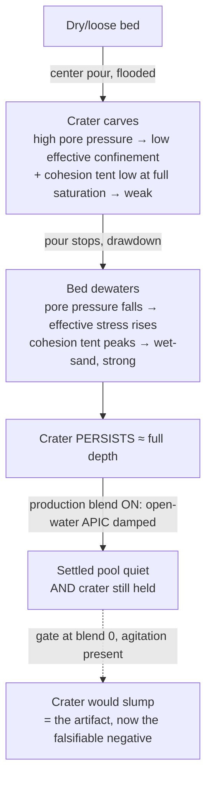
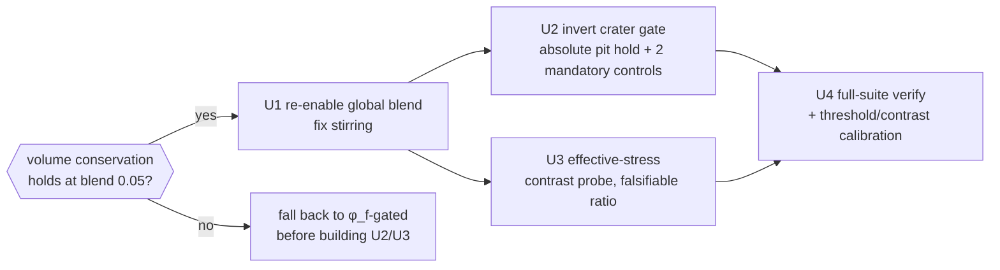

# fix: Wet-Sand Crater Persistence + Settled-Pool Stirring (effective-stress bed)

## Summary

Correct the deformable coffee bed's target behavior and fix the settled-pool stirring — **without any constitutive change**. Planning research (codebase + Tampubolon/Klár MPM literature) established that the effective-stress model the brainstorm thought we'd build **already exists and is validated**: the U7 solid phase runs a Klár Drucker-Prager return map on the skeleton's *effective* (contact) stress, with a Bishop-weighted saturation-dependent capillary cohesion (a tent peaking at partial saturation) and pore-pressure buoyancy via `project`; the Terzaghi/Skempton/stress-partition gates pass. So the bed is already weak-when-flooded / strong-when-drained by construction.

The remaining work is three corrections: (1) **invert the bed crater gate** — it currently asserts the crater *slumps* to ≤0.6×peak, which is physically wrong (real pour-over beds hold the pour topography; the slump was riding on numerical agitation) — to assert the crater *persists* (holds ≈ its full depth) after drawdown; (2) **re-enable the open-water APIC damping** (the inert `PIC_BLEND_DEFAULT`) to fix the settled-pool stirring, now compatible because a held crater is the correct outcome; (3) **add an effective-stress contrast probe gate** so the flooded-vs-drained strength difference is asserted, not just nominal. The inverted crater gate runs at the production blend (agitation damped), which makes it the proof that persistence is physics-driven, not agitation-driven.

---

## Problem Frame

The stirring investigation (memory `project_twofield_stirring_crater_coupling`) proved the deformable-bed crater "slump" rides on numerical APIC agitation — the same open-water agitation the user sees as settled-pool stirring. Every damping knob that quiets the pool froze the crater; more pressure sweeps inflated the pool ~5×. The crater-collapse gate `center_pour_craters_saturated_deformable_bed_then_collapses` (`tests/twofield_full.rs`) passes today only because that agitation shakes the cohesive wet bed loose enough to slump it.

External pour-over physics research (see origin) inverts that target: a poured crater **persists** into the spent bed; the Rao Spin technique exists precisely *because* an un-agitated bed does not self-level. And MPM technique research (Tampubolon 2017, Klár 2016) confirms the codebase already uses the established, robust effective-stress coupling (saturation-dependent cohesion + pore-pressure buoyancy), and that the stress-subtraction alternative (σ′=σ−p in the return map) is *fragile* — it liquefies unphysically when pore pressure exceeds total stress under impact, exactly the pour-jet case. So no constitutive change is warranted; the bug is the gate's target plus the disabled damping.

This plan builds on the current branch state from the investigation (baseline `PIC_BLEND_DEFAULT = 0`, the simple global blend mechanism retained inert, `tests/twofield_settled.rs` reframed as bounded-KE + characterization).

**U7 status (precondition — already met):** the deformable saturated bed rung (U7) is **implemented and green**, not pending. The unified two-field solver plan (`docs/plans/2026-06-09-001-feat-unified-twofield-solver-plan.md`) lists U7 as a future rung, but it has since shipped: `src/solvers/twofield/plasticity.wgsl` (`return_map` + `cohesion_for_saturation` + `g2p_solid`) and the `project` pore-pressure buoyancy (`src/solvers/twofield/pressure.wgsl`) are in place, and the Terzaghi consolidation, Skempton-B, stress-partition, and no-fluidize gates pass at the current default (re-confirmed during planning). This plan therefore makes no constitutive change; it relies on U7's already-validated effective-stress model.

---

## Key Technical Decisions

- **No constitutive change (Scope A, user-confirmed).** R1/R2 (effective-stress-dependent yield) are already satisfied by U7: the skeleton carries effective stress, cohesion is the Bishop capillary tent, buoyancy comes from the projection pressure. Validated by the passing Terzaghi consolidation, Skempton-B, and stress-partition-audit gates. (see origin: Key Decisions)
- **Reject the stress-subtraction route.** The geomechanical σ′=σ−(1−n)p·I-in-the-return-map approach was researched and rejected. Note the precise distinction (the flooded bed *should* be weak/near-fluid under the active pour — that's the desired carve regime — so the rejection is not "subtraction weakens, ours doesn't"): the subtraction route fails by going **unrecoverably tensile** when pore pressure exceeds total stress under impact, collapsing the DP cone to a stress-free apex (the bed liquefies catastrophically, a no-fluidize-gate risk), whereas the graphics route (Tampubolon, already in place) keeps the flooded weakening *controlled* (frictional cone + buoyancy, cohesion → 0 smoothly). Same desired softening, no unrecoverable failure mode.
- **Invert the crater gate to persistence.** Terminology (used consistently throughout): **persist / hold** = the desired wet-sand outcome (crater keeps ≥ threshold × peak depth); **slump / collapse** = the artifact failure mode (crater relaxes toward flat, ≤ 0.6 × peak — the old gate's target, now the falsifiable negative at blend 0). Replace `residual ≤ COLLAPSE_RESIDUAL_FRAC(0.6) × peak` with `residual ≥ PERSIST_RESIDUAL_FRAC × peak`. The "holds almost fully" target (origin) supports a high threshold; experiments showed residual ≈ 0.96–1.03 × peak once agitation is damped, so a threshold of ~0.8 holds with margin while still catching a real collapse. Final threshold confirmed against the measured held depth in U4.
- **Global PIC blend for the damping** (not φ_f-gated). With the crater gate corrected, a held crater is the desired outcome, so the global blend's "crater hold" is no longer a regression. The global blend already passed Terzaghi/Skempton/stress-partition/volume in this session's runs, so the φ_f-gated complexity (and its extra `g2p_water` binding) is unnecessary.
- **The decouple proof requires TWO controls, not one.** The persistence gate runs at the production blend (agitation damped), so a hold there is *consistent* with effective-stress cohesion — but the blend-0-slumps control alone is circular: it only proves agitation can destroy the crater (already known), not that the hold *is* cohesion rather than residual numerical agitation. The real proof adds a **cohesion-off control** (blend 0.05 with wet cohesion disabled → the crater must slump): only {blend-0 slumps, cohesion-off slumps, production holds} establishes the hold is effective-stress cohesion. Both controls are mandatory active assertions in U2 (see Risks: the "green but dishonest" risk).

---

## High-Level Technical Design

The crater life-cycle the corrected gate asserts, and why damping is now compatible:

Dependency / sequencing of the units:

The volume-conservation check gates the global-blend path at the front (U1), not last — it is the highest-risk check and a failure there invalidates the global-blend choice the other units build on.

The crater gate (U2) can only pass with the blend on (U1): at blend 0 the bed slumps and fails the persistence assertion. This coupling is intentional — but on its own it is not sufficient proof the hold is *physics* (it could be residual agitation), so U2 also adds a cohesion-off control. The two controls together make it a real decouple proof (see Key Technical Decisions).

---

## Implementation Units

### U1. Re-enable the open-water APIC damping (global PIC blend)

**Goal:** Restore a small nonzero global PIC blend so the settled-pool stirring is damped (the user's original complaint), now that a held crater is the correct outcome.

**Requirements:** R6 (stirring fixed); supports R5 (agitation damped). Covers AE3 (pool quiet), partially.

**Dependencies:** none.

**Files:**
- `src/solvers/twofield/mod.rs` — set `PIC_BLEND_DEFAULT` from 0 to the small value (≈0.05); update its doc from "deferred to redesign" to the shipped fix.
- `src/solvers/twofield/transfers.wgsl`, `src/solvers/twofield/surface.wgsl`, `src/solvers/twofield/common.wgsl` — update the "stirring fix deferred" comments to reflect the shipped global blend.
- `tests/twofield_settled.rs` — restore the blend-as-shipped-fix framing: re-assert the blend quiets the settled pool (the `isolate_settled_stirring_mechanisms` contribution), keep the every-frame bounded-KE regression gates. (The `pic_blend_default_*` guard already admits 0.05 via its `>= 0.0` band; tightening it to `> 0.0` is optional intent-encoding, not required.)

**Approach:** The global blend scales the G2P affine C by `1 − pic_blend` (the existing knob); no φ_f gating, no new binding. Choose the smallest value that quiets the pool to the target (≈0.05 measured: settled tail KE 67→21, max|v| 0.95→0.52). Keep the `dbg.x` relief gate and `RELIEF_DEADBAND` plumbing as-is (inert).

**Gating precondition — volume conservation comes FIRST (risk-ordering fix):** the global blend damps *bed pore-water* APIC, and project memory flags volume conservation as the gate that "secretly depends on under-convergence" — so it is the highest-risk check and must gate the global-blend choice *before* it becomes a default that U2/U3 build on. As the first action of this unit, run `combined_conservation_v60_pour_deformable` (`VOL_DRIFT_TOL`) and the `twofield_settled` long-run saturated-tail regime at blend 0.05. Only if they hold does the global blend stand. If either leaks, STOP and re-plan the damping (the φ_f-gated blend is the fallback — it keeps bed pore-water full-APIC) before building U2/U3 on the global default.

**Execution note:** verify volume conservation at blend 0.05 before committing `PIC_BLEND_DEFAULT`; do not build downstream units on the global default until that check is green.

**Patterns to follow:** the existing `g2p_water` blend line in `transfers.wgsl`; the bounded-KE gate shape in `tests/twofield_settled.rs`.

**Test scenarios:**
- **Volume conservation (gating).** `combined_conservation_v60_pour_deformable` (`VOL_DRIFT_TOL`) and the long-run saturated-tail KE regime stay green at blend 0.05 — the bed pore-water APIC damping does not introduce a volume leak. Failure here halts the global-blend path.
- Covers AE3. Settled water tank, blend on: per-particle tail-mean KE below the bounded-KE floor and the tail peak ≤ 4× tail mean (no spontaneous re-energization) — the stirring is quantitatively quieter than blend 0.
- Settled coupled bed (frozen skeleton + pond), blend on: pond tail KE bounded, max|v| below bound.
- APIC-vs-PIC discrimination gate (`tests/twofield_water.rs`) still passes with `set_pic_blend_for_test(1.0)` ⇒ pure PIC.
- `pic_blend_default_*` guard asserts the production blend is in the documented small-nonzero band.

**Verification:** the volume-conservation gating check is green at blend 0.05; `tests/twofield_settled.rs` and `tests/twofield_water.rs` green; the settled-pool KE is measurably lower than at blend 0 (the stirring is damped).

---

### U2. Invert the deformable-bed crater gate (slump → persist)

**Goal:** Replace the physically-wrong collapse assertion with a persistence assertion: after the pour stops and the bed drains, the crater must HOLD almost fully (wet-sand plasticity), not slump toward flat. Running at the production blend, this is also the decouple proof (persistence with agitation damped).

**Requirements:** R3 (forms), R4 (persists), R5 (physics-driven). Covers AE1, AE2, AE3.

**Dependencies:** U1 (the gate only passes with the blend on; at blend 0 the bed slumps).

**Files:**
- `tests/twofield_full.rs` — rename `center_pour_craters_saturated_deformable_bed_then_collapses` → `center_pour_craters_saturated_deformable_bed_and_holds`; replace `COLLAPSE_RESIDUAL_FRAC` (0.6, `residual ≤`) with `PERSIST_RESIDUAL_FRAC` (`residual ≥`); rewrite the gate doc + failure message to the wet-sand persistence rationale and the decouple framing.

**Approach:** Keep the form phase unchanged (peak depth ≥ `CRATER_DEPTH_FLOOR` = 0.75 while the pour runs). Keep the long (400-frame) drain window. Flip the post-drain assertion to require persistence — but **assert on the absolute pit displacement, not only the `rim − center` differential the current gate uses** (`twofield_full.rs:675`). This is critical: the differential confound was a *conservative friend* under the collapse gate (rim swelling raised the differential, making ≤0.6× harder to pass) and becomes a *passing accomplice* under the inverted gate (rim swelling keeps `rim − center` large even if the pit fully relaxed — and the measured residual 1.03×peak is exactly what differential swelling, not crater hold, would produce). So the persistence assertion must be on the **center pit holding its absolute depth below the post-settle swollen baseline** (track `center` vs `base_center` across the drain window), with rim swelling reported separately / subtracted. Document that the gate runs at the production blend (agitation damped).

**Patterns to follow:** the existing crater test scaffold (`build_bed`, `bed_surface_map`, `surface_band`, the `base_center`/`base_rim` baselines) in `tests/twofield_full.rs` — the assertion changes from a differential bound to an absolute-pit-hold bound + the two negative controls below.

**Test scenarios:**
- Covers AE1. Center pour on the saturated deformable bed: peak signed crater depth ≥ `CRATER_DEPTH_FLOOR` while pouring.
- Covers AE2 / AE3. After 400 drain frames at the production blend: the center pit holds its absolute depth (the pit's drop below the swollen baseline persists ≥ `PERSIST_RESIDUAL_FRAC` × peak), AND rim swelling is reported separately so the hold is not a differential artifact. Determinism: two identical runs give identical residual.
- **Negative control A (MANDATORY active assertion, not `#[ignore]`): agitation isolation.** Same scene at `set_pic_blend_for_test(0.0)` → the pit slumps below the persistence threshold. Proves agitation destroys the crater (the artifact).
- **Negative control B (MANDATORY active assertion): cohesion isolation.** Same scene at the production blend (0.05) **with wet cohesion disabled** (`tf_wet_cohesion → 0` / `tf_cohesion_speak` to the no-cohesion regime) → the pit must NOT persist (slumps below threshold). This is the real decouple proof: only {A slumps, B slumps, production holds} establishes that the hold is effective-stress *cohesion* and not residual numerical agitation or pit-floor stickiness. Without B, the "decouple proof" is circular (see Risks).

**Verification:** the renamed gate passes at the production default on the *absolute* pit-hold metric; both negative controls (blend 0; cohesion-off at blend 0.05) actively fail (pit slumps); rim swelling is reported and is not what's carrying the pass.

---

### U3. Effective-stress contrast probe gate

**Goal:** Make the effective-stress dependence observable, not nominal: assert the bed yields/deforms more readily when flooded (high pore pressure → low effective confinement) than when drained.

**Requirements:** R1, R2. Covers AE4.

**Dependencies:** none (independent of U1/U2; exercises the existing model).

**Files:**
- `tests/twofield_full.rs` (or `tests/twofield_bed.rs`) — new test `effective_stress_contrast_flooded_weaker_than_drained`.

**Approach:** Apply an identical applied load / surcharge to the bed in two saturation states — fully flooded (high pore pressure) vs drained (low pore pressure) — and assert the flooded bed deforms measurably more (larger settlement / lower resisted reaction) than the drained bed. Reuse the existing `build_bed` (its `sat_frac` knob), `basal_pressure`/`total_reaction`/`grain_mean_y`, and `set_gravity_for_test` (surcharge) helpers. This gate is **non-optional and must NOT be folded into the Terzaghi consolidation gate**: Terzaghi measures the *temporal* settling as the bed drains (a consolidation-rate signal), which is a different claim from the flooded-vs-drained *strength contrast* R2 requires. Folding U3 into Terzaghi would assert R2 is covered when it is not — leaving "weak-when-flooded / strong-when-drained" an unmeasured claim (the central premise of Scope A). The contrast must be its own falsifiable test with a **pre-committed minimum ratio** so it can fail.

**Patterns to follow:** `static_saturated_column_stress_partition_audit` (statics) in `tests/twofield_full.rs`; `build_bed`'s `sat_frac`.

**Test scenarios:**
- Covers AE4. Identical surcharge on a flooded bed vs a drained bed → the flooded bed's settlement (grain mean-y drop) is ≥ a pre-committed ratio of the drained bed's (e.g. ≥ 1.5×), set from a measured baseline with margin. The gate FAILS if the contrast is below the ratio — a marginal contrast is a real finding that "no constitutive change" under-delivered the weak-flooded/strong-drained behavior, not something to wave away.
- Edge case: a fully drained bed under the same load deforms least (highest effective stress) — monotonicity of the contrast across saturation.
- Note the regime: at full flood the contrast is buoyancy-dominated (the Bishop cohesion tent is low at both saturation endpoints), so the probe is specifically testing the buoyancy-driven effective-stress reduction.

**Verification:** the probe passes with the flooded/drained deformation ratio above the pre-committed minimum and above the discrete-bed noise floor. If the measured contrast is marginal, that is surfaced as a finding (re-open the constitutive question), not folded away.

---

### U4. Full-suite verification, threshold + contrast calibration

**Goal:** Confirm every L0–L3 gate and R9 stays green with the blend on and the inverted gate, and that the crater-persistence threshold and the flooded/drained contrast are pronounced (not marginal). Tune the existing cohesion/buoyancy knobs only if a gate shows the behavior is too mild.

**Requirements:** R7 (preserve all gates + R9), R8 (solver discipline).

**Dependencies:** U1, U2, U3.

**Files:**
- whole `tests/twofield_*` suite (verification); `src/solvers/twofield/mod.rs` or `Config` defaults *only if* calibration is needed (the wet-cohesion `c_max`, `s_peak`, `tf_wet_cohesion`, or buoyancy weight).

**Approach:** Run the full suite + R9 with U1+U2+U3 in place. Set `PERSIST_RESIDUAL_FRAC` from the measured held depth with margin (planning measured residual ≈ 0.95×peak at blend 0.05, so ≈0.8 holds with margin) — using the absolute-pit metric from U2, not the differential. If the pit holds well below the target, or the flooded/drained contrast (U3) is weak, tune the existing saturation-cohesion constants (execution-time) — no new physics. Confirm the global blend does not regress Terzaghi/Skempton/stress-partition under the shipped default (re-run green at 0.05 during planning). The volume-conservation gate was already front-loaded as U1's gating check; U4 re-confirms it holds **end-to-end** with U2/U3 in place (`combined_conservation_v60_pour_deformable` / `VOL_DRIFT_TOL` + the long-run saturated-tail regime).

**Execution note:** verification-and-calibration unit — driven by gate outcomes, not test-first.

**Test scenarios:**
- `Test expectation: none — verification/calibration unit.` Success = the existing gates (Terzaghi consolidation, Skempton-B, stress-partition, no-fluidize, volume conservation, face-velocity-consistency twin, R9 ≤33ms@200k) all green with the shipped blend + inverted gate, plus U1/U2/U3 green.

**Verification:** full `tests/twofield_*` suite green + R9 within budget; the crater-persistence and flooded/drained contrast margins documented as comfortable, not marginal.

---

## Scope Boundaries

**In scope**
- Re-enabling the open-water global PIC blend (the stirring fix).
- Inverting the deformable-bed crater gate to persistence (the decouple proof).
- An effective-stress contrast probe gate.
- Verification + execution-time calibration of the existing cohesion/buoyancy constants.

**Deferred to follow-up work**
- Any agitation/swirl re-leveling input (the sim has no agitation control; real but separate — see origin).
- φ_f-gated blend — only revisit if the global blend unexpectedly regresses a consolidation gate under the shipped default.

**Outside this work**
- The stress-subtraction (σ′=σ−p in the return map) effective-stress route — researched and rejected as liquefaction-prone (see Key Technical Decisions).
- Any creep / viscoplastic bed model (wrong physics — creep slumps; see origin).
- Re-architecting the two-field core, the pressure solve, the transfer scheme, or `src/solvers/xpbd/`.

---

## Risks & Dependencies

- **Epistemological risk — a "green but dishonest" gate (the top risk).** The current state is honestly-labeled-wrong: a green collapse gate that rewards a known artifact (documented in memory). After inversion, the gate is green and *labeled physically-correct* — but if the persistence is actually a measurement confound (rim swelling carrying the `rim − center` differential, F1) or residual numerical agitation/pit-floor stickiness rather than cohesion (F2), the new gate passes for a *new* wrong reason while *claiming* causation it hasn't proven. That is strictly worse than today. Mitigations are now load-bearing, not diagnostic: U2 asserts on **absolute pit displacement** (not the differential), and BOTH negative controls — blend-0 (agitation isolation) and **cohesion-off at blend 0.05** (cohesion isolation) — are **mandatory active assertions** that must fail. **Honest fallback:** if neither control can be made to discriminate cleanly (the hold survives cohesion-off, or the pit relaxes in absolute terms while the differential holds), keep the gate `#[ignore]`d with a "persistence-mechanism-unverified" note rather than ship a green gate asserting unproven physics. A red/ignored honest gate beats a green dishonest one.
- **Inverting an L3 gate is high-sensitivity.** Flipping a pre-registered gate's assertion risks moving the goalposts. Mitigation: the absolute-pit metric + the two mandatory controls above keep it falsifiable; ground the threshold in the measured held depth (U4), keep the form-phase floor unchanged. The unit most worth the multi-round Codex review.
- **Global blend vs the consolidation gates — risk now front-loaded.** The global blend damps bed pore-water APIC too, and memory flags volume conservation as "secretly dependent on under-convergence". This check now **gates the global-blend choice at the front of U1** (not last in U4): run `combined_conservation_v60_pour_deformable` + the long-run saturated-tail regime at blend 0.05 *before* committing the default; the consolidation gates (Terzaghi/Skempton/stress-partition) were re-run green at 0.05 during planning, but volume was not, so it is the specific residual risk. φ_f-gated is the fallback if volume leaks.
- **Persistence threshold calibration.** If the measured held depth is closer to the threshold than expected, the gate could be flaky. Mitigation: set the threshold with margin below the measured value; if margin is thin, tune cohesion (U4) rather than loosening the gate.
- **U3 contrast may be marginal.** The flooded-vs-drained contrast is real but possibly small (buoyancy-dominated at full flood). U3 makes it a falsifiable gate with a pre-committed ratio; a marginal result re-opens the "no constitutive change" call honestly rather than being folded away.
- **Dependencies:** U2 requires U1 (the persistence gate only passes with the blend on); U1's volume-gating check gates the whole global-blend path.

---

## Sources & Research

- Origin requirements doc: `docs/brainstorms/2026-06-15-saturated-bed-effective-stress-requirements.md` (pour-over bed physics: crater persistence, wet-sand cohesion, effective-stress = f(saturation); full citations there).
- MPM effective-stress technique (planning research, load-bearing on Key Technical Decisions):
  - Klár et al. 2016, "Drucker-Prager Elastoplasticity for Sand Animation" (SIGGRAPH) — the 3-branch return map the codebase mirrors; cohesion as the yield-surface apex offset.
  - Tampubolon et al. 2017, "Multi-species simulation of porous sand and water mixtures" (SIGGRAPH) — the graphics route the codebase uses: saturation-dependent cohesion + pore-pressure buoyancy/drag, *not* stress-space subtraction; the codebase's Bishop capillary *tent* is the more-accurate variant the research endorses.
  - Geomechanical double-point / Biot MPM (arXiv 2401.11951; GMD 2025) — the rejected σ′=σ−(1−n)p·I route and its near-saturation liquefaction failure mode.
- Codebase: `src/solvers/twofield/plasticity.wgsl` (`return_map`, `cohesion_for_saturation`, `g2p_solid`), `src/solvers/twofield/pressure.wgsl` (`project` pore-pressure buoyancy), `tests/twofield_full.rs` (crater gate + `static_saturated_column_stress_partition_audit` + Terzaghi/Skempton).
