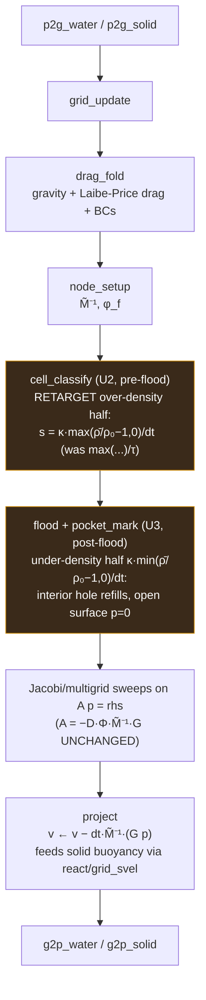

# fix: Two-field water incompressibility — implicit density-corrected projection

## Summary

Retarget the two-field solver's existing water pressure projection from a velocity-divergence constraint (`∇·v = 0`) plus a one-sided explicit density-relief source to an **implicit, two-sided density-corrected target** that drives the predicted node density to ρ₀. This reuses the already-certified consistent operator and Jacobi/multigrid solve — only the right-hand-side target and the free-surface gating change — so a standing pool holds ρ/ρ_rest near rest instead of over-compressing to ~5× and collapsing into a wall ring. PB-MPM (compliant-constraint MPM, same WebGPU/WGSL stack) is the named halt-for-redesign pivot if the front-loaded go/no-go gate fails.

---

## Problem Frame

Water poured into the V60 cup collapses into a thin dense ring at the wall with a hollow center. It is not geometry (a corner fillet and an interior cavity inset both only relocated the ring inward, reverted) and not a collocated-grid checkerboard mode (Rhie–Chow/MAC staggering was tried previously and rejected). The fluid is too compressible: a throwaway density probe measured cup water at mean ρ/ρ_rest ≈ 1.9× during pour and **≈ 5.0× standing (median 1.4×, p90 23×, max 24×), with ~27% of particles jammed into a shell at r ≥ cup radius, worsening monotonically over time** (see origin: Problem Frame).

Root cause (`src/solvers/twofield/pressure.wgsl`): the projection enforces `∇·v = 0`, which does not constrain density — a compacted static pool reads zero velocity divergence (the file header's "fully-compacted tank measures ZERO divergence" note). Density is corrected only by an explicit relief *source* folded into the rhs, which (a) cannot be stiffened — pushing the solve to 32 sweeps inflated the pool ~5× because it converges a one-sided expansion *source*, not a restoring constraint — and (b) leans on under-convergence as accidental damping for volume balance. A latent under-density suction term exists in `surface.wgsl::pocket_mark` but is gated `!near_air`, so it is suppressed at exactly the jet-evacuated hollow center.

The symptom reproduces in **WaterOnly** (single-phase, φ_s = 0), localizing it to the base water incompressibility; the two-field mixture coupling is a non-breaking constraint, not the cause.

---

## Key Technical Decisions

- **KTD-1 — Retarget the rhs, not the operator.** Keep the consistent corner-trilinear `D` / `G = −Dᵀ` operator and the `node_setup` M̃⁻¹ and Jacobi/coarse-multigrid solve exactly as-is. Change only what the same `A p = rhs` solve drives toward: from `(s_target − D·Φv)/dt` with one-sided `s_target = max(ρ̄/ρ₀ − 1, 0)/(τ·dt)` to a **two-sided density-corrected target** `s = κ·(ρ̄/ρ₀ − 1)/dt`, **split across two passes to respect the flood ordering**: U2 applies the over-density half `κ·max(ρ̄/ρ₀−1, 0)/dt` in `cell_classify` (pre-flood); U3 applies the under-density half `κ·min(ρ̄/ρ₀−1, 0)/dt` in `pocket_mark` (post-flood, where air labels exist). The *combined* U2+U3 effect is the two-sided target — neither pass alone is (folding the negative half into `cell_classify` is the round-1 blocker). This is a **single-shot implicit density-corrected projection** — a Baumgarte-style density-error→divergence controller. IISPH/DFSPH inspire it, but unlike them there is **no inner density-re-prediction loop**: the density error enters the rhs once per frame and the existing fixed sweeps converge toward that frozen target. Do not call it "density-invariant." Because it is single-shot at an under-converged budget it can still overshoot/ring, so acceptance must check frame-to-frame density-error oscillation/sign-flips and particle-side p90/p99 over a long settled window, not merely "does not inflate." The two-sidedness still fixes the prior failure (the detonation converged a one-sided expansion *source*). The certified operator gates (adjointness, MMS order, assembled-A SPD) stay valid because `A` is unchanged.
- **KTD-2 — Two-sidedness is the hole-refill, not a new term.** The under-density complement already exists (`surface.wgsl::pocket_mark` `s_under`), gated `!near_air`. The fix folds both halves into the implicit target and **reconciles the free-surface gating** so an interior under-dense hole refills while the true open surface stays at p = 0. This is a correctness unit, not a tuning knob.
- **KTD-3 — Reuse the existing buffers; no new storage buffer.** The lead mechanism changes the rhs computed into `cell_meta` (binding already present); it adds **no** grid buffer, so it stays under the per-entry-point storage ceiling (`MAX_STORAGE_BUFFERS_PER_ENTRY_POINT = 7`, device-granted limit 16). The storage-ceiling advantage over Candidate B (J-tracking adds a per-particle field) is verifiable now and holds; **perf-neutrality is conditional** on the sweep count not rising to reach ρ₀ (the density target may need more sweeps — measured in U2's go/no-go, not assumed). The stiffness κ goes in `Params.dbg.z` and a mode bit `pressure_rhs_mode` in `Params.dbg.w` — both verified-unused. **`dbg` truth table:** `dbg.x` = pressure-density-feedback enable for BOTH modes (0 disables for the isolation tests, as today); `dbg.w` = mode (0 = legacy `DENSITY_RELAX_FRAMES` relief, 1 = κ density target); `dbg.z` = κ (used only in mode 1). U2/U3 tests set the mode explicitly. **Not `dbg.y`:** it is written by `set_relief_deadband_for_test` (and zeroed in the settled-isolation arms), so not free even though no kernel currently reads it. **No `Params` resize.** Storage: the device requests 9 (`utils/gpu.rs::NEEDED_STORAGE_BUFFERS`) against a per-stage policy ceiling of 16; the lead stays ≤ 7 per entry point, so it adds none — the U8 browser check is "granted limit ≥ the widest entry point (7)," not "granted 16."
- **KTD-4 — Front-load the conservation gate as a go/no-go.** Volume balance currently leans on under-convergence as accidental damping; a genuinely converging constraint removes that crutch. The conservation gate at target stiffness (plus a ≥2000-step saturated-tail regime) runs **first**, gating all downstream units. Failing it is the explicit trigger to pivot to PB-MPM (KTD-7), not to tune.
- **KTD-5 — New acceptance gate asserts absolute interior mass.** The existing cup gate is blind (a centered hollow ring passes `radial_rms ≥ 0.75·initial` and `centroid_r ≤ 0.4·R`). The new R8 gate asserts **absolute interior fill / radial-mass profile** (a swelling rim is a passing accomplice if measured as a differential) and reads phase paired with the final snapshot to avoid the cell-order reorder artifact.
- **KTD-6 — Keep the relief safety-net selectable during bring-up.** Land the density-corrected target behind the `pressure_rhs_mode` bit (`dbg.w`) with the legacy one-sided relief still selectable; default to the density target only behind the go/no-go (mirrors the XPBD wall-pressure landing pattern). Note `set_relief_for_test`/`dbg.x` only toggles the *existing* relief family on/off — it cannot select legacy-vs-new, which is exactly why the new `pressure_rhs_mode` bit is required. The gate units pin the **mechanism-independent physics target** (ρ/ρ_rest ≲ 1.2× standing, interior fills), so test-first here is pinning acceptance criteria, not unsettled implementation.
- **KTD-7 — PB-MPM is the halt-for-redesign pivot, not a parallel build.** If U2's go/no-go cannot hold ρ/ρ_rest ≲ 1.2× at a real-time sweep budget, halt and redesign onto PB-MPM compliant constraints (open WGSL reference `g2p2g.wgsl`, same stack). This matches the parent program's no-pre-committed-fallback posture.

---

## High-Level Technical Design

The per-frame pressure family is unchanged in structure; the change is localized to the rhs target (`cell_classify` + `pocket_mark`) that the existing solve drives toward, plus the free-surface gating.

Directional guidance only; the prose KTDs are authoritative. The two amber nodes are the entire behavioral change — everything else (operator, solve, transfers, coupling) is reused as-is.

---

## Requirements

Traceability to origin (`docs/brainstorms/2026-06-16-twofield-water-incompressibility-requirements.md`).

- R1. A standing pool holds ρ/ρ_rest ≲ 1.2× with no upward drift over a long run (origin R1).
- R2. The density correction is two-sided — an evacuated interior hole refills (origin R2), via KTD-2's free-surface reconciliation.
- R3. A poured cup fills as a coherent pool, not a wall ring (origin R3).
- R4. Stable at the stiffness required for R1–R3 — no detonation/runaway inflation (origin R4).
- R5. R9 ≤ 33 ms @ 200k holds; fixed-point i32 grid, storage-buffer ceiling, Tint uniformity respected (origin R5).
- R6. All twofield L0–L3 gates stay green: Terzaghi/Skempton, volume conservation, no-fluidize, crater persistence, face-velocity twin (origin R6).
- R7. The retargeted pressure preserves the mixture role (buoyancy/pore-pressure/drag, Drucker–Prager coupling) (origin R7).
- R8. A new gate detects the ring directly — absolute interior-fill / radial-mass; a centered hollow ring fails it (origin R8).
- R9. Density excess is a measurable, bounded regression signal — the **particle-side** ρ/ρ_rest distribution (mean and high-percentile), reorder-safe (origin R9).

---

## Implementation Units

Dependency order front-loads the go/no-go. **U2's go/no-go is a SETTLED-TANK feasibility gate** (uniform over-compression, no free-surface/hollow dependency): if over-density expansion alone cannot hold a uniform settled tank at the production budget (density + two-sided conservation + saturation), that is a true KTD-7 pivot. **Instability that appears ONLY with free-surface/hollow states is NOT a U2 pivot** — it is U3's domain (per U3's execution note, land U2+U3 atomically). This resolves the apparent conflict between "U2 failure → pivot" and "land U2+U3 atomically if over-density is unstable without suction": the former is about the settled tank, the latter about free-surface states.

### U1. New acceptance gates (interior-fill + standing-density), test-first

- **Goal:** Pin the mechanism-independent acceptance criteria and characterize the current failure, so every later unit has a real success signal (the existing cup gate is blind).
- **Requirements:** R1, R3, R8, R9.
- **Dependencies:** none.
- **Files:** `tests/twofield_cup.rs` (add an interior-fill / radial-mass gate to the poured- and static-cup scenes), `tests/twofield_pressure.rs` (extend the settled-tank long-run with a ρ/ρ_rest ≲ 1.2× standing assertion, reusing `deep_mean_node_density` / `top_decile_y`).
- **Approach:** Interior-fill metric = absolute particle mass (or count) in the interior annulus (r < ~⅔·R) below the surface vs. an expected-fill floor derived from the poured volume; report the rim annulus separately (do **not** assert a rim−center differential — KTD-5). Standing-density metric = a **particle-side** ρ/ρ_rest probe (the brainstorm's neighbor-count / per-spacing³ census, covering the near-wall annulus), asserting mean ρ/ρ_rest ≲ 1.2× AND a bounded high-percentile (p90/max). **Do not use `deep_mean_node_density` as the gate** — it averages node mass over the deep interior (≥2 cells from walls) and returns only a mean, so it is blind to the wall-ring tail, and a B-spline node average can read ≈ρ₀ even when particles pile into a sub-cell shell (the gate would pass while the ring persists). Keep node-mass density only as a secondary diagnostic. Read `phase`/density paired with the final position snapshot to avoid the reorder artifact.
- **Execution note:** Test-first. These gates pin the physics target and **must fail on current `HEAD`** (the ring) before any solver change — that failure is the characterization.
- **Patterns to follow:** `cup_stats` in `tests/twofield_cup.rs`; `independent_volume_gates_settled_tank` / `deep_mean_node_density` / `long_run_settled_tank_stays_settled` in `tests/twofield_pressure.rs`; the density probe shape from the brainstorm (neighbor-count or node-mass ρ/ρ_rest).
- **Test scenarios:**
  - Covers AE1. Poured cup, settle: interior annulus carries ≥ floor mass AND high-percentile ρ/ρ_rest bounded — currently FAILS (hollow ring).
  - Covers AE2. Static seeded pool, ≥2000 quiet steps: mean ρ/ρ_rest ≲ 1.2×, no upward drift — currently FAILS (drifts to ~5×).
  - Reorder safety: the interior-mass metric is invariant to the per-step cell-order permutation (assert on a single final snapshot or an order-invariant multiset).
  - Gate-gaming guard: the standing-density gate FAILS on a synthetic one-cell-wide over-dense ring whose node-mass average is ≈ρ₀ — proving the gate measures particle compaction, not node-mass smear.
- **Verification:** Both new gates compile and FAIL on current `HEAD` with the documented ring/over-compression numbers; they are mechanism-independent (reference only ρ/ρ_rest and interior mass, not solver internals).

### U2. Retarget the OVER-density rhs (pre-flood) + mode-bit ABI — settled-tank feasibility gate

- **Goal:** Retarget the over-density half of the rhs (in `cell_classify`, pre-flood) to the κ-scaled single-shot density target, add the mode-bit ABI, and prove on a **settled tank** that the mechanism reaches ρ≲1.2× within the production budget. The negative/suction half is retargeted in U3 (post-flood) — it must NOT land in `cell_classify`, which runs before the flood/air labels exist (folding suction in here would suck on open free-surface rows = the surface-pumping failure). This is the **feasibility go/no-go, not the visual/hole fix.**
- **Requirements:** R1, R4; gated by KTD-4 go/no-go.
- **Dependencies:** U1.
- **Files:** `src/solvers/twofield/pressure.wgsl` (`cell_classify` over-density rhs — the `s_target` line), `src/solvers/twofield/mod.rs` (κ in `Params.dbg.z`, mode bit in `Params.dbg.w`; retire/relabel `DENSITY_RELAX_FRAMES` usage), `src/solvers/twofield/common.wgsl` (Params doc — no struct resize), `tests/twofield_pressure.rs` (CPU twin: the density-target rhs + its twin test — the D/G/A operator twins `twin_from_gpu`/`coarsen`/assembled-A are unchanged; **there is no `src/solvers/twofield/pressure.rs`** — the operator twins live in this test file).
- **Approach:** In `cell_classify` (pre-flood), replace the over-density relief source `max(ρ̄/ρ₀−1,0)/(τ·dt)` with the κ-scaled over-density target `κ·max(ρ̄/ρ₀−1,0)/dt` at the same dimensional order as `div` (KTD-1 dt-power). **Keep it over-density-only here** (the clamp at zero stays). Add κ (`dbg.z`) and `pressure_rhs_mode` (`dbg.w`, 0 = legacy relief, 1 = density target) so legacy stays selectable (KTD-6). **`A` is unchanged**; single-shot per frame (KTD-1). The uniformly over-compressed settled tank (the ~5× standing failure) is relieved by over-density expansion alone — the hole refill (suction) is U3.
- **Execution note:** Land behind `pressure_rhs_mode`; default to the density target only behind the go/no-go.
- **Technical design (directional):** the density target must enter at the **same dimensional order as the divergence term**. The current `s_target = relief/(RELAX·dt)` already sits at the same order as `div` *before* the outer `/dt`; the new target is `s = κ·max(ρ̄/ρ₀−1,0)/dt`, then `rhs = f·(s − D·Φv)/dt` applies the outer `/dt` **once**. A double `/dt` (≈`dt`-mismatched from `div`) is a correctness bug, not a calibration choice — pin the dt-power in the CPU twin. κ's magnitude is the calibration knob; the dt-power is not.
- **Patterns to follow:** the existing `s_target`/`cell_meta` write in `cell_classify`; the `dbg.x`/`set_relief_for_test` flag wiring in `mod.rs`.
- **Test scenarios:**
  - Covers AE2/AE4. A uniformly over-compressed settled tank at production budget (mode = density) converges to particle-side ρ/ρ_rest ≲ 1.2× (mean + p90/p99) with NO frame-to-frame oscillation/sign-flips (the prior 32-sweep 5× inflation does not recur — two-sided restoring controller, not a source).
  - **Go/no-go (KTD-4) — a settled-tank FEASIBILITY gate, not visual success. Pre-register the exact criteria BEFORE results: production budget = `coarse_ratio 4, FINE 8, COARSE 8` (the full triple — any change including the coarse ratio is an explicit named-budget change that updates the dispatch/R9 gates, NOT silent tuning → otherwise a KTD-7 pivot); max R9 ≤ 33 ms; ρ-bar ≲ 1.2× particle-side.** At production 8+8 with mode = density, ALL must hold: particle-side standing density ≲ 1.2× (mean + high-percentile) with no oscillation; a **two-sided** conservation arm — closed-domain, BOTH upper AND lower bounds (`combined_conservation_v60_pour_deformable` only caps creation, so add an anti-drain lower bound; for V60 separate expected drainage/absorption from numerical loss); `r9_realtime_gate_200k_full_v60_pour` ≤ 33 ms; `isolate_settled_stirring_mechanisms` tail-KE **drops**; and NO velocity-cap / fixed-point-saturation driven "success" (gate max node occupancy, velocity-cap hit count, and an FP-saturation proxy — a clipped result is a FAIL, per `FP_SCALE = 2^18` headroom). HALT and pivot (KTD-7) on any failure. **The cup interior-fill/hole refill is NOT tested here** — a density-fixed wall annulus can pass this feasibility gate while the visual hollow persists; that is the U3 + ship gate.
  - CPU twin: the new density-target rhs matches its Rust twin to tolerance (`gpu_*_match_twin` shape), dt-power pinned.
- **Verification:** the settled-tank feasibility gate passes (mode = density) at production 8+8; no NaN over `soak_1000_steps_dam_break_no_nan`; cup interior-fill explicitly deferred to U3.

### U3. Retarget the UNDER-density half (post-flood) + free-surface label audit

- **Goal:** Refill a jet-evacuated interior hole while keeping the true open surface at p = 0 — the difference R3 hinges on. This lands the negative/suction half (in `pocket_mark`, strictly **after** the flood pass) plus the gating that decides which under-dense cells get the restoring target.
- **Requirements:** R2, R3.
- **Dependencies:** U2.
- **Execution note:** U2 (over-density) and U3 (under-density + gating) together constitute the full two-sided mechanism; if bring-up shows the over-density half is unstable without the post-flood suction, land U2+U3 as one atomic change rather than sequentially.
- **Files:** `src/solvers/twofield/surface.wgsl` (`pocket_mark` `s_under` retarget to `κ·min(ρ̄/ρ₀−1,0)/dt` + the `near_air` exemption — the closure test lives HERE, after the flood pass, where the air/`FLOOD_OUTSIDE` labels exist; `cell_classify` cannot evaluate air-adjacency).
- **Approach:** **First, a pre-registered LABEL AUDIT** on the failing cup cavity — classify the hollow's cells as active-fluid rows vs `CELL_AIR` vs `FLOOD_OUTSIDE` vs `CELL_POCKET`. **If the hollow is outside-connected air** (no active rows to suck on), do NOT attempt local suction tuning: the refill must come from **over-density expansion in the surrounding fluid plus hydrostatic leveling** (gravity) — the U2 over-density half pushing neighbors inward while gravity levels the surface — or it is a KTD-7 pivot trigger. Only if the hollow contains *enclosed* (pocket / non-OUTSIDE) under-dense rows does the post-flood under-density retarget apply: refine the `near_air` gate so an enclosed under-dense cell gets `κ·min(ρ̄/ρ₀−1,0)/dt`, while a cell adjacent to true OUTSIDE air stays at p = 0. Preserve the bubble machinery's air-cavity rows unchanged. **Falsification (pre-registered, expected not incidental):** refilling air-adjacent cells risks re-enabling the surface-pumping the existing `!near_air` gate prevents; if no local predicate satisfies BOTH the interior-fill gate AND the hydrostatic-profile/surface guard at production budget, that is a **KTD-7 pivot trigger** (open-cavity geometry needs the bubble machinery's global closure, not a local `near_air` refinement).
- **Technical design (directional):** the suction gate becomes a closure test (under-dense AND not OUTSIDE-connected air) rather than the blanket `!near_air`. Exact predicate is a calibration point — but the label audit decides up front whether ANY local predicate is viable.
- **Implementation note (buffer hazard):** `pocket_mark` zeroes the pressure ping-pong (`pf_src`/`pf_dst`) in the same dispatch — if the closure predicate reads neighbor flood/`OUTSIDE` labels, keep the label buffer stable (write the pressure zeroes to the opposite ping-pong, or split the clear) so the predicate never reads a buffer it is clearing.
- **Patterns to follow:** `flood_init`/`flood_sweep` OUTSIDE labeling and the `near_air` neighbor test in `surface.wgsl`; the `CELL_AIR`/`CELL_POCKET` categories.
- **Test scenarios:**
  - Covers AE1. Poured cup interior-fill gate (U1) PASSES — the hollow center fills (whether via post-flood suction OR over-density expansion + leveling, per the label audit).
  - The open free surface stays at p ≈ 0: `coarse_seed_ab_and_hydrostatic_profile` (hydrostatic slope/R²) stays green; the surface is not sucked flat.
  - Pocket/bubble gate unaffected: `poured_cup_water_fills_not_corner`'s settled |λ| stays < 100 (no spurious enclosed-pocket regression).
- **Verification:** U1 interior-fill passes; hydrostatic-profile and pocket gates stay green; visual cup (U8) fills with no persistent hole — or the label audit/falsification fires a KTD-7 pivot.

### U4. Re-certify operator, divergence-decay, and multiphase face-velocity gates

- **Goal:** Prove the retargeted solve is still operator-consistent and that the divergence/density error decays below tolerance with budget (not a plateau).
- **Requirements:** R4, R6.
- **Dependencies:** U2 for the operator-adjointness/SPD re-run (A is unchanged, so these need only U2 and can run alongside U3); U3 for the divergence-decay and face-velocity re-runs (they consume the surface rows U3 touches).
- **Files:** `tests/twofield_pressure.rs` (assembled-operator adjointness/SPD + divergence-decay re-run against the retargeted rhs/surface rows), `tests/twofield_coupling.rs` (`face_velocity_consistency_rhs_carries_drag_and_phi`).
- **Approach:** Re-run the U3-layer certification on the operator-with-surface-handling actually used by the retargeted solve (the certification does not transfer to a materially different exit operator). Confirm the error decays below tolerance with budget — a monotonic-but-plateauing residual is the A≠D·G signature and a FAIL.
- **Patterns to follow:** `gpu_operators_match_twins_and_are_adjoint`, `gpu_assembled_a_symmetric_and_positive`, `divergence_decay_static_tank` / `_dam_break_midsplash` (`DIV_TOL`, `DECAY_FACTOR_MIN`).
- **Test scenarios:**
  - Assembled A stays SPD and adjoint with the new rhs/surface rows.
  - Density/divergence error decays by ≥ the recorded factor with sweeps (no plateau above tolerance).
  - Multiphase face-velocity consistency holds (the velocity feeding the divergence carries drag + φ consistently with the momentum update).
- **Verification:** all `twofield_pressure.rs` operator/decay gates green on the retargeted solve; face-velocity twin green.

### U5. Preserve the two-field mixture coexistence (buoyancy, Terzaghi, crater)

- **Goal:** Confirm the retargeted pressure still feeds the solid coupling and that L1–L3 macro gates hold; fix any interaction the new target introduces.
- **Requirements:** R6, R7.
- **Dependencies:** U2, U3.
- **Files:** `src/solvers/twofield/coupling.wgsl` and `src/solvers/twofield/plasticity.wgsl` (only if a fix is needed; expected verification-only), `tests/twofield_full.rs`, `tests/twofield_coupling.rs`, `tests/twofield_bed.rs`.
- **Approach:** `project` still applies `∇p` to both water `dv` and the solid buoyancy (`react`, `grid_svel`); verify the new pressure magnitude/target does not distort buoyancy or pore-pressure partition. Re-run the saturated-bed crater, Terzaghi/Skempton consolidation, stress-partition, and no-fluidize gates.
- **Test scenarios:**
  - Covers AE3. `center_pour_craters_saturated_deformable_bed_and_holds` stays green (crater persists).
  - `terzaghi_consolidation_two_lengths_skempton_and_load_sharing`, `buoyant_reaction_equals_displaced_weight`, `static_saturated_column_stress_partition_audit`, `saturated_bed_under_pour_does_not_fluidize` stay green.
- **Verification:** full coupling/full/bed suites green; any required coupling fix is minimal and localized.

### U6. Settled-stirring + PIC-blend reconciliation

- **Goal:** Close the origin's assumption-to-verify — fixing the base incompressibility should starve the settled-pool stirring (same one-sided-relief + under-convergence family); reconsider the PIC blend without regressing it.
- **Requirements:** R1, R6.
- **Dependencies:** U2, U3, U5.
- **Files:** `src/solvers/twofield/mod.rs` (`PIC_BLEND_DEFAULT` only if the stirring source is gone), `tests/twofield_settled.rs`.
- **Approach:** The tail-KE **drop** is already a U2 go/no-go assertion (a rise halts), so the stirring re-measurement is not new work here. U6's remaining work is **contingent**: only if the stirring source measurably collapsed, evaluate lowering `PIC_BLEND_DEFAULT` (the shipped mitigation) — a behavioral change, so it is optional and may be deferred to follow-up if the gain is marginal; keep `pic_blend_default_in_documented_band` honest and do not silently break the settled gates. If stirring did not collapse, U6 is a no-op.
- **Test scenarios:**
  - `isolate_settled_stirring_mechanisms` tail-KE drops vs. the recorded baseline (the density-error source is starved).
  - `isolate_cup_edge_ring` reflects the fixed behavior; `pic_blend_default_in_documented_band` stays valid for whatever blend ships.
- **Verification:** settled suite green; any PIC-blend change is justified by the re-measured isolation arms, not arbitrary.

### U7. Perf / R9 and dispatch-budget re-validation

- **Goal:** Confirm the retarget holds the real-time budget.
- **Requirements:** R5.
- **Dependencies:** U2.
- **Files:** `tests/twofield_perf.rs`.
- **Approach:** The lead reuses the existing solve and adds no buffer, so cost should be ~neutral; verify. If the density target needs more sweeps to hit ρ ≲ 1.2×, budget against the ~7.6 ms headroom (and `bubble_fine` at 34.5%) and pre-register the wall-clock ceiling — meeting tolerance only at non-real-time sweep counts is a FAIL now, not later (and a KTD-7 pivot trigger).
- **Test scenarios:**
  - `r9_realtime_gate_200k_full_v60_pour` ≤ 33 ms median.
  - `dispatch_budget_within_recorded_formula` and `linearity_40k_to_200k_within_preregistered_factor` hold (update the recorded formula only if the sweep count legitimately changed).
- **Verification:** R9 green at the sweep budget that satisfies R1.

### U8. Full-suite verification, calibration, and in-browser check

- **Goal:** Calibrate the stiffness knob + gate thresholds, prove the whole suite green, and verify the fix in the browser (Tint compile + visual + storage-grant).
- **Requirements:** R1–R9.
- **Dependencies:** U1–U7.
- **Files:** all `tests/twofield_*.rs`; wasm build to `www/pkg`; browser verification (the WebGPU storage-buffer grant and Tint compile cannot be checked in CI — no headless WebGPU).
- **Approach:** **Automated completion gate:** `cargo fmt --check`, `cargo clippy --all-targets -- -D warnings`, the full twofield suite, and `r9_realtime_gate` all green, with the `dbg.z` stiffness knob locked at the lowest value for which the U1 standing-density gate passes within R5 (the acceptance bound is fixed *before* the sweep, not discovered during it). **Manual sign-off (out-of-band — no headless WebGPU in CI):** rebuild wasm and confirm in-browser the cup fills (not rings), console is Tint-clean, and the granted `max_storage_buffers_per_shader_stage` covers the recorded widest entry point (≥ 7; the device currently requests 9).
- **Test scenarios:**
  - **Ship gate (the real success bar):** the particle-side standing-density gate AND the absolute interior-fill cup gate AND the two-sided (both-bounds) conservation arm pass *together* — a hollow or depleted cup must not pass on density or conservation alone (U2's go/no-go was only settled-tank feasibility).
  - Full twofield suite green (bed, cavity, coupling, cup, full, infiltration, perf, pressure, scaffold, settled, water).
  - In-browser WaterOnly + Two-field: cup fills as a pool (visual), console clean, no pipeline-creation failure.
- **Verification:** the ship gate + entire suite + R9 green; browser cup visibly fills; fmt/clippy clean (modulo the documented pre-existing reds).

---

## Scope Boundaries

- Base **water** incompressibility (the WaterOnly repro) is the target; the two-field mixture is carried as preservation gates (U5), not redesigned.
- The lead mechanism is the implicit density-corrected projection. Candidate B (MLS-MPM J-tracking) and explicit EOS are **not** built (see Alternatives).
- No corner geometry / fillet / inset (reverted; not the cause). No Rhie–Chow/MAC staggering (tried, rejected). No "converge harder" on the existing one-sided relief.

### Deferred to Follow-Up Work

- A per-particle water-volume (J) field — only if the node-density target proves too noisy near the free surface and U3 cannot reconcile it (would revisit Candidate B).
- Any `bubble_fine` perf optimization beyond what R5 requires.
- Broader smooth-fluid surface rendering of the now-correct pool.

---

## Alternative Approaches Considered

- **PB-MPM compliant-constraint MPM (the pivot, KTD-7).** A semi-implicit compliant constraint, unconditionally stable at any timestep, with open WGSL reference (`electronicarts/pbmpm`, `g2p2g.wgsl`) on this exact WebGPU stack. Larger rewrite (maps the compliant solve onto the fixed-point grid + mixture); reserved as the halt-for-redesign path if U2's go/no-go fails, not built in parallel.
- **Candidate B — MLS-MPM per-particle volume J tracking.** Mirror the solid `fmat`/`g2p_solid` deformation-gradient machinery into the water transfers and drive pressure from `J − 1`. Most accurate density signal, but adds a per-particle buffer (storage-ceiling pressure) and competes with the `bubble_fine` perf budget. Held as the deferred upgrade if node-density proves too noisy.
- **Explicit EOS pressure (Tait/weakly-compressible).** Rejected: at incompressible stiffness the sound-speed CFL limit forces a sub-1/60 s timestep — this *is* the measured detonation. Only viable as an opt-in, default-off pre-projection stabilizer, not the shipped mechanism.

---

## Risks & Dependencies

- **R-1 (highest) — volume conservation crutch.** Volume balance secretly leans on under-convergence as accidental damping; a converging constraint removes it — and can fail by *draining* as well as inflating. *Mitigation:* KTD-4 front-loads a **two-sided (both upper AND lower bound)** conservation + ≥2000-step saturated-tail gate as U2's go/no-go (a creation-only cap would silently pass a draining/depleting target); failing it triggers the KTD-7 pivot, not tuning.
- **R-7 — single-shot controller overshoot.** The density target is applied once per frame at an under-converged budget (a Baumgarte-style controller, not an inner IISPH density loop), so it can overshoot/ring or settle into a biased limit cycle. *Mitigation:* U2's go/no-go checks frame-to-frame oscillation/sign-flips and particle-side p90/p99, and treats a tail-KE *rise* as a halt.
- **R-2 — free-surface gating.** Getting the interior-hole-refills-vs-open-surface-stays-p0 distinction wrong either leaves the ring or sucks the surface flat. *Mitigation:* U3 is a dedicated correctness unit with both the interior-fill gate and the hydrostatic-profile gate as guards.
- **R-3 — A≠D·G plateau false-pass.** A self-consistent operator can still pass adjointness while the retargeted solve plateaus above tolerance. *Mitigation:* U4 re-runs divergence-decay (decay-below-tolerance, not plateau) on the exact retargeted exit operator.
- **R-4 — perf.** If the density target needs more sweeps, it competes with the ~7.6 ms headroom / `bubble_fine` 34.5%. *Mitigation:* U7 pre-registers the wall-clock ceiling; non-real-time sweep counts are a pivot trigger.
- **R-5 — mixture distortion.** A different pressure magnitude could distort buoyancy/pore-pressure. *Mitigation:* U5 re-runs the Terzaghi/buoyancy/crater/no-fluidize suite.
- **R-6 — test methodology traps.** Reorder artifact (fake per-particle drift) and rim-swelling-as-passing-accomplice. *Mitigation:* KTD-5 — absolute interior mass, final-snapshot phase pairing.
- **Dependency:** browser verification is required (no headless WebGPU in CI) for the storage-buffer grant and Tint compile.

---

## System-Wide Impact

- Changes are confined to `src/solvers/twofield/` (pressure/surface, with mod.rs knob); XPBD (the referee) is untouched.
- CPU twins: the operator twins in `tests/twofield_pressure.rs` stay valid (operator unchanged); the new density-target rhs needs a twin (U2). (There is no `src/solvers/twofield/pressure.rs`.)
- The fix may let the shipped `PIC_BLEND_DEFAULT` mitigation relax (U6) — a downstream simplification, not a requirement.
- No `Params` ABI resize (knob in `dbg.z`), so the 256-byte mirror and all byte-offset assertions are unaffected. (Aside: `common.wgsl`'s struct comment says "160 bytes" while the Rust `Params` asserts 256 — a pre-existing codebase doc bug worth fixing in passing, not a plan change.)

---

## Sources & Research

- Origin requirements: `docs/brainstorms/2026-06-16-twofield-water-incompressibility-requirements.md` (problem, measurements, candidate space, prior art).
- Parent program: `docs/plans/2026-06-09-001-feat-unified-twofield-solver-plan.md` (KTD-2 operator-consistency gate; KTD-7 storage budget; no-fallback posture).
- Prior family fix: `docs/plans/2026-06-15-001-fix-wet-sand-crater-stirring-plan.md` (the "volume conservation leans on under-convergence" warning; isolation arms; absolute-pit verification trap).
- Code map: `src/solvers/twofield/pressure.wgsl` (`cell_classify` `s_target`, `node_setup`, `project`, D/G, Jacobi/coarse; `DENSITY_RELAX_FRAMES`, `JACOBI_OMEGA`, `SURF_*`), `src/solvers/twofield/surface.wgsl` (`pocket_mark` `s_under` + `near_air`, bubble λ), `src/solvers/twofield/coupling.wgsl` (drag fold, φ_f, mixture role), `src/solvers/twofield/plasticity.wgsl` (`fmat`/`g2p_solid` — Candidate B mirror), `src/solvers/twofield/mod.rs` (`Params.extra`/`dbg`, dispatch order, `read_*`, `max_occupancy` proxy, `set_relief_for_test`, `MAX_STORAGE_BUFFERS_PER_ENTRY_POINT = 7`, `FP_SCALE = 2^18`).
- Gates: `tests/twofield_cup.rs` (blind gates + over-compression footer), `tests/twofield_pressure.rs` (`independent_volume_gates_settled_tank`, `deep_mean_node_density`, `long_run_settled_tank_stays_settled`, divergence-decay, assembled-A), `tests/twofield_perf.rs` (`r9_realtime_gate_200k_full_v60_pour`, `REALTIME_MS_GATE = 33.0`), `tests/twofield_full.rs` / `twofield_coupling.rs` / `twofield_bed.rs` / `twofield_settled.rs` (coexistence).
- Perf state: `docs/PERF_NOTES.md` (R9 ≈ 25.4 ms @ 207k; `bubble_fine` 34.5%; ~7.6 ms headroom).
- External prior art (web, 2026-06-16): PB-MPM (EA SEED, SIGGRAPH 2024) — https://www.ea.com/seed/news/siggraph2024-pbmpm , https://github.com/electronicarts/pbmpm ; IISPH/DFSPH implicit density-invariant pressure (the *inspiration* for the lead's single-shot density-corrected controller — note ours is single-shot, not a full inner density loop) — https://interactivecomputergraphics.github.io/physics-simulation/examples/iisph.html ; incompressible MPM operator-splitting (the current `∇·v` family) — https://www.sciencedirect.com/science/article/abs/pii/S0021999116305721 ; weakly-compressible EOS sound-speed/CFL wall — https://arxiv.org/pdf/2310.04139 .
- Constraints: `AGENTS.md` (storage ceiling 16/granted, smallest-correct-change, never delete/ignore tests, verification commands), `KEEP.md` (fixed-point grid), Tint uniformity + no-indirect-dispatch (in-file headers).
