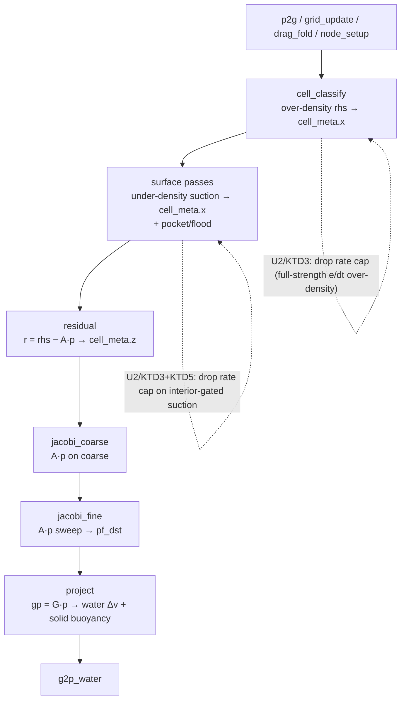

# fix: Two-field water — uncapped two-sided density relief (over-pack)

> **Revised 2026-06-17 (during /ce-work):** the original plan's central mechanism — a PB-MPM-style **compliance diagonal** `(A+αI)` — was implemented and then **dropped**. Calibration showed compliance is harmful here (it Tikhonov-damps the pressure response → softer → *more* over-pack), and that the simple **uncapped two-sided density relief is the fix on its own**. The premise "the stiff target detonates and needs compliance" was wrong: the historical detonation was the *one-sided expansion* relief; a two-sided *restoring* target is stable without compliance (verified converged + on the violent pour). This doc is updated to match; the compliance machinery (former KTD2/U3, R7-finite-compliance) is struck. See **Empirical Findings** below.

## Summary

Make the two-field **water** phase pin density by **dropping the `DENSITY_RELAX_FRAMES` rate cap** on the existing two-sided density relief, so it drives `ρ→ρ₀` at full strength instead of as a slow stability-capped feedback. Solved on the **existing** D / G = −Dᵀ / M̃⁻¹ operator and the existing cell-centered `pf_*` field — the operator and pressure unknown are **unchanged**, so the bed↔water/crater coupling that reads `gp = G·p` is preserved by construction. The full-strength relief is stable (no compliance needed) because it is a **bounded two-sided restoring target**, not the one-sided expansion source that historically detonated.

The change is selector-gated (`dbg.w`) and inert by default until validated, then checked against direct gates (interior-fill, ρ/ρ_rest, no-suction-leak, model-isolation) and the full L0–L3 suite.

---

## Problem Frame

Water poured (or statically seeded) into the V60 cup over-packs and does not refill an evacuated center, because the incompressibility *model* — not its convergence — is the constraint. The projection enforces `∇·v = 0`, which is blind to compaction (a static fully-compacted pool measures zero divergence). Validation this session: fine sweeps 8→64 barely move the over-pack (1.80×→1.77×); relief-off → 2.86×. "Converge harder" does not fix it — the constraint *target* is wrong. (Caveat: the sweep rules out under-convergence, not the corner-seam BC or the APIC/PIC blend; isolating the model is R11.)

**Plan-time discovery (reading the passes):** the solver is *already two-sided*. The over-density relief lives in `cell_classify` (`src/solvers/twofield/pressure.wgsl:494`, `s_target = max(ρ̄_c/ρ_rest − 1, 0)/(DENSITY_RELAX·dt)`) and the **under-density (suction) half already exists**, interior-gated, in `src/solvers/twofield/surface.wgsl:175–202` (`deficit = min(ρ̄_c/ρ_rest − 1, 0)`, gated `!near_air`, folded into the same solved rhs lane `cell_meta.x`). So the missing piece is **not** "add a suction path." Both halves are **rate-limited relief sources** (`/(DENSITY_RELAX_FRAMES·dt)`) — a slow, stability-capped feedback into a `∇·v=0` projection. The fix is to **drop the rate cap** so the relief drives `ρ→ρ₀` at full strength. (The original plan further proposed a compliance diagonal to stabilize it; calibration showed that is unnecessary — the full-strength two-sided relief is already stable because it is a *bounded restoring* target — and harmful — compliance re-softens it. See Empirical Findings.)

**The bed-coupling contract (must not break).** "The pore pressure IS the projection pressure" (`pressure.wgsl:903–906`). `project` gathers `gp = G·p` from `pf_*`, applies water `v −= dt·M̃⁻¹·Gp`, and applies solid buoyancy `Δv_s = −(dt/ρ_s)·gp` from the *same* `gp` (`pressure.wgsl:853–928`). Keeping `pf_*` and `A = D·M̃⁻¹·G` as the unknown/operator preserves this by construction. (With compliance dropped, the operator is the *unchanged* bare `A` — so the bed reads exactly the same `∇p` it always did; the earlier "finite-compliance partition" caveat no longer applies.)

The over-pack reproduces in WaterOnly (φ_s = 0), localizing it to the base water incompressibility; the mixture coupling is a non-breaking constraint, not the cause.

---

## Requirements Trace

From the origin requirements doc (see origin: `docs/brainstorms/2026-06-17-twofield-water-compliant-density-projection-requirements.md`):

- **R1** standing pool holds ρ/ρ_rest near rest, no upward drift (≲1.2× working bar) → U4
- **R2** two-sided correction (over-dense expands, under-dense interior refills) → U2, U4
- **R3** poured cup fills as a coherent pool, not a wall ring/packed corner → U2, U4
- **R4** stable at full-strength relief, no detonation → U2, U4 (the uncapped two-sided target is stable on its own — verified converged + on the violent pour; no compliance)
- **R5** fits the real-time gate (≤33 ms @ 200k), fixed-point i32, no new storage buffer, Tint uniformity → U1, U2, U5
- **R6** all L0–L3 gates stay green → U5
- **R7** pore pressure unchanged in kind; `σ_total = σ' + u` still closes (operator is the **unchanged bare A** — no compliance; existing static `twofield_full.rs:899–929` + dynamic `:946–1036`) → U5
- **R8** a direct interior-fill / radial-mass gate that fails a centered ring / packed corner → U4
- **R9** ρ/ρ_rest measurable & bounded as a regression signal → U4
- **R10** suction does not leak to surface/pockets (free-surface height + pocket λ bounded) → U4
- **R11** model-isolation gate (flat node-aligned box vs SDF cup at fixed `PIC_BLEND_DEFAULT`) → U4

---

## Key Technical Decisions

- **KTD1 — Reuse the existing operator and pressure field.** Keep `pf_*` as the unknown and `A = D·M̃⁻¹·G` (G = −Dᵀ) as the operator. The bed reads the same `gp = G·p`, so buoyancy/Terzaghi are preserved structurally. *Rationale:* the bed contract makes a cell-centered grid pressure mandatory; a particle PB-MPM (rejected) produces position deltas, not a grid `∇p`.
- **KTD2 — Compliance diagonal: evaluated and REJECTED (was the plan's centerpiece).** The original plan added `(A + αI)` for stability. Calibration showed it is *harmful* here: `+αI` is Tikhonov regularization that shrinks the pressure response → softer → *more* over-pack (monotonic in `α` at both budgets; `α=0.1` → interior 1.39 vs 1.04 at `α=0`). It was a fix for a non-problem — the two-sided target does not detonate (KTD3), so there was no instability to spend compliance on. Implemented (06373a6) then reverted (a30ba36); the `α`/`dbg.z` machinery is removed. *This is the plan's biggest change — see Empirical Findings.*
- **KTD3 — The fix: uncapped two-sided density relief.** On the `dbg.w` path, drop the `DENSITY_RELAX_FRAMES` rate cap so the existing two-sided relief — over-density `max(e,0)` in `cell_classify` + interior `!near_air` under-density `min(e,0)` in `surface.wgsl` — drives `ρ→ρ₀` at full strength (rate `e/dt` instead of `e/(30·dt)`). *Rationale:* the slow rate cap was the stiffness limiter; removing it is the over-pack lever (calibration: interior 1.29→1.04, wall 1.80→1.35). It is stable with **no compliance** because it is a *bounded two-sided restoring* target — unlike the one-sided *expansion* relief that historically detonated. The over-density half carries the over-pack fix (suction is analytically inactive on an over-dense pool); the suction fine-tunes the interior toward rest.
- **KTD4 — Positive pressure sign; do NOT import PBF λ.** The multiplier IS the existing cell-centered `pf_*` with *positive* pore pressure. The XPBD/PBF particle λ is per-particle and compression-negative (`max(−lambda,0)`); importing that convention would invert the bed sign. *Rationale:* sign trap flagged by Codex; the bed reads `pf_*` directly.
- **KTD5 — Two-sided suction on interior fluid rows only.** Keep the existing `!near_air` interior gate on the suction half; air-adjacent / free-surface rows are exempt. *Rationale:* suction leaking onto surface rows pulls the free surface up or re-crushes pockets (the chief risk, R10).
- **KTD6 — Selector-gated, inert-by-default, calibration-first.** Ship behind the `dbg.w` mode flag (alongside `dbg.x` relief on/off and `dbg.y` wall-BC mode) with `dbg.w` off ⇒ rate-capped relief = bitwise-identical to current. The uncapped target honors `dbg.x=0` (zero the density source) so the existing stirring-isolation gate (`set_relief_for_test`) still disables the source. Calibrate the target/bar empirically before pinning gates. *Rationale:* operator-consistency proof by byte-identity; `feedback_no_premature_tests` — confirm behavior before pinning invariants. (This discipline is exactly what caught the compliance error before any gate was pinned.)
- **KTD7 — Re-point the `∇·v=0` divergence-decay gate for the uncapped mode (committed decision).** The L0 gate `u3_rerun_divergence_decay_mid_jet` (`tests/twofield_cavity.rs`) hard-asserts post-step grid-velocity divergence `< DIV_TOL = 0.3` (a 0.5%/frame density-change allowance). But the uncapped target **intentionally** leaves nonzero post-projection `∇·v` while it corrects density error: the rhs is a divergence *target* (`cell_meta.x = f·(s_target − Dv)/dt`, `pressure.wgsl`), so a solve that is correcting density deliberately does NOT drive `∇·v→0`. **Resolution (committed): re-point the gate to assert density-error / pressure-residual decay, not raw `∇·v`.** (Tuning the calibration to keep mid-jet `∇·v` small was rejected as non-physical: the leftover velocity divergence IS the density correction, not solver error.) Do **not** loosen `DIV_TOL`; re-point the gate's *invariant* from "the old model's `∇·v→0`" to "the new model's density-error/pressure-residual decay." **There are *several* raw post-projection `∇·v` gates, not one** — at least `tests/twofield_cavity.rs` (`u3_rerun_divergence_decay_mid_jet`), `tests/twofield_pressure.rs` (~`:700`), `tests/twofield_coupling.rs` (~`:1485`), `tests/twofield_full.rs` (~`:1368`). U5 must enumerate each and **classify it** when `dbg.w` flips on: a gate on a **density-erred** scene (target active, `s_target ≠ 0`) is re-pointed to density-error/residual decay; a gate on a **near-rest** scene (`s_target ≈ 0`, target vanishes) is *unaffected* (`∇·v → 0` still holds, no change needed); none is loosened or silently pinned to legacy without a stated reason. Most likely L0 regression; the metric + per-gate classification are owned by U4, the run by U5.

---

## High-Level Technical Design

The pressure solve is a damped-Jacobi multigrid V-cycle; `A·p = D(M̃⁻¹(G·p))` is composed inline (never a stored stencil). The fix touches **one surface only**: the **rhs target** (set before the sweeps, in `cell_classify` + `surface.wgsl`). The operator `A` and the bed coupling are **untouched** (the compliance diagonal was tried and dropped — see KTD2).

Directional only — the prose and per-unit fields are authoritative. The target change lands in `cell_classify` + `surface.wgsl`; `residual`/`jacobi_*`/`project` and the bed coupling are unchanged (bare `A`).

---

## Implementation Units

### U1. Density-target mode flag (`dbg.w`) + diagnostics (inert) — DONE (49cc207)

**Goal:** Add the `dbg.w` mode flag for the uncapped density-target path, inert by default (byte-identical), plus calibration diagnostics.

**Requirements:** R5; enables R8–R11.

**Status:** shipped (49cc207). *Note: U1 originally also added the `α`/`dbg.z` compliance lane + `set_compliance_for_test`; removed in a30ba36 when compliance was dropped (KTD2). `dbg.z` is now reserved.*

**Files:**
- `src/solvers/twofield/mod.rs` — `dbg.w` mode flag (a free uniform `Params` lane; 256-byte layout unchanged, no new storage buffer) + `set_density_target_mode_for_test`.
- `src/solvers/twofield/{pressure,common}.wgsl` — `dbg.w` lane docs; no behavior at the default.
- Diagnostics: the ρ/ρ_rest baseline is logged by the existing wall-audit probes (`mean_nb`, `probe_v60_cup`) — not reimplemented; the interior-core mass-fraction metric is U4's gate.

**Execution note / Verification:** byte-identical at `dbg.w` off — confirmed (CPU operator SPD + GPU operator adjoint/twin gates green).

### U2. The fix: uncapped two-sided density relief (`dbg.w`) — DONE (06373a6, a30ba36)

**Goal:** On the `dbg.w` path, drop the `DENSITY_RELAX_FRAMES` rate cap so the existing two-sided density relief drives `ρ→ρ₀` at full strength.

**Requirements:** R2, R3, R4 (stable as a bounded restoring target), R10 (interior gate).

**Dependencies:** U1.

**Files:**
- `src/solvers/twofield/pressure.wgsl` — `cell_classify` over-density half: on `dbg.w`, `s_target = dbg.x·max(e − DEADBAND, 0)/dt` (rate `e/dt`, no `DENSITY_RELAX` cap) instead of `…/(DENSITY_RELAX·dt)`; the legacy `else` is unchanged.
- `src/solvers/twofield/surface.wgsl` — the interior `!near_air` under-density suction: matching uncapped rate `min(e+DEADBAND,0)/dt` on `dbg.w` (the `!near_air` interior gate kept, KTD5).
- `DENSITY_TARGET_DEADBAND` WGSL const (default 0; structural const, not a Params slot).

**Approach:** Both halves drop the rate cap on the `dbg.w` path; the legacy `else` (rate-capped) is byte-identical with `DEADBAND=0`. Both multiply by `dbg.x` so the stirring-isolation gate (`dbg.x=0`) still zeros the source (KTD6). Positive sign (KTD4). Stable with **no compliance** — a bounded two-sided restoring target (KTD3). The over-density half carries the over-pack fix; the suction (analytically inactive on an over-dense pool) fine-tunes the interior toward rest.

**Test scenarios / Verification:** legacy path byte-identical (✓ operator + full-step divergence gates); empirically — static cup interior 1.29→1.04, wall 1.80→1.35 (converged 1.22); stable on the violent pour (no detonation, no sustained pocket — pour λ drains to 0). Durable gates pinned in U4.

### U3. Compliance diagonal — EVALUATED AND REJECTED (06373a6 → reverted a30ba36)

**Outcome:** the compliance diagonal `(A + αI)` (this plan's original centerpiece) was implemented across `residual`/`jacobi_fine`/`jacobi_coarse` (pocket-excluded), then **reverted**. Calibration (U4) showed it is *harmful*: `+αI` is Tikhonov regularization that shrinks the pressure response → softer → *more* over-pack (monotonic in `α` at both budgets; `α=0.1` → interior 1.39 vs 1.04 at `α=0`). It was a fix for a non-problem — the uncapped two-sided target (U2) does not detonate, so there was no instability to spend compliance on. The `α`/`dbg.z` machinery is removed; the operator is the unchanged bare `A`, so the GPU↔CPU compliant-operator cert and the finite-compliance partition (R7) are moot. See KTD2 + Empirical Findings. No further work in this unit.

### U4. Pin the durable direct gates (calibration done) — NEXT

**Goal:** Pin the durable gates for the uncapped fix at the calibration-measured numbers, and define the KTD7 re-pointed divergence metric.

**Requirements:** R1, R2, R3, R8, R9, R10, R11.

**Dependencies:** U1, U2.

**Files:**
- `tests/twofield_cup.rs` — R8 interior-fill gate (interior-core mass-fraction floor; a centered hollow ring / packed corner fails) + R9 ρ/ρ_rest regression (mean & high-percentile bounded, uncapped vs legacy); R10 no-leak (free-surface height + pocket λ bounded with the target on — the `pour_uncapped_density_stability` probe already shows settle λ=0).
- `tests/twofield_wall_audit.rs` — R11 model-isolation gate (alongside `aligned_square_localize_overpack`: fixed `PIC_BLEND_DEFAULT`, `mean_nb` ρ/ρ_rest, flat `box_scene` vs `sdf_floor_scene`, the fix ON; pass when the flat-box over-pack ≤ R1 bar).

**Approach:** Calibration-first done (`feedback_no_premature_tests`) — the exploratory α-sweep + disentangling runs (this session) established the fix and overturned the compliance bet. Now **pin** the durable gates at the measured numbers. **R9 splits into two bars** (do NOT collapse to one, and do NOT over-tighten the wall):
  - *Clean model bar (near R1, ≲1.2×):* the **interior** core (uncapped ≈ 1.04 vs legacy 1.29) and the **R11 flat-box** model contribution — this is the strong incompressibility claim.
  - *V60 wall-shell regression bar:* pin at the measured **fix-vs-legacy separation** (uncapped 1.35 / converged 1.22 vs legacy 1.80) — NOT ≤1.2×, because the residual wall over-pack is partly the **deferred corner-seam BC** (this is `WALL_BC_SINGLE`), not the model. Assign that residual to the corner follow-up; the gate asserts "the fix materially beats legacy at the wall," not "wall = rest."
Plus R8 interior-core mass-fraction (fails a hollow ring) and R10 no-leak (settle λ bounded — measured 0 on the pour). Per KTD7, **define the re-pointed divergence-decay metric AND the per-gate classification here** — enumerate the raw `∇·v` gates (cavity mid-jet, `twofield_pressure.rs`, `twofield_coupling.rs`, `twofield_full.rs`), tag each density-erred (re-point) vs near-rest (unaffected) — so U5 runs the right set. *No `α` to calibrate (compliance dropped); no finite-compliance partition — the operator is the unchanged bare `A`, so R7's `σ=σ'+u` is just the existing partition gate, verified unchanged in U5.*

**Execution note:** Pin only what the calibration measured; each bar must fail legacy and pass the fix. Keep the clean-model bar (interior/flat-box) and the V60 wall regression bar SEPARATE — over-tightening the wall to ≤1.2× would wrongly fail the fix on the deferred corner-BC residual.

**Patterns to follow:** `mean_nb` + the A/B/C calibration in `tests/twofield_wall_audit.rs`; the existing cup gates in `tests/twofield_cup.rs`.

**Test scenarios:**
- Covers AE1: poured cup fills (interior carries mass, no hollow center / packed corner; ρ/ρ_rest ≲ bar) — fails a centered ring.
- Covers AE2: statically-seeded pool 400+ steps holds ρ/ρ_rest near rest (interior ≈ 1.04), no upward drift.
- Covers AE3: saturated deformable bed still craters & holds; Terzaghi/Skempton, volume-conservation, no-fluidize, buoyancy green (operator unchanged → expected intact; confirmed in U5).
- Covers AE5: with the target on, free-surface height does not rise and pocket λ does not re-crush (pour probe: settle λ=0).
- The divergence-decay gate (`u3_rerun_divergence_decay_mid_jet`) is **re-pointed** (KTD7) to assert density-error / pressure-residual decay — not raw `∇·v` (which the uncapped target intentionally leaves nonzero), and not by loosening `DIV_TOL`.
- R11: flat-box over-pack drops to ≤ the R1 bar at fixed blend (model contribution isolated).

**Verification:** R8/R9/R10/R11 green for the uncapped fix and red for legacy (where applicable); the re-pointed divergence metric defined.

### U5. L0–L3 regression, perf, and close-out

**Goal:** Flip the selector default to the uncapped path, run the full L0–L3 regression, confirm the real-time budget, and close out (selector retained as a one-release fallback).

**Requirements:** R5, R6.

**Dependencies:** U1, U2, U4.

**Files:**
- `src/solvers/twofield/mod.rs` — flip the `dbg.w` default to the uncapped path (keep the selector + setter for fallback/tests).
- `tests/twofield_*.rs` — full L0–L3 suite run (no new tests beyond U4; this is the regression + perf gate).

**Approach:** With the U4 gates green, flip the `dbg.w` default. Run the full L0–L3 suite (operator adjoint/SPD, Terzaghi/Skempton incl. the static + dynamic `σ=σ'+u` partition (R7 — operator unchanged, expected intact), volume conservation, no-fluidize, crater persistence, buoyancy, face-velocity twin). Run the raw-`∇·v` gates per the U4 classification — the density-erred ones (cavity `u3_rerun_divergence_decay_mid_jet`, and any of `twofield_pressure.rs`/`twofield_coupling.rs`/`twofield_full.rs` tagged density-erred) **re-pointed** to density-error/pressure-residual decay (KTD7), the near-rest ones unaffected — this is the most likely L0 regression. Confirm the real-time gate (≤33 ms @ 200k) holds — only the rhs target changed (an `e/dt` vs `e/(30·dt)` scalar in `cell_classify`/`surface`); no new buffer, pass, or operator work. Corner-patch retirement is OUT of scope (separate follow-up).

**Execution note:** none (regression/perf gate).

**Patterns to follow:** the existing L0–L3 suite layout and the perf-gate harness used by the twofield program close-out.

**Test scenarios:**
- Full L0–L3 suite green with the uncapped path ON by default.
- `Test expectation: none — perf/regression gate` for the perf check itself (no new behavior, just the budget assertion).

**Verification:** Entire twofield suite green with the path on; real-time gate holds; selector still flips back to the legacy path bitwise (U1 invariant).

---

## Empirical Findings (during /ce-work, 2026-06-17)

Calibration-first execution (per `feedback_no_premature_tests`) overturned the plan's central mechanism *before* any gate was pinned. Evidence (`v60_cup_static_full`, box-interior = 1.0 via `mean_nb`):

| arm | wall ρ/ρ_rest | interior |
|---|---|---|
| legacy (rate-capped) | 1.80 | 1.29 |
| **uncapped (the fix)** | **1.35** (fine=64: 1.22) | **1.04** |
| uncapped + compliance α=0.1 | 1.42 | 1.39 |
| uncapped + compliance α=1.0 | 2.03 | 1.76 |

- **Compliance `(A+αI)` is harmful** — Tikhonov damping that shrinks the pressure response; over-pack rises monotonically with `α` at *both* the production budget and converged (fine=64). Implemented (06373a6), reverted (a30ba36).
- **The uncapped two-sided relief is the fix and is stable without compliance** — converged (fine=64) *and* on the violent pour (flow 8: no detonation, pocket_cells=0, pour λ drains to settle 0, like legacy SINGLE). The plan's "stiff target detonates → needs compliance" premise was wrong: the historical detonation was the *one-sided expansion* relief; a two-sided *restoring* target is intrinsically stable.
- **Disentangling:** the over-pack lever is the uncapped *over-density* relief (suction is analytically inactive on an over-dense pool, `min(e,0)=0`); suction only fine-tunes the interior toward rest (over-only gave interior 0.93, two-sided 1.04).
- **Residual wall over-pack (1.22–1.35) is partly the deferred corner-seam BC** (this run is `WALL_BC_SINGLE`); the interior 1.04× is the clean model signal. R11 isolates it.

---

## Scope Boundaries

- **In scope:** the water incompressibility model (uncapped two-sided density relief on the existing operator), its calibration, the new direct gates, and the L0–L3/perf regression with the path defaulted on. *(Compliance was in scope originally; evaluated and dropped — KTD2.)*

### Deferred to Follow-Up Work
- **Corner-seam `WALL_BC_MULTI` + pour-pocket patch retirement** — a separate later plan, once this fix's effect on the corner audit (`corner_parity_multi_drops_to_box`) and the R11 model-isolation gate is measured. Not retired here; the patches stay behind their `dbg.y` selector (off by default), unaffected by this work.

### Out of scope (non-goals)
- **Settled-pool stirring** — a separate APIC/PIC particle-dynamics root (convergence-insensitive), tracked independently; this fix must not regress it but does not address it.
- **Literal particle PB-MPM / per-particle J-tracking** — rejected in the origin (produces position deltas, not the grid `∇p` the bed reads).
- **XPBD solver, two-field mixture-coupling redesign, operator/wall-BC lockstep changes** — untouched; the pressure unknown and `gp` are unchanged.

---

## Risks & Dependencies

- **Legacy `∇·v=0` divergence-decay gate trips under the uncapped target (most likely L0 regression).** The uncapped target intentionally leaves nonzero post-projection `∇·v` while correcting density (the rhs is a divergence *target*), but `u3_rerun_divergence_decay_mid_jet` asserts `∇·v < DIV_TOL=0.3`. Mitigation: KTD7 (committed) — re-point the gate to assert density-error / pressure-residual decay; never loosen `DIV_TOL`.
- **Residual wall over-pack may not reach the R1 bar (≲1.2×) from the density fix alone.** Measured 1.22–1.35× — partly the deferred corner-seam BC (this is `WALL_BC_SINGLE`), not the model. Mitigation: R11 isolates the clean model contribution (interior ≈ 1.04×); pin the R9 bar to what the fix achieves and fails legacy, and leave the corner-BC residual to its follow-up rather than over-tightening.
- **Suction leaking to surface/pockets (R10).** Mitigation: the `!near_air` interior gate (KTD5) is preserved; the pour probe already shows settle λ=0 (no leak); pin the R10 gate in U4.
- **Violent-pour stability** — historically the detonation/pocket-trap regime. *Already verified OK* (flow 8: no detonation, no sustained pocket); re-confirmed by the L0 pour gates in U5.
- **Perf (R5).** Low risk — only an `e/dt` vs `e/(30·dt)` rhs scalar changed; no new buffer/pass/operator work; confirmed by the U5 real-time gate.

---

## Acceptance Examples (carried from origin)

- **AE1.** Poured cup fills, not rings/corners (R1, R2, R3, R8) → U4.
- **AE2.** Standing pool does not creep over 1000+ steps (R1, R4) → U4.
- **AE3.** Saturated bed still craters & holds; mixture gates green; `σ = σ' + u` closes (R6, R7; operator unchanged — bare A) → U5.
- **AE4.** No detonation at full-strength relief — verified converged + on the violent pour (R4) → U2, U4.
- **AE5.** Suction stays interior — no surface pull-up, no pocket re-crush (R10) → U4.

---

## Sources & Research

- Origin: `docs/brainstorms/2026-06-17-twofield-water-compliant-density-projection-requirements.md` (ACCEPT after 4-persona ce-doc-review + Codex gpt-5.5 xhigh ×3).
- `src/solvers/twofield/pressure.wgsl` — operator (`:7–30`), `node_setup` M̃⁻¹ (`:269–384`), over-density rhs (`:494`), `residual` (`:620–669`), `jacobi_fine` (`:672–738`), `jacobi_coarse` (~`:741–800`), bed coupling (`:853–928`, "pore pressure IS the projection pressure" `:903–906`).
- `src/solvers/twofield/surface.wgsl:175–202` — the existing interior `!near_air` under-density suction (folded into the solved rhs lane).
- `src/solvers/twofield/mod.rs` — `Params` layout / `dbg`-lane selectors / 7-storage-buffer ceiling; `PIC_BLEND_DEFAULT`.
- `tests/twofield_full.rs:899–929` (static partition), `:946–1036` (dynamic Skempton/load-sharing); `tests/twofield_cup.rs` (cup gates); `tests/twofield_wall_audit.rs` (`mean_nb`, `aligned_square_localize_overpack`, `corner_parity_multi_drops_to_box`).
- This session: validation that the over-pack is model-bound; Codex source-verified the no-new-buffer claim, the three `A·p` sites, the bed-coupling preservation, and the sign trap.
- Memory: `project_twofield_cup_compressibility`, `project_solver_redesign_sota`, `feedback_no_premature_tests`, `feedback_volume_conservation`.
