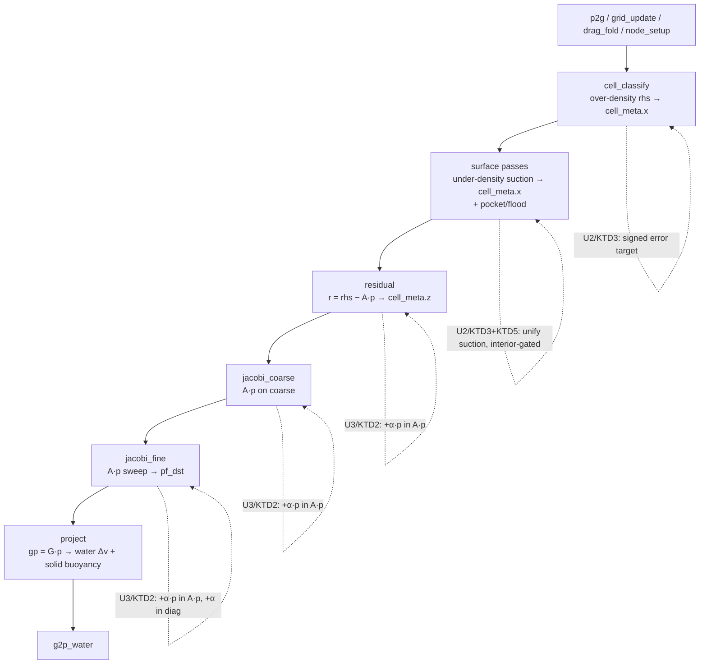

# fix: Two-field water — compliant predicted-density-error pressure projection

## Summary

Make the two-field **water** phase actually pin density by upgrading the existing pressure solve from a `∇·v = 0` projection with rate-limited density relief to a **two-sided predicted-density-error target stabilized by a compliance diagonal** — solved on the **existing** D / G = −Dᵀ / M̃⁻¹ operator and the existing cell-centered `pf_*` field. This is PB-MPM *in spirit* (the compliance diagonal = stability at any stiffness, no sound-speed CFL), not in letter (no particle method). Because the pressure unknown and the operator are unchanged, the bed↔water/crater coupling that reads `gp = G·p` is preserved structurally; the only physics check is that the Terzaghi partition still closes at finite compliance.

The work is selector-gated and inert by default until calibrated, then validated against new direct gates (interior-fill, no-suction-leak, model-isolation, finite-compliance stress-partition) and the full L0–L3 suite.

---

## Problem Frame

Water poured (or statically seeded) into the V60 cup over-packs and does not refill an evacuated center, because the incompressibility *model* — not its convergence — is the constraint. The projection enforces `∇·v = 0`, which is blind to compaction (a static fully-compacted pool measures zero divergence). Validation this session: fine sweeps 8→64 barely move the over-pack (1.80×→1.77×); relief-off → 2.86×. "Converge harder" does not fix it — the constraint *target* is wrong. (Caveat: the sweep rules out under-convergence, not the corner-seam BC or the APIC/PIC blend; isolating the model is R11.)

**Plan-time discovery (reading the passes):** the solver is *already two-sided*. The over-density relief lives in `cell_classify` (`src/solvers/twofield/pressure.wgsl:494`, `s_target = max(ρ̄_c/ρ_rest − 1, 0)/(DENSITY_RELAX·dt)`) and the **under-density (suction) half already exists**, interior-gated, in `src/solvers/twofield/surface.wgsl:175–202` (`deficit = min(ρ̄_c/ρ_rest − 1, 0)`, gated `!near_air`, folded into the same solved rhs lane `cell_meta.x`). So the missing piece is **not** "add a suction path." Both halves are **rate-limited relief sources** (`/(DENSITY_RELAX_FRAMES·dt)`) — a slow, stability-capped feedback into a `∇·v=0` projection. The fix is to **retarget** them to a true predicted-density-error target driving `ρ→ρ₀` (not a fixed slow relief rate), made stiff-but-stable by a **compliance diagonal** — the standard-stiff route that does not detonate (explicit stiffening already detonated: 32 sweeps inflated the pool ~5×).

**The bed-coupling contract (must not break).** "The pore pressure IS the projection pressure" (`pressure.wgsl:903–906`). `project` gathers `gp = G·p` from `pf_*`, applies water `v −= dt·M̃⁻¹·Gp`, and applies solid buoyancy `Δv_s = −(dt/ρ_s)·gp` from the *same* `gp` (`pressure.wgsl:853–928`). Keeping `pf_*` and `A = D·M̃⁻¹·G` as the unknown/operator preserves this by construction — the one caveat is that the compliance term makes the converged `p` slightly compliant, so the stress partition must be re-verified at finite `C` (R7).

The over-pack reproduces in WaterOnly (φ_s = 0), localizing it to the base water incompressibility; the mixture coupling is a non-breaking constraint, not the cause.

---

## Requirements Trace

From the origin requirements doc (see origin: `docs/brainstorms/2026-06-17-twofield-water-compliant-density-projection-requirements.md`):

- **R1** standing pool holds ρ/ρ_rest near rest, no upward drift (≲1.2× working bar) → U4
- **R2** two-sided correction (over-dense expands, under-dense interior refills) → U2, U4
- **R3** poured cup fills as a coherent pool, not a wall ring/packed corner → U2, U4
- **R4** stable at incompressible stiffness, no detonation → U3, U4
- **R5** fits the real-time gate (≤33 ms @ 200k), fixed-point i32, no new storage buffer, Tint uniformity → U1, U3, U5
- **R6** all L0–L3 gates stay green → U5
- **R7** pore pressure unchanged in kind; `σ_total = σ' + u` closes at finite compliance (static `twofield_full.rs:899–929` + dynamic `:946–1036`) → U4
- **R8** a direct interior-fill / radial-mass gate that fails a centered ring / packed corner → U1 (metric), U4 (pin)
- **R9** ρ/ρ_rest measurable & bounded as a regression signal → U1 (probe), U4 (pin)
- **R10** suction does not leak to surface/pockets (free-surface height + pocket λ bounded) → U2 (gate), U4 (pin)
- **R11** model-isolation gate (flat node-aligned box vs SDF cup at fixed `PIC_BLEND_DEFAULT`) → U4

---

## Key Technical Decisions

- **KTD1 — Reuse the existing operator and pressure field.** Keep `pf_*` as the unknown and `A = D·M̃⁻¹·G` (G = −Dᵀ) as the operator. The bed reads the same `gp = G·p`, so buoyancy/Terzaghi are preserved structurally. *Rationale:* the bed contract makes a cell-centered grid pressure mandatory; a particle PB-MPM (rejected) produces position deltas, not a grid `∇p`.
- **KTD2 — Compliance as a diagonal term, in all three `A·p` sites.** The solved system becomes `(A + αI)·p = b`. Add `+α·p_c` to the `A·p` accumulation and `+α` to the Jacobi denominator, applied **identically** in `residual`, `jacobi_fine`, AND `jacobi_coarse`. *Rationale:* a one-sided application breaks the multigrid V-cycle consistency (mirrors the reverted one-sided wall-BC regression). `A + αI` is SPD, but note the existing adjoint/SPD/divergence-decay gates assemble the **bare** `A` (via the `dbg_grad`/`dbg_div` taps and the CPU `apply_a` twin — they never see `α`), so they do NOT by themselves certify the compliant operator; U3 adds an explicit `A + αI` check (see U3). No new storage buffer — `α` rides the free `dbg.z` lane (KTD6); `pf_src` is already bound.
- **KTD3 — Retarget the existing two-sided relief to a stiff predicted-density-error target.** Replace the rate-limited sources (`/(DENSITY_RELAX·dt)`) with the signed density error `e = ρ̄_c/ρ_rest − 1` driving `ρ→ρ₀`; unify the over-density (`cell_classify`) and the existing interior under-density (`surface.wgsl`) halves into one consistent two-sided target. *Rationale:* the slow relief rate is what caps stiffness today; the compliance (KTD2) is what lets the stiff target be stable.
- **KTD4 — Positive pressure sign; do NOT import PBF λ.** The multiplier IS the existing cell-centered `pf_*` with *positive* pore pressure. The XPBD/PBF particle λ is per-particle and compression-negative (`max(−lambda,0)`); importing that convention would invert the bed sign. *Rationale:* sign trap flagged by Codex; the bed reads `pf_*` directly.
- **KTD5 — Two-sided suction on interior fluid rows only.** Keep the existing `!near_air` interior gate on the suction half; air-adjacent / free-surface rows are exempt. *Rationale:* suction leaking onto surface rows pulls the free surface up or re-crushes pockets (the chief risk, R10).
- **KTD6 — Selector-gated, inert-by-default, calibration-first.** Ship behind the `dbg.w` mode flag (alongside `dbg.x` relief on/off and `dbg.y` wall-BC mode) with `dbg.w` off ⇒ `α=0` + rate-source target = bitwise-identical to current. The new compliant target must also honor `dbg.x=0` (zero the density source) so the existing stirring-isolation gate (`set_relief_for_test`) still disables the source on the compliant path. Calibrate `α`/target/bar empirically before pinning gates. *Rationale:* operator-consistency proof by byte-identity; `feedback_no_premature_tests` — confirm behavior before pinning invariants.
- **KTD7 — Re-point the `∇·v=0` divergence-decay gate for compliant mode (committed decision).** The L0 gate `u3_rerun_divergence_decay_mid_jet` (`tests/twofield_cavity.rs`) hard-asserts post-step grid-velocity divergence `< DIV_TOL = 0.3` (a 0.5%/frame density-change allowance). But the compliant model **intentionally** leaves nonzero post-projection `∇·v` while it corrects density error: the rhs is a divergence *target* (`cell_meta.x = f·(s_target − Dv)/dt`, `pressure.wgsl:493`), so a solve that is correcting density deliberately does NOT drive `∇·v→0`. **Resolution (committed): re-point the gate to assert density-error / compliant-pressure-residual decay, not raw `∇·v`.** (The alternative of tuning the calibration to keep mid-jet `∇·v` small was considered and rejected as non-physical: even an exact `α=0` density-correcting solve can leave large `∇·v`, because that velocity divergence IS the density correction, not solver error.) Do **not** loosen `DIV_TOL`; re-point the gate's *invariant* from "the old model's `∇·v→0`" to "the new model's density-error/pressure-residual decay." This is the most likely L0 regression; it is owned by U4 (define the new metric) and U5 (run it).

---

## High-Level Technical Design

The pressure solve is a damped-Jacobi multigrid V-cycle; `A·p = D(M̃⁻¹(G·p))` is composed inline (never a stored stencil). The fix touches exactly two surfaces: the **rhs target** (set before the sweeps) and the **`A·p` diagonal** (in the three places `A·p` is evaluated).

Directional only — the prose and per-unit fields are authoritative. The compliance term must land in all three dashed `A·p` sites (`residual`, `jacobi_coarse`, `jacobi_fine`) in lockstep; the target change lands in `cell_classify` + `surface.wgsl`. `project` and the bed coupling are untouched.

---

## Implementation Units

### U1. Compliance + density-target plumbing and diagnostics (inert)

**Goal:** Add the compliance parameter `α`, a mode selector for the compliant-density path, and density/interior-fill diagnostics — all inert by default (reducing exactly to current behavior), proven byte-identical when off.

**Requirements:** R5, R9 (probe); enables R1–R4, R8, R10, R11.

**Dependencies:** none.

**Files:**
- `src/solvers/twofield/mod.rs` — `α` and the compliant-path mode flag occupy the two **free `dbg` lanes** (`Params` is asserted at exactly 256 bytes with no spare pad: `dbg.x` = relief/stirring, `dbg.y` = `WALL_BC`, leaving `dbg.z` and `dbg.w` free). Use `dbg.z` = α (compliance magnitude) and `dbg.w` = mode (off ⇒ legacy path). NOT a new storage buffer, and the 256-byte layout is unchanged. Add `set_compliance_for_test` / `set_density_target_mode_for_test` (mirror `set_relief_for_test` / `set_wall_bc_mode_for_test`); a ρ/ρ_rest distribution probe and an interior-core mass-fraction probe (reuse `read_positions` / `phase_counts`, the `mean_nb` neighbor-count pattern from `tests/twofield_wall_audit.rs`).
- `src/solvers/twofield/pressure.wgsl` — read the new `dbg.z`/`dbg.w` lanes; no behavior change at the default value.
- `tests/twofield_cup.rs` — characterization probe **logging** the documented baseline (~1.8× coarse over-pack) on the current default (printed via `println!`, NOT asserted — the threshold is pinned in U4 per `feedback_no_premature_tests`).

**Approach:** Follow the established `dbg`-lane selector pattern (`dbg.x` relief toggle, `dbg.y` `WALL_BC` mode). `α` and the mode flag ride the two free lanes `dbg.z`/`dbg.w` — uniform struct, not a storage binding, so R5's 7-storage-buffer ceiling is untouched and the 256-byte `Params` layout is unchanged. Default (`dbg.w` off ⇒ `α=0`, rate-source target) = identical to HEAD. Also run a cheap **α-feasibility probe** (a one-cell / 1D sweep confirming a stiffness-vs-compliance stability window plausibly exists) to fail fast before U2–U4's full plumbing if the no-clean-α contingency is heading toward dead-end. Diagnostics expose the metrics U4 will pin so calibration has numbers to tune against.

**Execution note:** Prove byte-identical at selector-off — the existing operator/full gates must be bitwise unchanged (the `WALL_BC_SINGLE`-default inertness proof is the template).

**Patterns to follow:** the `dbg.y` `WALL_BC_*` selector + `set_wall_bc_mode_for_test` (`src/solvers/twofield/mod.rs`); `mean_nb` and the A/B/C calibration in `tests/twofield_wall_audit.rs`.

**Test scenarios:**
- Selector-off: operator adjoint/SPD/divergence-decay and `twofield_full` gates byte-identical to HEAD.
- The ρ/ρ_rest probe reports the documented baseline (~1.8× wall / ~1.3× bulk) on `Scene::v60_cup_static_full` (characterization, no threshold yet).
- The interior-core mass-fraction probe returns a finite, sensible value on a filled box (sanity).

**Verification:** Suite green; default behavior unchanged; probes emit baseline numbers for U4.

### U2. Retarget to a unified two-sided predicted-density-error target

**Goal:** On the new path, replace the rate-limited relief sources with a single two-sided predicted-density-error target driving `ρ→ρ₀`, unifying the over-density (`cell_classify`) and the existing interior under-density (`surface.wgsl`) halves, interior-gated and positive-signed.

**Requirements:** R2, R3, R8; R10 (interior gate).

**Dependencies:** U1.

**Files:**
- `src/solvers/twofield/pressure.wgsl` — `cell_classify` rhs (~`:494`): on the new path, target the signed error `e = ρ̄_c/ρ_rest − 1` (drop the `max(…,0)` floor and the `DENSITY_RELAX` rate cap; stiffness comes from U3).
- `src/solvers/twofield/surface.wgsl` — the under-density suction (~`:198–201`): unify with the over-density half into one consistent target, keep the `!near_air` interior gate (KTD5), positive sign (KTD4).
- `src/solvers/twofield/mod.rs` — read-only here: the `dbg.w` mode flag and `dbg.z` α are defined in U1; U2 branches the WGSL on `dbg.w` but does not change the host side.

**Approach:** The new target is the **predicted relative density error** `e = ρ̄_c/ρ_rest − 1` (signed — over- AND under-dense), entering the rhs at density-error dimension (`∝ e/dt²`, the DFSPH/compliant convention the origin states as `density_error_target/dt²`), replacing the rate-limited source `(s_target − Dv)/dt` where `s_target = max(e,0)/(DENSITY_RELAX·dt)` (`pressure.wgsl:493–494`). The `−Dv` velocity-divergence coupling is retained; only the *target* changes (one-sided rate-cap → signed density error). Both halves write the same signed `e`-target into `cell_meta.x` at the same scale; sign is pressure-positive (over-dense → positive → outward `∇p`; under-dense interior → negative → inflow). Air-adjacent / free-surface rows remain exempt (no suction). The exact scaling and any small dead-band (`|e| < e_db → 0` to avoid chatter, `e_db` default 0) are pinned with the U2 magnitude readback + U4 calibration; calibrated constants live as **WGSL consts** (like `DENSITY_RELAX_FRAMES` / `JACOBI_OMEGA`), not new `Params` slots (`dbg.z`/`dbg.w` already hold `α`/mode). The retargeted source must still honor `dbg.x=0` (zero the target) so the stirring-isolation gate (`set_relief_for_test`) keeps disabling the density source on the compliant path (KTD6). Standalone (without U3) this stiff target is expected to be unstable — that is what the compliance diagonal stabilizes; U2 and U3 are co-validated in U4.

**Execution note:** Co-dependent with U3 — do not expect a stable cup from U2 alone; the calibration/stability check is U4.

**Patterns to follow:** the existing `cell_classify` over-density relief and the `surface.wgsl` `!near_air` suction (the gate and rhs-lane write are reused, not reinvented).

**Test scenarios:**
- Sign AND magnitude (unit-level GPU readback): an over-dense interior cell yields a positive rhs target; an evacuated interior cell yields a negative (suction) target; an air-adjacent cell yields no suction; the target magnitude scales with the density error `e` as expected (a mis-scaled target an SPD operator would still converge to is caught here, not left to the U4 ρ/ρ_rest bar).
- `dbg.x=0` zeros the density target on BOTH the legacy and compliant paths (the stirring-isolation gate stays valid — KTD6).
- Covers AE1 / AE3 partially (full cup-fill behavior pinned in U4 once stabilized by U3).

**Verification:** Selector-off byte-identical (U1 invariant holds); on-path target signs verified by readback; full cup-fill deferred to U4 (needs U3).

### U3. Compliance diagonal across `residual`, `jacobi_fine`, `jacobi_coarse`

**Goal:** Add the compliance term so the solved system is `(A + αI)·p = b`, applied identically in all three `A·p` evaluations, making the stiff U2 target unconditionally stable (no detonation).

**Requirements:** R4, R5.

**Dependencies:** U1, U2.

**Files:**
- `src/solvers/twofield/pressure.wgsl` — `residual` (~`:666`, `r = cm.x − A·p`), `jacobi_fine` (~`:732–735`, `ap` and `diag`), `jacobi_coarse` (~`:797`, same structure on the coarse error equation).
- `src/solvers/twofield/surface.wgsl` — `bubble_fine` / `bubble_coarse` aggregate pocket A-rows (`s_ap`/`s_diag`, ~`:230` / ~`:347`): intentionally **NOT** modified (pocket rows excluded from compliance — see Approach), but listed so the implementer confirms the exclusion rather than missing these A-row sites.

**Approach:** In each of the three sites, after `ap = −acc·cm.y`, add `ap += α·pf_src[c]`; in the sweeps add `+α` to the denominator (`pf_dst = pf_src + ω·(rhs − ap)/(diag + α)`). `α` is the calibrated compliance (units of A's diagonal; value set in U4, carried on `dbg.z`). The same `α` and algebra MUST appear in all three sites — `residual` produces the field the coarse stage restricts, and both sweeps relax it; an inconsistent term makes the V-cycle diverge. `α=0` ⇒ exactly the current operator (preserves U1 inertness). **`CELL_POCKET` / bubble rows are excluded from compliance** — they are the incompressible air-bubble Dirichlet constraint, not density-compliance rows. `jacobi_fine`/`jacobi_coarse` already early-return a Dirichlet copy of the bubble λ for `CELL_POCKET` (so the sweep `+α` never reaches them), but `residual` has NO pocket guard today — U3 must add the matching guard (skip the `+α` for `CELL_POCKET`) and must NOT add `+α` to the `bubble_fine`/`bubble_coarse` aggregate A-rows. Otherwise pocket residuals and bubble relaxation go inconsistent.

**Execution note:** Operator consistency is sacred — the `+α` term must be identical across all three sites (one-sided application = the reverted-regression failure mode). The existing adjoint/SPD/divergence-decay gates assemble the **bare** `A` (the `dbg_grad`/`dbg_div` taps and the CPU `apply_a`/`diag_a` twin never see `α`), so they certify the base operator, not the compliant one — they pass at `α>0` trivially. Certify the compliant operator with a **GPU↔CPU parity check at `α>0` exercising all three sites** (see Test scenarios) — NOT merely a CPU `A+αI` SPD check, which is algebraically trivial and would not catch a missing `+α` in one shader kernel.

**Patterns to follow:** the inline `A·p` composition shared by `residual` and `jacobi_fine` (same loops); the coarse twin in `jacobi_coarse`; the CPU `apply_a`/`diag_a` reference in `tests/twofield_pressure.rs`.

**Test scenarios:**
- **GPU↔CPU parity at `α>0`** across all three sites: the GPU `(A+αI)·p` (and the per-cell residual / sweep update) matches the α-extended CPU twin (`apply_a`/`diag_a`) for `residual`, `jacobi_fine`, AND `jacobi_coarse`. This is the real certification — a missing `+α` in any one shader site shows as a GPU↔CPU mismatch, which the algebraically-trivial "`A+αI` is SPD" property alone would NOT catch.
- The V-cycle converges at `α>0` (a missing `+α` in `jacobi_coarse` alone breaks the cycle even when `residual`/`jacobi_fine` are correct) — and the **pressure** residual `‖rhs − (A+αI)·p‖` decays monotonically across sweeps (the convergence signal — distinct from raw `∇·v`, see KTD7).
- Pocket exclusion: with a `CELL_POCKET` present, the bubble λ is unchanged by `α>0` (pocket/bubble rows carry no compliance term).
- No-detonation (AE4): a stiff two-sided target that diverges at `α=0` stays KE/density-bounded at a representative `α>0`.

**Verification:** With U2+U3 on at a representative `α`, the solve is bounded and operator gates are green.

### U4. Calibrate and pin the direct gates (calibration-first)

**Goal:** Empirically calibrate `α`, the target form, and the ρ/ρ_rest bar on the cup/static scenes; then pin the new direct gates.

**Requirements:** R1, R2, R3, R4, R7, R8, R9, R10, R11.

**Dependencies:** U1, U2, U3.

**Files:**
- `tests/twofield_cup.rs` — R8 interior-fill gate (interior-core mass-fraction floor; a centered hollow ring / packed corner fails) + R9 ρ/ρ_rest regression (mean & high-percentile bounded).
- `tests/twofield_wall_audit.rs` — R11 model-isolation gate (new test by `aligned_square_localize_overpack`: fixed `PIC_BLEND_DEFAULT`, `mean_nb` ρ/ρ_rest, flat `box_scene` vs `sdf_floor_scene`, density fix ON; pass when the flat-box over-pack ≤ R1 bar).
- `tests/twofield_full.rs` — R7 finite-compliance partition: rerun the static hydrostatic audit (`:899–929`) AND the dynamic Skempton/load-sharing coverage (`:946–1036`) at the chosen `α`.
- `tests/twofield_cup.rs` (or a new gate) — R10 no-leak: free-surface height + pocket λ bounded with the target on.

**Approach:** Calibration-first (`feedback_no_premature_tests`). Sweep `α` and the target form on `Scene::v60_cup_static_full` + the poured cup, reading the U1 probes; pick `α` that reaches ρ/ρ_rest ≲ 1.2× (R1) with no detonation (R4) and no surface pull-up / pocket re-crush (R10). Critically, the **violent-pour transient** (the `flow_rate = 8.0` path of `poured_cup_water_fills_not_corner`) sets the detonation ceiling — not the standing pool; calibrate `α` against the jet's worst-case transient density excursion (the same regime that trapped the corner pour-pocket). Per KTD7, **define the re-pointed divergence-decay metric here** (density-error / compliant-pressure-residual decay, replacing raw `∇·v`) so U5 can run it. Then pin the gates at the calibrated values. The R7 finite-compliance partition is the gate-before-committing-`α` (per the origin's "Gate before committing the compliance value").

**Execution note:** Calibration-first — confirm behavior empirically (probe / visual oracle) before pinning thresholds.

**Patterns to follow:** the A/B/C calibration + `mean_nb` in `tests/twofield_wall_audit.rs`; the existing cup gates in `tests/twofield_cup.rs`; the stress-partition audit in `tests/twofield_full.rs`.

**Test scenarios:**
- Covers AE1: poured cup fills (interior carries mass, no hollow center / packed corner; ρ/ρ_rest ≲ bar) — fails a centered ring.
- Covers AE2: statically-seeded pool 1000+ steps holds ρ/ρ_rest near rest, no upward drift.
- Covers AE3: saturated deformable bed still craters & holds; Terzaghi/Skempton, volume-conservation, no-fluidize, buoyancy green; `σ = σ' + u` closes at finite `α` (static + dynamic).
- Covers AE4: at the calibrated `α`, KE/density bounded (no runaway) — asserted on the **violent-pour transient** (`flow_rate = 8.0`), not only the standing pool, since the jet sets the detonation ceiling.
- Covers AE5: with the target on, free-surface height does not rise and pocket λ does not re-crush.
- The divergence-decay gate (`u3_rerun_divergence_decay_mid_jet`) is **re-pointed** (KTD7) to assert density-error / compliant-pressure-residual decay — not raw `∇·v` (which the compliant model intentionally leaves nonzero), and not by loosening `DIV_TOL`.
- R11: flat-box over-pack drops to ≤ the R1 bar at fixed blend (model contribution isolated).

**Verification:** All new gates green at the calibrated `α`; the finite-compliance partition closes (R7).

### U5. L0–L3 regression, perf, and close-out

**Goal:** Flip the selector default to the compliant path, run the full L0–L3 regression, confirm the real-time budget, and close out (selector retained as a one-release fallback).

**Requirements:** R5, R6.

**Dependencies:** U1–U4.

**Files:**
- `src/solvers/twofield/mod.rs` — flip the mode-selector default to the compliant path (keep the selector + setters for fallback/tests).
- `tests/twofield_*.rs` — full L0–L3 suite run (no new tests beyond U4; this is the regression + perf gate).

**Approach:** With all U4 gates green, flip the `dbg.w` default. Run the full L0–L3 suite (operator adjoint/SPD, Terzaghi/Skempton, volume conservation, no-fluidize, crater persistence, buoyancy, face-velocity twin) plus the explicit `A + αI` check from U3. The divergence-decay gate runs **re-pointed** per KTD7 (asserting density-error / compliant-pressure-residual decay, not raw `∇·v`) — flag it as the most likely L0 regression. Confirm the real-time gate (≤33 ms @ 200k) holds — the `+α` scalar and the signed-target arithmetic add negligible work in the hot Jacobi loop (no new buffer, no new pass). Corner-patch retirement is OUT of scope (separate follow-up).

**Execution note:** none (regression/perf gate).

**Patterns to follow:** the existing L0–L3 suite layout and the perf-gate harness used by the twofield program close-out.

**Test scenarios:**
- Full L0–L3 suite green with the compliant path ON by default.
- `Test expectation: none — perf/regression gate` for the perf check itself (no new behavior, just the budget assertion).

**Verification:** Entire twofield suite green with the path on; real-time gate holds; selector still flips back to the legacy path bitwise (U1 invariant).

---

## Scope Boundaries

- **In scope:** the water incompressibility model (compliance diagonal + two-sided predicted-density-error target on the existing operator), its calibration, the new direct gates, and the L0–L3/perf regression with the path defaulted on.

### Deferred to Follow-Up Work
- **Corner-seam `WALL_BC_MULTI` + pour-pocket patch retirement** — a separate later plan, once this fix's effect on the corner audit (`corner_parity_multi_drops_to_box`) and the R11 model-isolation gate is measured. Not retired here; the patches stay behind their `dbg.y` selector (off by default), unaffected by this work.

### Out of scope (non-goals)
- **Settled-pool stirring** — a separate APIC/PIC particle-dynamics root (convergence-insensitive), tracked independently; this fix must not regress it but does not address it.
- **Literal particle PB-MPM / per-particle J-tracking** — rejected in the origin (produces position deltas, not the grid `∇p` the bed reads).
- **XPBD solver, two-field mixture-coupling redesign, operator/wall-BC lockstep changes** — untouched; the pressure unknown and `gp` are unchanged.

---

## Risks & Dependencies

- **Suction leaking to surface/pockets (chief risk, R10).** Mitigation: keep the `!near_air` interior gate (KTD5); pin the R10 no-leak gate (free-surface height + pocket λ bounded) in U4 before flipping the default.
- **Finite compliance breaks the stress partition (R7).** Mitigation: the compliance value is gated on rerunning the static + dynamic partition audits at the chosen `α` (U4) — not committed until `σ = σ' + u` closes.
- **Legacy `∇·v=0` divergence-decay gate trips under finite compliance (most likely L0 regression).** The compliant model intentionally leaves nonzero post-projection `∇·v` while correcting density (the rhs is a divergence *target*), but `u3_rerun_divergence_decay_mid_jet` asserts `∇·v < DIV_TOL=0.3`. Mitigation: KTD7 (committed) — re-point the gate to assert density-error / compliant-pressure-residual decay (the calibrate-`∇·v`-small alternative was rejected as non-physical); never loosen `DIV_TOL`.
- **Detonation on the violent-pour jet, not the standing pool.** The un-rate-limited target spikes hardest on the `flow_rate=8.0` transient (the corner pour-pocket regime). Mitigation: U4 calibrates `α` against that transient as the detonation ceiling, not just standing pools.
- **Operator inconsistency** if `+α` lands in only some `A·p` sites — and the existing adjoint/SPD/divergence-decay gates assemble *bare* `A` so they won't catch it. Mitigation: U3 applies `+α` identically in `residual`/`jacobi_fine`/`jacobi_coarse`, adds an explicit `A + αI` check, and the byte-identical-at-`α=0` proof guards the off state.
- **Calibration may find no clean `α`** (stiff enough for R1 but stable + leak-free + jet-stable). This three-way conflict is the highest-risk gate. Mitigation: the U1 α-feasibility probe fails fast before U2–U4's full plumbing. Contingency (a deliberate accepted outcome, not a surprise): the selector keeps the legacy path as a bitwise fallback; if no clean `α` exists, ship the inert selector + diagnostics and escalate to a different mechanism — `never loosen a gate to pass`.
- **Perf (R5).** Low risk — scalar arithmetic in the existing loop, no new buffer/pass; confirmed by the U5 real-time gate.

---

## Acceptance Examples (carried from origin)

- **AE1.** Poured cup fills, not rings/corners (R1, R2, R3, R8) → U4.
- **AE2.** Standing pool does not creep over 1000+ steps (R1, R4) → U4.
- **AE3.** Saturated bed still craters & holds; mixture gates green; `σ = σ' + u` closes at finite compliance (R6, R7) → U4.
- **AE4.** No detonation at the calibrated stiffness (R4) → U3, U4.
- **AE5.** Suction stays interior — no surface pull-up, no pocket re-crush (R10) → U4.

---

## Sources & Research

- Origin: `docs/brainstorms/2026-06-17-twofield-water-compliant-density-projection-requirements.md` (ACCEPT after 4-persona ce-doc-review + Codex gpt-5.5 xhigh ×3).
- `src/solvers/twofield/pressure.wgsl` — operator (`:7–30`), `node_setup` M̃⁻¹ (`:269–384`), over-density rhs (`:494`), `residual` (`:620–669`), `jacobi_fine` (`:672–738`), `jacobi_coarse` (~`:741–800`), bed coupling (`:853–928`, "pore pressure IS the projection pressure" `:903–906`).
- `src/solvers/twofield/surface.wgsl:175–202` — the existing interior `!near_air` under-density suction (folded into the solved rhs lane).
- `src/solvers/twofield/mod.rs` — `Params` layout / `dbg`-lane selectors / 7-storage-buffer ceiling; `PIC_BLEND_DEFAULT`.
- `tests/twofield_full.rs:899–929` (static partition), `:946–1036` (dynamic Skempton/load-sharing); `tests/twofield_cup.rs` (cup gates); `tests/twofield_wall_audit.rs` (`mean_nb`, `aligned_square_localize_overpack`, `corner_parity_multi_drops_to_box`).
- This session: validation that the over-pack is model-bound; Codex source-verified the no-new-buffer claim, the three `A·p` sites, the bed-coupling preservation, and the sign trap.
- Memory: `project_twofield_cup_compressibility`, `project_solver_redesign_sota`, `feedback_no_premature_tests`, `feedback_volume_conservation`.
