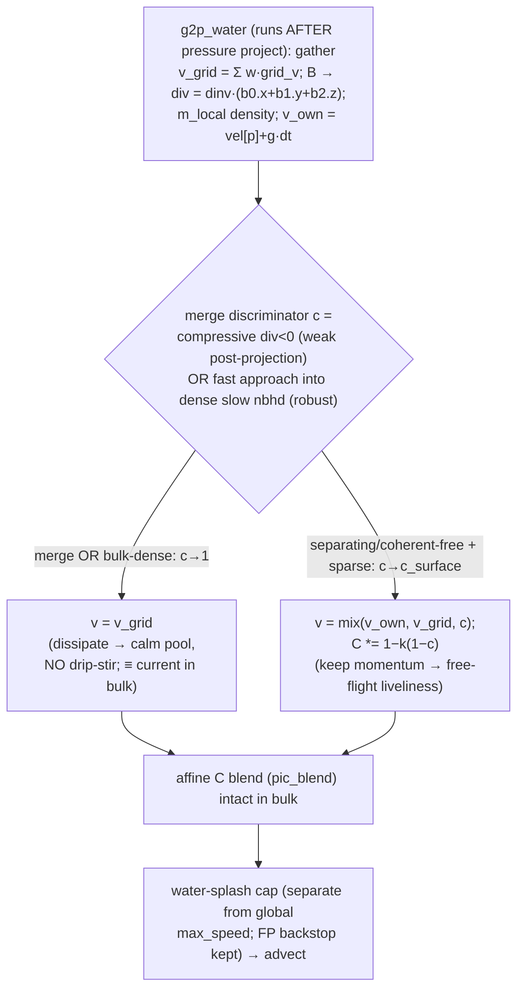

# feat: Surface-weighted velocity-averaging dissipation for two-field water (XSPH-style splash, calm pool)

## Summary

Two-field water reads as **slime** because its G2P sets each particle's velocity to the **full grid average** every step (`v = Σ w·grid_v`, `src/solvers/twofield/transfers.wgsl`), with the `pic_blend` knob only damping the affine `C`. On a grid, "pull velocity toward the local average" **is** XPBD's XSPH viscosity (`Δv = c·(v_avg − v_i)`, `src/solvers/xpbd/water.wgsl:226`) — and two-field applies it at **full strength everywhere**. The fix is to make that averaging-correction **surface-weighted**, exactly as XPBD weakens `xsph_c` near the free surface: **weak near the surface** (water keeps its own momentum → splash/crown) and **strong in the bulk** (smoothed → calm pool). This generalizes the flat `pic_blend = 0.05` from a global constant into a per-particle, surface-aware velocity dissipation.

This plan is **narrowed to that single mechanism**, on the **two-field solver** (kept for its speed/UX advantage — user decision). It explicitly **defers** the incompressibility-pressure work (over-pack and over-buoyant coffee — R9/R13 of the origin) and jet-geometry changes to a **separate pressure follow-up**, because those are a different lever (the velocity-divergence projection), not the averaging correction. The mechanism is validated in spirit by an existing prototype (the `FLIP_PROTO` block in `transfers.wgsl`): it made the settled cup pool dense/calm ≈ xpbd. This plan turns that into a shippable, surface-keyed, gated feature that restores **transfer-side liveliness** on free/in-flight water (the full pool-impact crown additionally needs the deferred density-target pressure, since a too-compressible pool absorbs the drop).

---

## Problem Frame

Splash is high-frequency velocity diversity; a calm pool needs the opposite. The single governing quantity is **how strongly each particle's velocity is averaged toward its neighbors** (XSPH `c` ≡ grid PIC fraction). Three in-repo data points (origin doc + render harness `.deliberate/renders/`) fix the diagnosis:

- **two-field** averages at full strength everywhere → slime, no splash; its flat `pic_blend` quiets the settled pool but also kills surface liveliness.
- **xpbd** averages with XSPH at a strength that is **lowered near the free surface** → splashy crown **and** calm bulk. This is the mechanism to port.
- The prototype (density-keyed momentum-preserve in `g2p_water`) already showed the settled-pool half of the win; the gap is making it a proper **surface-weighted** correction and restoring impact splash.

The averaging correction is the *transfer/dissipation* lever. The *separate* incompressibility-pressure lever (the velocity-divergence projection + density-relief) owns over-pack, over-buoyant coffee, and the part of impact-"mush" where a too-compressible pool **absorbs** the drop. This plan owns the transfer lever only.

---

## Requirements (trace to origin)

Advanced by this plan:
- **R1** (splash on impact — *transfer-side gain only; the full pool-impact crown depends on the deferred density-target pressure, since a too-compressible pool absorbs the drop*), **R3** (free water lively), **R4** (settled gentle liveliness), **R5** (no drip-induced blow-up / state separation), **R6** (state separation: high preserve only for free/separating water, NOT for sparse drips merging into the pool).
- **R8** (real-time ≤33 ms@200k, fixed-point i32 / no float atomics, Tint uniformity, storage-buffer budget).
- **R10** (visual oracle), **R11** (render comparison), **R12** (non-gameable quantitative splash + anti-blow-up gates).

Held as **constraints** (must not regress, not the focus):
- **R7** (bed↔water/crater/Terzaghi coupling, operator adjoint/SPD/divergence-decay, volume conservation).

**Deferred to the pressure follow-up** (explicitly out of scope here):
- **R2** jet-geometry sharpening; **R9** over-pack density-target pressure; **R13** over-buoyant coffee (density-fix-first — it rides the pressure work, since `Δv_s ∝ gp` tracks the over-pack pressure, not the averaging correction).

---

## Key Technical Decisions

- **KTD1 — Surface-weighted velocity-averaging dissipation (the mechanism).** In `g2p_water`, set `v = mix(v_own, v_grid, c)` where `v_grid = Σ w·grid_v` (today's value, the local average), `v_own = vel[p] + gravity·dt` (the particle's retained momentum), and `c` is the **surface-weighted smoothing strength**: `c → 1` (full average, calm) in the bulk, `c → c_surface` (small, momentum-preserving, splashy) near the free surface. This is the grid form of XPBD's XSPH-with-surface-falloff (`src/solvers/xpbd/water.wgsl:226-267`). Prior art: ASFLIP (Fei et al., *Revisiting Integration in the MPM*, SIGGRAPH 2021 — APIC + adaptive FLIP, blend rises on separation); the XSPH≡PIC-fraction unification; Yao & Zhao 2026 (compression–vorticity blend) as a documented signal refinement.
- **KTD2 — Discriminate "merging into a dense neighborhood" from "separating", via a gate-validated combination — NOT density/support alone, and NOT post-projection ∇·v alone. (Load-bearing — this is the drip-stir guard.)** main keyed preserve on `support_ratio` (≈ local density), so a *slow, sparse* drip read as "free," kept its momentum, punched into the cup pool, and the velocity projection rang it up. **Local density has the same flaw** (a drip is sparse) — density-only keying reproduces main's failure. The discriminator must instead detect *a particle merging into a denser, slower neighborhood* (→ dissipate, `c→1`) vs *separating/coherent-free* motion (→ preserve, `c→c_surface`). **No single cheap signal is a structural guarantee** (see below); use a **combination, validated by the R5 telemetry gate**:
  - **Velocity divergence** `div = dinv·(b0.x + b1.y + b2.z)` where `dinv = 4/h²` (i.e. `trace(C)`, the velocity gradient — `B` alone is NOT the gradient until scaled by `dinv`), from the `B` already gathered in `g2p_water`. Compressive `div < 0` ⇒ merge ⇒ dissipate. **Caveat:** `g2p_water` runs *after* the pressure `project` pass (`mod.rs` pipeline), so the gathered field is ~divergence-free — post-projection `div` is weak and (under-converged Jacobi) noisy. It is an input, not a proof.
  - **Relative approach into density (directional — the robust complement).** In the *same* g2p loop accumulate the **mass gradient** `grad_m = Σ ∇w_i · grid_vel[node].w`, where `∇w_i` is the **quadratic-B-spline weight derivative** (`1/h`-scaled, from the fractional position `fx` already computed). **Note this is NOT free from `B`** — APIC's `B` uses the `d`-offset form, not `∇w`; `grad_m` is a few extra ALU ops per node, but still **no new binding/buffer** (it reads the already-gathered `grid_vel[node].w`). Signal with stable normalization: `n = grad_m / max(length(grad_m), eps)`; `approach = max(0, dot(v_own − v_grid, n))` (use this, not `normalize(grad_m + ε)`, which biases the direction). A drip merging *into* the pool moves *up* the gradient ⇒ `approach > 0` ⇒ dissipate; a crown moving *down* it (toward air) ⇒ `approach ≈ 0` ⇒ preserve. Survives projection (`v_own` is the particle's own buffer; `grad_m` is geometric). A scalar `m_local` + `|v_own − v_grid|` **cannot** distinguish entering-pool from leaving-surface — the gradient *direction* is the discriminator.
  - **`near_air`/free-surface mask** (from `cell_meta`, `src/solvers/twofield/surface.wgsl`) as an *optional* sharpener. Note it would add a `cell_meta` binding to `g2p_water` (currently 6 storage buffers → 7, within the 16 cap / 7-internal budget); prefer the gradient signal first to avoid the binding.
  The exact blend/weights are tuned against the visual oracle and **locked by the R5 telemetry gate** (U2): merging-drip particles must measurably acquire high `c`. Prior art: ASFLIP separation condition (Fei 2021 — α rises on separation, falls in compression); Yao & Zhao 2026 compression suppression `χ = max(0,−∇·v)`. This is a robust, gate-validated heuristic, not a closed-form guarantee.
- **KTD3 — Generalize `pic_blend`, do not replace it.** The affine-`C` blend (`pic_blend = 0.05`, `mod.rs:151`) stays; this adds the **velocity-side** surface weighting that two-field currently lacks. In the bulk the new term reduces to today's behavior, so the settled-pool quiet and the **crater-hold decouple proof** (`tests/twofield_full.rs` — production holds, blend-0 slumps, cohesion-off slumps) are preserved by construction.
- **KTD4 — Plumbing: explicit Params ABI, no new buffer.** Add a dedicated **`flip: [f32; 4]` vec4 to `Params`** = `(c_surface, density_gate, div_scale, water_splash_cap)`; **bump the assert 256 → 272** (`mod.rs:358`). All other tuning values are **compile-time consts** in `transfers.wgsl` — affine-damp `k ≈ 0.75`, `approach_scale`, and the density-curve width `W` — not runtime lanes. **Sentinels:** `c_surface = 1.0` ⇒ disabled (`v = v_grid` = pure-PIC baseline); `div_scale ≤ 0` ⇒ **the entire merge discriminator off** (both the `div` *and* the `approach` terms — guard the whole block on `div_scale > 0`, not just the `div` term) ⇒ density-only keying = the R5 negative control (same shader, no second variant); `water_splash_cap ≤ 0` ⇒ fall back to the global `max_speed` (byte-identical default). Add `Config` fields; default = disabled so the off-path is byte-identical and existing gates stay green. The averaging + the `grad_m` gather use existing buffers (`vel[p]`, `grid_vel`) — **no new production storage buffer**. `g2p_water` has no `workgroupBarrier`, so the per-particle branch is **Tint-uniformity-safe**.
- **KTD5 — Separate water/splash velocity cap, with FP-safety (supporting).** `params.max_speed` is **global** — used by `p2g_water`, the **water-grid clamp in `drag_fold`** (`coupling.wgsl:292`, which runs *before* `project`/g2p in the pipeline), the g2p water clamp, AND `solid_update`/`g2p_solid` (`plasticity.wgsl:420`). The crown is clipped at the *earliest* of these, so the water cap must apply to **all three water-path sites** (`p2g_water`, water-grid `drag_fold`, `g2p_water`) — clamping only at p2g/g2p would leave the grid clipped at 12 by drag_fold and defeat the crown. **Leave the solid clamps (`solid_update`, `g2p_solid`) on the global `max_speed`** so grain dynamics are unperturbed. **Re-derive the FP overflow headroom against the water cap** (∝ `8192/cap`, `common.wgsl:117`), keep the encode-time magnitude clamp as the backstop, and gate with cap-hit-rate + FP-saturation probes. Not a blanket removal.
- **KTD6 — Scope: transfer lever only; stay two-field.** Two-field is kept for its speed/UX (user decision). The incompressibility-pressure lever (over-pack R9, over-buoyant coffee R13, the impact-**absorption** half of "mush") and jet geometry (R2) are a **separate pressure follow-up** — the in-repo `dbg.w` two-sided density-target is the planned path there (already built; compliance diagonal already rejected; a global Poisson risks the checkerboard/operator-inconsistency that killed main's solver against thin perf headroom). Not in this plan.

---

## High-Level Technical Design

The change is local to the G2P velocity update; the rest of the per-frame pipeline is untouched.

Directional only. Because `g2p` reads the post-projection (≈divergence-free) field, the **approach-into-dense-neighborhood** term — not the post-projection `div` sign — carries the drip-stir guard: a slow sparse drip is fast relative to the slow pool it enters → dissipated, even though it is locally sparse and its post-projection `div ≈ 0`. The constants are tuned against the visual oracle and the merge discriminator is **locked by the R5 telemetry gate**, not asserted as structural.

---

## Implementation Units

### U1. Dissipation-knob plumbing (Params/Config, default-off, byte-identical)

- **Goal:** Promote the prototype's hard-coded consts into a runtime, default-off knob without breaking the `Params` layout or adding a buffer.
- **Requirements:** R8 (budget/layout), enables R1/R3/R4.
- **Dependencies:** none.
- **Files:** `src/solvers/twofield/mod.rs` (Params lanes + Config→Params wiring), `src/utils/config.rs` (Config fields), `src/solvers/twofield/common.wgsl` (WGSL Params doc/`flip` field + the stale comments at `:22` ("160 bytes" → **272** after `flip`) and `:9-12` (buffer count)), `src/solvers/twofield/transfers.wgsl` (replace the `FLIP_PROTO` consts with `params.flip` reads + the `grad_m` gather), `tests/twofield_scaffold.rs` / `tests/twofield_water.rs` (byte-identical-off assertion).
- **Approach:** First **remove the `FLIP_PROTO` prototype block** (`transfers.wgsl`) to restore the pure-grid-gather (pure-PIC) velocity — *that* is the byte-identical baseline U1 pins. Then add a dedicated `flip: [f32; 4]` to `Params` (bump the assert 256 → 272) carrying `(c_surface, density_gate, div_scale, water_splash_cap)`; the affine-damp `k` is a compile-time const. Sentinels: **enable** = `c_surface = 1.0` (⇒ `v = v_grid` ⇒ pure-PIC baseline); **density-only negative control** = `div_scale ≤ 0` (merge discriminator off, same shader). Add `Config` fields defaulting to disabled. Wire Config→Params. For R5's telemetry, **re-derive `c` on the CPU twin** from read-back per-particle/grid state (`v_own`, `v_grid`, `m_local`, `grad_m`) with the same formula — **no GPU diagnostic buffer, no new lane/binding**, production byte-identity untouched (mirrors the existing CPU-twin operator gates in `tests/twofield_pressure.rs`).
- **Patterns to follow:** the existing `dbg`-lane setters (`set_density_target_mode_for_test`, etc., `mod.rs`) and Config→Params mapping at `mod.rs:1493`.
- **Test scenarios:**
  - With the knob disabled (default `c_surface=1` sentinel), `g2p_water` reproduces the **pure-grid-gather (pure-PIC velocity) baseline** exactly: all existing `tests/twofield_*` gates pass unchanged. *(integration/regression)*
  - `Params` asserts **272** bytes; WGSL/Rust layouts byte-match. *(edge: layout)*
  - Enabling via Config sets the expected `flip` lane values (round-trip test). *(happy path)*
- **Verification:** Suite green with knob off; knob on reproduces the prototype velocity field.
- **Execution note:** Characterization-first — pin the byte-identical-off assertion before wiring behavior.

### U2. Surface-weighted velocity-averaging dissipation in `g2p_water` (core)

- **Goal:** Make the velocity averaging surface-weighted: calm bulk, splashy surface — restoring free-water/impact liveliness while keeping the settled pool quiet.
- **Requirements:** R1, R3, R4, R5, R6.
- **Dependencies:** U1.
- **Files:** `src/solvers/twofield/transfers.wgsl` (`g2p_water`), `tests/twofield_settled.rs`, `tests/twofield_full.rs` (crater decouple), `tests/twofield_water.rs`.
- **Approach:** `v = mix(v_own, v_grid, c)` with `v_own = vel[p] + gravity·dt` and `c = smooth_strength(merge_signal, density)` per KTD1/KTD2: dissipate (`c → 1`) when the merge discriminator fires (compressive `div < 0` and/or fast relative-approach into a dense slow neighborhood), preserve (`c → c_surface`) only for separating/coherent-free motion; density is a secondary gate. Gather the mass gradient `grad_m` in the existing g2p loop for the directional approach signal (no new buffer). Damp the affine `C` **proportional to the preserve amount**: `C *= 1 − k·(1−c)` — bulk `c=1` ⇒ `C` unchanged (= current `C = B·dinv·(1−pic_blend)`); strong preserve ⇒ `C` shed by ~`k` (mirrors the prototype's `affine_damp`). Reduce-to-current in the bulk.
- **Technical design (directional — full curve):**
  - `div = dinv·(b0.x + b1.y + b2.z)`, `dinv = 4/h²` (= `trace(C)`, the local ∇·v).
  - `grad_m = Σ ∇w_i·grid_vel[node].w` (quadratic-B-spline derivative, `1/h`-scaled); `n = grad_m / max(length(grad_m), eps)`; `approach = max(0, dot(v_own − v_grid, n))`.
  - **Merge discriminator** (the whole block guarded on `div_scale > 0`; `div_scale ≤ 0` ⇒ `merge = 0` = density-only R5 control): `merge = clamp(max(−div·div_scale, approach·approach_scale), 0, 1)` (`approach_scale` const; the `approach` term is the robust one — post-projection `div` is weak).
  - **Density term** (calm bulk even without merge-motion): `dens_c = smoothstep(density_gate, density_gate + W, m_local/(8·particle_mass))` (`W` const).
  - **Final:** `c = clamp(max(c_surface, merge, dens_c), c_surface, 1)`; then `v = mix(v_own, v_grid, c)` and `C *= 1 − k·(1−c)`.
  - So: drip merging into pool ⇒ `approach` fires (even when `div≈0`) ⇒ `c→1` ⇒ dissipate, **regardless of its own low density**; dense bulk ⇒ `dens_c→1` ⇒ calm; crown/coherent-free in sparse air ⇒ `merge≈0, dens_c≈0` ⇒ `c→c_surface` ⇒ preserve. The **density-only control** (`merge=0`) leaves `c = max(c_surface, dens_c)`, so a sparse drip (low `m_local`) reads `c→c_surface` ⇒ preserved ⇒ reproduces main's stir (what the R5 control asserts). Tune `div_scale`, `approach_scale`, `c_surface`, `density_gate`, `W` against the visual oracle; **lock with the R5 telemetry gate**, not by asserting structurality.
- **Patterns to follow:** the prototype block currently in `transfers.wgsl`; the affine-damp pattern from main's G2P (`crates/sim-wasm/src/mpm_3d/shader.rs` ballistic-preserve, reference only).
- **Test scenarios:**
  - Settled tank: per-particle tail KE stays bounded and non-growing; `tests/twofield_settled.rs` `settled_water_tank_ke_decays_and_stays_bounded` and `settled_cup_water_no_edge_ring` pass. *(regression: calm bulk)*
  - Crater decouple proof holds: production config **holds** the poured crater; `center_pour_crater_slumps_without_blend` still slumps at blend 0. *(integration: bulk reduces to current)*
  - **Covers R5 — main's drip-stir guard (telemetry + control).** Sustained *slow, sparse* drips onto a settled cup pool do NOT trigger spontaneous stir/blow-up: settled-tail KE bounded + non-growing + circulation bounded, under a long sustained-drip run. **Telemetry precondition (CPU-twin):** for particles crossing from air into the pool, re-derive `c` from read-back state (`v_own`, `v_grid`, `m_local`, `grad_m`) and assert it is high (the merge discriminator is firing) *before* the KE/circulation bounds are deemed meaningful — no GPU diagnostic buffer needed. **Mandatory control (same scene, same tuned curve, merge discriminator disabled → density-only keying):** MUST exhibit the stir — proving the merge guard prevents main's failure, not luck (mirrors the crater blend-0 negative control). *(error path: drip blow-up — the named main MPM failure mode)*
  - **Covers R3 + transfer-side R1/R12.** Free-flight / post-cone water liveliness and surface velocity diversity rise materially vs the disabled (pure-PIC) baseline at a low cap-hit rate (mass-weighted, localized signal). **NOTE:** the *full pool-impact crown is NOT promised here* — a too-compressible pool still absorbs the drop until the deferred density-target pressure lands; this gate measures the **transfer-side** gain vs baseline, not absolute crown height. *(happy path: transfer-side liveliness — thresholds pinned after visual oracle)*
- **Verification:** Visual oracle (live webapp, Debug Scenes catalog, twofield): free/in-flight water shows visibly more liveliness / surface-velocity diversity than the disabled pure-PIC baseline; settled pool stays calm; crater held; slow drips do not stir the cup. (Full pool-impact crown is pressure-follow-up scope, not asserted here.) Then the quantitative transfer-side signal is pinned.
- **Execution note:** Visual-oracle / measure-first — confirm the look and tune `c_surface`/thresholds before pinning numeric splash thresholds (no premature numeric gates).

### U3. Velocity-clamp relaxation on the splash path (supporting, FP-safe)

- **Goal:** Let the surface crown's peak velocity survive the `max_speed` cap without losing the fixed-point overflow guarantee.
- **Requirements:** R1 (impact crown), R8 (FP safety).
- **Dependencies:** U2.
- **Files:** `src/solvers/twofield/transfers.wgsl` (p2g + g2p clamp sites), `src/solvers/twofield/coupling.wgsl` (`drag_fold` clamp), `src/solvers/twofield/plasticity.wgsl` (`solid_update` clamp), `src/utils/config.rs` / `mod.rs` (cap value), `tests/twofield_water.rs` (overflow + cap-hit probe).
- **Approach:** Apply the **water-splash cap** (the `flip.w` lane / Config from U1) at **all three water-path clamp sites** — `p2g_water`, `g2p_water` (`transfers.wgsl`), AND the **water-grid clamp in `drag_fold`** (`coupling.wgsl:292`), which runs *before* project/g2p and would otherwise clip the crown at the global 12. **Leave the solid clamps (`solid_update`, `g2p_solid`) on the global `params.max_speed`** so grain dynamics are unperturbed. Keep the encode-time magnitude clamp as the backstop, **re-derive the FP overflow headroom against the water cap** (∝ `8192/cap`), and add a cap-hit-rate metric + FP-saturation probe so a relaxation that courts i32 overflow fails as a regression, not ships.
- **Patterns to follow:** the existing overflow-headroom derivation in `common.wgsl:117` and its probe in `tests/twofield_water.rs`.
- **Test scenarios:**
  - FP-saturation probe: at the chosen **water cap**, encoded node lanes stay below the i32 overflow bound across the violent-pour scene; the global `max_speed` (drag/solid) is unchanged. *(edge: overflow)*
  - Cap-hit rate under splash stays low (the motion is real velocity, not saturation). *(happy path)*
  - No whip/plunge/air-pocket-collapse regression on the pour scenes vs U2. *(integration)*
- **Verification:** Crown velocities survive; overflow probe green; no new pocket/whip artifacts.

### U4. Integration: defaults, gates, perf, render re-capture

- **Goal:** Flip production defaults, pin the new gates, prove no regression + perf, and refresh the visual baseline.
- **Requirements:** R7 (no-regression), R8 (perf), R10, R11, R12.
- **Dependencies:** U1, U2, U3.
- **Files:** `src/utils/config.rs` / `src/web.rs` (defaults for the production/web scenes), `tests/twofield_settled.rs`, `tests/twofield_full.rs`, `tests/twofield_water.rs`, `tests/twofield_perf.rs`, `.deliberate/renders/` (re-capture harness).
- **Approach:** Enable the surface-weighted dissipation + tuned clamp in the production/web configs. Pin: R12 splash signal (mass-weighted, localized, low cap-hit + conservation/no-popcorn), R5 anti-blow-up under sustained drip, and run the full L0–L3 suite + perf gate (transfer-only change — no new passes, expect negligible cost vs the 25.4 ms@207k baseline; confirm ≤33 ms). Re-capture the three-solver render comparison on the debug-scene catalog for the visual oracle. Use multiset/phase-paired comparisons for any per-particle conservation check (reorder artifact).
- **Test scenarios:**
  - Full `tests/twofield_*` L0–L3 suite green (operator adjoint/SPD/divergence-decay, Terzaghi/Skempton, crater, infiltration, buoyancy reaction). *(regression)*
  - Volume conservation over a long-run saturated-tail regime (≥2000 steps), multiset comparison. *(integration: conservation)*
  - Perf gate: ≤33 ms @ 200k at the pre-registered composition. *(perf)*
- **Verification:** Suite + perf green; render comparison shows twofield with materially more free/in-flight water liveliness and a calm pool vs the disabled baseline (transfer-side gain, closer to xpbd); visual oracle confirms. (Absolute pool-impact crown remains gated on the deferred pressure follow-up.)

---

## Scope Boundaries

**In scope:** the surface-weighted velocity-averaging dissipation in `g2p_water` (the XSPH-on-grid mechanism), its Params/Config plumbing, the supporting splash-path clamp relaxation with FP-safety, and the gates/perf/render validation — all on the two-field solver.

### Deferred to Follow-Up Work
- **The incompressibility-pressure fix** (separate plan): the `dbg.w` two-sided volume+over-pack density-target → over-pack (R9), over-buoyant coffee (R13, density-fix-first), and the impact-**absorption** half of "mush". This is the velocity-divergence-projection lever, distinct from the averaging correction here.
- **Jet-geometry sharpening** (R2 `nozzle_radius`), bounded by the grid-resolvable floor.
- **Escalation** to grid-resolution increase or an XPBD/grid hybrid only if transfer + clamp (this plan) + the pressure follow-up still cannot reach the look.

**Outside this solver's identity:** the xpbd solver (reference/referee, not modified); the two-field bed-coupling operator's kind (cell-centered pore pressure = projection pressure preserved); no divergence-penalty Darcy; no compliance diagonal (already rejected); no global Poisson in this plan.

---

## Risks & Mitigations

- **main's drip-stir failure mode (the headline risk)** — a slow, sparse drip preserved into the cup pool rings it up via the velocity projection (main's exact bug). *Mitigation:* KTD2's merge discriminator (compressive `div` + **relative-approach-into-density** + `near_air`) dissipates merge-motion regardless of the drip's low density. **Residual risk:** `g2p` reads post-projection velocity, so the `div` signal is weak — the approach-into-density term carries the robustness, and the R5 **telemetry (merging particles must read high `c`) + density-only-keying control** lock it in. If the combined signal proves insufficient during tuning, escalate the discriminator (store a pre-projection divergence, or a sharper surface mask) rather than lowering `c_surface` toward main's regime.
- **Trilemma leak** — surface weighting bleeds into the bulk and re-energizes the settled pool. *Mitigation:* bulk reduces to current `pic`-velocity behavior by construction; settled-agitation + crater-decouple gates guard.
- **Impact still "mushes"** — because a too-compressible pool absorbs the drop (the pressure half), not the transfer. *Mitigation:* this is expected and explicitly owned by the deferred pressure follow-up; this plan targets the transfer half (crown formation + free-water liveliness). Surface the split to the visual oracle so the residual is correctly attributed.
- **Surface signal misfires** — a dense fast mid-air jet reads as "bulk" and gets over-damped. *Mitigation:* the `near_air`/surface-mask sharpening path (KTD2) and, if needed, a speed/compression term (Yao & Zhao 2026); decide by eye.
- **FP overflow** from the raised clamp. *Mitigation:* keep the encode backstop; cap-hit + saturation gates (U3).
- **Volume-conservation drift** from changed dissipation. *Mitigation:* long-run saturated-tail gate + multiset comparison (U4); front-load it.
- **Perf** — negligible expected (no new passes; a few ALU ops in `g2p_water`), but confirm against the thin headroom. *Mitigation:* perf gate in U4.

---

## Sources & Research

- **In-repo reference (mechanism):** XPBD XSPH viscosity with surface falloff — `src/solvers/xpbd/water.wgsl:226-267`; the surface-weakening rationale in `src/web.rs` (WaterOnly `xsph_viscosity_c` comment). main's ballistic-preserve G2P — `crates/sim-wasm/src/mpm_3d/shader.rs` (reference only).
- **Prior art:** ASFLIP — Fei, Guo, Wu, Huang, Gao, *Revisiting Integration in the Material Point Method*, SIGGRAPH 2021 (APIC + adaptive-α FLIP for separation/less dissipation). PolyPIC — Fu et al., SIGGRAPH Asia 2017 (higher moments; heavier — not adopted). FLIP energy-gain + mitigations — Boyd & Bridson, *MultiFLIP*, TOG 2012; APIC — Jiang et al., SIGGRAPH 2015. Adaptive compression–vorticity blend — Yao & Zhao, arXiv 2603.03860, 2026 (signal refinement).
- **Constraints / learnings:** AGENTS.md (16-buffer cap, no float atomics, Tint uniformity, operator consistency A=D·M̃⁻¹·G, don't-touch-xpbd); `docs/PERF_NOTES.md` (R9 at 25.4 ms@207k, ~7.6 ms headroom, bubble_fine/jacobi_fine dominate); the crater-hold + settled-quiet PIC-blend contract (`docs/plans/2026-06-15-001-...`); volume-conservation hard constraint + saturated-tail leak + reorder stale-phase artifact (MEMORY).
- **Origin:** `docs/brainstorms/2026-06-18-twofield-water-splash-dynamics-requirements.md` (the unified one-knob diagnosis + prototype empirical findings).
