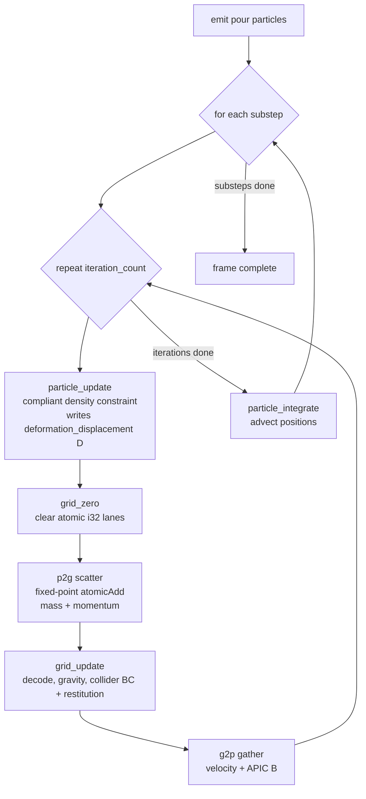
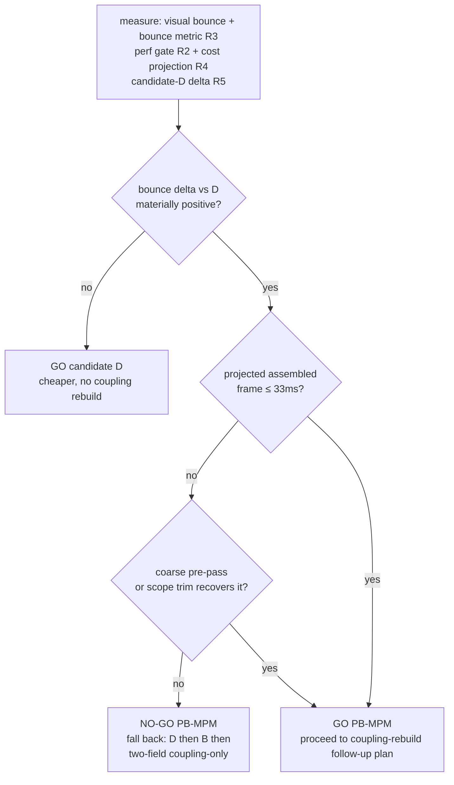

# PB-MPM gating prototype — single-phase water bounce + perf go/no-go

## Summary

Build a minimal single-phase **PB-MPM** (Position-Based MPM) water solver as a new registered solver, port EA SEED's compliant position-based density constraint, and **measure** whether it (a) visibly bounces/scatters on impact and (b) clears ≤33 ms @ ~200k on the fixed-point i32 grid — *before* any coffee/water coupling is built. The prototype ends in a documented **go/no-go**: a measured bounce delta vs candidate D and a projected *assembled* (two-velocity) frame cost decide whether the full re-architecture proceeds or falls back to candidate D/B.

This is the origin doc's **KD8 gate**. It is an unsettled bet validated by the visual oracle, so the execution posture is **visual-first**: confirm the bounce in the live webapp, then pin invariants.

---

## Problem Frame

The two-field grid solver is the fastest in-repo (25.4 ms @ 207k) and owns the coffee/water coupling, but its water reads mushy and "just pools where it is" — no bounce/scatter. The converged diagnosis (origin Problem Frame): a bounce is a **stiff-incompressibility** response, and two-field's under-converged `∇·v` Jacobi projection is soft *because* it under-converges. PB-MPM replaces that projection with a **compliant position-based density constraint** that gives stable stiff push-back at a few iterations with **no global Poisson** — the bounce-and-speed reconciliation, with XPBD as the in-repo existence proof.

But the assembled two-velocity porous PB-MPM has no shipped reference, `λ`-as-pore-pressure is unproven, and the assembled perf is unknown. Per KD8, the whole effort is **gated on a prototype** that retires the two retirable-by-measurement risks (bounce + frame rate) first. This plan builds and measures that prototype only; the coupling rebuild is deferred to a contingent follow-up plan.

---

## Requirements

### Bounce and realism
- R1. The single-phase PB-MPM water core visibly **bounces/scatters on impact** in the live webapp (the `high-velocity-jet-impact` and `dam-break-slosh` Debug Scenes), comparable to xpbd/main and clearly livelier than twofield. Primary oracle: the visual comparison render. (origin R1)
- R3. The bounce is quantified by a **non-gameable** localized, mass-weighted post-impact rebound/spread metric, guarded by a low cap-hit rate (rebound is not a clamp artifact), a no-popcorn check (no single-particle ejecta spikes), conservation (no injected mass/energy), AND a **restitution=0 (constraint-only) arm** so the compliant-density mechanism's contribution is isolated from the collider-BC reflection coefficient (R8). (origin R1)

### Real-time and budget
- R2. A **pre-registered perf gate** confirms ≤33 ms @ ~200k for single-phase water on the fixed-point i32 grid: no float atomics, Tint-uniform, each entry point within the 9-storage-buffer grant. (origin R2)
- R7. **Two overflow/range surfaces are gated, distinguished by type:** (a) the fixed-point i32 **grid accumulation lanes** (mass + momentum, coupled to the velocity cap — the existing two-field headroom math applies; any *new* scattered fixed-point lane PB-MPM adds must extend it); (b) the **per-particle `deformation_displacement` D and position-correction state**, which are *float* (not fixed-point) — gated for range/NaN/blow-up on fast pours, not i32 overflow. The plan must not conflate the two. (origin KD10)

### Decision integrity
- R4. A **two-velocity cost projection** + a buffer/pass-family ledger projects the *assembled* solver's frame time and buffer budget, so the go/no-go reflects the full system (second velocity field, drag, λ ping-pong, bed/wetting buffers), not single-phase water alone. (origin KD8, KD10)
- R5. **Candidate D** is measured on the *same pinned* bounce scene/config, so choosing full PB-MPM over D rests on a measured bounce delta, not assumption. The in-repo D proxy is the two-field **DensU density-target** path (`dbg.w` uncapped/two-sided target) — note this is the over-pack relief lever, *not* a true compliant projection (the compliance-diagonal variant was reviewed harmful and dropped, `pressure.wgsl`); the plan measures this proxy and labels it as such. (origin Candidate D)
- R6. The prototype produces a **documented go/no-go**. On fail, the recorded next step is the fallback ladder: D → B → two-field coupling-only. (origin KD8)
- R8. **Decision integrity — pre-register the tuning *protocols*, not just the threshold *values*.** Every measured go/no-go input must be isolated from the knob that could manufacture it: the bounce is measured constraint-only (restitution=0) as well as with restitution; perf + assembled-cost are measured at the *same* `iteration_count`/substep count that won the bounce; candidate-D is swept across its calibrated K range and compared at its best; the assembled-cost per-pass floors and the bounce-metric structure are committed before any result is read. (origin KD8; doc-review)

---

## Key Technical Decisions

- KTD1. **Port EA SEED's PB-MPM pipeline shape.** Per substep, repeat `iteration_count`×: `particle_update` (per-particle compliant constraint, writes `deformation_displacement`) → `grid_zero` → `p2g` → `grid_update` (decode + BC) → `g2p` (APIC); then `particle_integrate` once. The grid is rebuilt every iteration — it is a transient transfer medium, no standing pressure field. Liquid constraint: `alpha = 0.5*(1/liquid_density − tr(D) − 1)`, corrected by a compliant `liquid_relaxation·alpha·I` volume term + a `liquid_viscosity·deviatoric(D)` shear term. Rationale: this is the shipped real-time reference; bounce comes from the compliant volume correction, stability from relaxation-damped iterative rebuild — no global solve. (origin KD1)
- KTD2. **Mirror `src/solvers/twofield/` as the structural template.** Reuse its `Params` Rust↔WGSL mirror + size assert, `FP_SCALE = 2^18` fixed-point `atomic<i32>` grid encoding, WGSL-concatenation module assembly, the `bg()` per-pass bind-group helper, the test/perf harness shapes, and the registry seam. Rationale: proven on-stack conventions; minimizes net-new infrastructure. (origin: migration shape)
- KTD3. **Visual-first execution posture.** Confirm the bounce in the webapp (Phase A) before pinning invariants; concentrate the pinned perf/bounce/conservation gates in Phase B once the mechanism is settled by measurement. Rationale: the prototype is an unsettled bet — pinning a heavy suite against an approach that may be abandoned for D/B is premature.
- KTD4. **Pure-local-Jacobi first; coarse-grid pre-pass is contingent on an *objective* trigger, but its cost is always budgeted.** Build and measure the minimal local-Jacobi PB-MPM core first. The KD2 coarse-grid pressure pre-pass (real global low-frequency work) is *built* only if a **pre-registered bulk-density / settled-pool volume-loss drift threshold** is exceeded (not a subjective "spoils the look" call — the ~1–5% PBF/PB-MPM low-frequency gap is measured and recorded either way). But its expected cost is included in the U7 assembled-cost projection as a **conservative placeholder regardless of whether the trigger fires** (origin: "its cost must be in the KD8 budget, not hand-waved"). Reference: MGPBD (SIGGRAPH 2025) / a coarse-to-fine V-cycle. Rationale: minimal core first, but never let a not-yet-built pass silently zero-cost the go/no-go. (origin KD2)
- KTD5. **Plan to the 9-buffer grant.** Keep each entry point within the device's 9 requested storage buffers (`src/utils/gpu.rs`), using the pass-family bind-group split (`docs/issues/003-split-mpm-bind-groups.md`) before any `GpuContext` limit change. If >9 is unavoidable, raise `NEEDED_STORAGE_BUFFERS` and gate on live browser `request_device` verification (the over-report trap is present-code, not a stale note). Rationale: web portability. (origin KD10)
- KTD6. **Cell-bin particles before P2G — as a ported subsystem with measured cost, not a free fix.** The 3D 3×3×3 (27-node) scatter's atomic contention on clustered cells is the known P2G bottleneck at 200k (`docs/issues/004-reduce-p2g-atomic-contention.md`). The XPBD cell-order reorder (`src/utils/hash.rs`) is *neighbor-gather* machinery, not a drop-in P2G-scatter fix — porting/adapting it for scatter coherence is real work whose cost counts in the U6 budget. Rationale: name it as ported, don't assume the contention is already solved. (origin: perf)
- KTD7. **Measure candidate D via the two-field DensU proxy — swept, and as corroboration not sole decision.** Use `set_density_target_mode_for_test(true)` + `set_density_rate_k_for_test(k)` (`dbg.w` uncapped two-sided density target) on two-field, **swept across the calibrated K∈(1,30) range** (smaller K = stiffer/crisper) and compared at D's *best* arm — giving D the same live-tuning effort PB-MPM gets in U4 (avoids an asymmetric hand-tuned-vs-single-shot comparison). Critically, the DensU path is a *one-sided over-density relief through the same under-converged Jacobi projection* — it cannot bounce by construction, so PB-MPM out-bouncing it is near-tautological. The genuine compliant candidate D was already eliminated on prior review (compliance-diagonal "tried and dropped"); therefore the proxy delta is **corroboration that PB-MPM bounces where the relief lever cannot**, not the decision that PB-MPM beats a live compliant rival. Label it the DensU proxy throughout. Rationale: a measured, honestly-scoped comparison that doesn't overstate what it proves. (origin Candidate D)
- KTD8. **The per-particle PB-MPM state is decided up front (KD10).** `deformation_displacement` `D` (a `mat3x3` velocity-gradient×dt accumulation), `deformation_gradient` `F`, `liquid_density`, and the constraint scalars live in the *particle* storage buffer as floats — not on the grid. The grid carries only `[mass, mom.xyz]` as fixed-point `atomic<i32>`. `D` is zeroed at the start of each substep's iteration loop and accumulated across iterations; `F` carries across substeps. Rationale: resolves the grid-vs-particle state ambiguity and tells R7 which surface is fixed-point (grid) vs float (particle). (origin KD10)
- KTD10. **Physics gates are a SHARED, solver-parameterized harness — not a per-solver silo.** The phenomena under test — mass/momentum conservation, the bounce/rebound metric, real-time ≤33 ms@200k, incompressibility/density drift — are **solver-independent**, so they live in a shared harness parameterized over `SolverId` (run identically against pbmpm, xpbd, twofield) rather than a new `tests/pbmpm_*` copy of each. This is what makes the U7 bounce comparison first-class (one metric, every solver) and lets the perf/conservation gates regress all solvers at once. Only genuinely **implementation-specific** tests stay per-solver: WGSL-formula CPU twins, the fixed-point overflow / float-`D` range probes, the collider-BC smoke, and the candidate-D `dbg.w` hook (these test an implementation, not a phenomenon). Pattern already in repo: the registry test over `SolverId::all()` (`src/engine/registry.rs`) and the solver-agnostic `tests/render_smoke.rs` — extend that shape; existing `tests/twofield_*`/`tests/xpbd_*` physics gates can converge into it over time (not a required refactor now). Rationale (user): the physical phenomenon is independent of the solver. (user direction)
- KTD9. **Pre-register the tuning *protocols*, not just the threshold values (decision integrity, R8).** The plan's no-fallback discipline already pins threshold *values* before measuring; extend it to the *protocols* that generate the measured numbers, because every go/no-go input is otherwise tunable by a knob the tuner sets while watching the result. Concretely: measure the bounce constraint-only (restitution=0) as well as with restitution (U5/U7); freeze the bounce-winning `iteration_count`/substep count and measure perf + assembled-cost at *that* count (U6/U7); sweep candidate-D's K and compare at its best (KTD7); commit the assembled-cost per-pass floors and the bounce-metric functional form before any result is read (U7). Rationale: the gate's integrity must rest on structure, not on tuner discipline. (doc-review)

---

## High-Level Technical Design

### Per-frame solver pipeline (Phase A core)



The grid carries only `[mass, mom.x, mom.y, mom.z]` as `atomic<i32>` (stride-4 per node, mirroring two-field's `common.wgsl`). Incompressibility lives entirely in `particle_update` as a per-particle compliant correction to `deformation_displacement` — there is no pressure buffer and no Poisson pass. This is the structural departure from two-field (which has a `node_setup → cell_classify → smooth → residual → coarse → prolong → project` pressure stack).

### The go/no-go gate (Phase B)



---

## Output Structure

```text
src/solvers/pbmpm/
  mod.rs            # Solver impl, Params mirror + assert, step pipeline, test API
  common.wgsl       # Params mirror, FP encode/decode, grid bindings, helpers
  transfers.wgsl    # grid_zero / p2g / grid_update (BC) / g2p
  constraint.wgsl   # particle_update (compliant density constraint) + particle_integrate
```

Plus edits to `src/engine/solvers.json`, `src/engine/registry.rs`, `src/solvers/mod.rs`, optionally `src/web.rs` (`setup_for` per-solver config), and new tests under `tests/`.

---

## Implementation Units

Phase A (U1–U5) builds a runnable core verified by the visual oracle. Phase B (U6–U7) pins invariants and produces the decision. U8 is contingent. Per KTD3, Phase A units carry an exploratory execution note and keep coverage to light sanity checks; the enumerated, pinned test scenarios live in Phase B.

### U1. Solver scaffold + registry wiring

- Goal: a new `pbmpm` solver that builds via the registry, appears in the webapp dropdown, and runs an empty/gravity-only step without panicking.
- Requirements: R2 (substrate)
- Dependencies: none
- Files:
  - Create: `src/solvers/pbmpm/mod.rs`, `src/solvers/pbmpm/common.wgsl`
  - Modify: `src/engine/solvers.json`, `src/engine/registry.rs`, `src/solvers/mod.rs`
  - Test: `tests/pbmpm_scaffold.rs`
- Approach: Add the `pbmpm` catalog row (`solvers.json`), a `SolverId::Pbmpm` variant + `id()`/`all()` arms, and a `build_solver` match arm (`registry.rs`). Implement `trait Solver` (build/reset/step/particles/metrics/profile) mirroring `twofield/mod.rs`'s skeleton: `Params` `#[repr(C)]` + `bytemuck` + a `const _ = assert!(size_of::<Params>() == N)` ABI lock, the `FP_SCALE` constant, the WGSL-concat `build()`, and the `bg()` helper. The particle storage buffer carries the per-particle PB-MPM state per KTD8 (`D`, `F`, `liquid_density`, constraint scalars) from the start so the layout is fixed up front. No physics yet beyond grid clear + gravity advect so the dropdown renders something.
- Patterns to follow: `src/engine/registry.rs:23-93`, `src/engine/solvers.json`, `src/solvers/twofield/mod.rs:316-363` (Params+assert), `:1793-1832` (WGSL assembly + `bg()`), `tests/twofield_scaffold.rs:34-136`.
- Execution note: Exploratory. Keep the scaffold test to the structural gate only.
- Test expectation: structural only — builds via the registry arm, particle count round-trips, determinism (bit-exact re-run), and `MAX_STORAGE_BUFFERS_PER_ENTRY_POINT` within the 9 grant. No behavioral assertions yet.
- Verification: the solver appears in the `www` dropdown and steps without panic; `tests/pbmpm_scaffold.rs` passes.

### U2. Emission + water-pool activation

- Goal: a pour activates dormant water-pool slots so the `high-velocity-jet-impact` scene (and any pour scene) actually emits water into the new solver.
- Requirements: R1 (substrate — R1's oracle scene is a pour)
- Dependencies: U1
- Files:
  - Modify: `src/solvers/pbmpm/mod.rs` (the `emit()` path, water-pool layout, `water_count` growth)
  - Test: covered by U4's visual validation; light count check in `tests/pbmpm_scaffold.rs`
- Approach: Port two-field's emission model — a pre-allocated water pool with a live range `[0, water_count)` that grows as the pour activates dormant slots (dormant slots parked off-scene, never dispatched), fed by the canonical `EmissionInput`. Mirror the `water_count`/`particle_count` live-set discipline so transfer/constraint passes dispatch only the live range. The `high-velocity-jet-impact` scene (`src/engine/scene.rs:409`) declares the pour this consumes.
- Patterns to follow: `src/solvers/twofield/mod.rs` emission (`fn emit`, the water-pool/dormant-slot doc at `:21-27`, `:476-481`, `EmissionInput` activation `:558`), `src/engine/scene.rs:409` (the jet scene's pour).
- Execution note: Exploratory/visual-first.
- Test expectation: light — `water_count` grows when a pour is active and stays within pool capacity; no per-particle behavioral assertion yet.
- Verification: in the webapp, selecting `high-velocity-jet-impact` with the pbmpm solver emits a visible water stream.

### U3. APIC fixed-point transfers (grid_zero / p2g / grid_update / g2p)

- Goal: water particles transfer to and from the fixed-point grid each iteration and fall under gravity without exploding.
- Requirements: R2, R7
- Dependencies: U1
- Files:
  - Create: `src/solvers/pbmpm/transfers.wgsl`
  - Modify: `src/solvers/pbmpm/mod.rs`, `src/solvers/pbmpm/common.wgsl`
  - Test: `tests/pbmpm_transfers.rs`
- Approach: Implement `grid_zero` (clear the `atomic<i32>` `[mass, mom.xyz]` lanes — the grid carries *only* these per KTD8, no displacement lane), `p2g` (**3×3×3 (27-node) quadratic-B-spline** scatter via fixed-point `atomicAdd`, APIC affine momentum — matching the twofield stencil, not a 4³ cubic one), `grid_update` (decode `mom/mass`, apply gravity, write the float grid velocity/displacement locally — not as a fixed-point lane), and `g2p` (gather velocity + reconstruct the APIC `B` matrix, contributing to per-particle `D`). Wire the four passes into the per-substep loop in `step()`. Cell-binning before `p2g` (KTD6) is a *ported/adapted* subsystem — include it only if the visual/perf needs it, and account its cost in U6 (do not assume the XPBD neighbor-gather reorder drops in for scatter for free).
- Patterns to follow: `src/solvers/twofield/transfers.wgsl:118-120,213-215` (the 3×3×3 P2G/G2P loops), `:172` (quadratic B-spline), `src/solvers/twofield/common.wgsl:81-147` (grid lanes, `fp_encode`/`fp_decode`, overflow-headroom math), EA SEED `particleToGrid`/`gridToParticle`/`gridUpdate`.
- Execution note: Exploratory/visual-first. Confirm "water falls and pools, no detonation" in the webapp before formalizing. A single light CPU-twin mass/momentum round-trip sanity check is enough here; the pinned conservation gate lives in the shared solver-parameterized physics harness (Phase B, U7) per KTD10.
- Test expectation: one light sanity check (round-trip preserves total mass and momentum within float round-off on a small fixed scene). Heavier invariants deferred to the shared harness (U7).
- Verification: in the webapp, water emitted into a box falls and accumulates; velocities stay bounded; the sanity check passes.

### U4. Position-based compliant density constraint (the bounce mechanism)

- Goal: the pool is stiff enough that impacts spike a restoring correction and the water visibly bounces/scatters.
- Requirements: R1
- Dependencies: U2, U3
- Files:
  - Create: `src/solvers/pbmpm/constraint.wgsl`
  - Modify: `src/solvers/pbmpm/mod.rs`
  - Test: `tests/pbmpm_constraint.rs`
- Approach: Implement `particle_update` — per liquid particle read the per-particle `deformation_displacement` `D` (per KTD8: a float `mat3x3`, zeroed at the start of each substep's iteration loop, accumulated across iterations), compute `alpha = 0.5*(1/liquid_density − tr(D) − 1)`, apply the compliant volume correction `liquid_relaxation·alpha·I` and the viscous `liquid_viscosity·deviatoric(D)` shear term, write `D` back. Run the `particle_update → grid_zero → p2g → grid_update → g2p` bundle `iteration_count` times per substep (the grid rebuilds each iteration so corrections propagate spatially), then `particle_integrate` once. Expose `iteration_count`, `liquid_relaxation`, `liquid_density`, `liquid_viscosity` as `Params`/`Config` lanes for live tuning.
- Patterns to follow: EA SEED `particleUpdatePBMPM.wgsl` (the `alpha`/relaxation/viscosity formula), `src/solvers/twofield/mod.rs` step-pipeline replay (`:2483-2534`) for looping passes per substep.
- Execution note: Exploratory/visual-first — this is the crux. Tune `iteration_count`/`liquid_relaxation` live against the `high-velocity-jet-impact` scene; the verification is the visual bounce vs twofield/xpbd, not a unit test. A pure-Rust formula-mirror test (the constraint curve only) may be added once the formula is settled.
- Test expectation: optional pure-Rust formula mirror (mirror the `alpha`/correction math on the CPU, like `tests/twofield_dissipation.rs`) once tuned. No GPU behavioral gate here; the bounce is pinned quantitatively in U7.
- Verification: the live `high-velocity-jet-impact` render shows crown/rebound/scatter on the pool surface; the settled pool holds shape (no spontaneous stirring); behavior is qualitatively at xpbd/main level and clearly past twofield.

### U5. Collider boundary conditions + floor/wall restitution

- Goal: water rebounds off the cup floor and walls (not free-slip energy absorption), so the floor bounce reads physically.
- Requirements: R1
- Dependencies: U3
- Files:
  - Modify: `src/solvers/pbmpm/transfers.wgsl` (the `grid_update` BC block), `src/solvers/pbmpm/common.wgsl` (SDF solid mirror), `src/solvers/pbmpm/mod.rs`
  - Test: `tests/pbmpm_transfers.rs` (BC smoke test)
- Approach: In `grid_update`, apply collider BCs against the SDF solid set with a tunable normal restitution (origin notes two-field's free-slip BC kills normal velocity with no rebound). Reuse two-field's `Primitive` SDF mirror + the wall-band query. **Restitution is a net-new knob twofield never had** — it drives floor rebound *independent* of the compliant density constraint, so U7 measures the bounce both with it and at restitution=0 (R8) to keep the two contributions separable.
- Patterns to follow: `src/solvers/twofield/common.wgsl:189-198` (`Primitive` mirror + assert), the two-field wall/boundary BC in `coupling.wgsl`/`surface.wgsl`.
- Execution note: Exploratory/visual-first — tune restitution against the visual; the bounce is quantified jointly with U4 in U7.
- Test expectation: a light CPU-twin BC smoke test (no GPU bounce scene needed) — inject a near-wall grid node with a known inward normal velocity, run the `grid_update` BC, assert the normal component flips/damps within the restitution factor and the tangential component is preserved. Catches SDF/sign bugs before U7. The full rebound is measured in U7.
- Verification: a column dropped onto the bare cup floor visibly rebounds in the webapp; restitution is tunable; the BC smoke test passes.

### U6. Perf gate + overflow/range probes

- Goal: pin the real-time gate and both overflow/range surfaces now that the core runs and looks right.
- Requirements: R2, R7
- Dependencies: U4, U5
- Files:
  - Test: `tests/solver_perf.rs` (the **shared perf harness**, parameterized over `SolverId` per KTD10 — runs the ≤33 ms@200k gate against pbmpm now, structured to regress twofield/xpbd too), `tests/pbmpm_transfers.rs` (solver-specific overflow/range probes + bulk-drift measurement), `examples/pbmpm_scaling.rs` (breakdown printer)
- Approach: Mirror `tests/twofield_perf.rs` — pre-register constants *before* running (`REALTIME_MS_GATE = 33.0`, a single-phase water-only impact scene composed by box-edge to land ~200k, warmup 50 + median 30 frames, per-frame = `substeps × profile().total_micros()`). **Measure perf at the same `iteration_count`/substep count that won the U4 bounce (R8/KTD9)** — record that count as a frozen input so the perf number and the U7 cost projection reflect the bounce-winning config, not a cheaper one. Add **two distinct probes per R7**: (a) a fixed-point probe that drives a fast pour and asserts the *grid* momentum lanes stay within `FP_CLAMP` (the twofield headroom math, coupled to the velocity cap; extend that note if PB-MPM adds any new scattered fixed-point lane); (b) a float-range probe that asserts the *per-particle* `deformation_displacement`/position-correction state stays finite and bounded (no NaN/blow-up) on the same fast pour. Also **measure and record the bulk-density / settled-pool volume-loss drift** here and compare it to a pre-registered threshold — this is the objective trigger for whether U8 must be built (R8/KTD4); record the number whether or not U8 fires. Add a breakdown example so the dominant pass is named.
- Patterns to follow: `tests/twofield_perf.rs:39-274` (pre-register + median + no-fallback assert + composition guards), `examples/twofield_scaling.rs`, `src/solvers/twofield/common.wgsl:124-137` (overflow headroom).
- Execution note: This is the appropriate place for pinned gates — the mechanism is now settled by Phase A's visual confirmation.
- Test scenarios:
  - Perf: ~200k single-phase water impact scene runs ≤33 ms median (no-fallback RED on miss, naming the dominant pass). Composition guard: particle count in a pinned band so the gate can't be passed with a cheaper mix.
  - Linearity: 40k→200k within a pre-registered factor (mirror the twofield linearity gate).
  - Fixed-point grid lanes: a fast/high-velocity pour keeps the momentum lanes within `FP_CLAMP`; assert no saturation.
  - Per-particle float state: `D`/position-correction stays finite and within a pinned magnitude bound on the same pour.
  - Bulk drift: measured bulk-density / settled-pool volume-loss drift recorded and compared to the pre-registered U8 trigger threshold.
- Verification: `tests/pbmpm_perf.rs` reports a real median *at the bounce-winning iteration_count*; both overflow/range probes pass; the drift number is recorded; the breakdown example prints the per-pass cost split.

### U7. Pinned comparison harness → bounce metric + candidate-D + assembled-cost gate → go/no-go

- Goal: produce the measured numbers against pre-registered thresholds and the documented decision.
- Requirements: R3, R4, R5, R6
- Dependencies: U6
- Files:
  - Test: `tests/solver_physics.rs` (the **shared bounce + conservation harness**, parameterized over `SolverId` per KTD10 — the bounce metric runs against pbmpm, xpbd, twofield, and the candidate-D mode identically); candidate-D-specific plumbing stays via the two-field `dbg.w` hook
  - Create: `.deliberate/renders/pbmpm/` capture set (webapp), a go/no-go decision note
  - Modify: `src/solvers/pbmpm/mod.rs` (test read-back API for the bounce metric, mirrored on the `Solver` trait so the shared harness reads it uniformly)
- Approach:
  - **Pinned comparison harness (R5):** define ONE physical test config — emitter position/flow, particle spacing, velocity cap, geometry, and the impact-measurement window — constructed directly in the test (`Config`/`Materials`), *not* inherited from any solver-specific path, so PB-MPM, xpbd, twofield, and candidate-D run on identical physics. (Note: `src/web.rs::setup_for` gives twofield a wider nozzle + lower cap, but it is `wasm32`-only and the native test harness never executes it — building `Config` directly in the test, as `tests/twofield_perf.rs` does, sidesteps it; the point is to pin the physics explicitly, not to override a path the test would otherwise hit.) This pinned config is the substrate for every comparison below.
  - **Bounce metric (R3) — structure committed before Phase A, thresholds pre-registered before reading results (R8/KTD9):** the metric's *functional form* (the localized mass-weighted rebound/spread measure) and its guard structure (cap-hit ceiling, no-popcorn single-particle-ejecta guard, conservation guard) are written down before running Phase A, so the gate isn't shaped to fit the mechanism that's already working; numeric thresholds may calibrate afterward. Capture for pbmpm, xpbd, twofield. **Measure two arms: with tuned restitution AND at restitution=0 (constraint-only)** — the constraint-only bounce must itself materially exceed twofield, so the GO credits the compliant-density mechanism and not the collider-BC reflection coefficient (R8). Measure at the frozen bounce-winning `iteration_count` from U6.
  - **Candidate D (R5):** capture the same metric for the two-field **DensU density-target proxy** via `set_density_target_mode_for_test(true)` + `set_density_rate_k_for_test(k)`, **swept across K∈(1,30) and compared at D's best (crispest) arm** per KTD7 — labeled the proxy, not the full compliant D. Record the PB-MPM-vs-D delta as **corroboration** (PB-MPM bounces where a one-sided relief lever through the soft Jacobi projection cannot); the genuine compliant D was eliminated on prior review, so this delta does not stand in for "beats a live compliant rival."
  - **Assembled-cost projection (R4) — a HARD gate, per-pass floors pinned numerically BEFORE measuring (R8/KTD9):** project the *assembled* two-velocity frame cost = single-phase measured cost (at the frozen iteration_count) + **pre-committed conservative per-pass floors** for the second velocity field (e.g. ≥1.0× the measured single-phase transfer cost), the drag pass, the `λ` ping-pong, bed/plasticity, and wetting, **+ a conservative coarse-pre-pass placeholder whether or not U8 triggers** (KTD4), × the substep multiplier; plus a buffer/pass-family ledger (each prospective entry point's storage-buffer count vs the 9 grant and 16 cap, with the pass-family split that keeps it ≤9). The floors and the projection method are fixed before the single-phase number is read, so a tight budget can't retroactively soften them. The decision input is **projected assembled ≤ 33 ms@200k**, not the single-phase number — a single-phase pass alone cannot declare GO.
  - **Decision (R6):** record GO only if (constraint-only bounce materially exceeds twofield) AND (PB-MPM-vs-best-D delta positive) AND (projected assembled ≤ 33 ms at the frozen iteration_count); otherwise NO-GO with the fallback ladder (D → B → two-field coupling-only) as the recorded next step. Record the measured bulk-drift (from U6) and whether it tripped the U8 trigger.
  - Capture the live `high-velocity-jet-impact` + `dam-break-slosh` comparison renders (pbmpm vs twofield vs xpbd) into `.deliberate/renders/pbmpm/` via the established `agent-browser` CDP method.
- Patterns to follow: `.deliberate/renders/rewrite/manifest.md` (capture method + naming), `tests/twofield_perf.rs` (pre-registered, no-fallback measurement posture), the two-field `set_density_target_mode_for_test`/`set_density_rate_k_for_test` path (`src/solvers/twofield/mod.rs:904,913`).
- Execution note: Measurement + decision unit — the thresholds are pinned BEFORE results are read; bounce-vs-D and projected-assembled-cost are both pass/fail decision inputs, not just recorded numbers.
- Test scenarios:
  - Constraint-only bounce (restitution=0) exceeds its pre-registered threshold and materially exceeds the twofield baseline on the pinned scene; cap-hit below ceiling; no-popcorn holds; mass/energy conserved. (The with-restitution arm is recorded too, but the GO rests on the constraint-only arm.)
  - The pbmpm-vs-best-D delta is computed across D's K∈(1,30) sweep against the pre-registered threshold (sign + magnitude), labeled the DensU proxy / corroboration.
  - The assembled-cost projection (pre-fixed per-pass floors + coarse-pass placeholder, at the frozen iteration_count) yields a projected frame time, asserted against ≤33 ms as a GO precondition.
- Verification: the go/no-go note states the constraint-only bounce vs twofield, the bounce delta vs best-D, the projected assembled frame time + buffer ledger, the measured bulk-drift vs the U8 trigger, and the GO/NO-GO with its consequent next step; the comparison renders exist.

### U8. Coarse-grid pressure pre-pass — CONTINGENT (build only if U6's measured drift exceeds the pre-registered threshold)

- Goal: recover global low-frequency incompressibility if pure-local-Jacobi PB-MPM's measured bulk-density / volume-loss drift exceeds the pre-registered threshold (R8/KTD4) — an objective trigger, not "spoils the look."
- Requirements: R1, R2 (only if triggered)
- Dependencies: U4, U6 (gated on U6's recorded drift number vs the pre-registered threshold)
- Files:
  - Modify: `src/solvers/pbmpm/constraint.wgsl` or a new `src/solvers/pbmpm/coarse.wgsl`, `src/solvers/pbmpm/mod.rs`
- Approach: Add a coarse-level pressure pre-pass (coarse-to-fine V-cycle / MGPBD-style aggregation) that supplies the low-frequency correction the local constraint converges slowly. Implement any per-frame reduction as a **compacted active-cell list folded into existing passes** (atomic-append), never a single-workgroup all-cells reduction (the two-field `bubble_fine` trap that cost ~80% of frame). Re-run U6's perf gate and U7's bounce metric + assembled-cost projection after (the pre-pass cost enters the projection).
- Patterns to follow: MGPBD (SIGGRAPH 2025, arXiv 2505.13390); two-field's compacted-pocket-list fix (`docs/PERF_NOTES.md:81-96`); `docs/issues/002-pressure-solve-cost.md` (warm-start, residual-adaptive iteration).
- Execution note: Do not build unless measurement triggers it. Its cost counts against the KD8 budget (real global low-frequency work — KTD4).
- Test expectation: re-run U6 perf + U7 bounce/cost after building; no new standalone gate.
- Verification: bulk-compressibility artifact is gone in the webapp AND the perf gate still holds (or the go/no-go records that the coarse pass busts the budget).

---

## Scope Boundaries

In scope: the single-phase PB-MPM water core (emission, transfers, compliant density constraint, BC/restitution), the perf gate + overflow/range probes, the pinned bounce metric, the candidate-D (DensU proxy) comparison, the two-velocity assembled-cost projection + buffer ledger, the comparison renders, and the documented go/no-go. The contingent coarse pre-pass (U8) is in scope only if measurement triggers it.

### Deferred to Follow-Up Work (contingent on a GO)
- The full coffee/water coupling rebuild — two co-located momentum fields, Laibe-Price drag, the pore-packing mixture (`ρ₀·(1−φ_s)`, saturation), `λ`-as-pore-pressure buoyancy/Terzaghi (origin KD5, still a hypothesis), XPBI bed plasticity/crater, conserved wetting/absorption — and the rest of the validation ladder (origin KD3–KD7, KD9). These are full of open questions this prototype exists to resolve; planning them in detail now would detail work that a no-go abandons.

### Outside this effort's identity
- The two-field / `main` / XPBD solvers are not modified to become primary; they stay as reference/referee + donors (and two-field's DensU path is *read* for the candidate-D comparison, not changed). No full fine-grid Poisson is introduced.

---

## Risks & Dependencies

- 3D low-frequency incompressibility: pure-local-Jacobi PB-MPM is documented to leave ~1–5% bulk compressibility at few iterations (PBF/PB-MPM inherit Jacobi's slow low-frequency convergence). Mitigation: KTD4 / U8 contingency (coarse V-cycle). This is the single largest realism risk.
- Assembled-cost blind spot: a single-phase ≤33 ms result does not bound the full two-velocity system. Mitigation: R4 assembled-cost projection is a hard gating deliverable (U7), not an afterthought.
- Overflow/range on fast pours: two distinct surfaces (R7) — the fixed-point grid momentum lanes (twofield headroom math, velocity-cap-coupled) and the per-particle *float* `D`/position-correction state (NaN/blow-up). Mitigation: R7's two probes (U6).
- Storage-buffer ceiling: the assembled solver may exceed the 9-buffer grant. Mitigation: KTD5 pass-family split + ledger (U7); browser `request_device` verification before relying on >9.
- 3D P2G atomic contention at 200k. Mitigation: KTD6 cell-sort before scatter.
- `λ`-as-pore-pressure (origin KD5) is unproven — but it is *deferred* coupling work, not in this prototype; flagged so the follow-up plan owns the audit.
- The pinned velocity cap (U7) does triple duty: it bounds the rebound the bounce metric measures, sets the R3 cap-hit ceiling, and the fixed-point momentum headroom is coupled to it (`common.wgsl`). Too low clips a genuine bounce into cap-hits; too high shrinks FP headroom toward the R7 overflow. Mitigation: choose the cap before measuring and record it as a pinned input; if a result is borderline, re-check at an adjacent cap to confirm it's the mechanism, not the cap.
- Visual-first (KTD3) could miss a *slow* conservation drift that's invisible in a short webapp session and a short round-trip check (cf. the prior saturated-tail leak). The position-based displacement-correction loop is a new state surface that can introduce it. Mitigation: U6's float-range probe checks finiteness; if the go/no-go is otherwise GO, run one longer settled-pool conservation check before committing to the coupling-rebuild follow-up.

---

## Open Questions

- Exact `iteration_count` / `liquid_relaxation` / `liquid_density` that give the best bounce-vs-stability tradeoff within budget — resolved by live tuning in U4.
- The pre-registered bounce-metric thresholds ("materially exceeds", cap-hit ceiling) — set in U7 before measuring, mirroring the perf gate's pre-register posture.
- Whether the coarse pre-pass (U8) is needed at all — answered by U4/U6 measurement.
- The assembled-cost projection method (stubbed second field vs conservative additive bounds) — fixed in U7 before measuring, based on how cheap a credible stub is.

---

## Sources & Research

- Origin: `docs/brainstorms/2026-06-19-pbmpm-rearchitecture-requirements.md` (Codex-approved; KD8 is this plan's mandate).
- EA SEED PB-MPM — `electronicarts/pbmpm` (WebGPU, `siggraph2024` branch): the per-substep `particle_update → grid_zero → p2g → grid_update → g2p ×iteration_count → integrate` pipeline; the liquid `alpha`/`liquid_relaxation`/`liquid_viscosity` constraint; grid stores only encoded momentum+mass as `atomic<i32>`. Lewin, *A Position Based Material Point Method*, SIGGRAPH 2024 Talks.
- 3D convergence: PBF (Macklin & Müller 2013) Jacobi low-frequency gap; MGPBD (SIGGRAPH 2025, arXiv 2505.13390) multigrid fix — the U8 reference. WebGPU-Ocean (`matsuoka-601`) ships 3D MLS-MPM at ~300k with fixed-point `atomicAdd` — viability proof at 200k.
- In-repo: `src/solvers/twofield/` (template — `mod.rs`, `common.wgsl`, `transfers.wgsl`); `src/engine/registry.rs` + `solvers.json` (the 3-edit seam); `tests/twofield_perf.rs` (perf-gate posture); `tests/twofield_scaffold.rs` / `tests/twofield_water.rs` / `tests/twofield_dissipation.rs` (test shapes); `src/utils/gpu.rs:108-122` (the 9-buffer grant + over-report trap); `docs/PERF_NOTES.md` (25.4 ms@207k two-field, ~90 ms@200k xpbd, the `bubble_fine` reduction trap + fix); `docs/issues/003-split-mpm-bind-groups.md`, `docs/issues/004-reduce-p2g-atomic-contention.md`, `docs/issues/002-pressure-solve-cost.md`.
- XPBI (Yu et al., SIGGRAPH Asia 2024, arXiv 2405.11694) — Klar Drucker-Prager in a position-based loop; deferred bed work, oriented for the follow-up plan only.
